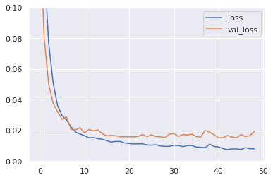
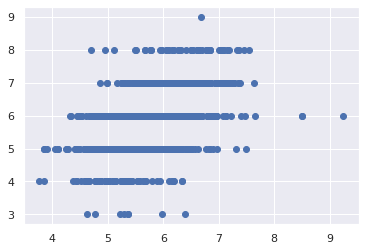
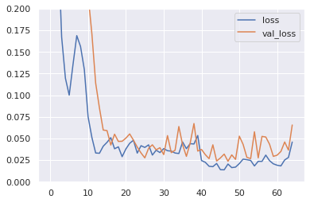
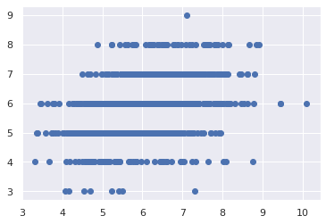
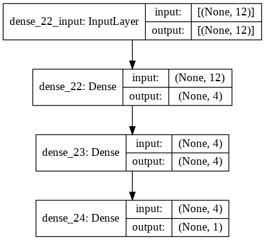
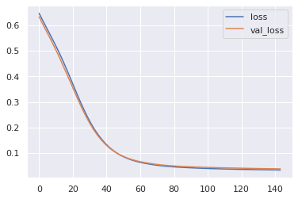
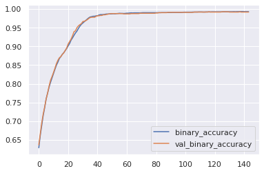
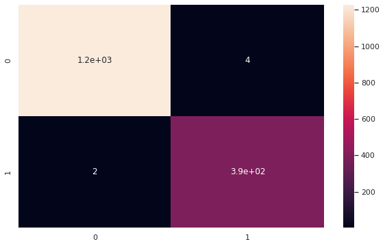
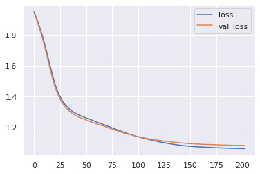
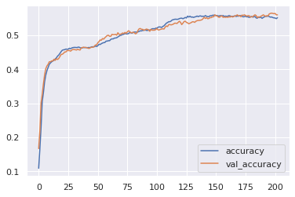

<a href="https://colab.research.google.com/github/wesleybeckner/general_applications_of_neural_networks/blob/main/notebooks/S2_Feed_Forward_Neural_Networks.ipynb" target="_parent"></a>

# General Applications of Neural Networks <br> Session 2: Feed Forward Neural Networks

**Instructor**: Wesley Beckner

**Contact**: wesleybeckner@gmail.com

---

<br>

In this session we will continue with our discussion on neural networks. Specifically, we will revisit the concept of learning curves, regularization and classification tasks, this time as they pertain to neural networks!

_images in this notebook borrowed from [Ryan Holbrook](https://mathformachines.com/)_

<br>

---

<a name='top'></a>

<a name='x.0'></a>

## 2.0 Preparing Environment and Importing Data

[back to top](#top)


```python
!pip uninstall scikit-learn -y

!pip install -U scikit-learn
```

    Found existing installation: scikit-learn 0.22.2.post1
    Uninstalling scikit-learn-0.22.2.post1:
      Successfully uninstalled scikit-learn-0.22.2.post1
    Collecting scikit-learn
      Downloading scikit_learn-0.24.2-cp37-cp37m-manylinux2010_x86_64.whl (22.3 MB)
         |████████████████████████████████| 22.3 MB 2.2 MB/s 
    [?25hRequirement already satisfied: numpy>=1.13.3 in /usr/local/lib/python3.7/dist-packages (from scikit-learn) (1.19.5)
    Collecting threadpoolctl>=2.0.0
      Downloading threadpoolctl-2.2.0-py3-none-any.whl (12 kB)
    Requirement already satisfied: scipy>=0.19.1 in /usr/local/lib/python3.7/dist-packages (from scikit-learn) (1.4.1)
    Requirement already satisfied: joblib>=0.11 in /usr/local/lib/python3.7/dist-packages (from scikit-learn) (1.0.1)
    Installing collected packages: threadpoolctl, scikit-learn
    Successfully installed scikit-learn-0.24.2 threadpoolctl-2.2.0


<a name='x.0.1'></a>

### 2.0.1 Import Packages

[back to top](#top)


```python
from tensorflow import keras
from tensorflow.keras import layers
import pandas as pd
import matplotlib.pyplot as plt
import seaborn as sns
import tensorflow as tf
from copy import copy
import numpy as np
sns.set()

from sklearn.preprocessing import StandardScaler, OneHotEncoder, LabelEncoder
from sklearn.compose import make_column_transformer, make_column_selector
from sklearn.metrics import classification_report,confusion_matrix
from sklearn.model_selection import train_test_split
from sklearn import set_config
from sklearn.pipeline import make_pipeline
from sklearn.impute import SimpleImputer
set_config(display='diagram')
```

<a name='x.0.1'></a>

### 2.0.2 Load Dataset

[back to top](#top)


```python
wine = pd.read_csv("https://raw.githubusercontent.com/wesleybeckner/"\
      "ds_for_engineers/main/data/wine_quality/winequalityN.csv")

# create X and y
X = wine.copy()
y = X.pop('quality')

# split into train/test
X_train, X_test, y_train, y_test = train_test_split(X, y)
X_train, X_val, y_train, y_val = train_test_split(X_train, y_train)

# the numerical values pipe
num_proc = make_pipeline(SimpleImputer(strategy='median'), StandardScaler())

# the categorical values pipe
cat_proc = make_pipeline(
    SimpleImputer(strategy='constant', fill_value='missing'),
    OneHotEncoder(handle_unknown='ignore'))

# parallelize the two pipes
preprocessor = make_column_transformer((num_proc,
                                make_column_selector(dtype_include=np.number)),
                                       (cat_proc,
                                make_column_selector(dtype_include=object)))

X_train_std = preprocessor.fit_transform(X_train) # fit_transform on train
X_test_std = preprocessor.transform(X_test) # transform test
X_val_std = preprocessor.transform(X_val)

y_train_std = np.log(y_train) # log output y
y_val_std = np.log(y_val) # log output y
y_test_std = np.log(y_test) # log output y

preprocessor
```


<style>#sk-32e8b842-4ed7-42ac-bb8d-cb9a2e776d5c {color: black;background-color: white;}#sk-32e8b842-4ed7-42ac-bb8d-cb9a2e776d5c pre{padding: 0;}#sk-32e8b842-4ed7-42ac-bb8d-cb9a2e776d5c div.sk-toggleable {background-color: white;}#sk-32e8b842-4ed7-42ac-bb8d-cb9a2e776d5c label.sk-toggleable__label {cursor: pointer;display: block;width: 100%;margin-bottom: 0;padding: 0.2em 0.3em;box-sizing: border-box;text-align: center;}#sk-32e8b842-4ed7-42ac-bb8d-cb9a2e776d5c div.sk-toggleable__content {max-height: 0;max-width: 0;overflow: hidden;text-align: left;background-color: #f0f8ff;}#sk-32e8b842-4ed7-42ac-bb8d-cb9a2e776d5c div.sk-toggleable__content pre {margin: 0.2em;color: black;border-radius: 0.25em;background-color: #f0f8ff;}#sk-32e8b842-4ed7-42ac-bb8d-cb9a2e776d5c input.sk-toggleable__control:checked~div.sk-toggleable__content {max-height: 200px;max-width: 100%;overflow: auto;}#sk-32e8b842-4ed7-42ac-bb8d-cb9a2e776d5c div.sk-estimator input.sk-toggleable__control:checked~label.sk-toggleable__label {background-color: #d4ebff;}#sk-32e8b842-4ed7-42ac-bb8d-cb9a2e776d5c div.sk-label input.sk-toggleable__control:checked~label.sk-toggleable__label {background-color: #d4ebff;}#sk-32e8b842-4ed7-42ac-bb8d-cb9a2e776d5c input.sk-hidden--visually {border: 0;clip: rect(1px 1px 1px 1px);clip: rect(1px, 1px, 1px, 1px);height: 1px;margin: -1px;overflow: hidden;padding: 0;position: absolute;width: 1px;}#sk-32e8b842-4ed7-42ac-bb8d-cb9a2e776d5c div.sk-estimator {font-family: monospace;background-color: #f0f8ff;margin: 0.25em 0.25em;border: 1px dotted black;border-radius: 0.25em;box-sizing: border-box;}#sk-32e8b842-4ed7-42ac-bb8d-cb9a2e776d5c div.sk-estimator:hover {background-color: #d4ebff;}#sk-32e8b842-4ed7-42ac-bb8d-cb9a2e776d5c div.sk-parallel-item::after {content: "";width: 100%;border-bottom: 1px solid gray;flex-grow: 1;}#sk-32e8b842-4ed7-42ac-bb8d-cb9a2e776d5c div.sk-label:hover label.sk-toggleable__label {background-color: #d4ebff;}#sk-32e8b842-4ed7-42ac-bb8d-cb9a2e776d5c div.sk-serial::before {content: "";position: absolute;border-left: 1px solid gray;box-sizing: border-box;top: 2em;bottom: 0;left: 50%;}#sk-32e8b842-4ed7-42ac-bb8d-cb9a2e776d5c div.sk-serial {display: flex;flex-direction: column;align-items: center;background-color: white;}#sk-32e8b842-4ed7-42ac-bb8d-cb9a2e776d5c div.sk-item {z-index: 1;}#sk-32e8b842-4ed7-42ac-bb8d-cb9a2e776d5c div.sk-parallel {display: flex;align-items: stretch;justify-content: center;background-color: white;}#sk-32e8b842-4ed7-42ac-bb8d-cb9a2e776d5c div.sk-parallel-item {display: flex;flex-direction: column;position: relative;background-color: white;}#sk-32e8b842-4ed7-42ac-bb8d-cb9a2e776d5c div.sk-parallel-item:first-child::after {align-self: flex-end;width: 50%;}#sk-32e8b842-4ed7-42ac-bb8d-cb9a2e776d5c div.sk-parallel-item:last-child::after {align-self: flex-start;width: 50%;}#sk-32e8b842-4ed7-42ac-bb8d-cb9a2e776d5c div.sk-parallel-item:only-child::after {width: 0;}#sk-32e8b842-4ed7-42ac-bb8d-cb9a2e776d5c div.sk-dashed-wrapped {border: 1px dashed gray;margin: 0.2em;box-sizing: border-box;padding-bottom: 0.1em;background-color: white;position: relative;}#sk-32e8b842-4ed7-42ac-bb8d-cb9a2e776d5c div.sk-label label {font-family: monospace;font-weight: bold;background-color: white;display: inline-block;line-height: 1.2em;}#sk-32e8b842-4ed7-42ac-bb8d-cb9a2e776d5c div.sk-label-container {position: relative;z-index: 2;text-align: center;}#sk-32e8b842-4ed7-42ac-bb8d-cb9a2e776d5c div.sk-container {display: inline-block;position: relative;}</style><div id="sk-32e8b842-4ed7-42ac-bb8d-cb9a2e776d5c" class"sk-top-container"><div class="sk-container"><div class="sk-item sk-dashed-wrapped"><div class="sk-label-container"><div class="sk-label sk-toggleable"><input class="sk-toggleable__control sk-hidden--visually" id="9de224c6-d8d4-4ab5-872a-116dd27068b5" type="checkbox" ><label class="sk-toggleable__label" for="9de224c6-d8d4-4ab5-872a-116dd27068b5">ColumnTransformer</label><div class="sk-toggleable__content"><pre>ColumnTransformer(transformers=[('pipeline-1',
                                 Pipeline(steps=[('simpleimputer',
                                                  SimpleImputer(strategy='median')),
                                                 ('standardscaler',
                                                  StandardScaler())]),
                                 <sklearn.compose._column_transformer.make_column_selector object at 0x7f4c4aa68a50>),
                                ('pipeline-2',
                                 Pipeline(steps=[('simpleimputer',
                                                  SimpleImputer(fill_value='missing',
                                                                strategy='constant')),
                                                 ('onehotencoder',
                                                  OneHotEncoder(handle_unknown='ignore'))]),
                                 <sklearn.compose._column_transformer.make_column_selector object at 0x7f4c4aa68fd0>)])</pre></div></div></div><div class="sk-parallel"><div class="sk-parallel-item"><div class="sk-item"><div class="sk-label-container"><div class="sk-label sk-toggleable"><input class="sk-toggleable__control sk-hidden--visually" id="f46f34c5-4e14-418a-9a7c-de67e517fc1e" type="checkbox" ><label class="sk-toggleable__label" for="f46f34c5-4e14-418a-9a7c-de67e517fc1e">pipeline-1</label><div class="sk-toggleable__content"><pre><sklearn.compose._column_transformer.make_column_selector object at 0x7f4c4aa68a50></pre></div></div></div><div class="sk-serial"><div class="sk-item"><div class="sk-serial"><div class="sk-item"><div class="sk-estimator sk-toggleable"><input class="sk-toggleable__control sk-hidden--visually" id="dafdd758-ddb8-472d-b7eb-a623f05a6b6d" type="checkbox" ><label class="sk-toggleable__label" for="dafdd758-ddb8-472d-b7eb-a623f05a6b6d">SimpleImputer</label><div class="sk-toggleable__content"><pre>SimpleImputer(strategy='median')</pre></div></div></div><div class="sk-item"><div class="sk-estimator sk-toggleable"><input class="sk-toggleable__control sk-hidden--visually" id="842cd92d-45b4-448a-b1ce-3ab0ce48fa0b" type="checkbox" ><label class="sk-toggleable__label" for="842cd92d-45b4-448a-b1ce-3ab0ce48fa0b">StandardScaler</label><div class="sk-toggleable__content"><pre>StandardScaler()</pre></div></div></div></div></div></div></div></div><div class="sk-parallel-item"><div class="sk-item"><div class="sk-label-container"><div class="sk-label sk-toggleable"><input class="sk-toggleable__control sk-hidden--visually" id="d1f887e1-a0e7-46f6-bf37-e7adee496ba2" type="checkbox" ><label class="sk-toggleable__label" for="d1f887e1-a0e7-46f6-bf37-e7adee496ba2">pipeline-2</label><div class="sk-toggleable__content"><pre><sklearn.compose._column_transformer.make_column_selector object at 0x7f4c4aa68fd0></pre></div></div></div><div class="sk-serial"><div class="sk-item"><div class="sk-serial"><div class="sk-item"><div class="sk-estimator sk-toggleable"><input class="sk-toggleable__control sk-hidden--visually" id="1448d43f-d7eb-4cf0-b37b-377486544002" type="checkbox" ><label class="sk-toggleable__label" for="1448d43f-d7eb-4cf0-b37b-377486544002">SimpleImputer</label><div class="sk-toggleable__content"><pre>SimpleImputer(fill_value='missing', strategy='constant')</pre></div></div></div><div class="sk-item"><div class="sk-estimator sk-toggleable"><input class="sk-toggleable__control sk-hidden--visually" id="fedde35a-c560-48cd-be32-d98db5565354" type="checkbox" ><label class="sk-toggleable__label" for="fedde35a-c560-48cd-be32-d98db5565354">OneHotEncoder</label><div class="sk-toggleable__content"><pre>OneHotEncoder(handle_unknown='ignore')</pre></div></div></div></div></div></div></div></div></div></div></div></div>


<a name='x.1'></a>

## 2.1 Evaluating the Model

[back to top](#top)

In the last session, we randomly chose 10 and then 30 epochs (10 rounds of the training data) to train our neural network. Now we'll garner the language to be more systematic in our approach.

### 2.1.1 Learning Curves

Recall learning curves from last week, where we plot model score (accuracy/mse/r2/etc.) over model complexity (trees in a forest, degrees in a polynomial, etc.):

<p align=center>
</img>
</p>

<small>[img src](https://jakevdp.github.io/PythonDataScienceHandbook/05.03-hyperparameters-and-model-validation.html)</small>


We have a similar situation with neural networks, accept here, the model complexity is defined by both the number of epochs, and the capacity of the model. 

#### 2.1.1.1 Training Data (Epochs)

A greater number of epochs allows the model to further tune itself to the training data. Remember that our model solves its weights by a solver function, most often a form of stochastic gradient descent. Because this solver is iterative, the longer we allow it run the closer it will get to finding its true weights. The caveat here is that, like we have seen before, the model is only learning the proper weights according to the training data, which we know includes noise, otherwise known as irreducible error. Our data science senses should be tingling: there's an optimum number of epochs here, and it will counter balance the trade-off between error due to bias (too few epochs) and error due to variance (too many epochs).

#### 2.1.1.2 Complexity (Capacity)


The capacity of the model is defined by the architecture. It is the total number of trainable weights available to the solver function. The more weights, the more capacity. Capacity determines the upper limit for which our model can learn relationships between the data. Again we should recall from our session on feature engineering: the more training data we have, the more capacity we should give our model to account for that abundance of training data. This is also influenced by the actual complexity between the input and output data, X and y, who's function we are attempting to approximate with the neural network. The more complicated the relationship, the more capacity we should give to our model.

Capacity can be increased either by widening our model (increasing the neurons in a layer) or deepening our model(increasing the number of layers in our model).

### 2.1.2 Early Stopping

[back to top](#top)

Without knowing the true relationship between X and y, or the degree to which there is irreducible error in our data, we return to our familiar learning curves to pragmaticaly determine how long we should train our model, that is, how many epochs should be ran and how many neurons we should give our model.

When dealing with the number of epochs, we can program this into the training session automatically with early stopping. Early stopping allows us to discontinue training the model when either the validation score stops improving, or stops improving by some margin. This allows us to both save time during training and to avoid overfitting our model.

To account for underfitting (not training the model long enough) we can simply set our number of training epochs to some large number and allow early stopping to take care of the rest.

In TF/Keras, we can envoke early stopping by setting a **_callback_** a callback is simply a function that is called every so often.


```python
from tensorflow.keras.callbacks import EarlyStopping

early_stopping = EarlyStopping(
    min_delta=0.001, # minimium amount of change to count as an improvement
    patience=20, # how many epochs to wait before stopping
    restore_best_weights=True,
)
```

In the above, we are saying detect when the validation loss stops improving by 0.001; check this over the past 20 epochs to avoid stopping early due to noise; and restore the best weights over that past 20 epoch period when early stopping is envoked. To envoke early stopping we would enlist it in our call to fit like so:

```
model.fit(
    # X, y, batch size etc, ...
    callbacks=[early_stopping],
)
```

### 🏋️ Exercise 1: Try Early Stopping

Take your best model from the last exercise in session 1 and apply early stopping


```python
from tensorflow import keras
from tensorflow.keras import layers
from tensorflow.keras.callbacks import EarlyStopping

model = keras.Sequential([
    ### YOUR CODE HERE ###
])

model.compile(
    optimizer='adam',
    loss='mse',
)

early_stopping = EarlyStopping(
    min_delta=0.001, # minimium amount of change to count as an improvement
    patience=20, # how many epochs to wait before stopping
    restore_best_weights=True,
)

print(model.summary())

history = model.fit(
    X_train_std, y_train_std,
    validation_data=(X_val_std, y_val_std),
    batch_size=256,
    epochs=1000,
    verbose=1,
    callbacks=[early_stopping],
)
```

    Model: "sequential_1"
    _________________________________________________________________
    Layer (type)                 Output Shape              Param #   
    =================================================================
    dense_5 (Dense)              (None, 32)                448       
    _________________________________________________________________
    dense_6 (Dense)              (None, 1024)              33792     
    _________________________________________________________________
    dense_7 (Dense)              (None, 1024)              1049600   
    _________________________________________________________________
    dense_8 (Dense)              (None, 32)                32800     
    _________________________________________________________________
    dense_9 (Dense)              (None, 1)                 33        
    =================================================================
    Total params: 1,116,673
    Trainable params: 1,116,673
    Non-trainable params: 0
    _________________________________________________________________
    None
    Epoch 1/1000
    15/15 [==============================] - 2s 50ms/step - loss: 0.4680 - val_loss: 0.1534
    Epoch 2/1000
    15/15 [==============================] - 1s 41ms/step - loss: 0.1286 - val_loss: 0.0802
    Epoch 3/1000
    15/15 [==============================] - 1s 40ms/step - loss: 0.0770 - val_loss: 0.0502
    Epoch 4/1000
    15/15 [==============================] - 1s 42ms/step - loss: 0.0511 - val_loss: 0.0378
    Epoch 5/1000
    15/15 [==============================] - 1s 41ms/step - loss: 0.0362 - val_loss: 0.0321
    Epoch 6/1000
    15/15 [==============================] - 1s 40ms/step - loss: 0.0298 - val_loss: 0.0272
    Epoch 7/1000
    15/15 [==============================] - 1s 42ms/step - loss: 0.0268 - val_loss: 0.0288
    Epoch 8/1000
    15/15 [==============================] - 1s 41ms/step - loss: 0.0223 - val_loss: 0.0206
    Epoch 9/1000
    15/15 [==============================] - 1s 42ms/step - loss: 0.0190 - val_loss: 0.0204
    Epoch 10/1000
    15/15 [==============================] - 1s 42ms/step - loss: 0.0177 - val_loss: 0.0218
    Epoch 11/1000
    15/15 [==============================] - 1s 41ms/step - loss: 0.0166 - val_loss: 0.0185
    Epoch 12/1000
    15/15 [==============================] - 1s 41ms/step - loss: 0.0152 - val_loss: 0.0207
    Epoch 13/1000
    15/15 [==============================] - 1s 41ms/step - loss: 0.0153 - val_loss: 0.0197
    Epoch 14/1000
    15/15 [==============================] - 1s 41ms/step - loss: 0.0147 - val_loss: 0.0204
    Epoch 15/1000
    15/15 [==============================] - 1s 41ms/step - loss: 0.0143 - val_loss: 0.0178
    Epoch 16/1000
    15/15 [==============================] - 1s 40ms/step - loss: 0.0133 - val_loss: 0.0165
    Epoch 17/1000
    15/15 [==============================] - 1s 41ms/step - loss: 0.0124 - val_loss: 0.0168
    Epoch 18/1000
    15/15 [==============================] - 1s 41ms/step - loss: 0.0129 - val_loss: 0.0166
    Epoch 19/1000
    15/15 [==============================] - 1s 40ms/step - loss: 0.0128 - val_loss: 0.0159
    Epoch 20/1000
    15/15 [==============================] - 1s 40ms/step - loss: 0.0119 - val_loss: 0.0159
    Epoch 21/1000
    15/15 [==============================] - 1s 40ms/step - loss: 0.0115 - val_loss: 0.0159
    Epoch 22/1000
    15/15 [==============================] - 1s 41ms/step - loss: 0.0112 - val_loss: 0.0158
    Epoch 23/1000
    15/15 [==============================] - 1s 42ms/step - loss: 0.0113 - val_loss: 0.0161
    Epoch 24/1000
    15/15 [==============================] - 1s 41ms/step - loss: 0.0113 - val_loss: 0.0173
    Epoch 25/1000
    15/15 [==============================] - 1s 42ms/step - loss: 0.0105 - val_loss: 0.0160
    Epoch 26/1000
    15/15 [==============================] - 1s 43ms/step - loss: 0.0104 - val_loss: 0.0172
    Epoch 27/1000
    15/15 [==============================] - 1s 41ms/step - loss: 0.0107 - val_loss: 0.0160
    Epoch 28/1000
    15/15 [==============================] - 1s 41ms/step - loss: 0.0099 - val_loss: 0.0159
    Epoch 29/1000
    15/15 [==============================] - 1s 41ms/step - loss: 0.0096 - val_loss: 0.0153
    Epoch 30/1000
    15/15 [==============================] - 1s 51ms/step - loss: 0.0097 - val_loss: 0.0176
    Epoch 31/1000
    15/15 [==============================] - 1s 41ms/step - loss: 0.0103 - val_loss: 0.0180
    Epoch 32/1000
    15/15 [==============================] - 1s 41ms/step - loss: 0.0102 - val_loss: 0.0161
    Epoch 33/1000
    15/15 [==============================] - 1s 42ms/step - loss: 0.0095 - val_loss: 0.0173
    Epoch 34/1000
    15/15 [==============================] - 1s 41ms/step - loss: 0.0101 - val_loss: 0.0171
    Epoch 35/1000
    15/15 [==============================] - 1s 42ms/step - loss: 0.0102 - val_loss: 0.0176
    Epoch 36/1000
    15/15 [==============================] - 1s 41ms/step - loss: 0.0092 - val_loss: 0.0160
    Epoch 37/1000
    15/15 [==============================] - 1s 43ms/step - loss: 0.0090 - val_loss: 0.0158
    Epoch 38/1000
    15/15 [==============================] - 1s 42ms/step - loss: 0.0088 - val_loss: 0.0200
    Epoch 39/1000
    15/15 [==============================] - 1s 41ms/step - loss: 0.0110 - val_loss: 0.0189
    Epoch 40/1000
    15/15 [==============================] - 1s 42ms/step - loss: 0.0096 - val_loss: 0.0172
    Epoch 41/1000
    15/15 [==============================] - 1s 42ms/step - loss: 0.0093 - val_loss: 0.0151
    Epoch 42/1000
    15/15 [==============================] - 1s 43ms/step - loss: 0.0082 - val_loss: 0.0153
    Epoch 43/1000
    15/15 [==============================] - 1s 42ms/step - loss: 0.0075 - val_loss: 0.0167
    Epoch 44/1000
    15/15 [==============================] - 1s 42ms/step - loss: 0.0080 - val_loss: 0.0157
    Epoch 45/1000
    15/15 [==============================] - 1s 41ms/step - loss: 0.0079 - val_loss: 0.0152
    Epoch 46/1000
    15/15 [==============================] - 1s 43ms/step - loss: 0.0077 - val_loss: 0.0173
    Epoch 47/1000
    15/15 [==============================] - 1s 42ms/step - loss: 0.0088 - val_loss: 0.0161
    Epoch 48/1000
    15/15 [==============================] - 1s 41ms/step - loss: 0.0081 - val_loss: 0.0166
    Epoch 49/1000
    15/15 [==============================] - 1s 42ms/step - loss: 0.0080 - val_loss: 0.0195


```python
# Show the learning curves
history_df = pd.DataFrame(history.history)
fig, ax = plt.subplots(1,1)
history_df.plot(ax=ax)
ax.set_ylim(0,.1)
```


    (0.0, 0.1)


    

    


```python
y_test_pred = np.exp(model.predict(X_test_std))
plt.plot(y_test_pred, np.exp(y_test_std), ls='', marker='o')
```


    [<matplotlib.lines.Line2D at 0x7f4c409a6210>]


    

    


## 2.2 Regularizing Layers: Dropout and Batch Normalization

[back to top](#top)

There are dozens of different layer types for accomplishing different tasks (and more are being generated by researchers all the time). While we're on the topic of general model performance, there are two layer types we'll want to introduce here: **_dropout_** and **_batch normalization_** or just batchnorm. What we'll see with both of these types is that while they don't contain any neurons, they're useful to think of as layers, because they are an extra processing step between neural layers.

### 2.2.1 Dropout

[back to top](#top)

Dropout is the Neural Network response to the wide success of ensemble learning. In a dropout layer, random neurons are dropped in each batch of training, i.e. their weighted updates are not sent to the next neural layer. Just as with random forests, the end result is that the neural network can be thought of as many _independent models_ that _vote_ on the final output. 

Put another way, when a network does not contain dropout layers, and has a capacity that exceeds that which would be suited for the true, underlying complexity level of the data, it can begin to fit to noise. This ability to fit to noise is based on very specific relationships between neurons, which fire uniquely given the particular training example. Adding dropout _breaks_ these specific neural connections, and so the neural network as a whole is forced to find weights that apply generally, as there is no guarantee they will be _turned on_ when their specific training example they would usually overfit for comes around again. 

<p align=center>
</img>
</p>
<small> Network with 50% dropout </small>

A last thing to note, is that after adding dropout, we will typically need to add additional layers to our network to maintain the overall capacity of the network.


```python
keras.Sequential([
    # ...
    layers.Dropout(rate=0.3), # apply 30% dropout to the next layer
    layers.Dense(16),
    # ...
])
```


    <tensorflow.python.keras.engine.sequential.Sequential at 0x7f2ae011ba50>


When adding dropout to a model we will usually want to increase the depth:


```python
# Dropout model

model = keras.Sequential([
    layers.Dense(512, activation='relu', input_shape=[X_train_std.shape[1]]),
    layers.Dropout(0.3),
    layers.Dense(512*2, activation='relu'),
    layers.Dropout(0.3),
    layers.Dense(512, activation='relu'),
    layers.Dense(1),
])

model.compile(
    optimizer='adam',
    loss='mse',
)

early_stopping = EarlyStopping(
    min_delta=0.001, # minimium amount of change to count as an improvement
    patience=20, # how many epochs to wait before stopping
    restore_best_weights=True,
)

print(model.summary())

history = model.fit(
    X_train_std, y_train_std,
    validation_data=(X_val_std, y_val_std),
    batch_size=256,
    epochs=1000,
    verbose=1,
    callbacks=[early_stopping],
)
```

    Model: "sequential_2"
    _________________________________________________________________
    Layer (type)                 Output Shape              Param #   
    =================================================================
    dense_10 (Dense)             (None, 512)               7168      
    _________________________________________________________________
    dropout (Dropout)            (None, 512)               0         
    _________________________________________________________________
    dense_11 (Dense)             (None, 1024)              525312    
    _________________________________________________________________
    dropout_1 (Dropout)          (None, 1024)              0         
    _________________________________________________________________
    dense_12 (Dense)             (None, 512)               524800    
    _________________________________________________________________
    dense_13 (Dense)             (None, 1)                 513       
    =================================================================
    Total params: 1,057,793
    Trainable params: 1,057,793
    Non-trainable params: 0
    _________________________________________________________________
    None
    Epoch 1/1000
    15/15 [==============================] - 1s 51ms/step - loss: 0.6459 - val_loss: 0.1513
    Epoch 2/1000
    15/15 [==============================] - 1s 45ms/step - loss: 0.1613 - val_loss: 0.1027
    Epoch 3/1000
    15/15 [==============================] - 1s 42ms/step - loss: 0.1056 - val_loss: 0.0918
    Epoch 4/1000
    15/15 [==============================] - 1s 44ms/step - loss: 0.0730 - val_loss: 0.0689
    Epoch 5/1000
    15/15 [==============================] - 1s 44ms/step - loss: 0.0566 - val_loss: 0.0742
    Epoch 6/1000
    15/15 [==============================] - 1s 43ms/step - loss: 0.0466 - val_loss: 0.0360
    Epoch 7/1000
    15/15 [==============================] - 1s 43ms/step - loss: 0.0409 - val_loss: 0.0673
    Epoch 8/1000
    15/15 [==============================] - 1s 44ms/step - loss: 0.0396 - val_loss: 0.0652
    Epoch 9/1000
    15/15 [==============================] - 1s 43ms/step - loss: 0.0339 - val_loss: 0.0702
    Epoch 10/1000
    15/15 [==============================] - 1s 43ms/step - loss: 0.0337 - val_loss: 0.0623
    Epoch 11/1000
    15/15 [==============================] - 1s 43ms/step - loss: 0.0329 - val_loss: 0.0561
    Epoch 12/1000
    15/15 [==============================] - 1s 43ms/step - loss: 0.0307 - val_loss: 0.0721
    Epoch 13/1000
    15/15 [==============================] - 1s 44ms/step - loss: 0.0294 - val_loss: 0.0828
    Epoch 14/1000
    15/15 [==============================] - 1s 43ms/step - loss: 0.0273 - val_loss: 0.0763
    Epoch 15/1000
    15/15 [==============================] - 1s 42ms/step - loss: 0.0267 - val_loss: 0.0672
    Epoch 16/1000
    15/15 [==============================] - 1s 43ms/step - loss: 0.0258 - val_loss: 0.0740
    Epoch 17/1000
    15/15 [==============================] - 1s 43ms/step - loss: 0.0249 - val_loss: 0.0462
    Epoch 18/1000
    15/15 [==============================] - 1s 43ms/step - loss: 0.0263 - val_loss: 0.0770
    Epoch 19/1000
    15/15 [==============================] - 1s 42ms/step - loss: 0.0246 - val_loss: 0.0679
    Epoch 20/1000
    15/15 [==============================] - 1s 44ms/step - loss: 0.0238 - val_loss: 0.0984
    Epoch 21/1000
    15/15 [==============================] - 1s 43ms/step - loss: 0.0246 - val_loss: 0.0536
    Epoch 22/1000
    15/15 [==============================] - 1s 43ms/step - loss: 0.0237 - val_loss: 0.0837
    Epoch 23/1000
    15/15 [==============================] - 1s 44ms/step - loss: 0.0214 - val_loss: 0.0754
    Epoch 24/1000
    15/15 [==============================] - 1s 44ms/step - loss: 0.0216 - val_loss: 0.0664
    Epoch 25/1000
    15/15 [==============================] - 1s 43ms/step - loss: 0.0222 - val_loss: 0.0631
    Epoch 26/1000
    15/15 [==============================] - 1s 43ms/step - loss: 0.0215 - val_loss: 0.0858


### 2.2.2 Batch Normalization

[back to top](#top)

Batch normalization ([batchnorm](https://arxiv.org/abs/1502.03167)) accomplishes a task very similar to sklearn's `StandardScaler`, and in fact, it can be added to the front of a neural network in place of sklearn's `StandardScaler` to scale and center the input data. But batchnorm is also used between layers, why would we want to rescale the output from one layer before feeding into the next? For the same reason we would want to scale and center our data in the first place: it levels the playing field for the following layer to find the important relationships. The optimizer algorithm, SGD, will shift weights in proportion to how large the activation is out of each neuron, and so large differences can lead to spurious behavior.

In practice, batchnorm is often implemented to make the overall training time faster, rather than to improve the final loss (although in some cases it does do this as well). It is good to envoke batchnorm in particular, if you are dealing with neural networks that take a long time to train.

Batchnorm can be added between layers, as well as between a layer and its activation function.


```python
# BatchNorm model

model = keras.Sequential([
    layers.Dense(512, activation='relu', input_shape=[X_train_std.shape[1]]),
    layers.BatchNormalization(),
    layers.Dense(512*2, activation='relu'),
    layers.BatchNormalization(),
    layers.Dense(512, activation='relu'),
    layers.Dense(1),
])

model.compile(
    optimizer='adam',
    loss='mse',
)

early_stopping = EarlyStopping(
    min_delta=0.001, # minimium amount of change to count as an improvement
    patience=20, # how many epochs to wait before stopping
    restore_best_weights=True,
)

print(model.summary())

history = model.fit(
    X_train_std, y_train_std,
    validation_data=(X_val_std, y_val_std),
    batch_size=256,
    epochs=1000,
    verbose=1,
    callbacks=[early_stopping],
)
```

    Model: "sequential_3"
    _________________________________________________________________
    Layer (type)                 Output Shape              Param #   
    =================================================================
    dense_14 (Dense)             (None, 512)               7168      
    _________________________________________________________________
    batch_normalization (BatchNo (None, 512)               2048      
    _________________________________________________________________
    dense_15 (Dense)             (None, 1024)              525312    
    _________________________________________________________________
    batch_normalization_1 (Batch (None, 1024)              4096      
    _________________________________________________________________
    dense_16 (Dense)             (None, 512)               524800    
    _________________________________________________________________
    dense_17 (Dense)             (None, 1)                 513       
    =================================================================
    Total params: 1,063,937
    Trainable params: 1,060,865
    Non-trainable params: 3,072
    _________________________________________________________________
    None
    Epoch 1/1000
    15/15 [==============================] - 2s 54ms/step - loss: 2.7890 - val_loss: 2.5754
    Epoch 2/1000
    15/15 [==============================] - 1s 44ms/step - loss: 0.7404 - val_loss: 2.2122
    Epoch 3/1000
    15/15 [==============================] - 1s 44ms/step - loss: 0.2845 - val_loss: 1.5998
    Epoch 4/1000
    15/15 [==============================] - 1s 45ms/step - loss: 0.1671 - val_loss: 1.4054
    Epoch 5/1000
    15/15 [==============================] - 1s 44ms/step - loss: 0.1195 - val_loss: 1.0034
    Epoch 6/1000
    15/15 [==============================] - 1s 43ms/step - loss: 0.1000 - val_loss: 0.9543
    Epoch 7/1000
    15/15 [==============================] - 1s 45ms/step - loss: 0.1353 - val_loss: 0.6496
    Epoch 8/1000
    15/15 [==============================] - 1s 44ms/step - loss: 0.1688 - val_loss: 0.4768
    Epoch 9/1000
    15/15 [==============================] - 1s 45ms/step - loss: 0.1562 - val_loss: 0.3414
    Epoch 10/1000
    15/15 [==============================] - 1s 44ms/step - loss: 0.1296 - val_loss: 0.3393
    Epoch 11/1000
    15/15 [==============================] - 1s 45ms/step - loss: 0.0750 - val_loss: 0.2155
    Epoch 12/1000
    15/15 [==============================] - 1s 45ms/step - loss: 0.0512 - val_loss: 0.1708
    Epoch 13/1000
    15/15 [==============================] - 1s 45ms/step - loss: 0.0332 - val_loss: 0.1139
    Epoch 14/1000
    15/15 [==============================] - 1s 44ms/step - loss: 0.0329 - val_loss: 0.0851
    Epoch 15/1000
    15/15 [==============================] - 1s 44ms/step - loss: 0.0411 - val_loss: 0.0597
    Epoch 16/1000
    15/15 [==============================] - 1s 45ms/step - loss: 0.0455 - val_loss: 0.0591
    Epoch 17/1000
    15/15 [==============================] - 1s 45ms/step - loss: 0.0510 - val_loss: 0.0424
    Epoch 18/1000
    15/15 [==============================] - 1s 44ms/step - loss: 0.0381 - val_loss: 0.0549
    Epoch 19/1000
    15/15 [==============================] - 1s 44ms/step - loss: 0.0403 - val_loss: 0.0466
    Epoch 20/1000
    15/15 [==============================] - 1s 44ms/step - loss: 0.0290 - val_loss: 0.0468
    Epoch 21/1000
    15/15 [==============================] - 1s 44ms/step - loss: 0.0379 - val_loss: 0.0504
    Epoch 22/1000
    15/15 [==============================] - 1s 45ms/step - loss: 0.0444 - val_loss: 0.0553
    Epoch 23/1000
    15/15 [==============================] - 1s 43ms/step - loss: 0.0479 - val_loss: 0.0480
    Epoch 24/1000
    15/15 [==============================] - 1s 46ms/step - loss: 0.0331 - val_loss: 0.0400
    Epoch 25/1000
    15/15 [==============================] - 1s 45ms/step - loss: 0.0416 - val_loss: 0.0333
    Epoch 26/1000
    15/15 [==============================] - 1s 44ms/step - loss: 0.0396 - val_loss: 0.0276
    Epoch 27/1000
    15/15 [==============================] - 1s 45ms/step - loss: 0.0426 - val_loss: 0.0386
    Epoch 28/1000
    15/15 [==============================] - 1s 46ms/step - loss: 0.0308 - val_loss: 0.0427
    Epoch 29/1000
    15/15 [==============================] - 1s 44ms/step - loss: 0.0365 - val_loss: 0.0369
    Epoch 30/1000
    15/15 [==============================] - 1s 45ms/step - loss: 0.0337 - val_loss: 0.0393
    Epoch 31/1000
    15/15 [==============================] - 1s 45ms/step - loss: 0.0383 - val_loss: 0.0314
    Epoch 32/1000
    15/15 [==============================] - 1s 44ms/step - loss: 0.0358 - val_loss: 0.0533
    Epoch 33/1000
    15/15 [==============================] - 1s 45ms/step - loss: 0.0354 - val_loss: 0.0336
    Epoch 34/1000
    15/15 [==============================] - 1s 45ms/step - loss: 0.0332 - val_loss: 0.0363
    Epoch 35/1000
    15/15 [==============================] - 1s 45ms/step - loss: 0.0326 - val_loss: 0.0638
    Epoch 36/1000
    15/15 [==============================] - 1s 45ms/step - loss: 0.0459 - val_loss: 0.0427
    Epoch 37/1000
    15/15 [==============================] - 1s 46ms/step - loss: 0.0382 - val_loss: 0.0293
    Epoch 38/1000
    15/15 [==============================] - 1s 44ms/step - loss: 0.0440 - val_loss: 0.0446
    Epoch 39/1000
    15/15 [==============================] - 1s 47ms/step - loss: 0.0436 - val_loss: 0.0673
    Epoch 40/1000
    15/15 [==============================] - 1s 45ms/step - loss: 0.0535 - val_loss: 0.0354
    Epoch 41/1000
    15/15 [==============================] - 1s 45ms/step - loss: 0.0245 - val_loss: 0.0373
    Epoch 42/1000
    15/15 [==============================] - 1s 45ms/step - loss: 0.0225 - val_loss: 0.0313
    Epoch 43/1000
    15/15 [==============================] - 1s 47ms/step - loss: 0.0179 - val_loss: 0.0267
    Epoch 44/1000
    15/15 [==============================] - 1s 46ms/step - loss: 0.0174 - val_loss: 0.0427
    Epoch 45/1000
    15/15 [==============================] - 1s 45ms/step - loss: 0.0211 - val_loss: 0.0240
    Epoch 46/1000
    15/15 [==============================] - 1s 44ms/step - loss: 0.0139 - val_loss: 0.0275
    Epoch 47/1000
    15/15 [==============================] - 1s 44ms/step - loss: 0.0138 - val_loss: 0.0319
    Epoch 48/1000
    15/15 [==============================] - 1s 45ms/step - loss: 0.0205 - val_loss: 0.0237
    Epoch 49/1000
    15/15 [==============================] - 1s 45ms/step - loss: 0.0163 - val_loss: 0.0310
    Epoch 50/1000
    15/15 [==============================] - 1s 44ms/step - loss: 0.0169 - val_loss: 0.0259
    Epoch 51/1000
    15/15 [==============================] - 1s 45ms/step - loss: 0.0210 - val_loss: 0.0527
    Epoch 52/1000
    15/15 [==============================] - 1s 46ms/step - loss: 0.0261 - val_loss: 0.0432
    Epoch 53/1000
    15/15 [==============================] - 1s 44ms/step - loss: 0.0255 - val_loss: 0.0282
    Epoch 54/1000
    15/15 [==============================] - 1s 45ms/step - loss: 0.0246 - val_loss: 0.0268
    Epoch 55/1000
    15/15 [==============================] - 1s 45ms/step - loss: 0.0183 - val_loss: 0.0577
    Epoch 56/1000
    15/15 [==============================] - 1s 45ms/step - loss: 0.0236 - val_loss: 0.0276
    Epoch 57/1000
    15/15 [==============================] - 1s 46ms/step - loss: 0.0235 - val_loss: 0.0524
    Epoch 58/1000
    15/15 [==============================] - 1s 46ms/step - loss: 0.0308 - val_loss: 0.0517
    Epoch 59/1000
    15/15 [==============================] - 1s 45ms/step - loss: 0.0243 - val_loss: 0.0433
    Epoch 60/1000
    15/15 [==============================] - 1s 44ms/step - loss: 0.0207 - val_loss: 0.0293
    Epoch 61/1000
    15/15 [==============================] - 1s 44ms/step - loss: 0.0191 - val_loss: 0.0307
    Epoch 62/1000
    15/15 [==============================] - 1s 44ms/step - loss: 0.0183 - val_loss: 0.0350
    Epoch 63/1000
    15/15 [==============================] - 1s 45ms/step - loss: 0.0252 - val_loss: 0.0460
    Epoch 64/1000
    15/15 [==============================] - 1s 45ms/step - loss: 0.0281 - val_loss: 0.0365
    Epoch 65/1000
    15/15 [==============================] - 1s 46ms/step - loss: 0.0459 - val_loss: 0.0656


```python
# Show the learning curves
history_df = pd.DataFrame(history.history)
fig, ax = plt.subplots(1,1)
history_df.plot(ax=ax)
ax.set_ylim(0,.2)
```


    (0.0, 0.2)


    

    


```python
y_test_pred = np.exp(model.predict(X_test_std))
plt.plot(y_test_pred, np.exp(y_test_std), ls='', marker='o')
```


    [<matplotlib.lines.Line2D at 0x7f4c3ceb5150>]


    

    


Model with BatchNorm and Dropout:


```python
from tensorflow import keras
from tensorflow.keras import layers

# Dropout and BatchNorm Model
model = keras.Sequential([
    layers.Dense(512, input_shape=[X_train_std.shape[1]]),
    layers.BatchNormalization(),
    layers.Activation('relu'), # separate activation
    layers.Dropout(0.3),
    layers.Dense(1024, activation='relu'), # built-in activation
    layers.Dropout(0.3),
    layers.BatchNormalization(),
    layers.Dense(512, activation='relu'),
    layers.Dropout(0.3),
    layers.BatchNormalization(),
    layers.Dense(1),
])
```


```python
print(model.summary())
```

    Model: "sequential_4"
    _________________________________________________________________
    Layer (type)                 Output Shape              Param #   
    =================================================================
    dense_18 (Dense)             (None, 512)               7168      
    _________________________________________________________________
    batch_normalization_2 (Batch (None, 512)               2048      
    _________________________________________________________________
    activation (Activation)      (None, 512)               0         
    _________________________________________________________________
    dropout_2 (Dropout)          (None, 512)               0         
    _________________________________________________________________
    dense_19 (Dense)             (None, 1024)              525312    
    _________________________________________________________________
    dropout_3 (Dropout)          (None, 1024)              0         
    _________________________________________________________________
    batch_normalization_3 (Batch (None, 1024)              4096      
    _________________________________________________________________
    dense_20 (Dense)             (None, 512)               524800    
    _________________________________________________________________
    dropout_4 (Dropout)          (None, 512)               0         
    _________________________________________________________________
    batch_normalization_4 (Batch (None, 512)               2048      
    _________________________________________________________________
    dense_21 (Dense)             (None, 1)                 513       
    =================================================================
    Total params: 1,065,985
    Trainable params: 1,061,889
    Non-trainable params: 4,096
    _________________________________________________________________
    None


### 🏋️ Exercise 2: Try Batch Normalization and Dropout

Create 3 models and train for 100 epochs with early stopping:

1. compile and train the model previously defined above
2. recreate the architecture but remove the batchnorm  layers
3. recreate the architecture but remove the dropout layers and one hidden, dense layer

Compare the number of epochs required to converge, and the overall loss


```python
# Dropout and BatchNorm Model
model = keras.Sequential([                      
    ### YOUR CODE HERE ###

])

model.compile(
    optimizer='adam',
    loss='mae',
)

early_stopping = EarlyStopping(
    min_delta=0.001, # minimium amount of change to count as an improvement
    patience=20, # how many epochs to wait before stopping
    restore_best_weights=True,
)

history = model.fit(
    X_train_std, y_train_std,
    validation_data=(X_val_std, y_val_std),
    batch_size=256,
    epochs=100,
    verbose=1,
    callbacks=[early_stopping],
)
```

    Epoch 1/100
    15/15 [==============================] - 1s 16ms/step - loss: 1.7653 - val_loss: 1.3092
    Epoch 2/100
    15/15 [==============================] - 0s 6ms/step - loss: 1.3614 - val_loss: 0.9521
    Epoch 3/100
    15/15 [==============================] - 0s 7ms/step - loss: 1.0655 - val_loss: 0.6253
    Epoch 4/100
    15/15 [==============================] - 0s 7ms/step - loss: 0.8148 - val_loss: 0.3236
    Epoch 5/100
    15/15 [==============================] - 0s 6ms/step - loss: 0.6566 - val_loss: 0.2231
    Epoch 6/100
    15/15 [==============================] - 0s 6ms/step - loss: 0.5569 - val_loss: 0.1752
    Epoch 7/100
    15/15 [==============================] - 0s 6ms/step - loss: 0.5185 - val_loss: 0.1731
    Epoch 8/100
    15/15 [==============================] - 0s 6ms/step - loss: 0.4466 - val_loss: 0.1596
    Epoch 9/100
    15/15 [==============================] - 0s 6ms/step - loss: 0.4092 - val_loss: 0.1712
    Epoch 10/100
    15/15 [==============================] - 0s 7ms/step - loss: 0.3836 - val_loss: 0.1516
    Epoch 11/100
    15/15 [==============================] - 0s 7ms/step - loss: 0.3530 - val_loss: 0.1603
    Epoch 12/100
    15/15 [==============================] - 0s 6ms/step - loss: 0.3323 - val_loss: 0.1423
    Epoch 13/100
    15/15 [==============================] - 0s 6ms/step - loss: 0.3423 - val_loss: 0.1385
    Epoch 14/100
    15/15 [==============================] - 0s 7ms/step - loss: 0.3116 - val_loss: 0.1289
    Epoch 15/100
    15/15 [==============================] - 0s 7ms/step - loss: 0.3055 - val_loss: 0.1269
    Epoch 16/100
    15/15 [==============================] - 0s 7ms/step - loss: 0.2849 - val_loss: 0.1067
    Epoch 17/100
    15/15 [==============================] - 0s 6ms/step - loss: 0.2813 - val_loss: 0.1116
    Epoch 18/100
    15/15 [==============================] - 0s 6ms/step - loss: 0.2737 - val_loss: 0.1163
    Epoch 19/100
    15/15 [==============================] - 0s 6ms/step - loss: 0.2520 - val_loss: 0.1149
    Epoch 20/100
    15/15 [==============================] - 0s 6ms/step - loss: 0.2454 - val_loss: 0.1366
    Epoch 21/100
    15/15 [==============================] - 0s 6ms/step - loss: 0.2406 - val_loss: 0.1094
    Epoch 22/100
    15/15 [==============================] - 0s 6ms/step - loss: 0.2334 - val_loss: 0.1069
    Epoch 23/100
    15/15 [==============================] - 0s 6ms/step - loss: 0.2283 - val_loss: 0.1109
    Epoch 24/100
    15/15 [==============================] - 0s 6ms/step - loss: 0.2116 - val_loss: 0.1092
    Epoch 25/100
    15/15 [==============================] - 0s 6ms/step - loss: 0.2048 - val_loss: 0.1024
    Epoch 26/100
    15/15 [==============================] - 0s 6ms/step - loss: 0.1885 - val_loss: 0.1004
    Epoch 27/100
    15/15 [==============================] - 0s 6ms/step - loss: 0.1979 - val_loss: 0.1115
    Epoch 28/100
    15/15 [==============================] - 0s 6ms/step - loss: 0.1863 - val_loss: 0.1077
    Epoch 29/100
    15/15 [==============================] - 0s 6ms/step - loss: 0.1713 - val_loss: 0.1106
    Epoch 30/100
    15/15 [==============================] - 0s 6ms/step - loss: 0.1756 - val_loss: 0.1057
    Epoch 31/100
    15/15 [==============================] - 0s 6ms/step - loss: 0.1598 - val_loss: 0.1120
    Epoch 32/100
    15/15 [==============================] - 0s 6ms/step - loss: 0.1706 - val_loss: 0.1153
    Epoch 33/100
    15/15 [==============================] - 0s 6ms/step - loss: 0.1553 - val_loss: 0.1175
    Epoch 34/100
    15/15 [==============================] - 0s 6ms/step - loss: 0.1628 - val_loss: 0.1051
    Epoch 35/100
    15/15 [==============================] - 0s 7ms/step - loss: 0.1538 - val_loss: 0.0985
    Epoch 36/100
    15/15 [==============================] - 0s 6ms/step - loss: 0.1472 - val_loss: 0.1005
    Epoch 37/100
    15/15 [==============================] - 0s 6ms/step - loss: 0.1447 - val_loss: 0.0950
    Epoch 38/100
    15/15 [==============================] - 0s 7ms/step - loss: 0.1439 - val_loss: 0.1088
    Epoch 39/100
    15/15 [==============================] - 0s 7ms/step - loss: 0.1530 - val_loss: 0.1176
    Epoch 40/100
    15/15 [==============================] - 0s 7ms/step - loss: 0.1400 - val_loss: 0.1240
    Epoch 41/100
    15/15 [==============================] - 0s 7ms/step - loss: 0.1438 - val_loss: 0.0981
    Epoch 42/100
    15/15 [==============================] - 0s 6ms/step - loss: 0.1410 - val_loss: 0.0963
    Epoch 43/100
    15/15 [==============================] - 0s 6ms/step - loss: 0.1420 - val_loss: 0.0972
    Epoch 44/100
    15/15 [==============================] - 0s 6ms/step - loss: 0.1468 - val_loss: 0.1168
    Epoch 45/100
    15/15 [==============================] - 0s 6ms/step - loss: 0.1419 - val_loss: 0.0949
    Epoch 46/100
    15/15 [==============================] - 0s 6ms/step - loss: 0.1401 - val_loss: 0.0940
    Epoch 47/100
    15/15 [==============================] - 0s 6ms/step - loss: 0.1394 - val_loss: 0.0970
    Epoch 48/100
    15/15 [==============================] - 0s 6ms/step - loss: 0.1368 - val_loss: 0.1291
    Epoch 49/100
    15/15 [==============================] - 0s 6ms/step - loss: 0.1445 - val_loss: 0.1008
    Epoch 50/100
    15/15 [==============================] - 0s 6ms/step - loss: 0.1467 - val_loss: 0.1030
    Epoch 51/100
    15/15 [==============================] - 0s 6ms/step - loss: 0.1404 - val_loss: 0.1066
    Epoch 52/100
    15/15 [==============================] - 0s 7ms/step - loss: 0.1420 - val_loss: 0.0946
    Epoch 53/100
    15/15 [==============================] - 0s 6ms/step - loss: 0.1370 - val_loss: 0.0946
    Epoch 54/100
    15/15 [==============================] - 0s 6ms/step - loss: 0.1367 - val_loss: 0.1009
    Epoch 55/100
    15/15 [==============================] - 0s 6ms/step - loss: 0.1403 - val_loss: 0.1037
    Epoch 56/100
    15/15 [==============================] - 0s 6ms/step - loss: 0.1377 - val_loss: 0.1040
    Epoch 57/100
    15/15 [==============================] - 0s 6ms/step - loss: 0.1377 - val_loss: 0.0935
    Epoch 58/100
    15/15 [==============================] - 0s 7ms/step - loss: 0.1420 - val_loss: 0.0921
    Epoch 59/100
    15/15 [==============================] - 0s 6ms/step - loss: 0.1333 - val_loss: 0.0990
    Epoch 60/100
    15/15 [==============================] - 0s 6ms/step - loss: 0.1305 - val_loss: 0.1067
    Epoch 61/100
    15/15 [==============================] - 0s 7ms/step - loss: 0.1362 - val_loss: 0.1123
    Epoch 62/100
    15/15 [==============================] - 0s 6ms/step - loss: 0.1344 - val_loss: 0.0942
    Epoch 63/100
    15/15 [==============================] - 0s 6ms/step - loss: 0.1267 - val_loss: 0.0981
    Epoch 64/100
    15/15 [==============================] - 0s 6ms/step - loss: 0.1247 - val_loss: 0.0904
    Epoch 65/100
    15/15 [==============================] - 0s 6ms/step - loss: 0.1307 - val_loss: 0.0979
    Epoch 66/100
    15/15 [==============================] - 0s 6ms/step - loss: 0.1321 - val_loss: 0.0976
    Epoch 67/100
    15/15 [==============================] - 0s 6ms/step - loss: 0.1325 - val_loss: 0.1214
    Epoch 68/100
    15/15 [==============================] - 0s 6ms/step - loss: 0.1340 - val_loss: 0.1112
    Epoch 69/100
    15/15 [==============================] - 0s 6ms/step - loss: 0.1290 - val_loss: 0.1022
    Epoch 70/100
    15/15 [==============================] - 0s 7ms/step - loss: 0.1330 - val_loss: 0.1014
    Epoch 71/100
    15/15 [==============================] - 0s 8ms/step - loss: 0.1274 - val_loss: 0.0989
    Epoch 72/100
    15/15 [==============================] - 0s 8ms/step - loss: 0.1179 - val_loss: 0.0913
    Epoch 73/100
    15/15 [==============================] - 0s 6ms/step - loss: 0.1157 - val_loss: 0.0970
    Epoch 74/100
    15/15 [==============================] - 0s 6ms/step - loss: 0.1280 - val_loss: 0.0909
    Epoch 75/100
    15/15 [==============================] - 0s 6ms/step - loss: 0.1203 - val_loss: 0.0940
    Epoch 76/100
    15/15 [==============================] - 0s 6ms/step - loss: 0.1293 - val_loss: 0.0934
    Epoch 77/100
    15/15 [==============================] - 0s 7ms/step - loss: 0.1300 - val_loss: 0.0975
    Epoch 78/100
    15/15 [==============================] - 0s 6ms/step - loss: 0.1257 - val_loss: 0.0915
    Epoch 79/100
    15/15 [==============================] - 0s 7ms/step - loss: 0.1265 - val_loss: 0.0975
    Epoch 80/100
    15/15 [==============================] - 0s 6ms/step - loss: 0.1192 - val_loss: 0.0906
    Epoch 81/100
    15/15 [==============================] - 0s 7ms/step - loss: 0.1214 - val_loss: 0.0902
    Epoch 82/100
    15/15 [==============================] - 0s 6ms/step - loss: 0.1209 - val_loss: 0.0994
    Epoch 83/100
    15/15 [==============================] - 0s 6ms/step - loss: 0.1200 - val_loss: 0.0971
    Epoch 84/100
    15/15 [==============================] - 0s 6ms/step - loss: 0.1238 - val_loss: 0.0942


## 2.3 Binary Classification with Neural Networks

When dealing with classification tasks, everything we've covered up till now with regression still applies. The main difference is the format of the last layer's outputs and the choice of loss function.

### 2.3.1 Accuracy and Cross Entropy

Formerly, we've encountered accuracy in classification tasks. It is the ratio of correct predictions over total predictions: `accuracy = number_corect / total` (and when classes were heavily imballanced we used a weighted accuracy). 

The problem with using accuracy as a loss function, is that it does not change smoothly (there are jumps in the numerator since it is just a count in correct predictions), which the SGD algorithm requires in order to work properly. We need another metric.

<p align=center>
</img>
</p>
<small> the further a model is from predicting the correct class, the higher the loss. </small>

Instead we use **_cross-entropy_**, we won't go into detail here, other than that it is a distance measure between two probabilities (the probability of predicting the class or the incorrect class). We want the probability for predicting the correct class to be 1 (100%) and cross-entropy will measure the distance the current probability of the model is from 1. 

We set cross-entropy as our loss when we compile the model. In this case we have two classes so we use `binary_crossentropy`

```
model.compile(
    # optimizer...
    loss='binary_crossentropy',
    metrics=['binary_accuracy'],
)
```


### 2.3.2 0 or 1: The Sigmoid Function

Finally, we need to introduce a special activation function that will map our last layer outputs from 0 to 1, to feed into our loss function. The traditional function we use for this is the **_sigmoid function_**. 

<p align=center>
</img>
</p>
<small>The sigmoid function maps values on the interval [0, 1]</small>

To get the final class prediction, we need a threshold probability, typically 0.5 where we will round up to the class label. Keras will set to 0.5 by default.

We set the sigmoid activation function in the last layer:

```
model = keras.Sequential([
    # ... previous layers ...
    layers.Dense(1, activation='sigmoid'),
])
```

### 2.3.3 Classification Example


```python
wine = pd.read_csv("https://raw.githubusercontent.com/wesleybeckner/"\
      "ds_for_engineers/main/data/wine_quality/winequalityN.csv")

# create X and y
X = wine.copy()
y = X.pop('type')

# split into train/test
X_train, X_test, y_train, y_test = train_test_split(X, y)
X_train, X_val, y_train, y_val = train_test_split(X_train, y_train)

# the numerical values pipe
num_proc = make_pipeline(SimpleImputer(strategy='median'), StandardScaler())

# the categorical values pipe
cat_proc = make_pipeline(
    SimpleImputer(strategy='constant', fill_value='missing'),
    OneHotEncoder(handle_unknown='ignore'))

# parallelize the two pipes
preprocessor = make_column_transformer((num_proc,
                                make_column_selector(dtype_include=np.number)),
                                       (cat_proc,
                                make_column_selector(dtype_include=object)))

X_train_std = preprocessor.fit_transform(X_train) # fit_transform on train
X_test_std = preprocessor.transform(X_test) # transform test
X_val_std = preprocessor.transform(X_val)

y_train_std = y_train.map({'white': 0, 'red': 1}) # convert to int
y_val_std = y_val.map({'white': 0, 'red': 1}) # convert to int
y_test_std = y_test.map({'white': 0, 'red': 1}) # convert to int

preprocessor
```


<style>#sk-540523ed-2679-4d85-a24d-3d67318116c3 {color: black;background-color: white;}#sk-540523ed-2679-4d85-a24d-3d67318116c3 pre{padding: 0;}#sk-540523ed-2679-4d85-a24d-3d67318116c3 div.sk-toggleable {background-color: white;}#sk-540523ed-2679-4d85-a24d-3d67318116c3 label.sk-toggleable__label {cursor: pointer;display: block;width: 100%;margin-bottom: 0;padding: 0.2em 0.3em;box-sizing: border-box;text-align: center;}#sk-540523ed-2679-4d85-a24d-3d67318116c3 div.sk-toggleable__content {max-height: 0;max-width: 0;overflow: hidden;text-align: left;background-color: #f0f8ff;}#sk-540523ed-2679-4d85-a24d-3d67318116c3 div.sk-toggleable__content pre {margin: 0.2em;color: black;border-radius: 0.25em;background-color: #f0f8ff;}#sk-540523ed-2679-4d85-a24d-3d67318116c3 input.sk-toggleable__control:checked~div.sk-toggleable__content {max-height: 200px;max-width: 100%;overflow: auto;}#sk-540523ed-2679-4d85-a24d-3d67318116c3 div.sk-estimator input.sk-toggleable__control:checked~label.sk-toggleable__label {background-color: #d4ebff;}#sk-540523ed-2679-4d85-a24d-3d67318116c3 div.sk-label input.sk-toggleable__control:checked~label.sk-toggleable__label {background-color: #d4ebff;}#sk-540523ed-2679-4d85-a24d-3d67318116c3 input.sk-hidden--visually {border: 0;clip: rect(1px 1px 1px 1px);clip: rect(1px, 1px, 1px, 1px);height: 1px;margin: -1px;overflow: hidden;padding: 0;position: absolute;width: 1px;}#sk-540523ed-2679-4d85-a24d-3d67318116c3 div.sk-estimator {font-family: monospace;background-color: #f0f8ff;margin: 0.25em 0.25em;border: 1px dotted black;border-radius: 0.25em;box-sizing: border-box;}#sk-540523ed-2679-4d85-a24d-3d67318116c3 div.sk-estimator:hover {background-color: #d4ebff;}#sk-540523ed-2679-4d85-a24d-3d67318116c3 div.sk-parallel-item::after {content: "";width: 100%;border-bottom: 1px solid gray;flex-grow: 1;}#sk-540523ed-2679-4d85-a24d-3d67318116c3 div.sk-label:hover label.sk-toggleable__label {background-color: #d4ebff;}#sk-540523ed-2679-4d85-a24d-3d67318116c3 div.sk-serial::before {content: "";position: absolute;border-left: 1px solid gray;box-sizing: border-box;top: 2em;bottom: 0;left: 50%;}#sk-540523ed-2679-4d85-a24d-3d67318116c3 div.sk-serial {display: flex;flex-direction: column;align-items: center;background-color: white;}#sk-540523ed-2679-4d85-a24d-3d67318116c3 div.sk-item {z-index: 1;}#sk-540523ed-2679-4d85-a24d-3d67318116c3 div.sk-parallel {display: flex;align-items: stretch;justify-content: center;background-color: white;}#sk-540523ed-2679-4d85-a24d-3d67318116c3 div.sk-parallel-item {display: flex;flex-direction: column;position: relative;background-color: white;}#sk-540523ed-2679-4d85-a24d-3d67318116c3 div.sk-parallel-item:first-child::after {align-self: flex-end;width: 50%;}#sk-540523ed-2679-4d85-a24d-3d67318116c3 div.sk-parallel-item:last-child::after {align-self: flex-start;width: 50%;}#sk-540523ed-2679-4d85-a24d-3d67318116c3 div.sk-parallel-item:only-child::after {width: 0;}#sk-540523ed-2679-4d85-a24d-3d67318116c3 div.sk-dashed-wrapped {border: 1px dashed gray;margin: 0.2em;box-sizing: border-box;padding-bottom: 0.1em;background-color: white;position: relative;}#sk-540523ed-2679-4d85-a24d-3d67318116c3 div.sk-label label {font-family: monospace;font-weight: bold;background-color: white;display: inline-block;line-height: 1.2em;}#sk-540523ed-2679-4d85-a24d-3d67318116c3 div.sk-label-container {position: relative;z-index: 2;text-align: center;}#sk-540523ed-2679-4d85-a24d-3d67318116c3 div.sk-container {display: inline-block;position: relative;}</style><div id="sk-540523ed-2679-4d85-a24d-3d67318116c3" class"sk-top-container"><div class="sk-container"><div class="sk-item sk-dashed-wrapped"><div class="sk-label-container"><div class="sk-label sk-toggleable"><input class="sk-toggleable__control sk-hidden--visually" id="19e23fab-861b-4211-83c3-e980b0b2636f" type="checkbox" ><label class="sk-toggleable__label" for="19e23fab-861b-4211-83c3-e980b0b2636f">ColumnTransformer</label><div class="sk-toggleable__content"><pre>ColumnTransformer(transformers=[('pipeline-1',
                                 Pipeline(steps=[('simpleimputer',
                                                  SimpleImputer(strategy='median')),
                                                 ('standardscaler',
                                                  StandardScaler())]),
                                 <sklearn.compose._column_transformer.make_column_selector object at 0x7f4c4d01f110>),
                                ('pipeline-2',
                                 Pipeline(steps=[('simpleimputer',
                                                  SimpleImputer(fill_value='missing',
                                                                strategy='constant')),
                                                 ('onehotencoder',
                                                  OneHotEncoder(handle_unknown='ignore'))]),
                                 <sklearn.compose._column_transformer.make_column_selector object at 0x7f4cbba78810>)])</pre></div></div></div><div class="sk-parallel"><div class="sk-parallel-item"><div class="sk-item"><div class="sk-label-container"><div class="sk-label sk-toggleable"><input class="sk-toggleable__control sk-hidden--visually" id="3560b6d5-e4f8-4025-8656-1af06c1f923d" type="checkbox" ><label class="sk-toggleable__label" for="3560b6d5-e4f8-4025-8656-1af06c1f923d">pipeline-1</label><div class="sk-toggleable__content"><pre><sklearn.compose._column_transformer.make_column_selector object at 0x7f4c4d01f110></pre></div></div></div><div class="sk-serial"><div class="sk-item"><div class="sk-serial"><div class="sk-item"><div class="sk-estimator sk-toggleable"><input class="sk-toggleable__control sk-hidden--visually" id="39a58ff3-4a47-4ac8-8da3-b3af6b8f9c95" type="checkbox" ><label class="sk-toggleable__label" for="39a58ff3-4a47-4ac8-8da3-b3af6b8f9c95">SimpleImputer</label><div class="sk-toggleable__content"><pre>SimpleImputer(strategy='median')</pre></div></div></div><div class="sk-item"><div class="sk-estimator sk-toggleable"><input class="sk-toggleable__control sk-hidden--visually" id="8986acea-f434-42fc-9fcf-476405e305b4" type="checkbox" ><label class="sk-toggleable__label" for="8986acea-f434-42fc-9fcf-476405e305b4">StandardScaler</label><div class="sk-toggleable__content"><pre>StandardScaler()</pre></div></div></div></div></div></div></div></div><div class="sk-parallel-item"><div class="sk-item"><div class="sk-label-container"><div class="sk-label sk-toggleable"><input class="sk-toggleable__control sk-hidden--visually" id="3b2df978-b55f-4a7d-82b1-56511effd428" type="checkbox" ><label class="sk-toggleable__label" for="3b2df978-b55f-4a7d-82b1-56511effd428">pipeline-2</label><div class="sk-toggleable__content"><pre><sklearn.compose._column_transformer.make_column_selector object at 0x7f4cbba78810></pre></div></div></div><div class="sk-serial"><div class="sk-item"><div class="sk-serial"><div class="sk-item"><div class="sk-estimator sk-toggleable"><input class="sk-toggleable__control sk-hidden--visually" id="1157686f-dfd5-4ef1-af31-1ac1da7e96ae" type="checkbox" ><label class="sk-toggleable__label" for="1157686f-dfd5-4ef1-af31-1ac1da7e96ae">SimpleImputer</label><div class="sk-toggleable__content"><pre>SimpleImputer(fill_value='missing', strategy='constant')</pre></div></div></div><div class="sk-item"><div class="sk-estimator sk-toggleable"><input class="sk-toggleable__control sk-hidden--visually" id="a58d2389-f3ba-40c5-9909-ec7489474fc9" type="checkbox" ><label class="sk-toggleable__label" for="a58d2389-f3ba-40c5-9909-ec7489474fc9">OneHotEncoder</label><div class="sk-toggleable__content"><pre>OneHotEncoder(handle_unknown='ignore')</pre></div></div></div></div></div></div></div></div></div></div></div></div>


```python
from tensorflow import keras
from tensorflow.keras import layers

model = keras.Sequential([
    layers.Dense(4, activation='relu', input_shape=[X_train_std.shape[1]]),
    layers.Dense(4, activation='relu'),    
    layers.Dense(1, activation='sigmoid'),
])

print(model.summary())
```

    Model: "sequential_5"
    _________________________________________________________________
    Layer (type)                 Output Shape              Param #   
    =================================================================
    dense_22 (Dense)             (None, 4)                 52        
    _________________________________________________________________
    dense_23 (Dense)             (None, 4)                 20        
    _________________________________________________________________
    dense_24 (Dense)             (None, 1)                 5         
    =================================================================
    Total params: 77
    Trainable params: 77
    Non-trainable params: 0
    _________________________________________________________________
    None


```python
tf.keras.utils.plot_model(model, 
                          show_layer_names=True, 
                          # show_dtype=True, 
                          show_shapes=True)
```


    

    


We set cross-entropy as our loss when we compile the model. In this case we have two classes so we use `binary_crossentropy`

> Introducing `metrics`: we can track other forms of performance during training with the `metrics` parameter in `model.compile`. We will look at the results when we finish training.


```python
model.compile(
    optimizer='adam',
    loss='binary_crossentropy',
    metrics=['binary_accuracy'], # new metrics flag here
)
```


```python
early_stopping = keras.callbacks.EarlyStopping(
    patience=10,
    min_delta=0.001,
    restore_best_weights=True,
)

history = model.fit(
    X_train_std, y_train_std,
    validation_data=(X_val_std, y_val_std),
    batch_size=512,
    epochs=1000,
    callbacks=[early_stopping],
    verbose=1, 
)
```

    Epoch 1/1000
    8/8 [==============================] - 1s 21ms/step - loss: 0.6466 - binary_accuracy: 0.6292 - val_loss: 0.6328 - val_binary_accuracy: 0.6371
    Epoch 2/1000
    8/8 [==============================] - 0s 5ms/step - loss: 0.6336 - binary_accuracy: 0.6623 - val_loss: 0.6196 - val_binary_accuracy: 0.6658
    Epoch 3/1000
    8/8 [==============================] - 0s 5ms/step - loss: 0.6207 - binary_accuracy: 0.6891 - val_loss: 0.6066 - val_binary_accuracy: 0.6954
    Epoch 4/1000
    8/8 [==============================] - 0s 5ms/step - loss: 0.6079 - binary_accuracy: 0.7154 - val_loss: 0.5938 - val_binary_accuracy: 0.7192
    Epoch 5/1000
    8/8 [==============================] - 0s 5ms/step - loss: 0.5951 - binary_accuracy: 0.7365 - val_loss: 0.5812 - val_binary_accuracy: 0.7381
    Epoch 6/1000
    8/8 [==============================] - 0s 5ms/step - loss: 0.5826 - binary_accuracy: 0.7597 - val_loss: 0.5687 - val_binary_accuracy: 0.7594
    Epoch 7/1000
    8/8 [==============================] - 0s 5ms/step - loss: 0.5700 - binary_accuracy: 0.7756 - val_loss: 0.5559 - val_binary_accuracy: 0.7750
    Epoch 8/1000
    8/8 [==============================] - 0s 5ms/step - loss: 0.5573 - binary_accuracy: 0.7909 - val_loss: 0.5428 - val_binary_accuracy: 0.7939
    Epoch 9/1000
    8/8 [==============================] - 0s 5ms/step - loss: 0.5444 - binary_accuracy: 0.8041 - val_loss: 0.5295 - val_binary_accuracy: 0.8095
    Epoch 10/1000
    8/8 [==============================] - 0s 5ms/step - loss: 0.5315 - binary_accuracy: 0.8158 - val_loss: 0.5162 - val_binary_accuracy: 0.8194
    Epoch 11/1000
    8/8 [==============================] - 0s 8ms/step - loss: 0.5184 - binary_accuracy: 0.8281 - val_loss: 0.5028 - val_binary_accuracy: 0.8300
    Epoch 12/1000
    8/8 [==============================] - 0s 6ms/step - loss: 0.5051 - binary_accuracy: 0.8388 - val_loss: 0.4890 - val_binary_accuracy: 0.8415
    Epoch 13/1000
    8/8 [==============================] - 0s 5ms/step - loss: 0.4913 - binary_accuracy: 0.8498 - val_loss: 0.4748 - val_binary_accuracy: 0.8539
    Epoch 14/1000
    8/8 [==============================] - 0s 5ms/step - loss: 0.4771 - binary_accuracy: 0.8580 - val_loss: 0.4601 - val_binary_accuracy: 0.8629
    Epoch 15/1000
    8/8 [==============================] - 0s 5ms/step - loss: 0.4627 - binary_accuracy: 0.8675 - val_loss: 0.4454 - val_binary_accuracy: 0.8695
    Epoch 16/1000
    8/8 [==============================] - 0s 5ms/step - loss: 0.4478 - binary_accuracy: 0.8725 - val_loss: 0.4309 - val_binary_accuracy: 0.8727
    Epoch 17/1000
    8/8 [==============================] - 0s 5ms/step - loss: 0.4327 - binary_accuracy: 0.8788 - val_loss: 0.4163 - val_binary_accuracy: 0.8785
    Epoch 18/1000
    8/8 [==============================] - 0s 5ms/step - loss: 0.4172 - binary_accuracy: 0.8831 - val_loss: 0.4014 - val_binary_accuracy: 0.8826
    Epoch 19/1000
    8/8 [==============================] - 0s 5ms/step - loss: 0.4015 - binary_accuracy: 0.8886 - val_loss: 0.3863 - val_binary_accuracy: 0.8892
    Epoch 20/1000
    8/8 [==============================] - 0s 5ms/step - loss: 0.3857 - binary_accuracy: 0.8944 - val_loss: 0.3710 - val_binary_accuracy: 0.8957
    Epoch 21/1000
    8/8 [==============================] - 0s 5ms/step - loss: 0.3695 - binary_accuracy: 0.9015 - val_loss: 0.3554 - val_binary_accuracy: 0.9064
    Epoch 22/1000
    8/8 [==============================] - 0s 5ms/step - loss: 0.3536 - binary_accuracy: 0.9078 - val_loss: 0.3400 - val_binary_accuracy: 0.9130
    Epoch 23/1000
    8/8 [==============================] - 0s 4ms/step - loss: 0.3380 - binary_accuracy: 0.9168 - val_loss: 0.3247 - val_binary_accuracy: 0.9195
    Epoch 24/1000
    8/8 [==============================] - 0s 5ms/step - loss: 0.3226 - binary_accuracy: 0.9228 - val_loss: 0.3098 - val_binary_accuracy: 0.9286
    Epoch 25/1000
    8/8 [==============================] - 0s 4ms/step - loss: 0.3074 - binary_accuracy: 0.9297 - val_loss: 0.2953 - val_binary_accuracy: 0.9392
    Epoch 26/1000
    8/8 [==============================] - 0s 7ms/step - loss: 0.2926 - binary_accuracy: 0.9360 - val_loss: 0.2811 - val_binary_accuracy: 0.9417
    Epoch 27/1000
    8/8 [==============================] - 0s 5ms/step - loss: 0.2780 - binary_accuracy: 0.9409 - val_loss: 0.2671 - val_binary_accuracy: 0.9499
    Epoch 28/1000
    8/8 [==============================] - 0s 5ms/step - loss: 0.2639 - binary_accuracy: 0.9480 - val_loss: 0.2537 - val_binary_accuracy: 0.9548
    Epoch 29/1000
    8/8 [==============================] - 0s 5ms/step - loss: 0.2502 - binary_accuracy: 0.9540 - val_loss: 0.2408 - val_binary_accuracy: 0.9581
    Epoch 30/1000
    8/8 [==============================] - 0s 4ms/step - loss: 0.2373 - binary_accuracy: 0.9589 - val_loss: 0.2285 - val_binary_accuracy: 0.9606
    Epoch 31/1000
    8/8 [==============================] - 0s 5ms/step - loss: 0.2248 - binary_accuracy: 0.9625 - val_loss: 0.2168 - val_binary_accuracy: 0.9663
    Epoch 32/1000
    8/8 [==============================] - 0s 5ms/step - loss: 0.2129 - binary_accuracy: 0.9658 - val_loss: 0.2056 - val_binary_accuracy: 0.9672
    Epoch 33/1000
    8/8 [==============================] - 0s 5ms/step - loss: 0.2017 - binary_accuracy: 0.9699 - val_loss: 0.1948 - val_binary_accuracy: 0.9688
    Epoch 34/1000
    8/8 [==============================] - 0s 5ms/step - loss: 0.1910 - binary_accuracy: 0.9729 - val_loss: 0.1849 - val_binary_accuracy: 0.9713
    Epoch 35/1000
    8/8 [==============================] - 0s 5ms/step - loss: 0.1811 - binary_accuracy: 0.9762 - val_loss: 0.1755 - val_binary_accuracy: 0.9745
    Epoch 36/1000
    8/8 [==============================] - 0s 5ms/step - loss: 0.1718 - binary_accuracy: 0.9787 - val_loss: 0.1665 - val_binary_accuracy: 0.9770
    Epoch 37/1000
    8/8 [==============================] - 0s 5ms/step - loss: 0.1630 - binary_accuracy: 0.9795 - val_loss: 0.1582 - val_binary_accuracy: 0.9778
    Epoch 38/1000
    8/8 [==============================] - 0s 6ms/step - loss: 0.1546 - binary_accuracy: 0.9806 - val_loss: 0.1504 - val_binary_accuracy: 0.9778
    Epoch 39/1000
    8/8 [==============================] - 0s 5ms/step - loss: 0.1468 - binary_accuracy: 0.9806 - val_loss: 0.1431 - val_binary_accuracy: 0.9778
    Epoch 40/1000
    8/8 [==============================] - 0s 5ms/step - loss: 0.1394 - binary_accuracy: 0.9817 - val_loss: 0.1362 - val_binary_accuracy: 0.9803
    Epoch 41/1000
    8/8 [==============================] - 0s 5ms/step - loss: 0.1326 - binary_accuracy: 0.9819 - val_loss: 0.1297 - val_binary_accuracy: 0.9819
    Epoch 42/1000
    8/8 [==============================] - 0s 5ms/step - loss: 0.1262 - binary_accuracy: 0.9839 - val_loss: 0.1237 - val_binary_accuracy: 0.9819
    Epoch 43/1000
    8/8 [==============================] - 0s 5ms/step - loss: 0.1202 - binary_accuracy: 0.9849 - val_loss: 0.1183 - val_binary_accuracy: 0.9828
    Epoch 44/1000
    8/8 [==============================] - 0s 5ms/step - loss: 0.1147 - binary_accuracy: 0.9849 - val_loss: 0.1132 - val_binary_accuracy: 0.9828
    Epoch 45/1000
    8/8 [==============================] - 0s 6ms/step - loss: 0.1096 - binary_accuracy: 0.9852 - val_loss: 0.1085 - val_binary_accuracy: 0.9844
    Epoch 46/1000
    8/8 [==============================] - 0s 5ms/step - loss: 0.1048 - binary_accuracy: 0.9858 - val_loss: 0.1042 - val_binary_accuracy: 0.9844
    Epoch 47/1000
    8/8 [==============================] - 0s 5ms/step - loss: 0.1003 - binary_accuracy: 0.9866 - val_loss: 0.1001 - val_binary_accuracy: 0.9852
    Epoch 48/1000
    8/8 [==============================] - 0s 5ms/step - loss: 0.0962 - binary_accuracy: 0.9866 - val_loss: 0.0963 - val_binary_accuracy: 0.9860
    Epoch 49/1000
    8/8 [==============================] - 0s 5ms/step - loss: 0.0923 - binary_accuracy: 0.9869 - val_loss: 0.0929 - val_binary_accuracy: 0.9869
    Epoch 50/1000
    8/8 [==============================] - 0s 4ms/step - loss: 0.0889 - binary_accuracy: 0.9869 - val_loss: 0.0898 - val_binary_accuracy: 0.9877
    Epoch 51/1000
    8/8 [==============================] - 0s 5ms/step - loss: 0.0856 - binary_accuracy: 0.9871 - val_loss: 0.0868 - val_binary_accuracy: 0.9877
    Epoch 52/1000
    8/8 [==============================] - 0s 5ms/step - loss: 0.0826 - binary_accuracy: 0.9874 - val_loss: 0.0840 - val_binary_accuracy: 0.9877
    Epoch 53/1000
    8/8 [==============================] - 0s 5ms/step - loss: 0.0798 - binary_accuracy: 0.9871 - val_loss: 0.0813 - val_binary_accuracy: 0.9877
    Epoch 54/1000
    8/8 [==============================] - 0s 5ms/step - loss: 0.0771 - binary_accuracy: 0.9877 - val_loss: 0.0788 - val_binary_accuracy: 0.9877
    Epoch 55/1000
    8/8 [==============================] - 0s 5ms/step - loss: 0.0747 - binary_accuracy: 0.9880 - val_loss: 0.0765 - val_binary_accuracy: 0.9877
    Epoch 56/1000
    8/8 [==============================] - 0s 5ms/step - loss: 0.0725 - binary_accuracy: 0.9885 - val_loss: 0.0744 - val_binary_accuracy: 0.9877
    Epoch 57/1000
    8/8 [==============================] - 0s 5ms/step - loss: 0.0704 - binary_accuracy: 0.9882 - val_loss: 0.0726 - val_binary_accuracy: 0.9877
    Epoch 58/1000
    8/8 [==============================] - 0s 5ms/step - loss: 0.0685 - binary_accuracy: 0.9882 - val_loss: 0.0708 - val_binary_accuracy: 0.9877
    Epoch 59/1000
    8/8 [==============================] - 0s 5ms/step - loss: 0.0667 - binary_accuracy: 0.9880 - val_loss: 0.0691 - val_binary_accuracy: 0.9869
    Epoch 60/1000
    8/8 [==============================] - 0s 8ms/step - loss: 0.0651 - binary_accuracy: 0.9882 - val_loss: 0.0675 - val_binary_accuracy: 0.9869
    Epoch 61/1000
    8/8 [==============================] - 0s 6ms/step - loss: 0.0635 - binary_accuracy: 0.9888 - val_loss: 0.0661 - val_binary_accuracy: 0.9869
    Epoch 62/1000
    8/8 [==============================] - 0s 5ms/step - loss: 0.0620 - binary_accuracy: 0.9888 - val_loss: 0.0647 - val_binary_accuracy: 0.9869
    Epoch 63/1000
    8/8 [==============================] - 0s 8ms/step - loss: 0.0607 - binary_accuracy: 0.9893 - val_loss: 0.0635 - val_binary_accuracy: 0.9869
    Epoch 64/1000
    8/8 [==============================] - 0s 5ms/step - loss: 0.0594 - binary_accuracy: 0.9896 - val_loss: 0.0623 - val_binary_accuracy: 0.9877
    Epoch 65/1000
    8/8 [==============================] - 0s 6ms/step - loss: 0.0582 - binary_accuracy: 0.9893 - val_loss: 0.0612 - val_binary_accuracy: 0.9877
    Epoch 66/1000
    8/8 [==============================] - 0s 6ms/step - loss: 0.0571 - binary_accuracy: 0.9896 - val_loss: 0.0601 - val_binary_accuracy: 0.9877
    Epoch 67/1000
    8/8 [==============================] - 0s 6ms/step - loss: 0.0559 - binary_accuracy: 0.9896 - val_loss: 0.0591 - val_binary_accuracy: 0.9877
    Epoch 68/1000
    8/8 [==============================] - 0s 5ms/step - loss: 0.0549 - binary_accuracy: 0.9896 - val_loss: 0.0581 - val_binary_accuracy: 0.9877
    Epoch 69/1000
    8/8 [==============================] - 0s 6ms/step - loss: 0.0539 - binary_accuracy: 0.9896 - val_loss: 0.0572 - val_binary_accuracy: 0.9877
    Epoch 70/1000
    8/8 [==============================] - 0s 5ms/step - loss: 0.0529 - binary_accuracy: 0.9896 - val_loss: 0.0563 - val_binary_accuracy: 0.9885
    Epoch 71/1000
    8/8 [==============================] - 0s 5ms/step - loss: 0.0521 - binary_accuracy: 0.9899 - val_loss: 0.0554 - val_binary_accuracy: 0.9885
    Epoch 72/1000
    8/8 [==============================] - 0s 5ms/step - loss: 0.0512 - binary_accuracy: 0.9901 - val_loss: 0.0546 - val_binary_accuracy: 0.9885
    Epoch 73/1000
    8/8 [==============================] - 0s 6ms/step - loss: 0.0505 - binary_accuracy: 0.9901 - val_loss: 0.0539 - val_binary_accuracy: 0.9885
    Epoch 74/1000
    8/8 [==============================] - 0s 5ms/step - loss: 0.0498 - binary_accuracy: 0.9901 - val_loss: 0.0532 - val_binary_accuracy: 0.9885
    Epoch 75/1000
    8/8 [==============================] - 0s 5ms/step - loss: 0.0492 - binary_accuracy: 0.9901 - val_loss: 0.0525 - val_binary_accuracy: 0.9885
    Epoch 76/1000
    8/8 [==============================] - 0s 6ms/step - loss: 0.0485 - binary_accuracy: 0.9901 - val_loss: 0.0519 - val_binary_accuracy: 0.9885
    Epoch 77/1000
    8/8 [==============================] - 0s 5ms/step - loss: 0.0479 - binary_accuracy: 0.9901 - val_loss: 0.0514 - val_binary_accuracy: 0.9885
    Epoch 78/1000
    8/8 [==============================] - 0s 5ms/step - loss: 0.0473 - binary_accuracy: 0.9901 - val_loss: 0.0509 - val_binary_accuracy: 0.9885
    Epoch 79/1000
    8/8 [==============================] - 0s 5ms/step - loss: 0.0468 - binary_accuracy: 0.9901 - val_loss: 0.0504 - val_binary_accuracy: 0.9885
    Epoch 80/1000
    8/8 [==============================] - 0s 5ms/step - loss: 0.0463 - binary_accuracy: 0.9901 - val_loss: 0.0499 - val_binary_accuracy: 0.9885
    Epoch 81/1000
    8/8 [==============================] - 0s 6ms/step - loss: 0.0458 - binary_accuracy: 0.9901 - val_loss: 0.0494 - val_binary_accuracy: 0.9893
    Epoch 82/1000
    8/8 [==============================] - 0s 5ms/step - loss: 0.0454 - binary_accuracy: 0.9901 - val_loss: 0.0490 - val_binary_accuracy: 0.9893
    Epoch 83/1000
    8/8 [==============================] - 0s 5ms/step - loss: 0.0450 - binary_accuracy: 0.9901 - val_loss: 0.0486 - val_binary_accuracy: 0.9901
    Epoch 84/1000
    8/8 [==============================] - 0s 5ms/step - loss: 0.0446 - binary_accuracy: 0.9901 - val_loss: 0.0481 - val_binary_accuracy: 0.9901
    Epoch 85/1000
    8/8 [==============================] - 0s 6ms/step - loss: 0.0442 - binary_accuracy: 0.9904 - val_loss: 0.0478 - val_binary_accuracy: 0.9901
    Epoch 86/1000
    8/8 [==============================] - 0s 6ms/step - loss: 0.0438 - binary_accuracy: 0.9904 - val_loss: 0.0475 - val_binary_accuracy: 0.9901
    Epoch 87/1000
    8/8 [==============================] - 0s 5ms/step - loss: 0.0434 - binary_accuracy: 0.9904 - val_loss: 0.0472 - val_binary_accuracy: 0.9901
    Epoch 88/1000
    8/8 [==============================] - 0s 5ms/step - loss: 0.0431 - binary_accuracy: 0.9904 - val_loss: 0.0469 - val_binary_accuracy: 0.9901
    Epoch 89/1000
    8/8 [==============================] - 0s 5ms/step - loss: 0.0428 - binary_accuracy: 0.9904 - val_loss: 0.0465 - val_binary_accuracy: 0.9910
    Epoch 90/1000
    8/8 [==============================] - 0s 6ms/step - loss: 0.0425 - binary_accuracy: 0.9904 - val_loss: 0.0463 - val_binary_accuracy: 0.9910
    Epoch 91/1000
    8/8 [==============================] - 0s 7ms/step - loss: 0.0422 - binary_accuracy: 0.9904 - val_loss: 0.0460 - val_binary_accuracy: 0.9910
    Epoch 92/1000
    8/8 [==============================] - 0s 5ms/step - loss: 0.0419 - binary_accuracy: 0.9907 - val_loss: 0.0457 - val_binary_accuracy: 0.9910
    Epoch 93/1000
    8/8 [==============================] - 0s 5ms/step - loss: 0.0416 - binary_accuracy: 0.9907 - val_loss: 0.0455 - val_binary_accuracy: 0.9910
    Epoch 94/1000
    8/8 [==============================] - 0s 5ms/step - loss: 0.0413 - binary_accuracy: 0.9907 - val_loss: 0.0452 - val_binary_accuracy: 0.9910
    Epoch 95/1000
    8/8 [==============================] - 0s 8ms/step - loss: 0.0410 - binary_accuracy: 0.9907 - val_loss: 0.0450 - val_binary_accuracy: 0.9910
    Epoch 96/1000
    8/8 [==============================] - 0s 5ms/step - loss: 0.0408 - binary_accuracy: 0.9907 - val_loss: 0.0448 - val_binary_accuracy: 0.9910
    Epoch 97/1000
    8/8 [==============================] - 0s 5ms/step - loss: 0.0405 - binary_accuracy: 0.9907 - val_loss: 0.0446 - val_binary_accuracy: 0.9910
    Epoch 98/1000
    8/8 [==============================] - 0s 5ms/step - loss: 0.0403 - binary_accuracy: 0.9907 - val_loss: 0.0444 - val_binary_accuracy: 0.9910
    Epoch 99/1000
    8/8 [==============================] - 0s 5ms/step - loss: 0.0400 - binary_accuracy: 0.9912 - val_loss: 0.0442 - val_binary_accuracy: 0.9910
    Epoch 100/1000
    8/8 [==============================] - 0s 5ms/step - loss: 0.0398 - binary_accuracy: 0.9915 - val_loss: 0.0439 - val_binary_accuracy: 0.9910
    Epoch 101/1000
    8/8 [==============================] - 0s 5ms/step - loss: 0.0396 - binary_accuracy: 0.9915 - val_loss: 0.0437 - val_binary_accuracy: 0.9910
    Epoch 102/1000
    8/8 [==============================] - 0s 5ms/step - loss: 0.0394 - binary_accuracy: 0.9915 - val_loss: 0.0436 - val_binary_accuracy: 0.9910
    Epoch 103/1000
    8/8 [==============================] - 0s 5ms/step - loss: 0.0391 - binary_accuracy: 0.9915 - val_loss: 0.0434 - val_binary_accuracy: 0.9910
    Epoch 104/1000
    8/8 [==============================] - 0s 5ms/step - loss: 0.0390 - binary_accuracy: 0.9915 - val_loss: 0.0432 - val_binary_accuracy: 0.9910
    Epoch 105/1000
    8/8 [==============================] - 0s 5ms/step - loss: 0.0388 - binary_accuracy: 0.9915 - val_loss: 0.0430 - val_binary_accuracy: 0.9910
    Epoch 106/1000
    8/8 [==============================] - 0s 5ms/step - loss: 0.0385 - binary_accuracy: 0.9918 - val_loss: 0.0428 - val_binary_accuracy: 0.9910
    Epoch 107/1000
    8/8 [==============================] - 0s 5ms/step - loss: 0.0383 - binary_accuracy: 0.9918 - val_loss: 0.0427 - val_binary_accuracy: 0.9918
    Epoch 108/1000
    8/8 [==============================] - 0s 6ms/step - loss: 0.0381 - binary_accuracy: 0.9918 - val_loss: 0.0425 - val_binary_accuracy: 0.9918
    Epoch 109/1000
    8/8 [==============================] - 0s 5ms/step - loss: 0.0380 - binary_accuracy: 0.9918 - val_loss: 0.0423 - val_binary_accuracy: 0.9918
    Epoch 110/1000
    8/8 [==============================] - 0s 6ms/step - loss: 0.0378 - binary_accuracy: 0.9921 - val_loss: 0.0421 - val_binary_accuracy: 0.9918
    Epoch 111/1000
    8/8 [==============================] - 0s 5ms/step - loss: 0.0376 - binary_accuracy: 0.9921 - val_loss: 0.0420 - val_binary_accuracy: 0.9918
    Epoch 112/1000
    8/8 [==============================] - 0s 5ms/step - loss: 0.0374 - binary_accuracy: 0.9921 - val_loss: 0.0419 - val_binary_accuracy: 0.9918
    Epoch 113/1000
    8/8 [==============================] - 0s 5ms/step - loss: 0.0372 - binary_accuracy: 0.9918 - val_loss: 0.0417 - val_binary_accuracy: 0.9918
    Epoch 114/1000
    8/8 [==============================] - 0s 7ms/step - loss: 0.0371 - binary_accuracy: 0.9918 - val_loss: 0.0415 - val_binary_accuracy: 0.9918
    Epoch 115/1000
    8/8 [==============================] - 0s 6ms/step - loss: 0.0369 - binary_accuracy: 0.9921 - val_loss: 0.0414 - val_binary_accuracy: 0.9918
    Epoch 116/1000
    8/8 [==============================] - 0s 5ms/step - loss: 0.0368 - binary_accuracy: 0.9921 - val_loss: 0.0413 - val_binary_accuracy: 0.9918
    Epoch 117/1000
    8/8 [==============================] - 0s 6ms/step - loss: 0.0366 - binary_accuracy: 0.9921 - val_loss: 0.0411 - val_binary_accuracy: 0.9926
    Epoch 118/1000
    8/8 [==============================] - 0s 6ms/step - loss: 0.0365 - binary_accuracy: 0.9921 - val_loss: 0.0410 - val_binary_accuracy: 0.9918
    Epoch 119/1000
    8/8 [==============================] - 0s 5ms/step - loss: 0.0364 - binary_accuracy: 0.9923 - val_loss: 0.0409 - val_binary_accuracy: 0.9918
    Epoch 120/1000
    8/8 [==============================] - 0s 7ms/step - loss: 0.0363 - binary_accuracy: 0.9923 - val_loss: 0.0408 - val_binary_accuracy: 0.9918
    Epoch 121/1000
    8/8 [==============================] - 0s 6ms/step - loss: 0.0361 - binary_accuracy: 0.9923 - val_loss: 0.0406 - val_binary_accuracy: 0.9918
    Epoch 122/1000
    8/8 [==============================] - 0s 5ms/step - loss: 0.0360 - binary_accuracy: 0.9923 - val_loss: 0.0405 - val_binary_accuracy: 0.9918
    Epoch 123/1000
    8/8 [==============================] - 0s 8ms/step - loss: 0.0359 - binary_accuracy: 0.9923 - val_loss: 0.0403 - val_binary_accuracy: 0.9918
    Epoch 124/1000
    8/8 [==============================] - 0s 6ms/step - loss: 0.0357 - binary_accuracy: 0.9923 - val_loss: 0.0402 - val_binary_accuracy: 0.9918
    Epoch 125/1000
    8/8 [==============================] - 0s 5ms/step - loss: 0.0356 - binary_accuracy: 0.9923 - val_loss: 0.0401 - val_binary_accuracy: 0.9918
    Epoch 126/1000
    8/8 [==============================] - 0s 6ms/step - loss: 0.0355 - binary_accuracy: 0.9923 - val_loss: 0.0399 - val_binary_accuracy: 0.9926
    Epoch 127/1000
    8/8 [==============================] - 0s 5ms/step - loss: 0.0354 - binary_accuracy: 0.9926 - val_loss: 0.0398 - val_binary_accuracy: 0.9926
    Epoch 128/1000
    8/8 [==============================] - 0s 5ms/step - loss: 0.0353 - binary_accuracy: 0.9926 - val_loss: 0.0397 - val_binary_accuracy: 0.9926
    Epoch 129/1000
    8/8 [==============================] - 0s 6ms/step - loss: 0.0352 - binary_accuracy: 0.9926 - val_loss: 0.0395 - val_binary_accuracy: 0.9926
    Epoch 130/1000
    8/8 [==============================] - 0s 5ms/step - loss: 0.0351 - binary_accuracy: 0.9926 - val_loss: 0.0394 - val_binary_accuracy: 0.9926
    Epoch 131/1000
    8/8 [==============================] - 0s 5ms/step - loss: 0.0350 - binary_accuracy: 0.9926 - val_loss: 0.0393 - val_binary_accuracy: 0.9918
    Epoch 132/1000
    8/8 [==============================] - 0s 5ms/step - loss: 0.0349 - binary_accuracy: 0.9926 - val_loss: 0.0392 - val_binary_accuracy: 0.9918
    Epoch 133/1000
    8/8 [==============================] - 0s 5ms/step - loss: 0.0348 - binary_accuracy: 0.9926 - val_loss: 0.0392 - val_binary_accuracy: 0.9918
    Epoch 134/1000
    8/8 [==============================] - 0s 5ms/step - loss: 0.0347 - binary_accuracy: 0.9929 - val_loss: 0.0391 - val_binary_accuracy: 0.9918
    Epoch 135/1000
    8/8 [==============================] - 0s 5ms/step - loss: 0.0345 - binary_accuracy: 0.9926 - val_loss: 0.0390 - val_binary_accuracy: 0.9918
    Epoch 136/1000
    8/8 [==============================] - 0s 5ms/step - loss: 0.0344 - binary_accuracy: 0.9929 - val_loss: 0.0389 - val_binary_accuracy: 0.9918
    Epoch 137/1000
    8/8 [==============================] - 0s 5ms/step - loss: 0.0344 - binary_accuracy: 0.9929 - val_loss: 0.0388 - val_binary_accuracy: 0.9918
    Epoch 138/1000
    8/8 [==============================] - 0s 5ms/step - loss: 0.0343 - binary_accuracy: 0.9932 - val_loss: 0.0387 - val_binary_accuracy: 0.9926
    Epoch 139/1000
    8/8 [==============================] - 0s 6ms/step - loss: 0.0342 - binary_accuracy: 0.9932 - val_loss: 0.0386 - val_binary_accuracy: 0.9918
    Epoch 140/1000
    8/8 [==============================] - 0s 5ms/step - loss: 0.0341 - binary_accuracy: 0.9932 - val_loss: 0.0385 - val_binary_accuracy: 0.9918
    Epoch 141/1000
    8/8 [==============================] - 0s 6ms/step - loss: 0.0339 - binary_accuracy: 0.9929 - val_loss: 0.0384 - val_binary_accuracy: 0.9918
    Epoch 142/1000
    8/8 [==============================] - 0s 5ms/step - loss: 0.0338 - binary_accuracy: 0.9929 - val_loss: 0.0383 - val_binary_accuracy: 0.9918
    Epoch 143/1000
    8/8 [==============================] - 0s 5ms/step - loss: 0.0337 - binary_accuracy: 0.9929 - val_loss: 0.0382 - val_binary_accuracy: 0.9918
    Epoch 144/1000
    8/8 [==============================] - 0s 7ms/step - loss: 0.0336 - binary_accuracy: 0.9929 - val_loss: 0.0382 - val_binary_accuracy: 0.9918


```python
history_df = pd.DataFrame(history.history)

history_df.loc[:, ['loss', 'val_loss']].plot()
history_df.loc[:, ['binary_accuracy', 'val_binary_accuracy']].plot()

print(("Best Validation Loss: {:0.4f}" +\
      "\nBest Validation Accuracy: {:0.4f}")\
      .format(history_df['val_loss'].min(), 
              history_df['val_binary_accuracy'].max()))
```

    Best Validation Loss: 0.0382
    Best Validation Accuracy: 0.9926


    

    


    

    


```python
# predict test set
pred_probability = model.predict(X_test_std)

# convert to bool
predictions = pred_probability > 0.5

# precision / recall / f1-score 
print(classification_report(y_test_std,predictions))
```

                  precision    recall  f1-score   support
    
               0       1.00      1.00      1.00      1231
               1       0.99      0.99      0.99       394
    
        accuracy                           1.00      1625
       macro avg       0.99      1.00      0.99      1625
    weighted avg       1.00      1.00      1.00      1625
    


```python
plt.figure(figsize=(10,6))
sns.heatmap(confusion_matrix(y_test_std,predictions),annot=True)
```


    <matplotlib.axes._subplots.AxesSubplot at 0x7f4c3c439c90>


    

    


## 2.4 Multi-Class Classification

[back to top](#top)

It is good practice, and often necessary to one-hot encode the target values for a multi-class problem. We will need to do that with our wine data here.

#### 🏋️ Exercise 3: Multi-Class Classification

1) Define Model

Define a model with both batch normalization and dropout layers. 

2) Add Optimizer, Loss, and Metric

3) Train and Evaluate


```python
from keras.utils import np_utils
```


```python
wine = pd.read_csv("https://raw.githubusercontent.com/wesleybeckner/"\
      "ds_for_engineers/main/data/wine_quality/winequalityN.csv")

# create X and y
X = wine.copy()
y = X.pop('quality')

# preprocess y for quality and/or type
encoder = LabelEncoder()
encoder.fit(y)
encoded_y = encoder.transform(y)
y = np_utils.to_categorical(encoded_y)

# split into train/test
X_train, X_test, y_train, y_test = train_test_split(X, y)
X_train, X_val, y_train, y_val = train_test_split(X_train, y_train)

# the numerical values pipe
num_proc = make_pipeline(SimpleImputer(strategy='median'), StandardScaler())

# the categorical values pipe
cat_proc = make_pipeline(
    SimpleImputer(strategy='constant', fill_value='missing'),
    OneHotEncoder(handle_unknown='ignore'))

# parallelize the two pipes
preprocessor = make_column_transformer((num_proc,
                                make_column_selector(dtype_include=np.number)),
                                       (cat_proc,
                                make_column_selector(dtype_include=object)))

X_train_std = preprocessor.fit_transform(X_train) # fit_transform on train
X_test_std = preprocessor.transform(X_test) # transform test
X_val_std = preprocessor.transform(X_val)

y_train_std = y_train
y_val_std = y_val
y_test_std = y_test

preprocessor
```


<style>#sk-babe4437-2322-43ce-8b3c-05d68e06278f {color: black;background-color: white;}#sk-babe4437-2322-43ce-8b3c-05d68e06278f pre{padding: 0;}#sk-babe4437-2322-43ce-8b3c-05d68e06278f div.sk-toggleable {background-color: white;}#sk-babe4437-2322-43ce-8b3c-05d68e06278f label.sk-toggleable__label {cursor: pointer;display: block;width: 100%;margin-bottom: 0;padding: 0.2em 0.3em;box-sizing: border-box;text-align: center;}#sk-babe4437-2322-43ce-8b3c-05d68e06278f div.sk-toggleable__content {max-height: 0;max-width: 0;overflow: hidden;text-align: left;background-color: #f0f8ff;}#sk-babe4437-2322-43ce-8b3c-05d68e06278f div.sk-toggleable__content pre {margin: 0.2em;color: black;border-radius: 0.25em;background-color: #f0f8ff;}#sk-babe4437-2322-43ce-8b3c-05d68e06278f input.sk-toggleable__control:checked~div.sk-toggleable__content {max-height: 200px;max-width: 100%;overflow: auto;}#sk-babe4437-2322-43ce-8b3c-05d68e06278f div.sk-estimator input.sk-toggleable__control:checked~label.sk-toggleable__label {background-color: #d4ebff;}#sk-babe4437-2322-43ce-8b3c-05d68e06278f div.sk-label input.sk-toggleable__control:checked~label.sk-toggleable__label {background-color: #d4ebff;}#sk-babe4437-2322-43ce-8b3c-05d68e06278f input.sk-hidden--visually {border: 0;clip: rect(1px 1px 1px 1px);clip: rect(1px, 1px, 1px, 1px);height: 1px;margin: -1px;overflow: hidden;padding: 0;position: absolute;width: 1px;}#sk-babe4437-2322-43ce-8b3c-05d68e06278f div.sk-estimator {font-family: monospace;background-color: #f0f8ff;margin: 0.25em 0.25em;border: 1px dotted black;border-radius: 0.25em;box-sizing: border-box;}#sk-babe4437-2322-43ce-8b3c-05d68e06278f div.sk-estimator:hover {background-color: #d4ebff;}#sk-babe4437-2322-43ce-8b3c-05d68e06278f div.sk-parallel-item::after {content: "";width: 100%;border-bottom: 1px solid gray;flex-grow: 1;}#sk-babe4437-2322-43ce-8b3c-05d68e06278f div.sk-label:hover label.sk-toggleable__label {background-color: #d4ebff;}#sk-babe4437-2322-43ce-8b3c-05d68e06278f div.sk-serial::before {content: "";position: absolute;border-left: 1px solid gray;box-sizing: border-box;top: 2em;bottom: 0;left: 50%;}#sk-babe4437-2322-43ce-8b3c-05d68e06278f div.sk-serial {display: flex;flex-direction: column;align-items: center;background-color: white;}#sk-babe4437-2322-43ce-8b3c-05d68e06278f div.sk-item {z-index: 1;}#sk-babe4437-2322-43ce-8b3c-05d68e06278f div.sk-parallel {display: flex;align-items: stretch;justify-content: center;background-color: white;}#sk-babe4437-2322-43ce-8b3c-05d68e06278f div.sk-parallel-item {display: flex;flex-direction: column;position: relative;background-color: white;}#sk-babe4437-2322-43ce-8b3c-05d68e06278f div.sk-parallel-item:first-child::after {align-self: flex-end;width: 50%;}#sk-babe4437-2322-43ce-8b3c-05d68e06278f div.sk-parallel-item:last-child::after {align-self: flex-start;width: 50%;}#sk-babe4437-2322-43ce-8b3c-05d68e06278f div.sk-parallel-item:only-child::after {width: 0;}#sk-babe4437-2322-43ce-8b3c-05d68e06278f div.sk-dashed-wrapped {border: 1px dashed gray;margin: 0.2em;box-sizing: border-box;padding-bottom: 0.1em;background-color: white;position: relative;}#sk-babe4437-2322-43ce-8b3c-05d68e06278f div.sk-label label {font-family: monospace;font-weight: bold;background-color: white;display: inline-block;line-height: 1.2em;}#sk-babe4437-2322-43ce-8b3c-05d68e06278f div.sk-label-container {position: relative;z-index: 2;text-align: center;}#sk-babe4437-2322-43ce-8b3c-05d68e06278f div.sk-container {display: inline-block;position: relative;}</style><div id="sk-babe4437-2322-43ce-8b3c-05d68e06278f" class"sk-top-container"><div class="sk-container"><div class="sk-item sk-dashed-wrapped"><div class="sk-label-container"><div class="sk-label sk-toggleable"><input class="sk-toggleable__control sk-hidden--visually" id="de472327-0b2c-475c-9754-83905ca4be34" type="checkbox" ><label class="sk-toggleable__label" for="de472327-0b2c-475c-9754-83905ca4be34">ColumnTransformer</label><div class="sk-toggleable__content"><pre>ColumnTransformer(transformers=[('pipeline-1',
                                 Pipeline(steps=[('simpleimputer',
                                                  SimpleImputer(strategy='median')),
                                                 ('standardscaler',
                                                  StandardScaler())]),
                                 <sklearn.compose._column_transformer.make_column_selector object at 0x7f4c32de5e10>),
                                ('pipeline-2',
                                 Pipeline(steps=[('simpleimputer',
                                                  SimpleImputer(fill_value='missing',
                                                                strategy='constant')),
                                                 ('onehotencoder',
                                                  OneHotEncoder(handle_unknown='ignore'))]),
                                 <sklearn.compose._column_transformer.make_column_selector object at 0x7f4c32d3b850>)])</pre></div></div></div><div class="sk-parallel"><div class="sk-parallel-item"><div class="sk-item"><div class="sk-label-container"><div class="sk-label sk-toggleable"><input class="sk-toggleable__control sk-hidden--visually" id="2cb27a91-0a9f-48a5-8b1e-957671021183" type="checkbox" ><label class="sk-toggleable__label" for="2cb27a91-0a9f-48a5-8b1e-957671021183">pipeline-1</label><div class="sk-toggleable__content"><pre><sklearn.compose._column_transformer.make_column_selector object at 0x7f4c32de5e10></pre></div></div></div><div class="sk-serial"><div class="sk-item"><div class="sk-serial"><div class="sk-item"><div class="sk-estimator sk-toggleable"><input class="sk-toggleable__control sk-hidden--visually" id="1059d50b-020f-444e-a724-6d45ada64bb3" type="checkbox" ><label class="sk-toggleable__label" for="1059d50b-020f-444e-a724-6d45ada64bb3">SimpleImputer</label><div class="sk-toggleable__content"><pre>SimpleImputer(strategy='median')</pre></div></div></div><div class="sk-item"><div class="sk-estimator sk-toggleable"><input class="sk-toggleable__control sk-hidden--visually" id="1a017c1e-b8cc-45b0-9fed-a1d1e50ef9a5" type="checkbox" ><label class="sk-toggleable__label" for="1a017c1e-b8cc-45b0-9fed-a1d1e50ef9a5">StandardScaler</label><div class="sk-toggleable__content"><pre>StandardScaler()</pre></div></div></div></div></div></div></div></div><div class="sk-parallel-item"><div class="sk-item"><div class="sk-label-container"><div class="sk-label sk-toggleable"><input class="sk-toggleable__control sk-hidden--visually" id="fd6591b6-faae-42f9-bf97-4adce2854ffa" type="checkbox" ><label class="sk-toggleable__label" for="fd6591b6-faae-42f9-bf97-4adce2854ffa">pipeline-2</label><div class="sk-toggleable__content"><pre><sklearn.compose._column_transformer.make_column_selector object at 0x7f4c32d3b850></pre></div></div></div><div class="sk-serial"><div class="sk-item"><div class="sk-serial"><div class="sk-item"><div class="sk-estimator sk-toggleable"><input class="sk-toggleable__control sk-hidden--visually" id="cc234471-3f22-424d-be96-6935c6742096" type="checkbox" ><label class="sk-toggleable__label" for="cc234471-3f22-424d-be96-6935c6742096">SimpleImputer</label><div class="sk-toggleable__content"><pre>SimpleImputer(fill_value='missing', strategy='constant')</pre></div></div></div><div class="sk-item"><div class="sk-estimator sk-toggleable"><input class="sk-toggleable__control sk-hidden--visually" id="3deb3cec-341f-4f09-898b-b387ca399d25" type="checkbox" ><label class="sk-toggleable__label" for="3deb3cec-341f-4f09-898b-b387ca399d25">OneHotEncoder</label><div class="sk-toggleable__content"><pre>OneHotEncoder(handle_unknown='ignore')</pre></div></div></div></div></div></div></div></div></div></div></div></div>


```python
from tensorflow import keras
from tensorflow.keras import layers

model = keras.Sequential([
  ### YOUR MODEL HERE ###
])

print(model.summary())
```

    Model: "sequential_8"
    _________________________________________________________________
    Layer (type)                 Output Shape              Param #   
    =================================================================
    dense_33 (Dense)             (None, 4)                 56        
    _________________________________________________________________
    dense_34 (Dense)             (None, 4)                 20        
    _________________________________________________________________
    dense_35 (Dense)             (None, 7)                 35        
    =================================================================
    Total params: 111
    Trainable params: 111
    Non-trainable params: 0
    _________________________________________________________________
    None


```python
model.compile(
    optimizer='adam',
    loss='categorical_crossentropy',
    metrics=['accuracy'],
)
```


```python
early_stopping = keras.callbacks.EarlyStopping(
    patience=10,
    min_delta=0.001,
    restore_best_weights=True,
)

history = model.fit(
    X_train_std, y_train_std,
    validation_data=(X_val_std, y_val_std),
    batch_size=512,
    epochs=1000,
    callbacks=[early_stopping],
    verbose=1, # hide the output because we have so many epochs
)
```

    Epoch 1/1000
    8/8 [==============================] - 1s 25ms/step - loss: 1.9526 - accuracy: 0.1089 - val_loss: 1.9443 - val_accuracy: 0.1667
    Epoch 2/1000
    8/8 [==============================] - 0s 6ms/step - loss: 1.9330 - accuracy: 0.1656 - val_loss: 1.9251 - val_accuracy: 0.2192
    Epoch 3/1000
    8/8 [==============================] - 0s 5ms/step - loss: 1.9144 - accuracy: 0.2288 - val_loss: 1.9066 - val_accuracy: 0.3005
    Epoch 4/1000
    8/8 [==============================] - 0s 6ms/step - loss: 1.8962 - accuracy: 0.3049 - val_loss: 1.8879 - val_accuracy: 0.3259
    Epoch 5/1000
    8/8 [==============================] - 0s 5ms/step - loss: 1.8778 - accuracy: 0.3309 - val_loss: 1.8686 - val_accuracy: 0.3563
    Epoch 6/1000
    8/8 [==============================] - 0s 5ms/step - loss: 1.8586 - accuracy: 0.3629 - val_loss: 1.8485 - val_accuracy: 0.3834
    Epoch 7/1000
    8/8 [==============================] - 0s 6ms/step - loss: 1.8387 - accuracy: 0.3829 - val_loss: 1.8270 - val_accuracy: 0.4015
    Epoch 8/1000
    8/8 [==============================] - 0s 5ms/step - loss: 1.8174 - accuracy: 0.3960 - val_loss: 1.8045 - val_accuracy: 0.4097
    Epoch 9/1000
    8/8 [==============================] - 0s 5ms/step - loss: 1.7950 - accuracy: 0.4056 - val_loss: 1.7808 - val_accuracy: 0.4146
    Epoch 10/1000
    8/8 [==============================] - 0s 5ms/step - loss: 1.7713 - accuracy: 0.4146 - val_loss: 1.7556 - val_accuracy: 0.4220
    Epoch 11/1000
    8/8 [==============================] - 0s 5ms/step - loss: 1.7465 - accuracy: 0.4187 - val_loss: 1.7291 - val_accuracy: 0.4220
    Epoch 12/1000
    8/8 [==============================] - 0s 5ms/step - loss: 1.7204 - accuracy: 0.4220 - val_loss: 1.7017 - val_accuracy: 0.4245
    Epoch 13/1000
    8/8 [==============================] - 0s 5ms/step - loss: 1.6936 - accuracy: 0.4245 - val_loss: 1.6735 - val_accuracy: 0.4245
    Epoch 14/1000
    8/8 [==============================] - 0s 5ms/step - loss: 1.6663 - accuracy: 0.4261 - val_loss: 1.6452 - val_accuracy: 0.4294
    Epoch 15/1000
    8/8 [==============================] - 0s 5ms/step - loss: 1.6390 - accuracy: 0.4302 - val_loss: 1.6171 - val_accuracy: 0.4261
    Epoch 16/1000
    8/8 [==============================] - 0s 5ms/step - loss: 1.6114 - accuracy: 0.4335 - val_loss: 1.5890 - val_accuracy: 0.4310
    Epoch 17/1000
    8/8 [==============================] - 0s 5ms/step - loss: 1.5836 - accuracy: 0.4387 - val_loss: 1.5613 - val_accuracy: 0.4286
    Epoch 18/1000
    8/8 [==============================] - 0s 5ms/step - loss: 1.5562 - accuracy: 0.4417 - val_loss: 1.5347 - val_accuracy: 0.4319
    Epoch 19/1000
    8/8 [==============================] - 0s 5ms/step - loss: 1.5300 - accuracy: 0.4469 - val_loss: 1.5096 - val_accuracy: 0.4376
    Epoch 20/1000
    8/8 [==============================] - 0s 5ms/step - loss: 1.5058 - accuracy: 0.4518 - val_loss: 1.4865 - val_accuracy: 0.4433
    Epoch 21/1000
    8/8 [==============================] - 0s 6ms/step - loss: 1.4831 - accuracy: 0.4559 - val_loss: 1.4651 - val_accuracy: 0.4442
    Epoch 22/1000
    8/8 [==============================] - 0s 8ms/step - loss: 1.4626 - accuracy: 0.4570 - val_loss: 1.4460 - val_accuracy: 0.4466
    Epoch 23/1000
    8/8 [==============================] - 0s 5ms/step - loss: 1.4440 - accuracy: 0.4576 - val_loss: 1.4287 - val_accuracy: 0.4507
    Epoch 24/1000
    8/8 [==============================] - 0s 5ms/step - loss: 1.4274 - accuracy: 0.4592 - val_loss: 1.4126 - val_accuracy: 0.4507
    Epoch 25/1000
    8/8 [==============================] - 0s 5ms/step - loss: 1.4120 - accuracy: 0.4587 - val_loss: 1.3978 - val_accuracy: 0.4548
    Epoch 26/1000
    8/8 [==============================] - 0s 5ms/step - loss: 1.3984 - accuracy: 0.4589 - val_loss: 1.3841 - val_accuracy: 0.4548
    Epoch 27/1000
    8/8 [==============================] - 0s 5ms/step - loss: 1.3859 - accuracy: 0.4617 - val_loss: 1.3713 - val_accuracy: 0.4548
    Epoch 28/1000
    8/8 [==============================] - 0s 5ms/step - loss: 1.3744 - accuracy: 0.4603 - val_loss: 1.3598 - val_accuracy: 0.4532
    Epoch 29/1000
    8/8 [==============================] - 0s 5ms/step - loss: 1.3640 - accuracy: 0.4625 - val_loss: 1.3494 - val_accuracy: 0.4565
    Epoch 30/1000
    8/8 [==============================] - 0s 5ms/step - loss: 1.3545 - accuracy: 0.4636 - val_loss: 1.3401 - val_accuracy: 0.4581
    Epoch 31/1000
    8/8 [==============================] - 0s 5ms/step - loss: 1.3459 - accuracy: 0.4641 - val_loss: 1.3317 - val_accuracy: 0.4581
    Epoch 32/1000
    8/8 [==============================] - 0s 5ms/step - loss: 1.3380 - accuracy: 0.4641 - val_loss: 1.3236 - val_accuracy: 0.4573
    Epoch 33/1000
    8/8 [==============================] - 0s 5ms/step - loss: 1.3310 - accuracy: 0.4636 - val_loss: 1.3165 - val_accuracy: 0.4565
    Epoch 34/1000
    8/8 [==============================] - 0s 5ms/step - loss: 1.3244 - accuracy: 0.4644 - val_loss: 1.3100 - val_accuracy: 0.4589
    Epoch 35/1000
    8/8 [==============================] - 0s 5ms/step - loss: 1.3182 - accuracy: 0.4652 - val_loss: 1.3039 - val_accuracy: 0.4573
    Epoch 36/1000
    8/8 [==============================] - 0s 5ms/step - loss: 1.3126 - accuracy: 0.4631 - val_loss: 1.2982 - val_accuracy: 0.4565
    Epoch 37/1000
    8/8 [==============================] - 0s 5ms/step - loss: 1.3071 - accuracy: 0.4628 - val_loss: 1.2929 - val_accuracy: 0.4622
    Epoch 38/1000
    8/8 [==============================] - 0s 5ms/step - loss: 1.3022 - accuracy: 0.4628 - val_loss: 1.2881 - val_accuracy: 0.4639
    Epoch 39/1000
    8/8 [==============================] - 0s 5ms/step - loss: 1.2976 - accuracy: 0.4639 - val_loss: 1.2838 - val_accuracy: 0.4647
    Epoch 40/1000
    8/8 [==============================] - 0s 5ms/step - loss: 1.2937 - accuracy: 0.4636 - val_loss: 1.2797 - val_accuracy: 0.4639
    Epoch 41/1000
    8/8 [==============================] - 0s 5ms/step - loss: 1.2897 - accuracy: 0.4639 - val_loss: 1.2758 - val_accuracy: 0.4639
    Epoch 42/1000
    8/8 [==============================] - 0s 5ms/step - loss: 1.2862 - accuracy: 0.4631 - val_loss: 1.2722 - val_accuracy: 0.4631
    Epoch 43/1000
    8/8 [==============================] - 0s 6ms/step - loss: 1.2830 - accuracy: 0.4639 - val_loss: 1.2686 - val_accuracy: 0.4614
    Epoch 44/1000
    8/8 [==============================] - 0s 5ms/step - loss: 1.2798 - accuracy: 0.4636 - val_loss: 1.2658 - val_accuracy: 0.4614
    Epoch 45/1000
    8/8 [==============================] - 0s 7ms/step - loss: 1.2768 - accuracy: 0.4644 - val_loss: 1.2631 - val_accuracy: 0.4639
    Epoch 46/1000
    8/8 [==============================] - 0s 5ms/step - loss: 1.2740 - accuracy: 0.4661 - val_loss: 1.2608 - val_accuracy: 0.4647
    Epoch 47/1000
    8/8 [==============================] - 0s 5ms/step - loss: 1.2712 - accuracy: 0.4658 - val_loss: 1.2582 - val_accuracy: 0.4647
    Epoch 48/1000
    8/8 [==============================] - 0s 5ms/step - loss: 1.2686 - accuracy: 0.4661 - val_loss: 1.2559 - val_accuracy: 0.4672
    Epoch 49/1000
    8/8 [==============================] - 0s 5ms/step - loss: 1.2657 - accuracy: 0.4680 - val_loss: 1.2529 - val_accuracy: 0.4713
    Epoch 50/1000
    8/8 [==============================] - 0s 5ms/step - loss: 1.2631 - accuracy: 0.4669 - val_loss: 1.2500 - val_accuracy: 0.4713
    Epoch 51/1000
    8/8 [==============================] - 0s 5ms/step - loss: 1.2606 - accuracy: 0.4688 - val_loss: 1.2470 - val_accuracy: 0.4778
    Epoch 52/1000
    8/8 [==============================] - 0s 6ms/step - loss: 1.2580 - accuracy: 0.4735 - val_loss: 1.2438 - val_accuracy: 0.4811
    Epoch 53/1000
    8/8 [==============================] - 0s 6ms/step - loss: 1.2556 - accuracy: 0.4726 - val_loss: 1.2408 - val_accuracy: 0.4860
    Epoch 54/1000
    8/8 [==============================] - 0s 6ms/step - loss: 1.2530 - accuracy: 0.4751 - val_loss: 1.2377 - val_accuracy: 0.4852
    Epoch 55/1000
    8/8 [==============================] - 0s 6ms/step - loss: 1.2502 - accuracy: 0.4770 - val_loss: 1.2358 - val_accuracy: 0.4901
    Epoch 56/1000
    8/8 [==============================] - 0s 5ms/step - loss: 1.2477 - accuracy: 0.4781 - val_loss: 1.2343 - val_accuracy: 0.4885
    Epoch 57/1000
    8/8 [==============================] - 0s 5ms/step - loss: 1.2451 - accuracy: 0.4787 - val_loss: 1.2317 - val_accuracy: 0.4926
    Epoch 58/1000
    8/8 [==============================] - 0s 5ms/step - loss: 1.2422 - accuracy: 0.4825 - val_loss: 1.2286 - val_accuracy: 0.4959
    Epoch 59/1000
    8/8 [==============================] - 0s 5ms/step - loss: 1.2396 - accuracy: 0.4828 - val_loss: 1.2265 - val_accuracy: 0.4992
    Epoch 60/1000
    8/8 [==============================] - 0s 5ms/step - loss: 1.2371 - accuracy: 0.4839 - val_loss: 1.2242 - val_accuracy: 0.5000
    Epoch 61/1000
    8/8 [==============================] - 0s 5ms/step - loss: 1.2342 - accuracy: 0.4839 - val_loss: 1.2221 - val_accuracy: 0.4967
    Epoch 62/1000
    8/8 [==============================] - 0s 6ms/step - loss: 1.2313 - accuracy: 0.4877 - val_loss: 1.2200 - val_accuracy: 0.4967
    Epoch 63/1000
    8/8 [==============================] - 0s 5ms/step - loss: 1.2287 - accuracy: 0.4893 - val_loss: 1.2178 - val_accuracy: 0.5025
    Epoch 64/1000
    8/8 [==============================] - 0s 6ms/step - loss: 1.2262 - accuracy: 0.4891 - val_loss: 1.2158 - val_accuracy: 0.5016
    Epoch 65/1000
    8/8 [==============================] - 0s 5ms/step - loss: 1.2237 - accuracy: 0.4915 - val_loss: 1.2135 - val_accuracy: 0.5016
    Epoch 66/1000
    8/8 [==============================] - 0s 8ms/step - loss: 1.2213 - accuracy: 0.4918 - val_loss: 1.2119 - val_accuracy: 0.5025
    Epoch 67/1000
    8/8 [==============================] - 0s 5ms/step - loss: 1.2189 - accuracy: 0.4926 - val_loss: 1.2100 - val_accuracy: 0.5000
    Epoch 68/1000
    8/8 [==============================] - 0s 5ms/step - loss: 1.2166 - accuracy: 0.4951 - val_loss: 1.2072 - val_accuracy: 0.5074
    Epoch 69/1000
    8/8 [==============================] - 0s 5ms/step - loss: 1.2137 - accuracy: 0.4973 - val_loss: 1.2052 - val_accuracy: 0.5025
    Epoch 70/1000
    8/8 [==============================] - 0s 7ms/step - loss: 1.2114 - accuracy: 0.4995 - val_loss: 1.2028 - val_accuracy: 0.5025
    Epoch 71/1000
    8/8 [==============================] - 0s 5ms/step - loss: 1.2088 - accuracy: 0.5003 - val_loss: 1.1996 - val_accuracy: 0.5041
    Epoch 72/1000
    8/8 [==============================] - 0s 5ms/step - loss: 1.2062 - accuracy: 0.5019 - val_loss: 1.1964 - val_accuracy: 0.5066
    Epoch 73/1000
    8/8 [==============================] - 0s 5ms/step - loss: 1.2036 - accuracy: 0.5027 - val_loss: 1.1936 - val_accuracy: 0.5049
    Epoch 74/1000
    8/8 [==============================] - 0s 6ms/step - loss: 1.2013 - accuracy: 0.5055 - val_loss: 1.1917 - val_accuracy: 0.5082
    Epoch 75/1000
    8/8 [==============================] - 0s 6ms/step - loss: 1.1988 - accuracy: 0.5041 - val_loss: 1.1900 - val_accuracy: 0.5057
    Epoch 76/1000
    8/8 [==============================] - 0s 6ms/step - loss: 1.1959 - accuracy: 0.5038 - val_loss: 1.1879 - val_accuracy: 0.5099
    Epoch 77/1000
    8/8 [==============================] - 0s 5ms/step - loss: 1.1934 - accuracy: 0.5049 - val_loss: 1.1854 - val_accuracy: 0.5131
    Epoch 78/1000
    8/8 [==============================] - 0s 5ms/step - loss: 1.1908 - accuracy: 0.5077 - val_loss: 1.1830 - val_accuracy: 0.5107
    Epoch 79/1000
    8/8 [==============================] - 0s 5ms/step - loss: 1.1879 - accuracy: 0.5071 - val_loss: 1.1810 - val_accuracy: 0.5074
    Epoch 80/1000
    8/8 [==============================] - 0s 5ms/step - loss: 1.1852 - accuracy: 0.5060 - val_loss: 1.1786 - val_accuracy: 0.5074
    Epoch 81/1000
    8/8 [==============================] - 0s 5ms/step - loss: 1.1824 - accuracy: 0.5082 - val_loss: 1.1767 - val_accuracy: 0.5090
    Epoch 82/1000
    8/8 [==============================] - 0s 5ms/step - loss: 1.1798 - accuracy: 0.5093 - val_loss: 1.1743 - val_accuracy: 0.5066
    Epoch 83/1000
    8/8 [==============================] - 0s 5ms/step - loss: 1.1774 - accuracy: 0.5093 - val_loss: 1.1719 - val_accuracy: 0.5041
    Epoch 84/1000
    8/8 [==============================] - 0s 7ms/step - loss: 1.1749 - accuracy: 0.5088 - val_loss: 1.1693 - val_accuracy: 0.5066
    Epoch 85/1000
    8/8 [==============================] - 0s 7ms/step - loss: 1.1721 - accuracy: 0.5099 - val_loss: 1.1665 - val_accuracy: 0.5140
    Epoch 86/1000
    8/8 [==============================] - 0s 6ms/step - loss: 1.1696 - accuracy: 0.5112 - val_loss: 1.1640 - val_accuracy: 0.5189
    Epoch 87/1000
    8/8 [==============================] - 0s 5ms/step - loss: 1.1674 - accuracy: 0.5129 - val_loss: 1.1616 - val_accuracy: 0.5197
    Epoch 88/1000
    8/8 [==============================] - 0s 5ms/step - loss: 1.1649 - accuracy: 0.5126 - val_loss: 1.1597 - val_accuracy: 0.5172
    Epoch 89/1000
    8/8 [==============================] - 0s 5ms/step - loss: 1.1625 - accuracy: 0.5142 - val_loss: 1.1580 - val_accuracy: 0.5172
    Epoch 90/1000
    8/8 [==============================] - 0s 5ms/step - loss: 1.1601 - accuracy: 0.5142 - val_loss: 1.1562 - val_accuracy: 0.5148
    Epoch 91/1000
    8/8 [==============================] - 0s 5ms/step - loss: 1.1579 - accuracy: 0.5153 - val_loss: 1.1543 - val_accuracy: 0.5156
    Epoch 92/1000
    8/8 [==============================] - 0s 5ms/step - loss: 1.1557 - accuracy: 0.5142 - val_loss: 1.1526 - val_accuracy: 0.5181
    Epoch 93/1000
    8/8 [==============================] - 0s 7ms/step - loss: 1.1534 - accuracy: 0.5140 - val_loss: 1.1515 - val_accuracy: 0.5172
    Epoch 94/1000
    8/8 [==============================] - 0s 8ms/step - loss: 1.1514 - accuracy: 0.5151 - val_loss: 1.1505 - val_accuracy: 0.5156
    Epoch 95/1000
    8/8 [==============================] - 0s 6ms/step - loss: 1.1494 - accuracy: 0.5151 - val_loss: 1.1489 - val_accuracy: 0.5115
    Epoch 96/1000
    8/8 [==============================] - 0s 6ms/step - loss: 1.1475 - accuracy: 0.5170 - val_loss: 1.1475 - val_accuracy: 0.5172
    Epoch 97/1000
    8/8 [==============================] - 0s 5ms/step - loss: 1.1453 - accuracy: 0.5189 - val_loss: 1.1452 - val_accuracy: 0.5148
    Epoch 98/1000
    8/8 [==============================] - 0s 5ms/step - loss: 1.1430 - accuracy: 0.5192 - val_loss: 1.1430 - val_accuracy: 0.5148
    Epoch 99/1000
    8/8 [==============================] - 0s 7ms/step - loss: 1.1410 - accuracy: 0.5186 - val_loss: 1.1409 - val_accuracy: 0.5148
    Epoch 100/1000
    8/8 [==============================] - 0s 5ms/step - loss: 1.1391 - accuracy: 0.5208 - val_loss: 1.1392 - val_accuracy: 0.5164
    Epoch 101/1000
    8/8 [==============================] - 0s 5ms/step - loss: 1.1374 - accuracy: 0.5205 - val_loss: 1.1380 - val_accuracy: 0.5197
    Epoch 102/1000
    8/8 [==============================] - 0s 5ms/step - loss: 1.1357 - accuracy: 0.5235 - val_loss: 1.1369 - val_accuracy: 0.5156
    Epoch 103/1000
    8/8 [==============================] - 0s 5ms/step - loss: 1.1338 - accuracy: 0.5244 - val_loss: 1.1354 - val_accuracy: 0.5156
    Epoch 104/1000
    8/8 [==============================] - 0s 6ms/step - loss: 1.1322 - accuracy: 0.5241 - val_loss: 1.1349 - val_accuracy: 0.5172
    Epoch 105/1000
    8/8 [==============================] - 0s 5ms/step - loss: 1.1303 - accuracy: 0.5227 - val_loss: 1.1331 - val_accuracy: 0.5181
    Epoch 106/1000
    8/8 [==============================] - 0s 5ms/step - loss: 1.1285 - accuracy: 0.5257 - val_loss: 1.1311 - val_accuracy: 0.5189
    Epoch 107/1000
    8/8 [==============================] - 0s 6ms/step - loss: 1.1268 - accuracy: 0.5276 - val_loss: 1.1298 - val_accuracy: 0.5181
    Epoch 108/1000
    8/8 [==============================] - 0s 5ms/step - loss: 1.1249 - accuracy: 0.5315 - val_loss: 1.1287 - val_accuracy: 0.5238
    Epoch 109/1000
    8/8 [==============================] - 0s 6ms/step - loss: 1.1232 - accuracy: 0.5353 - val_loss: 1.1271 - val_accuracy: 0.5271
    Epoch 110/1000
    8/8 [==============================] - 0s 5ms/step - loss: 1.1217 - accuracy: 0.5372 - val_loss: 1.1254 - val_accuracy: 0.5255
    Epoch 111/1000
    8/8 [==============================] - 0s 5ms/step - loss: 1.1201 - accuracy: 0.5397 - val_loss: 1.1235 - val_accuracy: 0.5312
    Epoch 112/1000
    8/8 [==============================] - 0s 5ms/step - loss: 1.1183 - accuracy: 0.5397 - val_loss: 1.1224 - val_accuracy: 0.5312
    Epoch 113/1000
    8/8 [==============================] - 0s 6ms/step - loss: 1.1167 - accuracy: 0.5416 - val_loss: 1.1213 - val_accuracy: 0.5304
    Epoch 114/1000
    8/8 [==============================] - 0s 6ms/step - loss: 1.1152 - accuracy: 0.5449 - val_loss: 1.1202 - val_accuracy: 0.5312
    Epoch 115/1000
    8/8 [==============================] - 0s 6ms/step - loss: 1.1136 - accuracy: 0.5457 - val_loss: 1.1189 - val_accuracy: 0.5328
    Epoch 116/1000
    8/8 [==============================] - 0s 6ms/step - loss: 1.1117 - accuracy: 0.5468 - val_loss: 1.1179 - val_accuracy: 0.5353
    Epoch 117/1000
    8/8 [==============================] - 0s 6ms/step - loss: 1.1103 - accuracy: 0.5471 - val_loss: 1.1175 - val_accuracy: 0.5353
    Epoch 118/1000
    8/8 [==============================] - 0s 6ms/step - loss: 1.1089 - accuracy: 0.5465 - val_loss: 1.1171 - val_accuracy: 0.5345
    Epoch 119/1000
    8/8 [==============================] - 0s 6ms/step - loss: 1.1075 - accuracy: 0.5471 - val_loss: 1.1165 - val_accuracy: 0.5378
    Epoch 120/1000
    8/8 [==============================] - 0s 5ms/step - loss: 1.1062 - accuracy: 0.5487 - val_loss: 1.1153 - val_accuracy: 0.5411
    Epoch 121/1000
    8/8 [==============================] - 0s 5ms/step - loss: 1.1049 - accuracy: 0.5498 - val_loss: 1.1142 - val_accuracy: 0.5378
    Epoch 122/1000
    8/8 [==============================] - 0s 5ms/step - loss: 1.1036 - accuracy: 0.5501 - val_loss: 1.1134 - val_accuracy: 0.5312
    Epoch 123/1000
    8/8 [==============================] - 0s 6ms/step - loss: 1.1024 - accuracy: 0.5484 - val_loss: 1.1121 - val_accuracy: 0.5353
    Epoch 124/1000
    8/8 [==============================] - 0s 6ms/step - loss: 1.1011 - accuracy: 0.5501 - val_loss: 1.1115 - val_accuracy: 0.5402
    Epoch 125/1000
    8/8 [==============================] - 0s 6ms/step - loss: 1.1000 - accuracy: 0.5523 - val_loss: 1.1109 - val_accuracy: 0.5411
    Epoch 126/1000
    8/8 [==============================] - 0s 5ms/step - loss: 1.0987 - accuracy: 0.5506 - val_loss: 1.1092 - val_accuracy: 0.5378
    Epoch 127/1000
    8/8 [==============================] - 0s 5ms/step - loss: 1.0972 - accuracy: 0.5561 - val_loss: 1.1080 - val_accuracy: 0.5361
    Epoch 128/1000
    8/8 [==============================] - 0s 5ms/step - loss: 1.0958 - accuracy: 0.5534 - val_loss: 1.1080 - val_accuracy: 0.5337
    Epoch 129/1000
    8/8 [==============================] - 0s 5ms/step - loss: 1.0947 - accuracy: 0.5558 - val_loss: 1.1077 - val_accuracy: 0.5353
    Epoch 130/1000
    8/8 [==============================] - 0s 5ms/step - loss: 1.0933 - accuracy: 0.5531 - val_loss: 1.1074 - val_accuracy: 0.5369
    Epoch 131/1000
    8/8 [==============================] - 0s 5ms/step - loss: 1.0922 - accuracy: 0.5536 - val_loss: 1.1070 - val_accuracy: 0.5394
    Epoch 132/1000
    8/8 [==============================] - 0s 6ms/step - loss: 1.0911 - accuracy: 0.5523 - val_loss: 1.1059 - val_accuracy: 0.5394
    Epoch 133/1000
    8/8 [==============================] - 0s 6ms/step - loss: 1.0900 - accuracy: 0.5536 - val_loss: 1.1047 - val_accuracy: 0.5378
    Epoch 134/1000
    8/8 [==============================] - 0s 5ms/step - loss: 1.0890 - accuracy: 0.5545 - val_loss: 1.1034 - val_accuracy: 0.5411
    Epoch 135/1000
    8/8 [==============================] - 0s 5ms/step - loss: 1.0879 - accuracy: 0.5564 - val_loss: 1.1017 - val_accuracy: 0.5427
    Epoch 136/1000
    8/8 [==============================] - 0s 5ms/step - loss: 1.0869 - accuracy: 0.5545 - val_loss: 1.1010 - val_accuracy: 0.5435
    Epoch 137/1000
    8/8 [==============================] - 0s 6ms/step - loss: 1.0860 - accuracy: 0.5564 - val_loss: 1.1006 - val_accuracy: 0.5435
    Epoch 138/1000
    8/8 [==============================] - 0s 5ms/step - loss: 1.0849 - accuracy: 0.5567 - val_loss: 1.1004 - val_accuracy: 0.5443
    Epoch 139/1000
    8/8 [==============================] - 0s 5ms/step - loss: 1.0842 - accuracy: 0.5553 - val_loss: 1.0999 - val_accuracy: 0.5452
    Epoch 140/1000
    8/8 [==============================] - 0s 6ms/step - loss: 1.0831 - accuracy: 0.5558 - val_loss: 1.0988 - val_accuracy: 0.5484
    Epoch 141/1000
    8/8 [==============================] - 0s 7ms/step - loss: 1.0822 - accuracy: 0.5550 - val_loss: 1.0979 - val_accuracy: 0.5525
    Epoch 142/1000
    8/8 [==============================] - 0s 5ms/step - loss: 1.0816 - accuracy: 0.5577 - val_loss: 1.0975 - val_accuracy: 0.5493
    Epoch 143/1000
    8/8 [==============================] - 0s 5ms/step - loss: 1.0809 - accuracy: 0.5556 - val_loss: 1.0971 - val_accuracy: 0.5517
    Epoch 144/1000
    8/8 [==============================] - 0s 6ms/step - loss: 1.0800 - accuracy: 0.5545 - val_loss: 1.0970 - val_accuracy: 0.5484
    Epoch 145/1000
    8/8 [==============================] - 0s 6ms/step - loss: 1.0792 - accuracy: 0.5545 - val_loss: 1.0964 - val_accuracy: 0.5493
    Epoch 146/1000
    8/8 [==============================] - 0s 7ms/step - loss: 1.0785 - accuracy: 0.5572 - val_loss: 1.0956 - val_accuracy: 0.5517
    Epoch 147/1000
    8/8 [==============================] - 0s 5ms/step - loss: 1.0777 - accuracy: 0.5569 - val_loss: 1.0943 - val_accuracy: 0.5517
    Epoch 148/1000
    8/8 [==============================] - 0s 5ms/step - loss: 1.0771 - accuracy: 0.5586 - val_loss: 1.0937 - val_accuracy: 0.5542
    Epoch 149/1000
    8/8 [==============================] - 0s 6ms/step - loss: 1.0764 - accuracy: 0.5588 - val_loss: 1.0930 - val_accuracy: 0.5542
    Epoch 150/1000
    8/8 [==============================] - 0s 6ms/step - loss: 1.0759 - accuracy: 0.5586 - val_loss: 1.0926 - val_accuracy: 0.5599
    Epoch 151/1000
    8/8 [==============================] - 0s 8ms/step - loss: 1.0756 - accuracy: 0.5580 - val_loss: 1.0926 - val_accuracy: 0.5575
    Epoch 152/1000
    8/8 [==============================] - 0s 6ms/step - loss: 1.0750 - accuracy: 0.5577 - val_loss: 1.0926 - val_accuracy: 0.5567
    Epoch 153/1000
    8/8 [==============================] - 0s 6ms/step - loss: 1.0743 - accuracy: 0.5564 - val_loss: 1.0926 - val_accuracy: 0.5534
    Epoch 154/1000
    8/8 [==============================] - 0s 5ms/step - loss: 1.0736 - accuracy: 0.5569 - val_loss: 1.0918 - val_accuracy: 0.5525
    Epoch 155/1000
    8/8 [==============================] - 0s 6ms/step - loss: 1.0732 - accuracy: 0.5577 - val_loss: 1.0912 - val_accuracy: 0.5558
    Epoch 156/1000
    8/8 [==============================] - 0s 5ms/step - loss: 1.0727 - accuracy: 0.5567 - val_loss: 1.0906 - val_accuracy: 0.5567
    Epoch 157/1000
    8/8 [==============================] - 0s 6ms/step - loss: 1.0724 - accuracy: 0.5577 - val_loss: 1.0908 - val_accuracy: 0.5525
    Epoch 158/1000
    8/8 [==============================] - 0s 5ms/step - loss: 1.0720 - accuracy: 0.5553 - val_loss: 1.0906 - val_accuracy: 0.5534
    Epoch 159/1000
    8/8 [==============================] - 0s 5ms/step - loss: 1.0715 - accuracy: 0.5561 - val_loss: 1.0903 - val_accuracy: 0.5525
    Epoch 160/1000
    8/8 [==============================] - 0s 5ms/step - loss: 1.0710 - accuracy: 0.5556 - val_loss: 1.0897 - val_accuracy: 0.5534
    Epoch 161/1000
    8/8 [==============================] - 0s 5ms/step - loss: 1.0706 - accuracy: 0.5558 - val_loss: 1.0887 - val_accuracy: 0.5525
    Epoch 162/1000
    8/8 [==============================] - 0s 6ms/step - loss: 1.0704 - accuracy: 0.5577 - val_loss: 1.0883 - val_accuracy: 0.5542
    Epoch 163/1000
    8/8 [==============================] - 0s 6ms/step - loss: 1.0700 - accuracy: 0.5564 - val_loss: 1.0882 - val_accuracy: 0.5534
    Epoch 164/1000
    8/8 [==============================] - 0s 5ms/step - loss: 1.0697 - accuracy: 0.5553 - val_loss: 1.0880 - val_accuracy: 0.5558
    Epoch 165/1000
    8/8 [==============================] - 0s 7ms/step - loss: 1.0694 - accuracy: 0.5553 - val_loss: 1.0879 - val_accuracy: 0.5534
    Epoch 166/1000
    8/8 [==============================] - 0s 5ms/step - loss: 1.0693 - accuracy: 0.5558 - val_loss: 1.0880 - val_accuracy: 0.5550
    Epoch 167/1000
    8/8 [==============================] - 0s 6ms/step - loss: 1.0690 - accuracy: 0.5569 - val_loss: 1.0876 - val_accuracy: 0.5567
    Epoch 168/1000
    8/8 [==============================] - 0s 6ms/step - loss: 1.0685 - accuracy: 0.5550 - val_loss: 1.0871 - val_accuracy: 0.5575
    Epoch 169/1000
    8/8 [==============================] - 0s 6ms/step - loss: 1.0684 - accuracy: 0.5564 - val_loss: 1.0873 - val_accuracy: 0.5599
    Epoch 170/1000
    8/8 [==============================] - 0s 5ms/step - loss: 1.0679 - accuracy: 0.5558 - val_loss: 1.0867 - val_accuracy: 0.5567
    Epoch 171/1000
    8/8 [==============================] - 0s 6ms/step - loss: 1.0679 - accuracy: 0.5577 - val_loss: 1.0871 - val_accuracy: 0.5575
    Epoch 172/1000
    8/8 [==============================] - 0s 6ms/step - loss: 1.0673 - accuracy: 0.5575 - val_loss: 1.0865 - val_accuracy: 0.5542
    Epoch 173/1000
    8/8 [==============================] - 0s 6ms/step - loss: 1.0670 - accuracy: 0.5556 - val_loss: 1.0866 - val_accuracy: 0.5591
    Epoch 174/1000
    8/8 [==============================] - 0s 8ms/step - loss: 1.0665 - accuracy: 0.5539 - val_loss: 1.0862 - val_accuracy: 0.5583
    Epoch 175/1000
    8/8 [==============================] - 0s 5ms/step - loss: 1.0662 - accuracy: 0.5547 - val_loss: 1.0862 - val_accuracy: 0.5599
    Epoch 176/1000
    8/8 [==============================] - 0s 6ms/step - loss: 1.0659 - accuracy: 0.5556 - val_loss: 1.0857 - val_accuracy: 0.5583
    Epoch 177/1000
    8/8 [==============================] - 0s 6ms/step - loss: 1.0654 - accuracy: 0.5539 - val_loss: 1.0851 - val_accuracy: 0.5558
    Epoch 178/1000
    8/8 [==============================] - 0s 5ms/step - loss: 1.0652 - accuracy: 0.5542 - val_loss: 1.0841 - val_accuracy: 0.5575
    Epoch 179/1000
    8/8 [==============================] - 0s 6ms/step - loss: 1.0650 - accuracy: 0.5523 - val_loss: 1.0840 - val_accuracy: 0.5575
    Epoch 180/1000
    8/8 [==============================] - 0s 6ms/step - loss: 1.0647 - accuracy: 0.5534 - val_loss: 1.0834 - val_accuracy: 0.5534
    Epoch 181/1000
    8/8 [==============================] - 0s 5ms/step - loss: 1.0644 - accuracy: 0.5553 - val_loss: 1.0833 - val_accuracy: 0.5542
    Epoch 182/1000
    8/8 [==============================] - 0s 6ms/step - loss: 1.0641 - accuracy: 0.5534 - val_loss: 1.0832 - val_accuracy: 0.5542
    Epoch 183/1000
    8/8 [==============================] - 0s 6ms/step - loss: 1.0637 - accuracy: 0.5539 - val_loss: 1.0835 - val_accuracy: 0.5575
    Epoch 184/1000
    8/8 [==============================] - 0s 6ms/step - loss: 1.0636 - accuracy: 0.5550 - val_loss: 1.0839 - val_accuracy: 0.5599
    Epoch 185/1000
    8/8 [==============================] - 0s 8ms/step - loss: 1.0634 - accuracy: 0.5506 - val_loss: 1.0837 - val_accuracy: 0.5575
    Epoch 186/1000
    8/8 [==============================] - 0s 5ms/step - loss: 1.0634 - accuracy: 0.5501 - val_loss: 1.0826 - val_accuracy: 0.5517
    Epoch 187/1000
    8/8 [==============================] - 0s 5ms/step - loss: 1.0634 - accuracy: 0.5534 - val_loss: 1.0823 - val_accuracy: 0.5542
    Epoch 188/1000
    8/8 [==============================] - 0s 5ms/step - loss: 1.0631 - accuracy: 0.5517 - val_loss: 1.0820 - val_accuracy: 0.5534
    Epoch 189/1000
    8/8 [==============================] - 0s 5ms/step - loss: 1.0626 - accuracy: 0.5528 - val_loss: 1.0822 - val_accuracy: 0.5558
    Epoch 190/1000
    8/8 [==============================] - 0s 7ms/step - loss: 1.0626 - accuracy: 0.5495 - val_loss: 1.0824 - val_accuracy: 0.5575
    Epoch 191/1000
    8/8 [==============================] - 0s 7ms/step - loss: 1.0623 - accuracy: 0.5523 - val_loss: 1.0818 - val_accuracy: 0.5599
    Epoch 192/1000
    8/8 [==============================] - 0s 7ms/step - loss: 1.0621 - accuracy: 0.5542 - val_loss: 1.0817 - val_accuracy: 0.5575
    Epoch 193/1000
    8/8 [==============================] - 0s 5ms/step - loss: 1.0618 - accuracy: 0.5558 - val_loss: 1.0812 - val_accuracy: 0.5558
    Epoch 194/1000
    8/8 [==============================] - 0s 7ms/step - loss: 1.0619 - accuracy: 0.5553 - val_loss: 1.0812 - val_accuracy: 0.5575
    Epoch 195/1000
    8/8 [==============================] - 0s 5ms/step - loss: 1.0617 - accuracy: 0.5564 - val_loss: 1.0813 - val_accuracy: 0.5567
    Epoch 196/1000
    8/8 [==============================] - 0s 5ms/step - loss: 1.0614 - accuracy: 0.5547 - val_loss: 1.0810 - val_accuracy: 0.5624
    Epoch 197/1000
    8/8 [==============================] - 0s 6ms/step - loss: 1.0613 - accuracy: 0.5531 - val_loss: 1.0812 - val_accuracy: 0.5640
    Epoch 198/1000
    8/8 [==============================] - 0s 9ms/step - loss: 1.0613 - accuracy: 0.5536 - val_loss: 1.0817 - val_accuracy: 0.5649
    Epoch 199/1000
    8/8 [==============================] - 0s 6ms/step - loss: 1.0611 - accuracy: 0.5520 - val_loss: 1.0817 - val_accuracy: 0.5640
    Epoch 200/1000
    8/8 [==============================] - 0s 5ms/step - loss: 1.0610 - accuracy: 0.5509 - val_loss: 1.0815 - val_accuracy: 0.5632
    Epoch 201/1000
    8/8 [==============================] - 0s 5ms/step - loss: 1.0606 - accuracy: 0.5506 - val_loss: 1.0812 - val_accuracy: 0.5640
    Epoch 202/1000
    8/8 [==============================] - 0s 6ms/step - loss: 1.0606 - accuracy: 0.5487 - val_loss: 1.0814 - val_accuracy: 0.5599
    Epoch 203/1000
    8/8 [==============================] - 0s 6ms/step - loss: 1.0606 - accuracy: 0.5515 - val_loss: 1.0807 - val_accuracy: 0.5599


```python
history_df = pd.DataFrame(history.history)

history_df.loc[:, ['loss', 'val_loss']].plot()
history_df.loc[:, ['accuracy', 'val_accuracy']].plot()

print(("Best Validation Loss: {:0.4f}" +\
      "\nBest Validation Accuracy: {:0.4f}")\
      .format(history_df['val_loss'].min(), 
              history_df['val_accuracy'].max()))
```

    Best Validation Loss: 1.0807
    Best Validation Accuracy: 0.5649


    

    


    

    


```python
# predict test set
pred_probability = model.predict(X_test_std)

# convert to bool
predictions = pred_probability > 0.5

# precision / recall / f1-score 
print(classification_report(y_test_std,predictions))
```

                  precision    recall  f1-score   support
    
               0       0.06      0.22      0.09         9
               1       0.06      0.78      0.11        55
               2       0.36      0.99      0.53       535
               3       0.43      1.00      0.60       698
               4       0.19      1.00      0.31       286
               5       0.05      0.85      0.09        41
               6       0.00      0.00      0.00         1
    
       micro avg       0.26      0.98      0.41      1625
       macro avg       0.16      0.69      0.25      1625
    weighted avg       0.34      0.98      0.49      1625
     samples avg       0.26      0.98      0.41      1625
    


    /usr/local/lib/python3.7/dist-packages/sklearn/metrics/_classification.py:1248: UndefinedMetricWarning: Precision and F-score are ill-defined and being set to 0.0 in labels with no predicted samples. Use `zero_division` parameter to control this behavior.
      _warn_prf(average, modifier, msg_start, len(result))


# References

[Difference between a batch and an epoch](https://machinelearningmastery.com/difference-between-a-batch-and-an-epoch/)

[Cross Entropy](https://machinelearningmastery.com/cross-entropy-for-machine-learning/)
