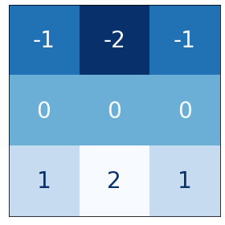
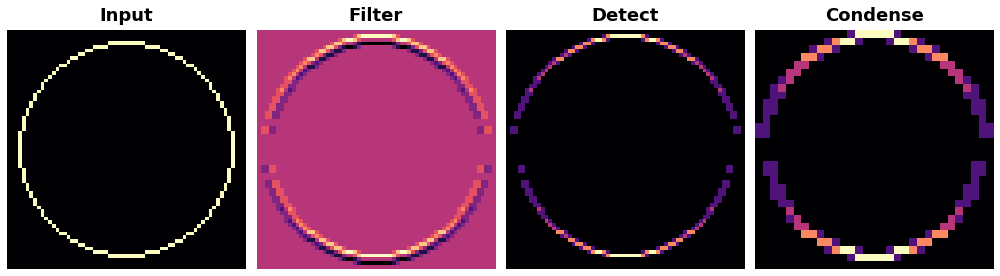
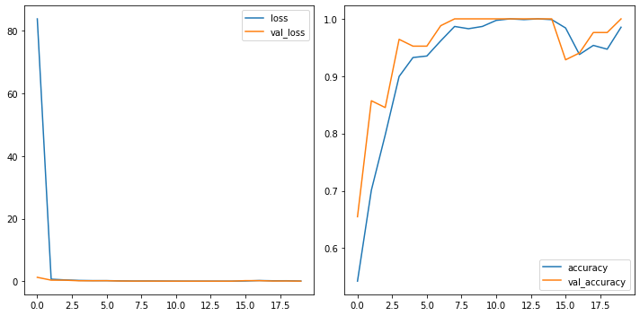
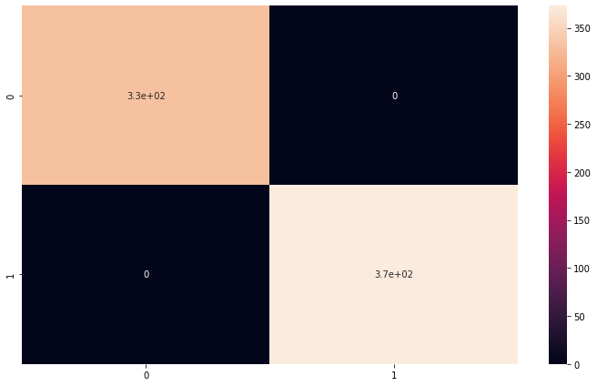
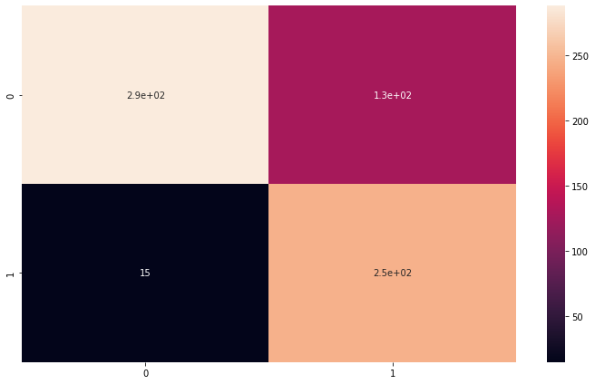
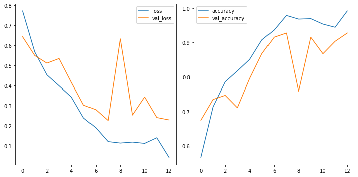
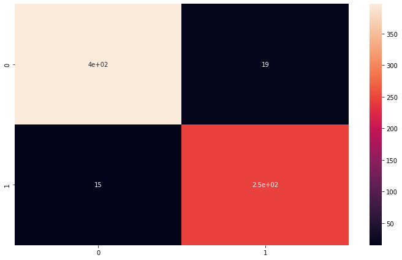
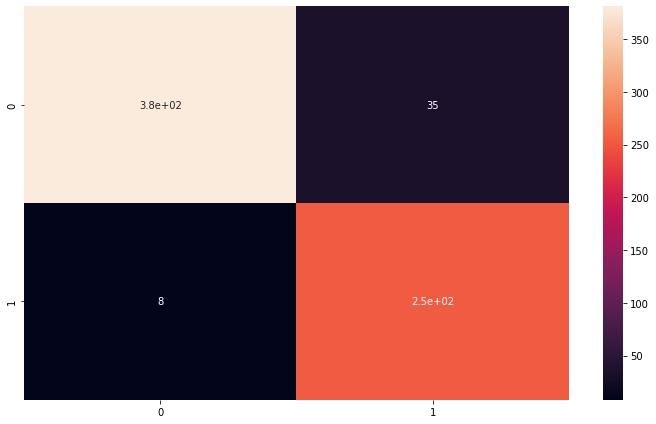

<a href="https://colab.research.google.com/github/wesleybeckner/general_applications_of_neural_networks/blob/main/notebooks/S4_Computer_Vision_II.ipynb" target="_parent"></a>

# General Applications of Neural Networks <br> Session 4: Computer Vision Part 2 (Defect Detection Case Study)

**Instructor**: Wesley Beckner

**Contact**: wesleybeckner@gmail.com

---

<br>

In this session we will continue with our exploration of CNNs. In the previous session we discussed three flagship layers for the CNN: convolution ReLU and maximum pooling. Here we'll discuss the sliding window, how to build your custom CNN, and data augmentation for images.

<br>

_images in this notebook borrowed from [Ryan Holbrook](https://mathformachines.com/)_

For more information on the dataset we are using today watch this [video](https://www.youtube.com/watch?v=4sDfwS48p0A)


---

<br>

<a name='top'></a>

<a name='x.0'></a>

## 4.0 Preparing Environment and Importing Data

[back to top](#top)

<a name='x.0.1'></a>

### 4.0.1 Enabling and testing the GPU

[back to top](#top)

First, you'll need to enable GPUs for the notebook:

- Navigate to Edit→Notebook Settings
- select GPU from the Hardware Accelerator drop-down

Next, we'll confirm that we can connect to the GPU with tensorflow:


```python
%tensorflow_version 2.x
import tensorflow as tf
device_name = tf.test.gpu_device_name()
if device_name != '/device:GPU:0':
  raise SystemError('GPU device not found')
print('Found GPU at: {}'.format(device_name))
```

    Found GPU at: /device:GPU:0


<a name='x.0.2'></a>

### 4.0.2 Observe TensorFlow speedup on GPU relative to CPU

[back to top](#top)

This example constructs a typical convolutional neural network layer over a
random image and manually places the resulting ops on either the CPU or the GPU
to compare execution speed.


```python
%tensorflow_version 2.x
import tensorflow as tf
import timeit

device_name = tf.test.gpu_device_name()
if device_name != '/device:GPU:0':
  print(
      '\n\nThis error most likely means that this notebook is not '
      'configured to use a GPU.  Change this in Notebook Settings via the '
      'command palette (cmd/ctrl-shift-P) or the Edit menu.\n\n')
  raise SystemError('GPU device not found')

def cpu():
  with tf.device('/cpu:0'):
    random_image_cpu = tf.random.normal((100, 100, 100, 3))
    net_cpu = tf.keras.layers.Conv2D(32, 7)(random_image_cpu)
    return tf.math.reduce_sum(net_cpu)

def gpu():
  with tf.device('/device:GPU:0'):
    random_image_gpu = tf.random.normal((100, 100, 100, 3))
    net_gpu = tf.keras.layers.Conv2D(32, 7)(random_image_gpu)
    return tf.math.reduce_sum(net_gpu)
  
# We run each op once to warm up; see: https://stackoverflow.com/a/45067900
cpu()
gpu()

# Run the op several times.
print('Time (s) to convolve 32x7x7x3 filter over random 100x100x100x3 images '
      '(batch x height x width x channel). Sum of ten runs.')
print('CPU (s):')
cpu_time = timeit.timeit('cpu()', number=10, setup="from __main__ import cpu")
print(cpu_time)
print('GPU (s):')
gpu_time = timeit.timeit('gpu()', number=10, setup="from __main__ import gpu")
print(gpu_time)
print('GPU speedup over CPU: {}x'.format(int(cpu_time/gpu_time)))
```

    Time (s) to convolve 32x7x7x3 filter over random 100x100x100x3 images (batch x height x width x channel). Sum of ten runs.
    CPU (s):
    3.7607866190000436
    GPU (s):
    0.04739101299998083
    GPU speedup over CPU: 79x


<a name='x.0.3'></a>

### 4.0.3 Import Packages

[back to top](#top)


```python
# clear memory from cpu/gpu task (skimage load method is ram intensive)
import gc
gc.collect()
```


    61


```python
import os
import pandas as pd
import numpy as np
import seaborn as sns
import matplotlib.pyplot as plt
from skimage import io, feature, filters, exposure, color
from skimage.transform import rescale, resize
from sklearn.metrics import classification_report,confusion_matrix

#importing required tf libraries
import tensorflow as tf
from tensorflow.keras import layers
from tensorflow.keras.layers import Activation, Dropout, Flatten, Dense, Conv2D, MaxPooling2D, InputLayer
from tensorflow.data.experimental import AUTOTUNE
from tensorflow.keras.layers.experimental import preprocessing
from tensorflow.keras.preprocessing import image_dataset_from_directory
from tensorflow.keras.preprocessing.image import ImageDataGenerator, load_img, img_to_array
from tensorflow.keras.models import Sequential
from tensorflow.keras.callbacks import EarlyStopping
```


```python
# Sync your google drive folder
from google.colab import drive
drive.mount("/content/drive")
```

    Mounted at /content/drive


<a name='x.0.4'></a>

### 4.0.4 Load Dataset

[back to top](#top)

We will actually take a beat here today. When we started building our ML frameworks, we simply wanted our data in a numpy array to feed it into our pipeline. At some point, especially when working with images, the data becomes too large to fit into memory. For this reason we need an alternative way to import our data. With the merger of keras/tf two popular frameworks became available, `ImageDataGenerator` and `image_dataset_from_directory` both under `tf.keras.preprocessing.image`. `image_dataset_from_directory` can sometimes be faster (tf origin) but `ImageDataGenerator` is a lot simpler to use and has on-the-fly data augmentation capability (keras).

For a full comparison of methods visit [this link](https://towardsdatascience.com/what-is-the-best-input-pipeline-to-train-image-classification-models-with-tf-keras-eb3fe26d3cc5)

#### 4.0.4.0 Define Global Parameters

[back to top](#top)


```python
# full dataset can be attained from kaggle if you are interested
# https://www.kaggle.com/ravirajsinh45/real-life-industrial-dataset-of-casting-product?select=casting_data

# set global parameters for all import dataset methods
image_shape = (300,300,3) # the images actually are 300,300,3
batch_size = 32
validation_split = 0.1
seed_value = 42

path_to_casting_data = '/content/drive/MyDrive/courses/tech_fundamentals/TECH_FUNDAMENTALS/data/casting_data_class_practice'
technocast_train_path = path_to_casting_data + '/train/'
technocast_test_path = path_to_casting_data + '/test/'

from numpy.random import seed
seed(seed_value)
tf.random.set_seed(seed_value)
```

#### 4.0.4.1 Loading data with skimage

[back to top](#top)


```python
class MyImageLoader: 
    def __init__(self):
        self.classifer = None
        self.folder = path_to_casting_data

    def imread_convert(self, f):
        return io.imread(f).astype(np.uint8)

    def load_data_from_folder(self, dir):
        # read all images into an image 
        if type(dir) != list:
          ic = io.ImageCollection(self.folder + dir + "*.bmp",
                                  load_func=self.imread_convert)
        else:
          dir1 = dir[0]
          dir2 = dir[1]
          ic = io.ImageCollection(self.folder + dir1 + "*.jpeg:" + self.folder + dir2 + "*.jpeg",
                                load_func=self.imread_convert)
        
        #create one large array of image data
        data = io.concatenate_images(ic)

        #resize to target shape
        # data = resize(data, (data.shape[0], *image_shape[:2])) #uncomment if you need to resize images
        
        #extract labels from image names
        labels = np.array(ic.files)
        for i, f in enumerate(labels):
            labels[i] = '_'.join(f.split('/')[-1].split('_')[:2])
            # print(f, labels[i])
        return(data,labels)

# Create an object of the class `MyImageLoader`
img_clf = MyImageLoader()

# load images
(train_val_raw, train_val_labels) = img_clf.load_data_from_folder(['/train/ok_front/', '/train/def_front/'])
(test_raw, test_labels) = img_clf.load_data_from_folder(['/test/ok_front/', '/test/def_front/'])

classes = list(np.unique(train_val_labels))
print(f"Classes: {classes}")
print("train and validation labels: {}".format(len(train_val_labels)))
print("test labels: {}".format(len(test_labels)))

# convert labels to numeric
for i in range(len(classes)):
    train_val_labels[train_val_labels == classes[i]] = i
    test_labels[test_labels == classes[i]] = i

train_val_labels = train_val_labels.astype(float)
test_labels = test_labels.astype(float)

# create train/val/test and shuffle
train_val_dataset = tf.data.Dataset.from_tensor_slices((train_val_raw, train_val_labels)) 
# shuffling the `train+val` dataset before separating them
train_val_dataset = train_val_dataset.shuffle(buffer_size=len(train_val_dataset), seed=seed_value)

# use validation_split
val_len = int(validation_split * len(train_val_raw))
val_dataset = train_val_dataset.take(val_len)
train_dataset = train_val_dataset.skip(val_len)

test_dataset = tf.data.Dataset.from_tensor_slices((test_raw, test_labels)) 
# test_dataset = test_dataset.shuffle(buffer_size=len(test_dataset), seed=seed_value)        

print(f"Train size: {len(train_dataset)}\nVal size: {len(val_dataset)}\nTest size: {len(test_dataset)}")

# batch the data
train_dataset_batched = train_dataset.batch(batch_size)
val_dataset_batched = val_dataset.batch(batch_size)
test_dataset_batched = test_dataset.batch(batch_size)

print(f"Train batches: {len(train_dataset_batched)}\nVal batches: {len(val_dataset_batched)}\nTest batches: {len(test_dataset_batched)}")
```

    Classes: ['cast_def', 'cast_ok']
    train and validation labels: 840
    test labels: 678
    Train size: 756
    Val size: 84
    Test size: 678
    Train batches: 24
    Val batches: 3
    Test batches: 22


<a name='x.0.4.1'></a>

#### 4.0.4.2 Loading Data with `ImageDataGenerator`

[back to top](#top)


```python
image_gen = ImageDataGenerator(rescale=1/255,
                               validation_split=validation_split) # normalize pixels to 0-1

#we're using keras inbuilt function to ImageDataGenerator so we 
# dont need to label all images into 0 and 1 
print("loading training set...")
train_set_keras = image_gen.flow_from_directory(technocast_train_path,
                                          target_size=image_shape[:2],
                                          color_mode="rgb",
                                          batch_size=batch_size,
                                          class_mode="sparse",
                                          subset="training",
                                          shuffle=True,
                                          seed=seed_value)
print("loading validation set...")
val_set_keras = image_gen.flow_from_directory(technocast_train_path,
                                          target_size=image_shape[:2],
                                          color_mode="rgb",
                                          batch_size=batch_size,
                                          class_mode="sparse",
                                          subset="validation",
                                          shuffle=True,
                                          seed=seed_value)
print("loading testing set...")
test_set_keras = image_gen.flow_from_directory(technocast_test_path,
                                          target_size=image_shape[:2],
                                          color_mode="rgb",
                                          batch_size=batch_size,
                                          class_mode="sparse",
                                          shuffle=False)
```

    loading training set...
    Found 757 images belonging to 2 classes.
    loading validation set...
    Found 83 images belonging to 2 classes.
    loading testing set...
    Found 678 images belonging to 2 classes.


<a name='x.0.4.2'></a>

#### 4.0.4.3 loading data with `image_dataset_from_directory`

[back to top](#top)

This method should be approx 2x faster than `ImageDataGenerator`


```python
# Load training and validation sets
print("loading training set...")
ds_train_ = image_dataset_from_directory(
    technocast_train_path,
    labels="inferred",
    label_mode="int",
    color_mode="rgb",
    image_size=image_shape[:2],
    batch_size=batch_size,
    validation_split=validation_split,
    subset="training",
    shuffle=True,
    seed=seed_value,
)
print("loading validation set...")
ds_val_ = image_dataset_from_directory(
    technocast_train_path,
    labels="inferred",
    label_mode="int",
    color_mode="rgb",
    image_size=image_shape[:2],
    batch_size=batch_size,
    validation_split=validation_split,
    subset="validation",
    shuffle=True,
    seed=seed_value,
)
print("loading testing set...")
ds_test_ = image_dataset_from_directory(
    technocast_test_path,
    labels="inferred",
    label_mode="int",
    color_mode="rgb",
    image_size=image_shape[:2],
    batch_size=batch_size,
    shuffle=False,
)

train_set_tf = ds_train_.prefetch(buffer_size=AUTOTUNE)
val_set_tf = ds_val_.prefetch(buffer_size=AUTOTUNE)
test_set_tf = ds_test_.prefetch(buffer_size=AUTOTUNE)
```

    loading training set...
    Found 840 files belonging to 2 classes.
    Using 756 files for training.
    loading validation set...
    Found 840 files belonging to 2 classes.
    Using 84 files for validation.
    loading testing set...
    Found 678 files belonging to 2 classes.


#### 4.0.4.4 View Images

[back to top](#top)


```python
# view some images
def_path = '/def_front/cast_def_0_1001.jpeg'
ok_path = '/ok_front/cast_ok_0_1.jpeg'
image_path = technocast_train_path + ok_path
image = tf.io.read_file(image_path)
image = tf.io.decode_jpeg(image)
image = resize(image, (256, 256),
                anti_aliasing=True)

plt.figure(figsize=(6, 6))
plt.imshow(tf.squeeze(image), cmap='gray')
plt.axis('off')
plt.show();
```


    

    


<a name='x.1'></a>

## 4.1 Understanding the Sliding Window

[back to top](#top)

The kernels we just reviewed, need to be swept or _slid_ along the preceding layer. We call this a **_sliding window_**, the window being the kernel. 

<p align=center>
</img>
</p>

What do you notice about the gif? One perhaps obvious observation is that you can't scoot all the way up to the border of the input layer, this is because the kernel defines operations _around_ the centered pixel and so you bang up against the margin of the input array. We can change the behavior at the boundary with a **_padding_** hyperparameter. A second observation, is that the distance we move the kernel along in each step could be variable, we call this the **_stride_**. We will explore the affects of each of these.


```python
from tensorflow import keras
from tensorflow.keras import layers

model = keras.Sequential([
    layers.Conv2D(filters=64,
                  kernel_size=3,
                  strides=1,
                  padding='same',
                  activation='relu'),
    layers.MaxPool2D(pool_size=2,
                     strides=1,
                     padding='same')
    # More layers follow
])
```

<a name='x.1.1'></a>

### 4.1.1 Stride

[back to top](#top)

Stride defines the the step size we take with each kernel as it passes along the input array. The stride needs to be defined in both the horizontal and vertical dimensions. This animation shows a 2x2 stride


<p align=center>
</img>
</p>

The stride will often be 1 for CNNs, where we don't want to lose any important information. Maximum pooling layers will often have strides greater than 1, to better summarize/accentuate the relevant features/activations.

If the stride is the same in both the horizontal and vertical directions, it can be set with a single number like `strides=2` within keras.


### 4.1.2 Padding

[back to top](#top)

Padding attempts to resolve our issue at the border: our kernel requires information surrounding the centered pixel, and at the border of the input array we don't have that information. What to do?

We have a couple popular options within the keras framework. We can set `padding='valid'` and only slide the kernel to the edge of the input array. This has the drawback of feature maps shrinking in size as we pass through the NN. Another option is to set `padding='same'` what this will do is pad the input array with 0's, just enough of them to allow the feature map to be the same size as the input array. This is shown in the gif below:


<p align=center>
</img>
</p>

The downside of setting the padding to same will be that features at the edges of the image will be diluted. 

<a name='x.1.3'></a>

### 🏋️ Exercise 1: Exploring Sliding Windows

[back to top](#top)


```python
from skimage import draw, transform
from itertools import product
# helper functions borrowed from Ryan Holbrook
# https://mathformachines.com/

def circle(size, val=None, r_shrink=0):
    circle = np.zeros([size[0]+1, size[1]+1])
    rr, cc = draw.circle_perimeter(
        size[0]//2, size[1]//2,
        radius=size[0]//2 - r_shrink,
        shape=[size[0]+1, size[1]+1],
    )
    if val is None:
        circle[rr, cc] = np.random.uniform(size=circle.shape)[rr, cc]
    else:
        circle[rr, cc] = val
    circle = transform.resize(circle, size, order=0)
    return circle

def show_kernel(kernel, label=True, digits=None, text_size=28):
    # Format kernel
    kernel = np.array(kernel)
    if digits is not None:
        kernel = kernel.round(digits)

    # Plot kernel
    cmap = plt.get_cmap('Blues_r')
    plt.imshow(kernel, cmap=cmap)
    rows, cols = kernel.shape
    thresh = (kernel.max()+kernel.min())/2
    # Optionally, add value labels
    if label:
        for i, j in product(range(rows), range(cols)):
            val = kernel[i, j]
            color = cmap(0) if val > thresh else cmap(255)
            plt.text(j, i, val, 
                     color=color, size=text_size,
                     horizontalalignment='center', verticalalignment='center')
    plt.xticks([])
    plt.yticks([])

def show_extraction(image,
                    kernel,
                    conv_stride=1,
                    conv_padding='valid',
                    activation='relu',
                    pool_size=2,
                    pool_stride=2,
                    pool_padding='same',
                    figsize=(10, 10),
                    subplot_shape=(2, 2),
                    ops=['Input', 'Filter', 'Detect', 'Condense'],
                    gamma=1.0):
    # Create Layers
    model = tf.keras.Sequential([
                    tf.keras.layers.Conv2D(
                        filters=1,
                        kernel_size=kernel.shape,
                        strides=conv_stride,
                        padding=conv_padding,
                        use_bias=False,
                        input_shape=image.shape,
                    ),
                    tf.keras.layers.Activation(activation),
                    tf.keras.layers.MaxPool2D(
                        pool_size=pool_size,
                        strides=pool_stride,
                        padding=pool_padding,
                    ),
                   ])

    layer_filter, layer_detect, layer_condense = model.layers
    kernel = tf.reshape(kernel, [*kernel.shape, 1, 1])
    layer_filter.set_weights([kernel])

    # Format for TF
    image = tf.expand_dims(image, axis=0)
    image = tf.image.convert_image_dtype(image, dtype=tf.float32) 
    
    # Extract Feature
    image_filter = layer_filter(image)
    image_detect = layer_detect(image_filter)
    image_condense = layer_condense(image_detect)
    
    images = {}
    if 'Input' in ops:
        images.update({'Input': (image, 1.0)})
    if 'Filter' in ops:
        images.update({'Filter': (image_filter, 1.0)})
    if 'Detect' in ops:
        images.update({'Detect': (image_detect, gamma)})
    if 'Condense' in ops:
        images.update({'Condense': (image_condense, gamma)})
    
    # Plot
    plt.figure(figsize=figsize)
    for i, title in enumerate(ops):
        image, gamma = images[title]
        plt.subplot(*subplot_shape, i+1)
        plt.imshow(tf.image.adjust_gamma(tf.squeeze(image), gamma))
        plt.axis('off')
        plt.title(title)
```

Create an image and kernel:


```python
import tensorflow as tf
import matplotlib.pyplot as plt

plt.rc('figure', autolayout=True)
plt.rc('axes', labelweight='bold', labelsize='large',
       titleweight='bold', titlesize=18, titlepad=10)
plt.rc('image', cmap='magma')

image = circle([64, 64], val=1.0, r_shrink=3)
image = tf.reshape(image, [*image.shape, 1])
# Bottom sobel
kernel = tf.constant(
    [[-1, -2, -1],
     [0, 0, 0],
     [1, 2, 1]],
)

show_kernel(kernel)
```


    

    


What do we think this kernel is meant to detect for?

We will apply our kernel with a 1x1 stride and our max pooling with a 2x2 stride and pool size of 2.


```python
show_extraction(
    image, kernel,

    # Window parameters
    conv_stride=1,
    pool_size=2,
    pool_stride=2,

    subplot_shape=(1, 4),
    figsize=(14, 6),
)
```


    

    


Works ok! what about a higher conv stride?


```python
show_extraction(
    image, kernel,

    # Window parameters
    conv_stride=3,
    pool_size=2,
    pool_stride=2,

    subplot_shape=(1, 4),
    figsize=(14, 6),
)
```


    

    


Looks like we lost a bit of information!

Sometimes published models will use a larger kernel and stride in the initial layer to produce large-scale features early on in the network without losing too much information (ResNet50 uses 7x7 kernels with a stride of 2). For now, without having much experience it's safe to set conv strides to 1.

Take a moment here with the given kernel and explore different settings for applying both the kernel and the max_pool

```
conv_stride=YOUR_VALUE, # condenses pixels
pool_size=YOUR_VALUE,
pool_stride=YOUR_VALUE, # condenses pixels
```

Given a total condensation of 8 (I'm taking condensation to mean `conv_stride` x `pool_stride`). what do you think is the best combination of values for `conv_stride, pool_size, and pool_stride`?

<a name='x.2'></a>

## 4.2 Building a Custom CNN

[back to top](#top)

As we move through the network, small-scale features (lines, edges, etc.) turn to large-scale features (shapes, eyes, ears, etc). We call these blocks of convolution, ReLU, and max pool **_convolutional blocks_** and they are the low level modular framework we work with. By this means, the CNN is able to design it's own features, ones suited for the classification or regression task at hand. 

We will design a custom CNN for the Casting Defect Detection Dataset.

### 4.2.1 Define Architecture

[back to top](#top)

In the following I'm going to double the filter size after the first block. This is a common pattern as the max pooling layers forces us in the opposite direction.


```python
def build_model():
  # Creating model
  model = Sequential()

  model.add(InputLayer(input_shape=(image_shape)))

  model.add(Conv2D(filters=8, kernel_size=(3,3), activation='relu',))
  model.add(MaxPooling2D(pool_size=(2, 2)))

  model.add(Conv2D(filters=16, kernel_size=(3,3), activation='relu',))
  model.add(MaxPooling2D(pool_size=(2, 2)))

  model.add(Conv2D(filters=16, kernel_size=(3,3), activation='relu',))
  model.add(MaxPooling2D(pool_size=(2, 2)))

  model.add(Flatten())

  model.add(Dense(224))
  model.add(Activation('relu'))

  # Last layer
  model.add(Dense(2))

  base_learning_rate = 0.001
  model.compile(loss=tf.keras.losses.SparseCategoricalCrossentropy(from_logits=True),
                optimizer=tf.keras.optimizers.Adam(learning_rate=base_learning_rate),
                metrics=['accuracy'])

  print(model.summary())
  return model

early_stop = EarlyStopping(monitor='val_loss',
                            patience=5,
                            restore_best_weights=True,)
```

<a name='x.2.1'></a>

### 4.2.1 Train and Evaluate Model

[back to top](#top)

To save/load weights and training history:
```
# model.save('inspection_of_casting_products.h5')
# model.load_weights('inspection_of_casting_products.h5')
# losses.to_csv('history_simple_model.csv', index=False)
```

#### 4.2.1.1 Skimage

[back to top](#top)


```python
%%time
model = build_model()
with tf.device('/device:GPU:0'):
  results = model.fit(train_dataset_batched,
                      epochs=30,
                      validation_data=val_dataset_batched,
                      callbacks=[early_stop]
                      )
```

    Model: "sequential_3"
    _________________________________________________________________
     Layer (type)                Output Shape              Param #   
    =================================================================
     conv2d_25 (Conv2D)          (None, 298, 298, 8)       224       
                                                                     
     max_pooling2d_3 (MaxPooling  (None, 149, 149, 8)      0         
     2D)                                                             
                                                                     
     conv2d_26 (Conv2D)          (None, 147, 147, 16)      1168      
                                                                     
     max_pooling2d_4 (MaxPooling  (None, 73, 73, 16)       0         
     2D)                                                             
                                                                     
     conv2d_27 (Conv2D)          (None, 71, 71, 16)        2320      
                                                                     
     max_pooling2d_5 (MaxPooling  (None, 35, 35, 16)       0         
     2D)                                                             
                                                                     
     flatten (Flatten)           (None, 19600)             0         
                                                                     
     dense (Dense)               (None, 224)               4390624   
                                                                     
     activation_2 (Activation)   (None, 224)               0         
                                                                     
     dense_1 (Dense)             (None, 2)                 450       
                                                                     
    =================================================================
    Total params: 4,394,786
    Trainable params: 4,394,786
    Non-trainable params: 0
    _________________________________________________________________
    None
    Epoch 1/30
    24/24 [==============================] - 4s 95ms/step - loss: 83.8552 - accuracy: 0.5423 - val_loss: 1.2317 - val_accuracy: 0.6548
    Epoch 2/30
    24/24 [==============================] - 2s 72ms/step - loss: 0.6356 - accuracy: 0.7011 - val_loss: 0.3245 - val_accuracy: 0.8571
    Epoch 3/30
    24/24 [==============================] - 2s 71ms/step - loss: 0.3996 - accuracy: 0.7976 - val_loss: 0.3156 - val_accuracy: 0.8452
    Epoch 4/30
    24/24 [==============================] - 2s 72ms/step - loss: 0.2368 - accuracy: 0.8995 - val_loss: 0.1321 - val_accuracy: 0.9643
    Epoch 5/30
    24/24 [==============================] - 2s 72ms/step - loss: 0.1764 - accuracy: 0.9325 - val_loss: 0.1329 - val_accuracy: 0.9524
    Epoch 6/30
    24/24 [==============================] - 2s 71ms/step - loss: 0.1729 - accuracy: 0.9352 - val_loss: 0.1492 - val_accuracy: 0.9524
    Epoch 7/30
    24/24 [==============================] - 2s 72ms/step - loss: 0.0984 - accuracy: 0.9616 - val_loss: 0.0482 - val_accuracy: 0.9881
    Epoch 8/30
    24/24 [==============================] - 2s 71ms/step - loss: 0.0494 - accuracy: 0.9868 - val_loss: 0.0247 - val_accuracy: 1.0000
    Epoch 9/30
    24/24 [==============================] - 2s 71ms/step - loss: 0.0632 - accuracy: 0.9828 - val_loss: 0.0292 - val_accuracy: 1.0000
    Epoch 10/30
    24/24 [==============================] - 2s 71ms/step - loss: 0.0411 - accuracy: 0.9868 - val_loss: 0.0139 - val_accuracy: 1.0000
    Epoch 11/30
    24/24 [==============================] - 2s 71ms/step - loss: 0.0183 - accuracy: 0.9974 - val_loss: 0.0096 - val_accuracy: 1.0000
    Epoch 12/30
    24/24 [==============================] - 2s 72ms/step - loss: 0.0077 - accuracy: 1.0000 - val_loss: 0.0048 - val_accuracy: 1.0000
    Epoch 13/30
    24/24 [==============================] - 2s 71ms/step - loss: 0.0083 - accuracy: 0.9987 - val_loss: 0.0050 - val_accuracy: 1.0000
    Epoch 14/30
    24/24 [==============================] - 2s 72ms/step - loss: 0.0047 - accuracy: 1.0000 - val_loss: 0.0054 - val_accuracy: 1.0000
    Epoch 15/30
    24/24 [==============================] - 2s 73ms/step - loss: 0.0048 - accuracy: 0.9987 - val_loss: 0.0033 - val_accuracy: 1.0000
    Epoch 16/30
    24/24 [==============================] - 2s 72ms/step - loss: 0.0692 - accuracy: 0.9841 - val_loss: 0.1683 - val_accuracy: 0.9286
    Epoch 17/30
    24/24 [==============================] - 2s 71ms/step - loss: 0.2085 - accuracy: 0.9378 - val_loss: 0.1657 - val_accuracy: 0.9405
    Epoch 18/30
    24/24 [==============================] - 2s 71ms/step - loss: 0.1278 - accuracy: 0.9537 - val_loss: 0.0475 - val_accuracy: 0.9762
    Epoch 19/30
    24/24 [==============================] - 2s 73ms/step - loss: 0.1368 - accuracy: 0.9471 - val_loss: 0.0586 - val_accuracy: 0.9762
    Epoch 20/30
    24/24 [==============================] - 2s 72ms/step - loss: 0.0445 - accuracy: 0.9854 - val_loss: 0.0144 - val_accuracy: 1.0000
    CPU times: user 34.5 s, sys: 1.8 s, total: 36.3 s
    Wall time: 47.6 s


```python
losses = pd.DataFrame(results.history)
fig, ax = plt.subplots(1, 2, figsize=(10,5))
losses[['loss','val_loss']].plot(ax=ax[0])
losses[['accuracy','val_accuracy']].plot(ax=ax[1])
```


    <matplotlib.axes._subplots.AxesSubplot at 0x7ff3801d4ad0>


    

    


##### 4.2.1.1.1 Evaluate

[back to top](#top)


```python
pred = []
label = []
for batch in range(len(test_dataset_batched)):
  image_batch, label_batch = train_dataset_batched.as_numpy_iterator().next()
  predictions = model.predict_on_batch(image_batch).argmax(axis=1)
  # print(f"Labels     : {label_batch}\nPredictions: {predictions.astype(float)}")
  pred.append(predictions)
  label.append(label_batch)
predictions = np.array(pred).flatten()
labels = np.array(label).flatten()
print(classification_report(labels,predictions))

plt.figure(figsize=(10,6))
sns.heatmap(confusion_matrix(labels,predictions), annot=True)
```

                  precision    recall  f1-score   support
    
             0.0       1.00      1.00      1.00       331
             1.0       1.00      1.00      1.00       373
    
        accuracy                           1.00       704
       macro avg       1.00      1.00      1.00       704
    weighted avg       1.00      1.00      1.00       704
    


    <matplotlib.axes._subplots.AxesSubplot at 0x7ff3800f0350>


    

    


#### 4.2.1.2 TF - image_dataset_from_directory

[back to top](#top)


```python
%%time
model = build_model()
with tf.device('/device:GPU:0'):
  results = model.fit(train_set_tf,
                      epochs=30,
                      validation_data=val_set_tf,
                      callbacks=[early_stop]
                      )
```

    Model: "sequential_4"
    _________________________________________________________________
     Layer (type)                Output Shape              Param #   
    =================================================================
     conv2d_28 (Conv2D)          (None, 298, 298, 8)       224       
                                                                     
     max_pooling2d_6 (MaxPooling  (None, 149, 149, 8)      0         
     2D)                                                             
                                                                     
     conv2d_29 (Conv2D)          (None, 147, 147, 16)      1168      
                                                                     
     max_pooling2d_7 (MaxPooling  (None, 73, 73, 16)       0         
     2D)                                                             
                                                                     
     conv2d_30 (Conv2D)          (None, 71, 71, 16)        2320      
                                                                     
     max_pooling2d_8 (MaxPooling  (None, 35, 35, 16)       0         
     2D)                                                             
                                                                     
     flatten_1 (Flatten)         (None, 19600)             0         
                                                                     
     dense_2 (Dense)             (None, 224)               4390624   
                                                                     
     activation_3 (Activation)   (None, 224)               0         
                                                                     
     dense_3 (Dense)             (None, 2)                 450       
                                                                     
    =================================================================
    Total params: 4,394,786
    Trainable params: 4,394,786
    Non-trainable params: 0
    _________________________________________________________________
    None
    Epoch 1/30
    24/24 [==============================] - 4s 110ms/step - loss: 134.4262 - accuracy: 0.4907 - val_loss: 1.5430 - val_accuracy: 0.4643
    Epoch 2/30
    24/24 [==============================] - 3s 104ms/step - loss: 0.8062 - accuracy: 0.6323 - val_loss: 0.5887 - val_accuracy: 0.7262
    Epoch 3/30
    24/24 [==============================] - 3s 104ms/step - loss: 0.5298 - accuracy: 0.7526 - val_loss: 0.4983 - val_accuracy: 0.7857
    Epoch 4/30
    24/24 [==============================] - 3s 102ms/step - loss: 0.3654 - accuracy: 0.8452 - val_loss: 0.4701 - val_accuracy: 0.7738
    Epoch 5/30
    24/24 [==============================] - 3s 102ms/step - loss: 0.3978 - accuracy: 0.8082 - val_loss: 0.4899 - val_accuracy: 0.7738
    Epoch 6/30
    24/24 [==============================] - 3s 102ms/step - loss: 0.2814 - accuracy: 0.8796 - val_loss: 0.6540 - val_accuracy: 0.7262
    Epoch 7/30
    24/24 [==============================] - 3s 105ms/step - loss: 0.8786 - accuracy: 0.7817 - val_loss: 0.8129 - val_accuracy: 0.6429
    Epoch 8/30
    24/24 [==============================] - 3s 103ms/step - loss: 0.3586 - accuracy: 0.8320 - val_loss: 0.5316 - val_accuracy: 0.8333
    Epoch 9/30
    24/24 [==============================] - 3s 104ms/step - loss: 0.2162 - accuracy: 0.9180 - val_loss: 0.5447 - val_accuracy: 0.8095
    CPU times: user 26 s, sys: 2.77 s, total: 28.8 s
    Wall time: 39.1 s


```python
losses = pd.DataFrame(results.history)
fig, ax = plt.subplots(1, 2, figsize=(10,5))
losses[['loss','val_loss']].plot(ax=ax[0])
losses[['accuracy','val_accuracy']].plot(ax=ax[1])
```


    <matplotlib.axes._subplots.AxesSubplot at 0x7ff389cf4050>


    

    


##### 4.2.1.2.1 Evaluate

[back to top](#top)


```python
predictions = model.predict(test_set_tf).argmax(axis=1)
labels = np.array([])
for x, y in ds_test_:
  labels = np.concatenate([labels, tf.squeeze(y.numpy()).numpy()])
print(classification_report(labels,predictions))
plt.figure(figsize=(10,6))
sns.heatmap(confusion_matrix(labels,predictions), annot=True)
```

                  precision    recall  f1-score   support
    
             0.0       0.95      0.69      0.80       416
             1.0       0.66      0.94      0.78       262
    
        accuracy                           0.79       678
       macro avg       0.80      0.82      0.79       678
    weighted avg       0.84      0.79      0.79       678
    


    <matplotlib.axes._subplots.AxesSubplot at 0x7ff381bb5710>


    

    


#### 4.2.1.3 Keras - ImageDataGenerator

[back to top](#top)


```python
%%time
model = build_model()
with tf.device('/device:GPU:0'):
  results = model.fit(train_set_keras,
                      epochs=30,
                      validation_data=val_set_keras,
                      callbacks=[early_stop]
                      )
```

    Model: "sequential_5"
    _________________________________________________________________
     Layer (type)                Output Shape              Param #   
    =================================================================
     conv2d_31 (Conv2D)          (None, 298, 298, 8)       224       
                                                                     
     max_pooling2d_9 (MaxPooling  (None, 149, 149, 8)      0         
     2D)                                                             
                                                                     
     conv2d_32 (Conv2D)          (None, 147, 147, 16)      1168      
                                                                     
     max_pooling2d_10 (MaxPoolin  (None, 73, 73, 16)       0         
     g2D)                                                            
                                                                     
     conv2d_33 (Conv2D)          (None, 71, 71, 16)        2320      
                                                                     
     max_pooling2d_11 (MaxPoolin  (None, 35, 35, 16)       0         
     g2D)                                                            
                                                                     
     flatten_2 (Flatten)         (None, 19600)             0         
                                                                     
     dense_4 (Dense)             (None, 224)               4390624   
                                                                     
     activation_4 (Activation)   (None, 224)               0         
                                                                     
     dense_5 (Dense)             (None, 2)                 450       
                                                                     
    =================================================================
    Total params: 4,394,786
    Trainable params: 4,394,786
    Non-trainable params: 0
    _________________________________________________________________
    None
    Epoch 1/30
    24/24 [==============================] - 6s 218ms/step - loss: 0.7728 - accuracy: 0.5667 - val_loss: 0.6439 - val_accuracy: 0.6747
    Epoch 2/30
    24/24 [==============================] - 4s 183ms/step - loss: 0.5682 - accuracy: 0.7133 - val_loss: 0.5502 - val_accuracy: 0.7349
    Epoch 3/30
    24/24 [==============================] - 4s 183ms/step - loss: 0.4538 - accuracy: 0.7860 - val_loss: 0.5121 - val_accuracy: 0.7470
    Epoch 4/30
    24/24 [==============================] - 4s 186ms/step - loss: 0.3994 - accuracy: 0.8177 - val_loss: 0.5352 - val_accuracy: 0.7108
    Epoch 5/30
    24/24 [==============================] - 4s 184ms/step - loss: 0.3441 - accuracy: 0.8507 - val_loss: 0.4172 - val_accuracy: 0.7952
    Epoch 6/30
    24/24 [==============================] - 4s 182ms/step - loss: 0.2397 - accuracy: 0.9075 - val_loss: 0.3036 - val_accuracy: 0.8675
    Epoch 7/30
    24/24 [==============================] - 4s 184ms/step - loss: 0.1906 - accuracy: 0.9366 - val_loss: 0.2806 - val_accuracy: 0.9157
    Epoch 8/30
    24/24 [==============================] - 4s 185ms/step - loss: 0.1218 - accuracy: 0.9789 - val_loss: 0.2270 - val_accuracy: 0.9277
    Epoch 9/30
    24/24 [==============================] - 5s 187ms/step - loss: 0.1146 - accuracy: 0.9683 - val_loss: 0.6334 - val_accuracy: 0.7590
    Epoch 10/30
    24/24 [==============================] - 4s 185ms/step - loss: 0.1193 - accuracy: 0.9696 - val_loss: 0.2541 - val_accuracy: 0.9157
    Epoch 11/30
    24/24 [==============================] - 5s 187ms/step - loss: 0.1129 - accuracy: 0.9538 - val_loss: 0.3443 - val_accuracy: 0.8675
    Epoch 12/30
    24/24 [==============================] - 5s 189ms/step - loss: 0.1410 - accuracy: 0.9445 - val_loss: 0.2417 - val_accuracy: 0.9036
    Epoch 13/30
    24/24 [==============================] - 4s 186ms/step - loss: 0.0431 - accuracy: 0.9921 - val_loss: 0.2299 - val_accuracy: 0.9277
    CPU times: user 53.5 s, sys: 4.18 s, total: 57.7 s
    Wall time: 1min


```python
losses = pd.DataFrame(results.history)
fig, ax = plt.subplots(1, 2, figsize=(10,5))
losses[['loss','val_loss']].plot(ax=ax[0])
losses[['accuracy','val_accuracy']].plot(ax=ax[1])
```


    <matplotlib.axes._subplots.AxesSubplot at 0x7ff37fdbe790>


    

    


##### 4.2.1.3.1 Evaluate

[back to top](#top)


```python
predictions = model.predict(test_set_keras).argmax(axis=1)
labels = test_set_keras.classes
print(classification_report(labels,predictions))
plt.figure(figsize=(10,6))
sns.heatmap(confusion_matrix(labels,predictions), annot=True)
```

                  precision    recall  f1-score   support
    
               0       0.99      0.88      0.93       416
               1       0.83      0.98      0.90       262
    
        accuracy                           0.92       678
       macro avg       0.91      0.93      0.92       678
    weighted avg       0.93      0.92      0.92       678
    


    <matplotlib.axes._subplots.AxesSubplot at 0x7ff37fef4d10>


    

    


### 🏋️ Exercise 2: Binary Output

In the above, we used a type of loss function called *sparse categorical crossentropy*

This loss is useful when we have many target classes set as different integers, i.e.

```
good = 1
bad = 2
ugly = 3
```

another type of loss function is *categorical crossentropy* this is for when the target classes are one-hot encoded, i.e.

```
good = [1,0,0]
bad = [0,1,0]
ugly = [0,0,1]
```

1. Choose one of the datatset import methods from above
2. Specify the labels as binary during the loading process
3. Redefine the model using 
  * a single dense node as the final layer with
  * a sigmoidal activation function
4. Compile with the new loss set to 'binary_crossentropy',
5. Train the model
6. Evaluate the F1/Precision/Recall metrics and display the confusion matrix. 
  * *note: our prior method of obtaining the classification using `argmax` will not work, as the output is now a probability score ranging 0-1*


```python
# Code cell for exercise 2
```

<a name='x.3'></a>

## 4.3 Data Augmentation

[back to top](#top)

Alright, alright, alright. We've done pretty good making our CNN model. But let's see if we can make it even better. There's a last trick we'll cover here in regard to image classifiers. We're going to perturb the input images in such a way as to create a pseudo-larger dataset.

With any machine learning model, the more relevant training data we give the model, the better. The key here is _relevant_ training data. We can easily do this with images so long as we do not change the class of the image. For example, in the small plot below, we are changing contrast, hue, rotation, and doing other things to the image of a car; and this is okay because it does not change the classification from a car to, say, a truck.

<p align=center>
</img>
</p>

Typically when we do data augmentation for images, we do them _online_, i.e. during training. Recall that we train in batches (or minibatches) with CNNs. An example of a minibatch then, might be the small multiples plot below.

<p align=center>
</img>
</p>

by varying the images in this way, the model always sees slightly new data, and becomes a more robust model. Remember that the caveat is that we can't muddle the relevant classification of the image. Sometimes the best way to see if data augmentation will be helpful is to just try it and see!

### 4.3.1 Define Architecture

[back to top](#top)


```python
#Creating model
model = Sequential()

model.add(InputLayer(input_shape=(image_shape)))

model.add(preprocessing.RandomFlip('horizontal', seed=seed_value)), # flip left-to-right
model.add(preprocessing.RandomFlip('vertical', seed=seed_value)), # flip upside-down
model.add(preprocessing.RandomContrast(0.1, seed=seed_value)), # contrast change by up to 50%
model.add(preprocessing.RandomRotation(factor=1, fill_mode='constant', seed=seed_value))

model.add(Conv2D(filters=8, kernel_size=(3,3),input_shape=image_shape, activation='relu',))
model.add(MaxPooling2D(pool_size=(2, 2)))

model.add(Conv2D(filters=16, kernel_size=(3,3), activation='relu',))
model.add(MaxPooling2D(pool_size=(2, 2)))

model.add(Conv2D(filters=16, kernel_size=(3,3), activation='relu',))
model.add(MaxPooling2D(pool_size=(2, 2)))

model.add(Flatten())

model.add(Dense(224))
model.add(Activation('relu'))

# Last layer
model.add(Dense(2))

early_stop = EarlyStopping(monitor='val_loss',
                           patience=5,
                           restore_best_weights=True,)

base_learning_rate = 0.001
model.compile(loss=tf.keras.losses.SparseCategoricalCrossentropy(from_logits=True),
              optimizer=tf.keras.optimizers.Adam(learning_rate=base_learning_rate),
              metrics=['accuracy'])

model.summary()
```

    Model: "sequential_6"
    _________________________________________________________________
     Layer (type)                Output Shape              Param #   
    =================================================================
     random_flip (RandomFlip)    (None, 300, 300, 3)       0         
                                                                     
     random_flip_1 (RandomFlip)  (None, 300, 300, 3)       0         
                                                                     
     random_contrast (RandomCont  (None, 300, 300, 3)      0         
     rast)                                                           
                                                                     
     random_rotation (RandomRota  (None, 300, 300, 3)      0         
     tion)                                                           
                                                                     
     conv2d_34 (Conv2D)          (None, 298, 298, 8)       224       
                                                                     
     max_pooling2d_12 (MaxPoolin  (None, 149, 149, 8)      0         
     g2D)                                                            
                                                                     
     conv2d_35 (Conv2D)          (None, 147, 147, 16)      1168      
                                                                     
     max_pooling2d_13 (MaxPoolin  (None, 73, 73, 16)       0         
     g2D)                                                            
                                                                     
     conv2d_36 (Conv2D)          (None, 71, 71, 16)        2320      
                                                                     
     max_pooling2d_14 (MaxPoolin  (None, 35, 35, 16)       0         
     g2D)                                                            
                                                                     
     flatten_3 (Flatten)         (None, 19600)             0         
                                                                     
     dense_6 (Dense)             (None, 224)               4390624   
                                                                     
     activation_5 (Activation)   (None, 224)               0         
                                                                     
     dense_7 (Dense)             (None, 2)                 450       
                                                                     
    =================================================================
    Total params: 4,394,786
    Trainable params: 4,394,786
    Non-trainable params: 0
    _________________________________________________________________


```python
%%time
results = model.fit(train_set_tf,
                    epochs=30,
                    validation_data=val_set_tf,
                    callbacks=[early_stop])
```

    Epoch 1/30
    24/24 [==============================] - 4s 116ms/step - loss: 119.8577 - accuracy: 0.4960 - val_loss: 4.5860 - val_accuracy: 0.5952
    Epoch 2/30
    24/24 [==============================] - 3s 108ms/step - loss: 1.8653 - accuracy: 0.6561 - val_loss: 0.9853 - val_accuracy: 0.6310
    Epoch 3/30
    24/24 [==============================] - 3s 110ms/step - loss: 0.7695 - accuracy: 0.7143 - val_loss: 0.7379 - val_accuracy: 0.6548
    Epoch 4/30
    24/24 [==============================] - 3s 110ms/step - loss: 0.7312 - accuracy: 0.7196 - val_loss: 0.4667 - val_accuracy: 0.7500
    Epoch 5/30
    24/24 [==============================] - 3s 109ms/step - loss: 0.5811 - accuracy: 0.7513 - val_loss: 0.5543 - val_accuracy: 0.7262
    Epoch 6/30
    24/24 [==============================] - 3s 110ms/step - loss: 0.5251 - accuracy: 0.7619 - val_loss: 0.4778 - val_accuracy: 0.7976
    Epoch 7/30
    24/24 [==============================] - 3s 113ms/step - loss: 0.4472 - accuracy: 0.7950 - val_loss: 0.4601 - val_accuracy: 0.8214
    Epoch 8/30
    24/24 [==============================] - 3s 112ms/step - loss: 0.5250 - accuracy: 0.7765 - val_loss: 0.4135 - val_accuracy: 0.7976
    Epoch 9/30
    24/24 [==============================] - 3s 110ms/step - loss: 0.3857 - accuracy: 0.8241 - val_loss: 0.3998 - val_accuracy: 0.8333
    Epoch 10/30
    24/24 [==============================] - 3s 114ms/step - loss: 0.3940 - accuracy: 0.8241 - val_loss: 0.4778 - val_accuracy: 0.7976
    Epoch 11/30
    24/24 [==============================] - 3s 111ms/step - loss: 0.3229 - accuracy: 0.8505 - val_loss: 0.3675 - val_accuracy: 0.8095
    Epoch 12/30
    24/24 [==============================] - 3s 110ms/step - loss: 0.4138 - accuracy: 0.8280 - val_loss: 0.4310 - val_accuracy: 0.8214
    Epoch 13/30
    24/24 [==============================] - 3s 113ms/step - loss: 0.4179 - accuracy: 0.8280 - val_loss: 0.3730 - val_accuracy: 0.8690
    Epoch 14/30
    24/24 [==============================] - 3s 111ms/step - loss: 0.3174 - accuracy: 0.8704 - val_loss: 0.4226 - val_accuracy: 0.7976
    Epoch 15/30
    24/24 [==============================] - 3s 111ms/step - loss: 0.3104 - accuracy: 0.8704 - val_loss: 0.3007 - val_accuracy: 0.8929
    Epoch 16/30
    24/24 [==============================] - 3s 110ms/step - loss: 0.2717 - accuracy: 0.8915 - val_loss: 0.3191 - val_accuracy: 0.8929
    Epoch 17/30
    24/24 [==============================] - 3s 109ms/step - loss: 0.2499 - accuracy: 0.9008 - val_loss: 0.4745 - val_accuracy: 0.7857
    Epoch 18/30
    24/24 [==============================] - 3s 106ms/step - loss: 0.2226 - accuracy: 0.9008 - val_loss: 0.2697 - val_accuracy: 0.8929
    Epoch 19/30
    24/24 [==============================] - 3s 110ms/step - loss: 0.2619 - accuracy: 0.8876 - val_loss: 0.1840 - val_accuracy: 0.9167
    Epoch 20/30
    24/24 [==============================] - 3s 111ms/step - loss: 0.1931 - accuracy: 0.9061 - val_loss: 0.1650 - val_accuracy: 0.9048
    Epoch 21/30
    24/24 [==============================] - 3s 108ms/step - loss: 0.1871 - accuracy: 0.9259 - val_loss: 0.2051 - val_accuracy: 0.8929
    Epoch 22/30
    24/24 [==============================] - 3s 110ms/step - loss: 0.2252 - accuracy: 0.9153 - val_loss: 0.1596 - val_accuracy: 0.9167
    Epoch 23/30
    24/24 [==============================] - 3s 111ms/step - loss: 0.1519 - accuracy: 0.9431 - val_loss: 0.1245 - val_accuracy: 0.9643
    Epoch 24/30
    24/24 [==============================] - 3s 109ms/step - loss: 0.1538 - accuracy: 0.9405 - val_loss: 0.1161 - val_accuracy: 0.9524
    Epoch 25/30
    24/24 [==============================] - 3s 109ms/step - loss: 0.2514 - accuracy: 0.9127 - val_loss: 0.1773 - val_accuracy: 0.9167
    Epoch 26/30
    24/24 [==============================] - 3s 106ms/step - loss: 0.1651 - accuracy: 0.9339 - val_loss: 0.1341 - val_accuracy: 0.9643
    Epoch 27/30
    24/24 [==============================] - 3s 111ms/step - loss: 0.1599 - accuracy: 0.9418 - val_loss: 0.1689 - val_accuracy: 0.9167
    Epoch 28/30
    24/24 [==============================] - 3s 109ms/step - loss: 0.1578 - accuracy: 0.9471 - val_loss: 0.1424 - val_accuracy: 0.9286
    Epoch 29/30
    24/24 [==============================] - 3s 110ms/step - loss: 0.1286 - accuracy: 0.9524 - val_loss: 0.1622 - val_accuracy: 0.9286
    CPU times: user 1min 25s, sys: 9.96 s, total: 1min 35s
    Wall time: 2min 4s


<a name='x.3.1'></a>

### 4.3.2 Evaluate Model

[back to top](#top)


```python
predictions = model.predict(test_set_tf).argmax(axis=1)
labels = np.array([])
for x, y in ds_test_:
  labels = np.concatenate([labels, tf.squeeze(y.numpy()).numpy()])
print(classification_report(labels,predictions))
plt.figure(figsize=(10,6))
sns.heatmap(confusion_matrix(labels,predictions), annot=True)
```

                  precision    recall  f1-score   support
    
             0.0       0.96      0.95      0.96       416
             1.0       0.93      0.94      0.94       262
    
        accuracy                           0.95       678
       macro avg       0.95      0.95      0.95       678
    weighted avg       0.95      0.95      0.95       678
    


    <matplotlib.axes._subplots.AxesSubplot at 0x7ff389e48f90>


    

    


<a name='x.3.2'></a>

### 🏋️ Exercise 3: Image Preprocessing Layers

[back to top](#top)

These layers apply random augmentation transforms to a batch of images. They are only active during training. You can visit the documentation [here](https://keras.io/api/layers/preprocessing_layers/image_preprocessing/)

* `RandomCrop` layer
* `RandomFlip` layer
* `RandomTranslation` layer
* `RandomRotation` layer
* `RandomZoom` layer
* `RandomHeight` layer
* `RandomWidth` layer

Use any combination of random augmentation transforms and retrain your model. Can you get a higher val performance? you may need to increase your epochs.


```python
# Code cell for exercise 3
```

<a name='x.4'></a>

## 4.4 Transfer Learning

[back to top](#top)

MobileNetV2 - A general purpose, deployable computer vision neural network designed by Google that works efficiently for classification, detection and segmentation.  


### 4.4.1 Define Architecture

[back to top](#top)


```python
### COMPONENTS (IN ORDER)
resize = layers.experimental.preprocessing.Resizing(224,224)
preprocess_input_fn = tf.keras.applications.mobilenet_v2.preprocess_input 
base_model = tf.keras.applications.MobileNetV2(input_shape=(224,224,3),
                                               include_top=False,
                                               weights='imagenet')
base_model.trainable=False
global_average_layer = tf.keras.layers.GlobalAveragePooling2D()
prediction_layer = tf.keras.layers.Dense(len(classes))
```

    Downloading data from https://storage.googleapis.com/tensorflow/keras-applications/mobilenet_v2/mobilenet_v2_weights_tf_dim_ordering_tf_kernels_1.0_224_no_top.h5
    9412608/9406464 [==============================] - 0s 0us/step
    9420800/9406464 [==============================] - 0s 0us/step


```python
### MODEL
inputs = tf.keras.Input(shape=image_shape)
x = resize(inputs)
x = preprocess_input_fn(x)
x = base_model(x, training=False)
x = global_average_layer(x)
x = tf.keras.layers.Dropout(0.2)(x)
outputs = prediction_layer(x)

model = tf.keras.Model(inputs, outputs)
```


```python
base_learning_rate = 0.0001
model.compile(optimizer=tf.keras.optimizers.Adam(lr=base_learning_rate),
              loss=tf.keras.losses.SparseCategoricalCrossentropy(from_logits=True),
              metrics=['accuracy'])

early_stop = EarlyStopping(monitor='val_loss',
                           patience=5,
                           restore_best_weights=True,)
model.summary()
```

    Model: "model"
    _________________________________________________________________
     Layer (type)                Output Shape              Param #   
    =================================================================
     input_6 (InputLayer)        [(None, 300, 300, 3)]     0         
                                                                     
     resizing (Resizing)         (None, 224, 224, 3)       0         
                                                                     
     tf.math.truediv (TFOpLambda  (None, 224, 224, 3)      0         
     )                                                               
                                                                     
     tf.math.subtract (TFOpLambd  (None, 224, 224, 3)      0         
     a)                                                              
                                                                     
     mobilenetv2_1.00_224 (Funct  (None, 7, 7, 1280)       2257984   
     ional)                                                          
                                                                     
     global_average_pooling2d (G  (None, 1280)             0         
     lobalAveragePooling2D)                                          
                                                                     
     dropout (Dropout)           (None, 1280)              0         
                                                                     
     dense_8 (Dense)             (None, 2)                 2562      
                                                                     
    =================================================================
    Total params: 2,260,546
    Trainable params: 2,562
    Non-trainable params: 2,257,984
    _________________________________________________________________


    /usr/local/lib/python3.7/dist-packages/keras/optimizer_v2/adam.py:105: UserWarning: The `lr` argument is deprecated, use `learning_rate` instead.
      super(Adam, self).__init__(name, **kwargs)


### 4.4.2 Train Head

[back to top](#top)


```python
%%time
with tf.device('/device:GPU:0'):
  results = model.fit(train_set_tf,
                      epochs=50,
                      validation_data=val_set_tf,
                      callbacks=[early_stop]
                      )
```

    Epoch 1/50
    24/24 [==============================] - 9s 181ms/step - loss: 0.9359 - accuracy: 0.3955 - val_loss: 0.7577 - val_accuracy: 0.4881
    Epoch 2/50
    24/24 [==============================] - 4s 121ms/step - loss: 0.8204 - accuracy: 0.4802 - val_loss: 0.6900 - val_accuracy: 0.5238
    Epoch 3/50
    24/24 [==============================] - 4s 120ms/step - loss: 0.7541 - accuracy: 0.5423 - val_loss: 0.6381 - val_accuracy: 0.6071
    Epoch 4/50
    24/24 [==============================] - 4s 118ms/step - loss: 0.7042 - accuracy: 0.5913 - val_loss: 0.5892 - val_accuracy: 0.7143
    Epoch 5/50
    24/24 [==============================] - 4s 123ms/step - loss: 0.6486 - accuracy: 0.6389 - val_loss: 0.5492 - val_accuracy: 0.8214
    Epoch 6/50
    24/24 [==============================] - 4s 121ms/step - loss: 0.6115 - accuracy: 0.6614 - val_loss: 0.5149 - val_accuracy: 0.8452
    Epoch 7/50
    24/24 [==============================] - 4s 123ms/step - loss: 0.5769 - accuracy: 0.6905 - val_loss: 0.4887 - val_accuracy: 0.8929
    Epoch 8/50
    24/24 [==============================] - 3s 119ms/step - loss: 0.5645 - accuracy: 0.6997 - val_loss: 0.4639 - val_accuracy: 0.8929
    Epoch 9/50
    24/24 [==============================] - 3s 119ms/step - loss: 0.5212 - accuracy: 0.7500 - val_loss: 0.4404 - val_accuracy: 0.9048
    Epoch 10/50
    24/24 [==============================] - 4s 120ms/step - loss: 0.4703 - accuracy: 0.7844 - val_loss: 0.4205 - val_accuracy: 0.9048
    Epoch 11/50
    24/24 [==============================] - 4s 121ms/step - loss: 0.4738 - accuracy: 0.7857 - val_loss: 0.4020 - val_accuracy: 0.9167
    Epoch 12/50
    24/24 [==============================] - 3s 119ms/step - loss: 0.4544 - accuracy: 0.8069 - val_loss: 0.3888 - val_accuracy: 0.9048
    Epoch 13/50
    24/24 [==============================] - 4s 122ms/step - loss: 0.4313 - accuracy: 0.8148 - val_loss: 0.3707 - val_accuracy: 0.9405
    Epoch 14/50
    24/24 [==============================] - 4s 121ms/step - loss: 0.4249 - accuracy: 0.8161 - val_loss: 0.3597 - val_accuracy: 0.9405
    Epoch 15/50
    24/24 [==============================] - 4s 122ms/step - loss: 0.4151 - accuracy: 0.8320 - val_loss: 0.3483 - val_accuracy: 0.9405
    Epoch 16/50
    24/24 [==============================] - 4s 121ms/step - loss: 0.4108 - accuracy: 0.8214 - val_loss: 0.3373 - val_accuracy: 0.9405
    Epoch 17/50
    24/24 [==============================] - 4s 122ms/step - loss: 0.3905 - accuracy: 0.8373 - val_loss: 0.3260 - val_accuracy: 0.9524
    Epoch 18/50
    24/24 [==============================] - 4s 124ms/step - loss: 0.3772 - accuracy: 0.8439 - val_loss: 0.3169 - val_accuracy: 0.9524
    Epoch 19/50
    24/24 [==============================] - 4s 121ms/step - loss: 0.3610 - accuracy: 0.8651 - val_loss: 0.3086 - val_accuracy: 0.9524
    Epoch 20/50
    24/24 [==============================] - 4s 121ms/step - loss: 0.3484 - accuracy: 0.8611 - val_loss: 0.3014 - val_accuracy: 0.9524
    Epoch 21/50
    24/24 [==============================] - 4s 121ms/step - loss: 0.3475 - accuracy: 0.8571 - val_loss: 0.2932 - val_accuracy: 0.9524
    Epoch 22/50
    24/24 [==============================] - 4s 123ms/step - loss: 0.3524 - accuracy: 0.8413 - val_loss: 0.2856 - val_accuracy: 0.9524
    Epoch 23/50
    24/24 [==============================] - 4s 122ms/step - loss: 0.3252 - accuracy: 0.8690 - val_loss: 0.2809 - val_accuracy: 0.9524
    Epoch 24/50
    24/24 [==============================] - 4s 121ms/step - loss: 0.3215 - accuracy: 0.8862 - val_loss: 0.2728 - val_accuracy: 0.9524
    Epoch 25/50
    24/24 [==============================] - 4s 122ms/step - loss: 0.3094 - accuracy: 0.8915 - val_loss: 0.2671 - val_accuracy: 0.9524
    Epoch 26/50
    24/24 [==============================] - 4s 121ms/step - loss: 0.3063 - accuracy: 0.8902 - val_loss: 0.2622 - val_accuracy: 0.9524
    Epoch 27/50
    24/24 [==============================] - 4s 124ms/step - loss: 0.3060 - accuracy: 0.8810 - val_loss: 0.2553 - val_accuracy: 0.9524
    Epoch 28/50
    24/24 [==============================] - 4s 122ms/step - loss: 0.2958 - accuracy: 0.9008 - val_loss: 0.2532 - val_accuracy: 0.9524
    Epoch 29/50
    24/24 [==============================] - 4s 122ms/step - loss: 0.2996 - accuracy: 0.8889 - val_loss: 0.2460 - val_accuracy: 0.9524
    Epoch 30/50
    24/24 [==============================] - 4s 121ms/step - loss: 0.2908 - accuracy: 0.8955 - val_loss: 0.2403 - val_accuracy: 0.9524
    Epoch 31/50
    24/24 [==============================] - 4s 122ms/step - loss: 0.2956 - accuracy: 0.8981 - val_loss: 0.2371 - val_accuracy: 0.9524
    Epoch 32/50
    24/24 [==============================] - 4s 121ms/step - loss: 0.2861 - accuracy: 0.8981 - val_loss: 0.2352 - val_accuracy: 0.9524
    Epoch 33/50
    24/24 [==============================] - 4s 122ms/step - loss: 0.2808 - accuracy: 0.9101 - val_loss: 0.2278 - val_accuracy: 0.9643
    Epoch 34/50
    24/24 [==============================] - 4s 122ms/step - loss: 0.2705 - accuracy: 0.9114 - val_loss: 0.2237 - val_accuracy: 0.9643
    Epoch 35/50
    24/24 [==============================] - 3s 120ms/step - loss: 0.2751 - accuracy: 0.8955 - val_loss: 0.2195 - val_accuracy: 0.9524
    Epoch 36/50
    24/24 [==============================] - 4s 120ms/step - loss: 0.2596 - accuracy: 0.9114 - val_loss: 0.2168 - val_accuracy: 0.9643
    Epoch 37/50
    24/24 [==============================] - 4s 123ms/step - loss: 0.2610 - accuracy: 0.9114 - val_loss: 0.2140 - val_accuracy: 0.9643
    Epoch 38/50
    24/24 [==============================] - 4s 121ms/step - loss: 0.2568 - accuracy: 0.9074 - val_loss: 0.2097 - val_accuracy: 0.9524
    Epoch 39/50
    24/24 [==============================] - 4s 121ms/step - loss: 0.2489 - accuracy: 0.9114 - val_loss: 0.2080 - val_accuracy: 0.9643
    Epoch 40/50
    24/24 [==============================] - 4s 121ms/step - loss: 0.2451 - accuracy: 0.9193 - val_loss: 0.2040 - val_accuracy: 0.9643
    Epoch 41/50
    24/24 [==============================] - 4s 121ms/step - loss: 0.2434 - accuracy: 0.9153 - val_loss: 0.2011 - val_accuracy: 0.9643
    Epoch 42/50
    24/24 [==============================] - 4s 121ms/step - loss: 0.2393 - accuracy: 0.9206 - val_loss: 0.1984 - val_accuracy: 0.9643
    Epoch 43/50
    24/24 [==============================] - 3s 120ms/step - loss: 0.2363 - accuracy: 0.9193 - val_loss: 0.1948 - val_accuracy: 0.9643
    Epoch 44/50
    24/24 [==============================] - 4s 120ms/step - loss: 0.2455 - accuracy: 0.9167 - val_loss: 0.1926 - val_accuracy: 0.9643
    Epoch 45/50
    24/24 [==============================] - 4s 121ms/step - loss: 0.2252 - accuracy: 0.9206 - val_loss: 0.1899 - val_accuracy: 0.9643
    Epoch 46/50
    24/24 [==============================] - 4s 122ms/step - loss: 0.2296 - accuracy: 0.9312 - val_loss: 0.1869 - val_accuracy: 0.9643
    Epoch 47/50
    24/24 [==============================] - 4s 123ms/step - loss: 0.2369 - accuracy: 0.9140 - val_loss: 0.1844 - val_accuracy: 0.9643
    Epoch 48/50
    24/24 [==============================] - 4s 121ms/step - loss: 0.2199 - accuracy: 0.9259 - val_loss: 0.1822 - val_accuracy: 0.9643
    Epoch 49/50
    24/24 [==============================] - 4s 120ms/step - loss: 0.2202 - accuracy: 0.9246 - val_loss: 0.1800 - val_accuracy: 0.9643
    Epoch 50/50
    24/24 [==============================] - 3s 117ms/step - loss: 0.2098 - accuracy: 0.9325 - val_loss: 0.1803 - val_accuracy: 0.9643
    CPU times: user 2min 18s, sys: 17 s, total: 2min 35s
    Wall time: 3min 41s


### 4.4.3 Evaluate Model

[back to top](#top)


```python
predictions = model.predict(test_set_tf).argmax(axis=1)
labels = np.array([])
for x, y in ds_test_:
  labels = np.concatenate([labels, tf.squeeze(y.numpy()).numpy()])
print(classification_report(labels,predictions))
plt.figure(figsize=(10,6))
sns.heatmap(confusion_matrix(labels,predictions), annot=True)
```

                  precision    recall  f1-score   support
    
             0.0       0.98      0.92      0.95       416
             1.0       0.88      0.97      0.92       262
    
        accuracy                           0.94       678
       macro avg       0.93      0.94      0.93       678
    weighted avg       0.94      0.94      0.94       678
    


    <matplotlib.axes._subplots.AxesSubplot at 0x7ff380d62450>


    

    


### 🏋️ Exercise 4: Transfer Learn with other Base Models

visit [keras](https://www.tensorflow.org/api_docs/python/tf/keras/applications) and read about 2-3 of the available models. Choose one and reimplement our transfer learning procedure from above!


```python
# Code cell for exercise 4
```

## 4.5 Summary

If you ran this notebook as-is you should've gotten something similar to the following table

| Data Handling | Model       | Data Augmentation | Weighted F1 | Training Time (min:sec) |
|---------------|-------------|-------------------|-------------|-------------------------|
| Keras         | CNN         | No                | 0.92        | 1:00                    |
| Tensorflow    | CNN         | No                | 0.79        | 0:39                    |
| Scikit-Image  | CNN         | No                | 1.00        | 0:47                    |
| Tensorflow    | CNN         | Yes               | 0.95        | 2:04                    |
| Tensorflow    | MobileNetV2 | No                | 0.94        | 3:41                    |

In conclusion, we can see an appreciable difference in speed when we decide to transfer learn or augment the original dataset. Curiously, Loading our data with scikit-image gives us the best performance in our custom CNN model.
