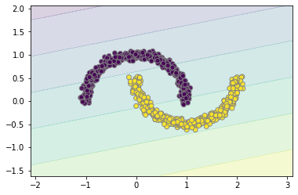
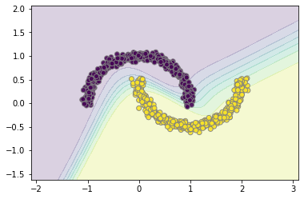
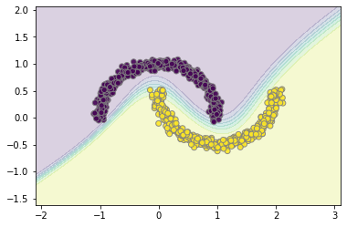

<a href="https://colab.research.google.com/github/wesleybeckner/general_applications_of_neural_networks/blob/main/notebooks/exercises/E1_Neural_Network_Linearity.ipynb" target="_parent"></a>

# General Applications of Neural Networks <br> Lab 1: Neural Network Linearity

**Instructor**: Wesley Beckner

**Contact**: wesleybeckner@gmail.com

---

<br>

In this lab we will compare the FFNNs to simple linear models

<br>

---


## Data and Helper Functions


```python
import plotly.express as px
from sklearn.datasets import make_blobs, make_moons
import pandas as pd
import numpy as np
import matplotlib.pyplot as plt

X, y = make_blobs(random_state=42, centers=2, cluster_std=3)
X, y = make_moons(random_state=42, noise=.05, n_samples=1000)
px.scatter(x=X[:,0],y=X[:,1],color=y.astype(str))
```


<html>
<head><meta charset="utf-8" /></head>
<body>
    <div>
            <script src="https://cdnjs.cloudflare.com/ajax/libs/mathjax/2.7.5/MathJax.js?config=TeX-AMS-MML_SVG"></script><script type="text/javascript">if (window.MathJax) {MathJax.Hub.Config({SVG: {font: "STIX-Web"}});}</script>
                <script type="text/javascript">window.PlotlyConfig = {MathJaxConfig: 'local'};</script>
        <script src="https://cdn.plot.ly/plotly-latest.min.js"></script>    
            <div id="c40b16c5-9ac5-473f-b958-547b4bf59671" class="plotly-graph-div" style="height:525px; width:100%;"></div>
            <script type="text/javascript">

                    window.PLOTLYENV=window.PLOTLYENV || {};

                if (document.getElementById("c40b16c5-9ac5-473f-b958-547b4bf59671")) {
                    Plotly.newPlot(
                        'c40b16c5-9ac5-473f-b958-547b4bf59671',
                        [{"hoverlabel": {"namelength": 0}, "hovertemplate": "color=1<br>x=%{x}<br>y=%{y}", "legendgroup": "color=1", "marker": {"color": "#636efa", "symbol": "circle"}, "mode": "markers", "name": "color=1", "showlegend": true, "type": "scatter", "x": [-0.02137124176534741, 0.9767004512590101, 0.9040588181889767, 0.37736315593139597, 0.5893033674343496, 0.29248724488050315, -0.026378361734335026, 1.6201408002696527, 1.2671828519438877, 0.33220069503933425, 1.9528119960894716, 1.9797372994482496, 1.7292636434383168, 1.789588100653137, 1.0280973990524327, 0.003467472728882294, -0.009956890749796943, 2.0610013072906024, 1.7978819432299944, 1.9950804766368369, 0.22347835896743645, 0.6064473078062914, 0.22571792435646254, 1.8264689725355827, 2.114573602922549, 1.9331897179587911, 0.1839527505802008, 1.4482994021578994, 0.03927763416731231, 1.7276007815375978, 0.17219449019081365, 0.2592820495979804, 1.4236794415177, -0.06916239179473493, 0.22129849296716522, 0.6383540756953149, 0.5182235408416075, 1.6513479104495974, 0.03195991474457149, 0.1813037127643914, 0.9289773585494512, 0.5063106204922861, 0.06942815391313314, 0.6363666829222565, 0.028529406322205582, 2.107742158583974, 0.7472132777121037, 0.9576110668652604, 0.09060345442824758, 1.2259994001145722, 1.0737613683967255, 1.5302872382727954, 0.8193499688889234, 1.927132618544801, 0.3396973495753294, 0.2990892258697176, 0.039627331512575664, 1.9774500535344222, 1.7917769304081708, 0.04048431440928878, 1.3920122159014456, 1.9079747606592947, 1.3405775237186934, 1.9685855923937061, -0.053504864135638805, 1.8038830076655947, 0.748948740808155, 0.05514691703582684, 0.15407894482893966, 1.7174943175246813, 1.2451341863071925, 0.2237028071897016, 1.6474147351820063, 2.0456742978149194, -0.06746998748693264, 0.8798867459445642, 1.7595863893485137, 1.8879655570584535, 1.346952559188547, 1.480554109948365, 0.3433614582910149, 1.9484177139008794, 1.96124335725528, 0.7196622785080242, 1.7838907365498862, -0.0004480613532620026, 1.1702347337962746, 0.47484883409038314, 0.3317739989643634, 1.6767534541171911, 0.5557643618513285, 0.6533698201044806, 1.9867331318361088, 1.337871790654681, 0.5861423330338507, 0.5289005103096923, -0.004780511062108857, 1.4751730271216446, 1.972904240930428, 0.9118024391714524, 1.8874002057435182, 1.5123085979208808, 0.5008496411497253, 0.24627662146488044, 0.037662937381448866, 0.6989590699758024, 0.0866983907273326, 1.470844471256458, 0.23961380079492778, 1.8915139434900679, 1.4149844263627622, 1.8795783019431593, 1.4601402660267848, 0.5631458703213645, 0.505938936618251, 1.8237284273484695, 0.8617890757089063, 0.8587543302771186, 1.9751469952452954, 1.8067823256210032, 0.01345055834815248, 1.9170066261220016, 0.045238045924702014, 2.005231249144342, 0.12948978784396156, 2.122675629230518, 0.050525847113584425, 1.2134043847723197, 2.0149218966869675, 1.1636033071860212, 1.7815074696421953, 0.025859919370369393, 1.9069142312438205, 1.9401659307880803, 0.7790334103991241, 1.739468418562985, 1.3187551851741415, 0.3049130067182995, 1.7825289955102306, 0.0037866371787284034, 0.15606479311853597, 1.2630027463416758, 0.1736533194704183, 1.2930675494841775, 0.7429789732853964, 1.9698221925388755, 1.973064864650542, 1.2043505112854298, 0.05236582472018032, 1.8560150272613007, 0.041614857041363154, 1.155756186016954, 1.8930245663669192, 0.22873470686652986, 1.9514279260266112, 0.07501920323939616, 0.1606189694102546, 0.016099275663376437, 0.08370632261382979, 0.7841558501859509, 0.8165937829227553, 0.3311065969289635, 1.2325778713164164, -0.013483712865137141, 0.7462129108559318, 0.751555299880831, 0.8397036715524079, 0.4231989432627436, 0.790773566950995, -0.0333870459512904, 1.7699943333823245, 0.03594467094355608, 0.02378383532079511, 1.7848942652190163, 1.9810512506649693, 1.8279435152801018, 0.1279384010309648, 1.1121972017368138, 1.7092389835433595, 0.7360538785534525, 0.9463166409279263, 1.8496096782631468, 1.3779600594125094, 1.1381032547306398, 1.7975757981798375, -0.14441356025963623, 2.0254007743767777, 1.1053097702500083, 0.6511475042110576, 0.15037229947894018, 1.0407754082730785, 1.9745653327281836, 0.028498130131812523, -0.0005931332760947608, 0.30664611939361913, 0.6630934871644625, 1.846528370379491, 0.05938183068183091, -0.11006562690830578, 1.8351011264909998, 1.2112640644720454, 1.332332014428568, 0.7494549993616355, 0.6582395614993388, 1.5101879214682936, -0.025610378067933835, 0.7730503979626255, 0.05012452522302984, 0.3151842349303073, 1.7067700791871292, 0.1639608272398762, 0.07680084701622314, 1.9939024983067954, 0.36212092076740127, 0.05507085892061413, 0.1722035888759144, 0.39124411287504435, 0.44080787330120264, 0.5530920912545451, 0.1350846962801227, 1.7421546804334165, 0.2402888633712877, 1.8438768678642203, 0.5310418626479455, 0.19740722097108435, 2.007510326425419, -0.02849832116612446, 1.9654465339224418, 2.0039253826299612, 1.9748942831212735, 1.9964524832853443, 0.1794165330999754, 0.16621598347955552, 0.29020049664857867, -0.020658309769524194, 1.7747864019616464, 0.11808024999143729, 0.9703699037886488, 1.6323651875872884, 1.751037225027912, 0.4327084392492476, 1.8701775093337638, 1.2881298002277455, 1.921188582608904, 0.6169662392098072, 1.9483874840764341, 0.9831396233126057, -0.059660086073984084, 1.097718904549744, 1.998930446459027, 0.5298317556988078, 1.6966052004933032, 0.04697393609253137, 1.4384993065953982, 0.4051401818686814, 0.13579291901212504, 0.2493331504861996, 1.618564793465073, 0.8744883378184299, 1.997897894004819, 0.04112200360905427, 1.3966771834821312, 0.2088046765137585, 0.6666417997815854, 1.6185029791547985, 1.86328352562573, 2.089646129566544, 1.4669834439461524, 0.9286580312028455, 0.5397040023316766, 2.005786138282938, 1.265958305102635, 1.9009061182212441, 0.26854727881522983, 1.417333239042822, 1.2884055810780777, 1.2994282078900423, -0.021306689117003466, 0.18682261802422412, 1.4632507510889974, 0.4818781502363078, 1.0381259577624737, 1.6756272435967492, 0.15366639724410308, -0.0013791069746475343, 0.8787700210264979, 0.45416019741913094, 1.9391311317991364, 0.2876965990001003, 0.12403530794244598, 1.1650343477488616, 0.8271855530078582, 0.7832138810684961, 0.556716137641891, 1.9792537105434254, 0.026933766169225222, 2.069498120967828, 1.8384436606065246, 1.5854004542490547, -0.007849683379450141, 2.008509873407435, 1.950669255439995, -0.03450175489395475, 1.9122286307695038, 0.7830248375464267, 1.650357567663155, 2.0061978338583937, 1.9192704169033825, 2.0027734756022153, 1.990110706121436, 1.6104218342284438, 0.7203613581635865, 1.459872164146514, 1.5134938761044576, 1.7028088273169695, 0.02372728551128933, 2.0742272547332874, 1.4381982100995288, 0.10786937518049508, 2.007418311346916, 1.7485411150245282, 1.269242075565549, 1.98662387681975, 0.9863996407585056, 0.6148815245005763, 1.0008493828357523, 0.14330554698428066, 1.1857369071786714, 0.47630071613682673, 1.9692119161270707, 0.5339136986500325, 1.5442852173359636, 1.0254459036538643, 1.3572078064349313, 0.4085914134658922, 0.9555708401625238, 0.09674490945399504, 0.20891960230694748, 0.9033409850043334, 1.7595198387596154, 0.22413948364200742, 1.2720102945585732, 0.3759588366643407, 1.9054269551641303, 0.1088360353798975, 1.7781686156616714, 0.9131936579047576, 1.9573488562918777, 0.9134444537387055, 0.5178329096679996, 1.635694786421806, 0.1840392824700099, 1.8848565006149718, 0.23170521815608025, 1.8353068602390123, 1.1013745411540978, 1.7507859416822633, 1.469933985687836, 1.7619274539984036, 0.317029756648171, 1.2576690900707146, 1.140534502005988, 0.8510567032049889, 1.8200289370913776, 0.3855678284342961, 1.832080754959263, 1.0634936112769395, 1.3053348150185526, 1.8621721833533527, 0.325996513904797, 1.7573640359274352, 1.0580777929774057, 1.9823097592146892, 0.08004379141252124, 1.4333027745425153, 0.6603635483887582, 1.611278836084678, 0.14822076605677742, 0.5874122948186635, 1.9750561801758517, 1.5363449378274021, 1.1845436903499498, 0.6173283311001421, 0.48098980209674824, 1.7606291290200764, 0.6605825424517209, 1.0043291321131098, 0.2991117272202126, 0.35279701969295335, 2.007399214271862, 1.2869309464006964, -0.11317939378933384, 0.3392984267693231, 1.9599907938610681, 1.985322021629067, 1.7951840131930346, 0.29461885686695893, 1.60614653328497, 1.2973847427178125, 0.40547734263154167, 1.590514881405918, 0.07779476062119, 1.9003372147960562, 0.05671920919605883, 1.3144820850804113, 0.6269646163400832, 0.011583851976794662, 0.07361863450396877, 0.406144019076425, 1.763596683339985, 1.6486915549879573, 1.5784073139407897, 1.9194571347552354, 0.8604744183514398, 0.1050688352018364, 0.9485547267590134, 0.05850233758424467, 0.7037244996391261, 0.05483770690547791, 1.796519025042513, 1.2999899944042876, 1.1027061334692163, 1.5413356967250154, 1.1285843092956866, 0.3787275371250402, 1.9640493582511989, 0.25879463399588387, 0.9965972911648352, 0.006139402232989595, 0.770050828617131, 0.6041502752345098, 1.3638882469117608, 0.8185628281649207, 0.14273001233810748, -0.01796529840604455, 1.1663479471564113, 1.534681762803947, 1.6846267444491305, 1.1756935498597783, 0.5297805518522823, 0.20628531048316168, 0.42256340726764485, 1.9101111437351328, 0.05643656243980857, 1.5304580449002139, 1.8575318832645034, 1.4242140233798932, 0.9653269741882563, 1.2226875287424543, 1.762308943971179, 1.0815176342417825, 0.7972594934522245, 0.8523282860094877, 0.6435205295945912, 0.8201188281664391, 1.949698043093755, 1.4632739185814487, 1.711411973570764, 0.0377421527141316, 0.8983474237124535, 0.6461149510574886, 1.4203855929449098, 1.1095924557853807, 0.1582506264818656, 1.8833546686102136, 1.9069052925816163, 0.12026467007841032, 1.2347826949424812, 0.06076367955538808, 1.8029873997383545, 0.06372793373743997, 1.1467960086968432, 0.27559690624013683, 1.5573957022189715, 1.9640988136292095, 0.4787810817445109, 1.4987652585129752, 1.9228331053919576, 0.07116809834154524, 1.4986023046344203, 0.09278557158171516, 1.6245480211656356, 0.11573681035972688, 0.6661308525351213, 1.2447234938305243, 0.6066243125576949, 0.5580310295644941, -0.03253814552150909, 0.15796310516079087, 1.5864160940282395, 1.0113964275939702, 1.9284727682287581, 1.3955926313105051, 1.1029894137565603, 0.42181790965367505, 0.48754233720761514, 1.6784404873697873, 0.30098821838516837, 0.744140443395479, 1.6625846200665195], "xaxis": "x", "y": [0.4061860760728654, -0.4583230648958083, -0.3765195183209672, -0.39703716744111384, -0.32137599301771974, -0.20696308753957884, 0.44766267100521034, -0.28758855823009816, -0.40793471050810065, -0.1903220237466552, 0.2255233265092496, 0.08315130002556324, -0.08800079322720622, -0.16231967104251357, -0.48303309784936055, 0.1763581693865052, 0.351022501469148, 0.3960143671698958, -0.10106546073450899, 0.2271142085715099, -0.21586279245949078, -0.4212323135166668, 0.024977047589629604, -0.05647377016362439, 0.36945226280097176, -0.07086860261133202, -0.062473487613485354, -0.36510073669959753, 0.06597151810090561, -0.2516050380479384, -0.06381550157535147, -0.16386479200305562, -0.3953522895945679, 0.17661598882501486, -0.12171058712942494, -0.408799626771914, -0.4183909292604944, -0.24634340470786834, 0.2340754360790136, -0.08944621278233666, -0.510029264631326, -0.3677976488360454, 0.05677354690499763, -0.49075947312125456, 0.2696835681307252, 0.5273171289504526, -0.4960348041311498, -0.4947163632719785, 0.44046007450720215, -0.43192992061372937, -0.4859081555214971, -0.4304313563314821, -0.5655198060066096, 0.12263604229336884, -0.2841725640704342, -0.2380513220034473, 0.17866537307866523, 0.234079692103942, -0.013644617927113946, 0.3512595859263131, -0.34835877115116176, 0.4691799647680357, -0.42494305591392667, 0.39982060303077027, 0.28467928313356083, -0.13450494592689866, -0.4293870444629516, 0.14378153218491985, -0.09557523761053704, -0.22448294846397726, -0.4206072593789681, -0.08135224116333942, -0.34429730965075306, 0.49051265245336784, 0.23050518847115897, -0.4028902160777428, -0.14885474512953262, -0.04110588559652935, -0.43673822048439637, -0.34519903966654514, -0.31869193161881093, 0.3701702341160022, 0.19708634921110102, -0.49340521395819037, -0.21543869376133298, -0.10658348938494083, -0.4767799985778196, -0.3630095581477992, -0.28699829251186965, -0.23178610771605618, -0.35013986680104026, -0.3854601791172613, 0.437254551456034, -0.46594001225453546, -0.39522788407776976, -0.3569102788487348, 0.34577178535893566, -0.27638029140841375, 0.20279704092807, -0.5203196892381192, 0.17551704890955575, -0.3279704513047752, -0.2661609658321474, -0.16438222715020687, 0.2699238672297299, -0.405582649094571, 0.1791693072694373, -0.3391802287119178, -0.043693783369562436, -0.026010502210310968, -0.39271918981335385, 0.04951466728441879, -0.41771656670951957, -0.3529693202363816, -0.33464354412947306, -0.06752866669723487, -0.4671916367297798, -0.4933593942306419, 0.34516872759181816, -0.1570953567668757, 0.20426594971541467, -0.04517604084317692, 0.3093597670558822, 0.5160335878313548, 0.1542936172964292, 0.2704560677068569, 0.4556311320681723, -0.49691173784567494, 0.4350805779252967, -0.47175850915187234, -0.060831116504472336, 0.37632306770073937, -0.06137931074981458, -0.0014130783217369686, -0.4805161212850643, -0.2388520573994403, -0.38880631602459426, -0.26192333261031603, -0.08323851419298126, 0.4099959536645816, -0.07175030992060519, -0.48603916409127124, -0.06661085196672883, -0.3554466153293382, -0.4457193448524265, 0.26813589050438524, 0.190258884605349, -0.5041389513121618, 0.5222017799968333, 0.02569784702500033, 0.20972429653054808, -0.4849424137294191, 0.11374451033285203, 0.07582801055837357, 0.1308745386572107, 0.11018531951623901, -0.030204660697929007, 0.26473023395633355, -0.03735414513002047, -0.49528840167789856, -0.46330105698977236, -0.2144652925475458, -0.46585115597183846, 0.48229393261157355, -0.43319891443616887, -0.48547524624962674, -0.524150615444562, -0.28766255568915755, -0.3815626054906763, 0.22178526030182227, -0.30131756948222327, 0.2997910331159463, 0.16855957491065562, -0.0665910731709224, 0.13660024640650817, -0.011642381835068535, 0.07871634845323806, -0.5010192741549158, -0.35548172079177337, -0.4610881619351797, -0.5114164410334371, -0.022935938056117114, -0.41126698511928245, -0.461218231709397, 0.007243964529664387, 0.5146634657066751, 0.3792433919842689, -0.467268047386986, -0.4791468813357371, -0.06255384159572161, -0.4494169500181439, 0.42885668629275014, 0.24820871257833463, 0.3053079331926927, -0.21624987078715377, -0.49550450791345874, 0.05487082868594822, 0.4127985592774463, 0.3771905515137585, -0.09093132806216964, -0.47004486273214596, -0.43138934329191997, -0.423169886416473, -0.3503292324442232, -0.3281413991388843, 0.3953381776673755, -0.4720015970691104, 0.14978588115915387, -0.21958607670366795, -0.24049274540801777, -0.2597915296356863, 0.04549620472209095, 0.3102069849204364, -0.27540337094061534, 0.23375974123782337, -0.034307817720931555, -0.2498660561593295, -0.3366527360088319, -0.38472688401355126, -0.014257023261254526, -0.1837540348606524, -0.24314235378398685, -0.12649031652831352, -0.329285898806121, -0.1486050014430451, 0.3353613214434557, 0.2385485980623932, 0.05047610190433598, 0.39640492916913445, 0.12276049274392374, 0.14415511656727206, -0.07255868720010722, 0.012998220974296412, -0.17578660292800455, 0.2869686430492015, -0.2961415116236608, -0.05600095485044723, -0.5578863156519999, -0.22835371624305612, -0.1907002936430473, -0.41383499313481653, -0.054789148604113574, -0.45665718303554276, 0.21230160586222674, -0.4272278422646017, 0.310981494088566, -0.5006563858372098, 0.2117040879093407, -0.5445274689896823, 0.41683314533623594, -0.38745300329638643, -0.13040658859699517, 0.1429532190010081, -0.3678733987567342, -0.2818068282163254, 0.1457565233343805, -0.16463514325194664, -0.3665942587017212, -0.5292664350026407, 0.18153241711314042, 0.41493145306385265, -0.38325516299803597, -0.009266433896129293, -0.3993537411926558, -0.24519104116011547, -0.008690954824159736, 0.5111977639044867, -0.33197563927650525, -0.4811806238347502, -0.32670624237749574, 0.2517367430052659, -0.4108599172569497, 0.06884624921625394, -0.16934228945630578, -0.49649196599262907, -0.4342955629128192, -0.391228050261687, 0.27666404974095093, -0.2994973461644936, -0.3592554626920059, -0.33058701912230276, -0.483749733290317, -0.30196268140090565, -0.09434073568509392, 0.06431261997843951, -0.46020108759798356, -0.35852250778355554, 0.28322985858303007, -0.03272397505213495, -0.1533052186434246, -0.5538646435942736, -0.3847805177457887, -0.4469712669556637, -0.41716918739053505, 0.25427922835640343, 0.40034297008824193, 0.4362608360142391, -0.04600110928594187, -0.4060725545016431, 0.4311452112892778, 0.4611731921189639, 0.1280078066973535, 0.39598707601074584, 0.22183077041778737, -0.5130443944643716, -0.2876586058051412, 0.19334620117519105, 0.2195221158776203, 0.2791591168023465, 0.33784215299305254, -0.2745889347500731, -0.49648995875084545, -0.37089188599707423, -0.25464025729806505, -0.18686790327375957, 0.5233938680708092, 0.27497396850831407, -0.4290266587295294, 0.09455846835868911, 0.33050218726665287, 0.01647781207852024, -0.373794389437505, 0.40151135775759583, -0.5209083849835582, -0.4616613245553046, -0.5573282811293513, -0.03915308816129039, -0.4611575896292627, -0.40139914916613406, 0.06459128794776822, -0.32609079417826137, -0.27030211320979936, -0.5405754540652656, -0.4104902712188111, -0.19709239955080726, -0.5635488387131781, 0.03935232959008142, -0.18722714593536427, -0.40548091611549897, -0.11474333251102056, -0.1971201739041523, -0.5070311626880198, -0.39262296954736897, -0.15197652003938208, 0.17353941166679487, -0.07831611469642595, -0.4948732745220247, 0.13990310302916548, -0.5351697205917099, -0.3686040986997715, -0.27262385990772786, -0.1181585480107689, 0.16310217004119348, -0.14037098421020477, 0.08395525905410062, -0.49408546973413037, 0.007533422208704815, -0.3418352960629417, -0.0979450791986222, -0.2500306027966267, -0.4485312851520229, -0.42319743192671533, -0.49257266389918386, 0.02912799165352744, -0.3229995165168446, -0.0037677342948546307, -0.55151959896679, -0.38111958979848415, -0.02151310653751875, -0.2281699208647904, -0.24140487034603894, -0.4505672333571912, 0.4299160638551837, 0.37696350991865785, -0.4023712162668439, -0.4391884728666082, -0.24056081510259955, -0.19466620888258224, -0.3963442851524476, 0.4921087226499833, -0.3169110668448662, -0.49602582762261843, -0.3543297813157656, -0.3407501953440836, -0.1645072764585691, -0.46171768169208605, -0.6198949615593068, -0.21630106121441156, -0.24071859885323263, 0.17731412254586246, -0.40589858333167295, 0.42171188266107507, -0.2765971195231466, 0.3846723857950752, 0.06235966220807006, -0.05991679836558082, -0.17847000223050563, -0.3199082654434057, -0.47369946279909625, -0.34098172995460835, -0.2504036441729891, 0.1362159595166606, 0.3175533331049689, 0.07641896671175771, -0.47108917856272214, -0.4556865878347496, 0.2681596821679075, 0.21994047525303553, -0.3287827196362138, -0.19523967174519058, -0.2610286666010861, -0.30085098745780675, 0.07974242024047626, -0.4867565609411477, 0.08462690019342022, -0.5610516183525553, 0.09232673581761183, -0.3718903682603237, 0.25059410971915247, -0.1536972001584023, -0.4253054616573801, -0.5189382845453103, -0.29685089429169703, -0.48570454398856633, -0.2501967865427847, 0.043810024896126336, -0.22711133075944995, -0.5596217228214833, 0.18454012286879, -0.4864987917356861, -0.42310147851257024, -0.309998550926577, -0.4420895878541432, 0.04188902338886154, 0.3138372844046242, -0.46060854249014255, -0.3099236494641088, -0.15991856779098618, -0.6179021184258471, -0.33246005027412895, -0.01838203013244639, -0.327378254766558, 0.3953493792458464, 0.41458517754244617, -0.3965605112268295, 0.277009924192454, -0.42728863419164936, -0.5001340667227457, -0.39384046284985436, -0.240288927536174, -0.4979585890635959, -0.4681693056022481, -0.41780283505235516, -0.5043479855116628, -0.45047049731282135, 0.42602413245146686, -0.4919269546479593, -0.30290727895118685, 0.15244452738171008, -0.4993570847729972, -0.429568570409702, -0.4267845476641277, -0.5742754996974517, 0.07143306465657524, 0.0863596104615732, 0.3867739263941996, 0.06103080945209591, -0.424752896655102, 0.5003388639021644, -0.1117260298126734, 0.026707120903246673, -0.4650921552723531, -0.11342576787592833, -0.3136291646838624, 0.4124179709225864, -0.31014682084986656, -0.3585847844214688, 0.39100404554896934, 0.5088865294391419, -0.28562725320580185, 0.13465646755547123, -0.1895166388286573, 0.10601675313644868, -0.3890865981012992, -0.5300059382894151, -0.5516589745627907, -0.49711468889367605, 0.43728846428088664, 0.08026063038867517, -0.30812883217216425, -0.5518191270267814, 0.2767918770828352, -0.5465862304424174, -0.4129282672912732, -0.32201273977909656, -0.2681105581944324, -0.200177757167414, -0.10490681680684293, -0.4638932538587638, -0.3079192974488752], "yaxis": "y"}, {"hoverlabel": {"namelength": 0}, "hovertemplate": "color=0<br>x=%{x}<br>y=%{y}", "legendgroup": "color=0", "marker": {"color": "#EF553B", "symbol": "circle"}, "mode": "markers", "name": "color=0", "showlegend": true, "type": "scatter", "x": [-0.841925571991321, 0.682467332555129, 0.8741860776206716, -0.20280226248192992, -0.41546770859685006, 0.4831018198648976, -0.6441953693353871, 0.19155834582323616, 0.1666505883345491, 0.787176934158832, -0.501556254167852, 0.5592992302226678, -0.9914702898209569, -0.7324780053165639, 0.3276079199427982, 0.9443139169305158, -0.5414160541687476, 0.8320404551747068, -0.3879217644130111, -0.33602530250350193, -0.11872037817262393, -0.865991827636781, -0.032116240642788764, 0.9386747622287412, 0.9422608694499245, 0.9641405035778899, 0.1393412145128936, -0.16009343904193618, 1.012193132759459, 0.19334863345288741, 0.9287172152733659, 0.746327515916764, -0.9943493334391437, -0.22369599100458393, -0.23439526743015504, 0.9371456802671978, -0.4162270875140181, 0.9527236026865668, -0.09751882951540852, 0.8246730415480225, -0.369425283058781, -0.5502716592604471, -0.6404742039978804, -0.9781422260432127, 0.14683167526526725, -0.9031858805065766, 0.7786937878528977, 0.8461658161110637, -0.4923444527611955, -0.010532785476474734, 0.5896368379627389, 0.910197514429224, -0.871511586474877, 0.4650983141814987, -0.23558716675493915, -0.8369697720562213, -0.13631551718687845, 0.026491760271055168, -0.9752932613852875, -0.122922615199171, 0.8970144239590865, 0.7129154298647282, 0.16519466430868734, 0.8909551327802967, 0.8454796924228637, 0.9535901481763159, 0.13122493007517538, -0.27551758672630255, 0.015949890070261825, -0.41791790705782667, 0.662595851647462, -0.9225781667003112, -1.0155188927618566, -0.45332645775587854, 0.8874526650631741, -0.28034152440456417, -0.344582921827727, -0.4042105777500545, -0.664246307468959, -1.0265601231065522, 0.7905422542877861, -0.95576492430432, -0.6540610699855107, 0.009338007384638743, 0.014982459587409312, -0.9390554836282453, -0.7285612260371523, 0.6265179559034115, -0.5980777994869654, -0.6713042375828886, 0.30148672595569054, 0.22204923505624388, -0.901686985713673, -0.4514663111856433, 0.2227686418623045, 0.9293536410235851, 1.0086540617608457, 0.4557161601585934, -1.0675964821437036, 0.8378590398759589, 0.5994638541545335, -0.43970939415791677, 0.001939034376703431, -0.3161043554127958, 0.9438415932280083, 1.049364864300265, -0.5775693779815646, -0.5894412664957717, -1.003483362657891, 0.9600191987137255, 0.9294360806160966, 0.14714304085927188, 0.3074913555842822, -0.5582076929017485, 0.9747088538643435, 0.3371084971589208, -0.42634765510706046, 0.7683645452457621, -0.9887667184006907, 0.9248048203622942, 0.8900332512110143, -0.15893857542769574, 0.889755821566578, -0.9162745929631899, -0.5041796650698196, 0.9217096483090739, -0.9901397931797628, 0.8516985508778182, -0.14561296270184196, -0.5839445171011158, -0.7474011078828955, -0.734089636000622, -1.0049409374311087, 0.7270091725557934, 0.003819246449453647, 0.8933491957200252, 0.28693459678931693, 0.8865935042028288, 0.1142057975243623, -0.27467109309712384, 0.24989922747741583, -0.6905443807169022, -0.9894431937403603, 0.1914388385046656, -0.939747216799151, -0.5860367228694352, -0.9749898950201394, -0.9460060520199547, 0.9213927020182104, 0.49581083660996056, -0.8773184770510103, -1.1067327332191668, -0.8818228021603742, -0.4349828008195228, -1.0444988327098021, -0.8826306636855094, 0.10478005830047077, -0.6081652305508954, 0.32623579965960603, 0.886865955844748, 0.6662809207524713, -0.35349092607964283, -0.525014070807405, -0.9386471206896609, 0.7068007202242268, -0.28660952719264865, 1.0262181373626456, -0.4242503002479633, -0.9696961271110569, -0.8981885613259298, 0.5176112076347361, 0.7211272266102963, -0.8704962842266091, -0.93388110963664, 0.8126292481813207, 0.4411477343364732, -0.21226578438982383, 0.8940941762766556, -0.25349055244319174, 0.6292083348658327, -0.35835531826760353, -0.811404142238073, -0.3975211685555937, 0.5897374577605289, -0.8840464057558804, 0.622576864851381, -0.9791656577645753, 0.5378544352470284, 0.9309728496845366, 0.35261663224760875, -0.8079995409866508, 0.5272069315204925, 0.6168226317048133, 0.44129228197492437, 1.027708672633818, -1.0506684482526314, 0.8444048862137858, 0.19558207794121654, 0.5789427356734955, 0.07884409115952734, 0.21004740763789947, 0.688271037238145, 0.360575625318509, 0.9386873812049207, 0.7927304779194625, 0.8617756759502471, -0.8049598469457511, -0.9884967025636874, 1.0489967672524148, -0.935842328272884, -0.6267995490316154, 0.8892406769100474, -0.03404569998465, -1.0064524676654591, 0.9980180411993752, -0.9830827066454677, -0.9639518963702124, -0.6400927973513629, 0.8439790921232345, 0.9412848237200061, -0.11082515480158367, -0.2842734477511065, -0.6268511560806208, -0.5793790155512624, -0.9927469250871123, -0.10568746527056146, 1.0344375696524877, 0.36960201201667353, -0.6509019122589677, 0.19503730371646702, 0.4908312066810775, -0.7839391293806417, 0.5427850808377916, 0.12446402919555219, -0.7415566357055887, -0.8662308793820274, 0.9348459697177338, 0.8218328129152243, -0.7993662189785357, 0.8070927734783936, 0.6808152881569263, -0.8923840242075799, -0.9357907116784944, -0.9286626231968224, 0.9209491382256922, 0.8561387129939999, -0.4073503339604967, 0.8773274863423824, 0.8589247883431155, -0.8186016008031817, 0.9875820054800791, 0.974735950859411, -0.38678649200135107, 0.47888012878477054, -0.9425502609252339, 0.7818873970631965, -0.9910319240969651, 0.4867470338922282, -0.959087466807264, -0.8761551276393382, 0.4857676340516148, -0.7754546961327481, -0.7869816311952328, -0.04211856793139306, -0.5003137640460915, 1.0306645007550932, -0.45750351133460765, 0.11675022566808599, 0.36276377695916867, 0.9500022266038769, -0.6427158607366137, -0.5542136117666949, -0.8907767352581123, 0.2661707700737591, 0.7978938713967487, 0.8773888062169855, -0.2509521445460971, -0.9897356738787813, 0.5528277500221775, 0.9064509902438325, -0.9406773617062165, 0.32891584245760774, -0.08302679877482544, 0.15036434055699982, -1.0886859295192106, 0.7588814470312026, 0.7432105761091852, 0.7316902177614554, -1.0139580168391111, 0.9263216268973042, -0.6572881746353788, -0.10295591122486067, 1.0157932159614604, -0.6457067517714352, 0.338062931663714, 0.005503112200495708, -0.9536736834631697, -0.34098516306448784, -0.5696451530054487, 0.5630806672790234, 0.6773020373629023, 0.8749393304212794, -0.6116207856857013, 0.6449201999494786, -0.9236452640138701, -0.8283795775013268, -0.3606283338326535, 0.8960483177245648, -0.823259632802671, 0.9785598832082368, 0.4646728874744018, 0.018950500066500398, 0.5986400014800275, -0.21692875042714008, 1.0467834766218154, 0.7184353013368235, -0.39563532358090203, 0.0020953802889846704, 0.38327562731590625, 0.7624104613725036, 0.4974302302272833, -0.2742912209724403, 1.0746796458168144, 0.5280164903121144, 0.49694546350805135, 0.9502141462766489, 1.0089088191871194, -0.9876768764765262, -0.21027627935946355, 0.19520308489992108, 1.0252337252138446, -0.9175370571842107, -0.7016505210387458, 0.08429801967580965, 1.0490609947203429, -0.6446727019669775, -0.9234076427291916, 0.4762542880279132, 0.4324722566061934, 0.6552915662859992, 0.7680735320439248, 0.07677816623782226, 0.8525269294703098, -0.9632730124381795, -0.7812515608718273, 0.6420466136971893, 0.9401730117100286, 0.5931230589778632, -0.8998296135431146, 0.2735541970160142, 0.9356591486239149, 1.0224961959128591, -0.9651327972731387, -0.00744034775312594, -0.2324567213831401, -0.11189027471692276, -0.2952855223460142, -0.8474330468474298, 0.5138533690503994, -0.9393126305283686, 0.5946891091133355, 0.7231318458301057, -0.6258617275934728, -1.0012057785657524, -0.4318807803842828, 0.41028637633491494, 0.7497094761575074, 0.580365938420061, 0.31499037882258313, -0.1831499847618166, -0.29361910271335373, -0.7392161111824123, 0.7102820825877286, 0.39847669952508774, 0.2447104394037704, -0.883511688076127, 0.014287205761313208, -0.8773098151108902, 0.7973102796627205, -0.8745200062301077, 0.09917627095510018, -0.7687467327838147, -0.08384114583623242, -0.9868377529704373, -0.989656492495596, 0.7396237486538573, -0.03167264864017717, -0.7213533171423128, 0.1522406547147911, -0.3585300419674959, -0.8374682385763518, -0.7074600604308738, -0.06439035896652032, -0.10229260311405808, -0.6621737133999107, -0.7431148446980856, 0.1479688101074062, -0.9361536810858393, -0.5424982467778454, 0.8470477760290743, 0.06370403235649998, 0.5413296455098155, 0.9493236420152802, 0.5892592749123341, 0.8345448406575776, 0.06110828054398841, -0.9583995486859708, 0.30188691657237304, -0.8163345899821505, -0.8084897129625784, 0.16528839017978667, 0.9324771987893767, 0.7386135390848821, -0.7628793315212464, 0.9769910506371062, 0.9522384439744107, 0.3699024379670562, 0.6408239551321332, 1.037439503990736, 0.12793302111043478, -1.0266624186914628, -0.7601780410850274, -0.29151766151408376, -0.8118963680855009, -0.8307228499597747, -1.0229933517414864, 0.7187167327909912, 0.8948591436499106, -0.8943943261747443, 0.7209154809970969, 0.9740132594201618, 1.0504913158044216, 0.5341113402855393, 0.9416598253275545, -1.0639848876240656, -0.6750231019219641, 0.41509095823899256, 0.2320575374306522, 0.9438735111314883, -0.5137772819037197, -0.33237577650904043, 0.009385175833752665, -0.9159395290252508, -0.9583889583915941, -0.1567198008010405, 0.2654396765832578, 0.6194588462160627, -0.7462630501338061, -0.9135174088905357, 0.7229282419800694, -0.8017674916959139, 0.9445673085715209, 0.880199864297024, 0.27234218972315183, 0.987043634180512, -0.977757569878373, -0.9273553782354008, -0.6801879767687514, 0.9235398515738621, -0.5773529710154244, -0.5711594473614869, 0.0102690115109004, 1.012479575428554, -0.48105813799722064, -0.760738862660445, -0.06899959920039071, 0.542192881867624, -0.9751503331787739, 0.03165909256000281, 0.4788201674304247, -0.9616901007095184, 0.973726870455468, -0.9750360307004108, -0.008952862777465757, 0.9565549092838592, -0.43960808071688207, -0.9634774947719471, 0.4268845495239975, -0.11361667794354532, 0.30275579158701, -0.717926295245547, -0.927002780083817, -0.977848205382481, -0.5465021298811779, -0.41518387526048056, 0.6315020606957786, 0.7729843582975352, -0.6917321792409309, 0.7828262807231933, -0.9741741736528217, -0.5222400543915524, 0.22727153288324353, -1.0831006410360984, 0.7906874090373106, 0.9921053817619112, 0.9291918192609102, 0.798054909425106, -0.14549196420816424, -0.9435587275506016, 0.7941940613267031], "xaxis": "x", "y": [0.5305869534842842, 0.8071206917588001, 0.5078104062937839, 1.0227757577963752, 0.9342365814558391, 0.9515075766286676, 0.7255288065374311, 0.9283872946027532, 1.0159377976686577, 0.6353374225167823, 0.8714835294467724, 0.7816641355572947, 0.04177826991749532, 0.6095355254121818, 1.080074093288222, 0.30597998244822927, 0.97468109171144, 0.5732687838495222, 0.9626317486450024, 0.9451616576493191, 0.9559097035285317, 0.3279031765427942, 0.9895194662423529, 0.17013082886121492, 0.1795255739860949, 0.07038051427651006, 1.0176596674044673, 0.9020976159451496, 0.20049308034949212, 0.9778536919017272, 0.3879432914489443, 0.5874255696312145, 0.031248420905410683, 0.9173953823265485, 0.9818751419426923, 0.19620781805876192, 0.8943725943657549, 0.33301568358301975, 0.8786468540068699, 0.382172795220859, 0.9068915596643669, 0.910901764969981, 0.7076571700403769, 0.3239655128741004, 1.0059143753229096, 0.26782972705985697, 0.5551683580203007, 0.34639384516322635, 0.7874521362554806, 0.9232037901643552, 0.8688608803652028, 0.5213481084190841, 0.44035200495430116, 0.9692826800458622, 0.9677030193556847, 0.44519509171090715, 1.022867483802495, 1.0608013138227834, 0.3856379436662887, 0.871011826934748, 0.3790723293531127, 0.6454084399548248, 0.9239581410603653, 0.09637557897209917, 0.47206214221453446, 0.23220564206501929, 0.966681291860104, 0.984097704047472, 0.9407220428533601, 0.8815550652203666, 0.8855053296429825, 0.4557666673704325, 0.23607952100952503, 0.867787508630084, 0.368412983667411, 0.9894935919118412, 0.9952617060793372, 0.952360581073669, 0.7218877567390231, 0.15033085077668845, 0.658511194923437, 0.007284101935356932, 0.7598724528111099, 0.9320862835818461, 1.0088934434625134, -0.040601026684593984, 0.6745257125585686, 0.7658753623569184, 0.7611171626442352, 0.6453018117036439, 0.8925345009852251, 1.005376290206583, 0.625091325059969, 0.8577880033925253, 0.9326054282019067, 0.4544214481454153, 0.18011861732039008, 0.8593094307720844, 0.009375552298312488, 0.42613394784431835, 0.8254125216022237, 0.8165426656934837, 0.9714448094213274, 1.0286541910247868, 0.2670293326736063, 0.04375671133118682, 0.7664914852608554, 0.8826265104252563, 0.1789454932929465, 0.2164966819737342, 0.1674674984914969, 1.0496910377743496, 0.9728541528373591, 0.8931880707864593, 0.029465956171557988, 0.9537140769604843, 1.037485833477008, 0.7226740159027809, 0.39223558661869046, 0.4749728652333638, 0.441846271673797, 1.0125637198792687, 0.4593450358638575, 0.605640479730254, 0.9107940636281776, 0.01785388719359586, 0.27410981756835184, 0.5038333552077577, 1.0206425110383304, 0.8407084149111261, 0.7000376304130725, 0.6420506891671954, 0.004883933733048386, 0.6988473764149679, 1.0226217899943728, 0.20351931931804346, 0.9639785446425321, 0.45560484949814084, 1.0131968543991803, 0.9710435287885352, 0.9932291355359535, 0.8531919997908746, 0.3244471130378394, 0.9773646970897695, 0.25034315760119613, 0.7464152312408232, 0.1424986937123538, 0.5098904719734667, 0.028879374506168877, 0.7981273131858493, 0.4396666098985431, 0.07267437177451369, 0.5223149863127989, 0.7705942625598919, 0.3354378683085143, 0.3242285609034321, 0.9115123363221448, 0.7909478758543164, 0.9833737188823278, 0.4302512501908781, 0.7989226098393425, 0.9490554440705049, 0.7703485414808247, 0.07298159439471733, 0.7078223296189133, 0.8845639326784839, -0.03674552072388997, 0.9363076866507517, 0.0994494559895311, 0.4674170060188141, 0.9385110390286734, 0.6815114340126481, 0.6421184651234796, 0.44154772139454257, 0.571851929992048, 1.01433226967749, 0.9264541655421089, 0.5072156999570544, 0.9320171181555849, 0.765846606131384, 0.9539462745602485, 0.439492714268857, 0.8255152924019483, 0.717050230699137, 0.4994334683965428, 0.7625012604658197, 0.32170701622630016, 0.887706950325268, 0.13088286445288597, 0.9728034344433351, 0.5632723591391211, 0.8758606756143166, 0.7948343213229538, 0.9445576042501078, 0.0677453838688456, 0.11417567582262482, 0.5092356472357061, 0.9823731466909509, 0.8177573819797911, 0.9456267425872341, 0.985501974923304, 0.6989704640420543, 0.915544418207169, 0.23472335199424224, 0.5973529776217953, 0.3909265265004409, 0.6722924279598369, 0.34075838472143666, 0.13469184867095194, 0.2382146970526554, 0.9517795979001498, 0.31359150938324615, 0.9397949553902923, 0.32469793364884003, 0.19918801224063537, 0.07782114468558568, 0.3372709972657454, 0.7965253008349386, 0.4772883334123352, 0.33927881802500365, 1.0555416435788973, 0.9500045280851553, 0.7213348770226666, 0.8525040796958357, 0.2693533426586962, 1.0739092227180786, 0.1051489326854959, 0.9290136591624826, 0.7238574189589927, 0.9934997453960699, 0.9315553481927829, 0.544311717977997, 0.8915231978162554, 1.0537270620795822, 0.7276645708345509, 0.5197716874164034, 0.40288022527174744, 0.6317714989594121, 0.578121385928969, 0.6817100559603938, 0.602352350311978, 0.4526083586914133, 0.2782880324340885, 0.6096430647478994, 0.509818914109573, 0.4896726930570929, 0.8405416554908718, 0.5919600470221493, 0.10924503343914722, 0.559661595179487, 0.19915064453773526, 0.2901899106002602, 0.82350138780635, 0.8811995104489155, -0.0026199730601336266, 0.6273754137551937, 0.45209713956439024, 0.8906354373500319, 0.35947799638202405, 0.5686159968568669, 0.9365310458982259, 0.5540764057933456, 0.6209591838506415, 0.9423341023576534, 0.8629537052218356, 0.09913384146619357, 0.861804124497599, 1.0134025094685868, 1.0238436707072753, 0.1223014150437775, 0.7564191790890565, 0.8496420275164502, 0.5057299257128748, 1.0579533031401507, 0.5563107155071795, 0.41221059458806253, 0.9509819363304264, 0.402648582285326, 0.8466241570008279, 0.4532358091802571, 0.3715828859500071, 0.9257037629236954, 1.0161241267627343, 0.9679831533207046, 0.08551006422360004, 0.7401986887743578, 0.6912617761978903, 0.6912719677427132, 0.13717432461280588, 0.293046936035356, 0.7303787147472682, 0.9909734747559312, 0.3571915030054305, 0.7973631230391343, 0.9283639175083588, 1.0139295286001617, 0.24754094272197763, 0.8297071581830998, 0.88824784151029, 0.7858833180860436, 0.6022763776161989, 0.3718083436833463, 0.8563632726474141, 0.7400800529100179, 0.12549582962539463, 0.6150166980415612, 0.9537314208270358, 0.12562704192371885, 0.5798832810346423, 0.2919937556919383, 0.8888324350466479, 0.952470434606834, 0.8053072035989765, 0.9399710154775853, 0.06362642722102937, 0.7620088082285006, 0.9083481282905073, 0.9669339876079467, 0.9888299620492754, 0.6944938807177057, 0.8881890939896832, 0.9593959903064364, 0.2848873018568047, 0.7247797916248883, 0.8183366714816989, 0.06709165073838032, 0.26874213756713305, 0.011223732396861794, 1.0316484357431759, 0.9790536541271544, 0.23952636533842916, 0.3497625223408625, 0.6407765418269316, 0.9763388133908357, 0.20629588358405002, 0.7660736707702512, 0.1010531804177125, 0.9152903776989848, 0.8174046370931856, 0.8564215169827514, 0.6352561134416187, 1.0497410572208679, 0.5447934084827437, 0.5351946118904838, 0.4595313536126999, 0.6633019568604016, 0.3389677681314225, 0.8589967160940021, 0.49395016022302285, 0.905401424075449, 0.007092961807579082, 0.13347628461694513, 0.23619407435686118, 1.0447304829420934, 1.0001769556335662, 1.0405634438955484, 0.9751431235666935, 0.5622571965501586, 0.7679885906434996, 0.05897545247341297, 0.8490873977683159, 0.8047207889589721, 0.7796026034672046, 0.26754334219326603, 0.924924136104976, 0.8914539231095208, 0.7583960871301029, 0.7823095355684584, 0.9184490407965745, 1.0132329261188513, 0.9517602430233854, 0.5838573081607782, 0.6988846386900802, 0.8781521803158315, 0.9174454116809432, 0.34317618912624265, 1.034794048641326, 0.5362047491056425, 0.66125328425766, 0.6125423024649467, 0.9802163157294758, 0.6907147631176219, 0.9531165518236112, 0.41001836066068875, 0.004652055868909304, 0.6551194038774679, 0.9947812869407875, 0.7367757629916575, 1.0747219512919652, 0.8426179619616073, 0.5240496559285501, 0.718934130013812, 0.8666280370406515, 0.9899555869779699, 0.6631002553563234, 0.7397758587210745, 0.9967524765686744, 0.10159623822021915, 0.8512914999877094, 0.4181767970733139, 1.0298817385520407, 0.8712548832350971, 0.22980460025990193, 0.7826122428257578, 0.5651412799070576, 1.026816561161334, 0.1829189720690934, 0.8992626732748483, 0.5696317575774928, 0.5552874891305405, 0.9008222562513402, -0.05498257762065896, 0.6777489151718835, 0.5323517097321465, 0.2253268053322805, 0.14879379507579316, 0.9333919037100045, 0.7949502064180195, 0.2061980698699697, 1.045099959603982, -0.020414328454609262, 0.6390572981450053, 0.9333161402422115, 0.5291682973157141, 0.5688352326721351, -0.05047730941467041, 0.6775605785555954, 0.39192999197460315, 0.19452518014587553, 0.7266915290237453, 0.4418917406497507, 0.1342348865555803, 0.8655180578975504, 0.2761789058580983, -0.01705441664861696, 0.7325257918980794, 0.9279765263168213, 0.9511044577331956, 0.344303422286615, 0.9180462031788715, 0.945257094106218, 1.0404483010061818, 0.33369917527554266, 0.24149665784368612, 0.9848957397860001, 1.0003422289697628, 0.8158800591916902, 0.6359107992573945, 0.11955831614046483, 0.6178248779350897, 0.723566646982552, -0.07676642286508525, 0.5024329383266082, 0.9702952661304376, 0.1717890736536283, 0.48423409928227584, 0.20270900200568004, 0.7567035860284822, 0.5783206702822696, 0.9301751369119973, 0.8495053023268582, 0.9915220663397655, 0.09123679877099287, 0.8942218899566153, 0.6437927678617089, 1.0535936428713195, 0.8163120857164957, 0.11692291853621228, 0.9681850055625798, 0.8908023308240709, 0.15973674583121883, 0.35626734597179077, 0.1379387515057112, 1.008121644708765, 0.14832545170674544, 0.8652922240987655, 0.16618991500334923, 0.8720473790292391, 0.9627746232001045, 0.8647710523126371, 0.6581196686990107, 0.5160844279669388, 0.09269477750950172, 0.8399209148346867, 0.950890691176492, 0.7672789717451685, 0.5693084514974619, 0.6406910264205575, 0.5507458266987093, 0.22562358315680073, 0.8393728919656983, 0.9973794456364957, 0.276910915007692, 0.573684335533575, 0.06072464380436819, 0.5432224447970733, 0.5730642907156376, 0.952210602813155, 0.32789359847521676, 0.6077717126326211], "yaxis": "y"}],
                        {"legend": {"tracegroupgap": 0}, "margin": {"t": 60}, "template": {"data": {"bar": [{"error_x": {"color": "#2a3f5f"}, "error_y": {"color": "#2a3f5f"}, "marker": {"line": {"color": "#E5ECF6", "width": 0.5}}, "type": "bar"}], "barpolar": [{"marker": {"line": {"color": "#E5ECF6", "width": 0.5}}, "type": "barpolar"}], "carpet": [{"aaxis": {"endlinecolor": "#2a3f5f", "gridcolor": "white", "linecolor": "white", "minorgridcolor": "white", "startlinecolor": "#2a3f5f"}, "baxis": {"endlinecolor": "#2a3f5f", "gridcolor": "white", "linecolor": "white", "minorgridcolor": "white", "startlinecolor": "#2a3f5f"}, "type": "carpet"}], "choropleth": [{"colorbar": {"outlinewidth": 0, "ticks": ""}, "type": "choropleth"}], "contour": [{"colorbar": {"outlinewidth": 0, "ticks": ""}, "colorscale": [[0.0, "#0d0887"], [0.1111111111111111, "#46039f"], [0.2222222222222222, "#7201a8"], [0.3333333333333333, "#9c179e"], [0.4444444444444444, "#bd3786"], [0.5555555555555556, "#d8576b"], [0.6666666666666666, "#ed7953"], [0.7777777777777778, "#fb9f3a"], [0.8888888888888888, "#fdca26"], [1.0, "#f0f921"]], "type": "contour"}], "contourcarpet": [{"colorbar": {"outlinewidth": 0, "ticks": ""}, "type": "contourcarpet"}], "heatmap": [{"colorbar": {"outlinewidth": 0, "ticks": ""}, "colorscale": [[0.0, "#0d0887"], [0.1111111111111111, "#46039f"], [0.2222222222222222, "#7201a8"], [0.3333333333333333, "#9c179e"], [0.4444444444444444, "#bd3786"], [0.5555555555555556, "#d8576b"], [0.6666666666666666, "#ed7953"], [0.7777777777777778, "#fb9f3a"], [0.8888888888888888, "#fdca26"], [1.0, "#f0f921"]], "type": "heatmap"}], "heatmapgl": [{"colorbar": {"outlinewidth": 0, "ticks": ""}, "colorscale": [[0.0, "#0d0887"], [0.1111111111111111, "#46039f"], [0.2222222222222222, "#7201a8"], [0.3333333333333333, "#9c179e"], [0.4444444444444444, "#bd3786"], [0.5555555555555556, "#d8576b"], [0.6666666666666666, "#ed7953"], [0.7777777777777778, "#fb9f3a"], [0.8888888888888888, "#fdca26"], [1.0, "#f0f921"]], "type": "heatmapgl"}], "histogram": [{"marker": {"colorbar": {"outlinewidth": 0, "ticks": ""}}, "type": "histogram"}], "histogram2d": [{"colorbar": {"outlinewidth": 0, "ticks": ""}, "colorscale": [[0.0, "#0d0887"], [0.1111111111111111, "#46039f"], [0.2222222222222222, "#7201a8"], [0.3333333333333333, "#9c179e"], [0.4444444444444444, "#bd3786"], [0.5555555555555556, "#d8576b"], [0.6666666666666666, "#ed7953"], [0.7777777777777778, "#fb9f3a"], [0.8888888888888888, "#fdca26"], [1.0, "#f0f921"]], "type": "histogram2d"}], "histogram2dcontour": [{"colorbar": {"outlinewidth": 0, "ticks": ""}, "colorscale": [[0.0, "#0d0887"], [0.1111111111111111, "#46039f"], [0.2222222222222222, "#7201a8"], [0.3333333333333333, "#9c179e"], [0.4444444444444444, "#bd3786"], [0.5555555555555556, "#d8576b"], [0.6666666666666666, "#ed7953"], [0.7777777777777778, "#fb9f3a"], [0.8888888888888888, "#fdca26"], [1.0, "#f0f921"]], "type": "histogram2dcontour"}], "mesh3d": [{"colorbar": {"outlinewidth": 0, "ticks": ""}, "type": "mesh3d"}], "parcoords": [{"line": {"colorbar": {"outlinewidth": 0, "ticks": ""}}, "type": "parcoords"}], "pie": [{"automargin": true, "type": "pie"}], "scatter": [{"marker": {"colorbar": {"outlinewidth": 0, "ticks": ""}}, "type": "scatter"}], "scatter3d": [{"line": {"colorbar": {"outlinewidth": 0, "ticks": ""}}, "marker": {"colorbar": {"outlinewidth": 0, "ticks": ""}}, "type": "scatter3d"}], "scattercarpet": [{"marker": {"colorbar": {"outlinewidth": 0, "ticks": ""}}, "type": "scattercarpet"}], "scattergeo": [{"marker": {"colorbar": {"outlinewidth": 0, "ticks": ""}}, "type": "scattergeo"}], "scattergl": [{"marker": {"colorbar": {"outlinewidth": 0, "ticks": ""}}, "type": "scattergl"}], "scattermapbox": [{"marker": {"colorbar": {"outlinewidth": 0, "ticks": ""}}, "type": "scattermapbox"}], "scatterpolar": [{"marker": {"colorbar": {"outlinewidth": 0, "ticks": ""}}, "type": "scatterpolar"}], "scatterpolargl": [{"marker": {"colorbar": {"outlinewidth": 0, "ticks": ""}}, "type": "scatterpolargl"}], "scatterternary": [{"marker": {"colorbar": {"outlinewidth": 0, "ticks": ""}}, "type": "scatterternary"}], "surface": [{"colorbar": {"outlinewidth": 0, "ticks": ""}, "colorscale": [[0.0, "#0d0887"], [0.1111111111111111, "#46039f"], [0.2222222222222222, "#7201a8"], [0.3333333333333333, "#9c179e"], [0.4444444444444444, "#bd3786"], [0.5555555555555556, "#d8576b"], [0.6666666666666666, "#ed7953"], [0.7777777777777778, "#fb9f3a"], [0.8888888888888888, "#fdca26"], [1.0, "#f0f921"]], "type": "surface"}], "table": [{"cells": {"fill": {"color": "#EBF0F8"}, "line": {"color": "white"}}, "header": {"fill": {"color": "#C8D4E3"}, "line": {"color": "white"}}, "type": "table"}]}, "layout": {"annotationdefaults": {"arrowcolor": "#2a3f5f", "arrowhead": 0, "arrowwidth": 1}, "coloraxis": {"colorbar": {"outlinewidth": 0, "ticks": ""}}, "colorscale": {"diverging": [[0, "#8e0152"], [0.1, "#c51b7d"], [0.2, "#de77ae"], [0.3, "#f1b6da"], [0.4, "#fde0ef"], [0.5, "#f7f7f7"], [0.6, "#e6f5d0"], [0.7, "#b8e186"], [0.8, "#7fbc41"], [0.9, "#4d9221"], [1, "#276419"]], "sequential": [[0.0, "#0d0887"], [0.1111111111111111, "#46039f"], [0.2222222222222222, "#7201a8"], [0.3333333333333333, "#9c179e"], [0.4444444444444444, "#bd3786"], [0.5555555555555556, "#d8576b"], [0.6666666666666666, "#ed7953"], [0.7777777777777778, "#fb9f3a"], [0.8888888888888888, "#fdca26"], [1.0, "#f0f921"]], "sequentialminus": [[0.0, "#0d0887"], [0.1111111111111111, "#46039f"], [0.2222222222222222, "#7201a8"], [0.3333333333333333, "#9c179e"], [0.4444444444444444, "#bd3786"], [0.5555555555555556, "#d8576b"], [0.6666666666666666, "#ed7953"], [0.7777777777777778, "#fb9f3a"], [0.8888888888888888, "#fdca26"], [1.0, "#f0f921"]]}, "colorway": ["#636efa", "#EF553B", "#00cc96", "#ab63fa", "#FFA15A", "#19d3f3", "#FF6692", "#B6E880", "#FF97FF", "#FECB52"], "font": {"color": "#2a3f5f"}, "geo": {"bgcolor": "white", "lakecolor": "white", "landcolor": "#E5ECF6", "showlakes": true, "showland": true, "subunitcolor": "white"}, "hoverlabel": {"align": "left"}, "hovermode": "closest", "mapbox": {"style": "light"}, "paper_bgcolor": "white", "plot_bgcolor": "#E5ECF6", "polar": {"angularaxis": {"gridcolor": "white", "linecolor": "white", "ticks": ""}, "bgcolor": "#E5ECF6", "radialaxis": {"gridcolor": "white", "linecolor": "white", "ticks": ""}}, "scene": {"xaxis": {"backgroundcolor": "#E5ECF6", "gridcolor": "white", "gridwidth": 2, "linecolor": "white", "showbackground": true, "ticks": "", "zerolinecolor": "white"}, "yaxis": {"backgroundcolor": "#E5ECF6", "gridcolor": "white", "gridwidth": 2, "linecolor": "white", "showbackground": true, "ticks": "", "zerolinecolor": "white"}, "zaxis": {"backgroundcolor": "#E5ECF6", "gridcolor": "white", "gridwidth": 2, "linecolor": "white", "showbackground": true, "ticks": "", "zerolinecolor": "white"}}, "shapedefaults": {"line": {"color": "#2a3f5f"}}, "ternary": {"aaxis": {"gridcolor": "white", "linecolor": "white", "ticks": ""}, "baxis": {"gridcolor": "white", "linecolor": "white", "ticks": ""}, "bgcolor": "#E5ECF6", "caxis": {"gridcolor": "white", "linecolor": "white", "ticks": ""}}, "title": {"x": 0.05}, "xaxis": {"automargin": true, "gridcolor": "white", "linecolor": "white", "ticks": "", "title": {"standoff": 15}, "zerolinecolor": "white", "zerolinewidth": 2}, "yaxis": {"automargin": true, "gridcolor": "white", "linecolor": "white", "ticks": "", "title": {"standoff": 15}, "zerolinecolor": "white", "zerolinewidth": 2}}}, "xaxis": {"anchor": "y", "domain": [0.0, 1.0], "title": {"text": "x"}}, "yaxis": {"anchor": "x", "domain": [0.0, 1.0], "title": {"text": "y"}}},
                        {"responsive": true}
                    ).then(function(){

var gd = document.getElementById('c40b16c5-9ac5-473f-b958-547b4bf59671');
var x = new MutationObserver(function (mutations, observer) {{
        var display = window.getComputedStyle(gd).display;
        if (!display || display === 'none') {{
            console.log([gd, 'removed!']);
            Plotly.purge(gd);
            observer.disconnect();
        }}
}});

// Listen for the removal of the full notebook cells
var notebookContainer = gd.closest('#notebook-container');
if (notebookContainer) {{
    x.observe(notebookContainer, {childList: true});
}}

// Listen for the clearing of the current output cell
var outputEl = gd.closest('.output');
if (outputEl) {{
    x.observe(outputEl, {childList: true});
}}

                        })
                };

            </script>
        </div>
</body>
</html>


```python
def plot_boundaries(X, clf, ax=False):
  plot_step = 0.02
  x_min, x_max = X[:, 0].min() - 1, X[:, 0].max() + 1
  y_min, y_max = X[:, 1].min() - 1, X[:, 1].max() + 1
  xx, yy = np.meshgrid(np.arange(x_min, x_max, plot_step),
                        np.arange(y_min, y_max, plot_step))
  
  Z = clf.predict(np.c_[xx.ravel(), yy.ravel()])
  Z = Z.reshape(xx.shape)
  
  if ax:
    cs = ax.contourf(xx, yy, Z, cmap='viridis', alpha=0.2)
    ax.scatter(X[:,0], X[:,1], c=y, cmap='viridis', edgecolor='grey', alpha=0.9)
    return ax
  else:
    cs = plt.contourf(xx, yy, Z, cmap='viridis', alpha=0.2)
    plt.scatter(X[:,0], X[:,1], c=y, cmap='viridis', edgecolor='grey', alpha=0.9)
  
```

## 📈 L1 Q1: Build a Linear Model

Build and train a linear classification model using keras tf. Verify that the model is linear by either showing the weights or plotting the decision boundary (hint: you can use `plot_boundaries` above).


```python
# Code Cell for L1 Q1
from tensorflow import keras
from tensorflow.keras import layers

model = keras.Sequential([
    #### YOUR CODE HERE ###
])

model.compile(
    optimizer='adam',
    loss='binary_crossentropy',
    metrics=['binary_accuracy'],
)

history = model.fit(X,y,
          batch_size=100,
          epochs=500,
          verbose=0)

model.summary()

results = pd.DataFrame(history.history)
display(results.tail())

y_pred = model.predict(X) > 0.5
px.scatter(x=X[:,0],y=X[:,1], color=y_pred.astype(str))
```

    Model: "sequential_14"
    _________________________________________________________________
    Layer (type)                 Output Shape              Param #   
    =================================================================
    dense_51 (Dense)             (None, 2)                 6         
    _________________________________________________________________
    dense_52 (Dense)             (None, 2)                 6         
    _________________________________________________________________
    dense_53 (Dense)             (None, 2)                 6         
    _________________________________________________________________
    dense_54 (Dense)             (None, 1)                 3         
    =================================================================
    Total params: 21
    Trainable params: 21
    Non-trainable params: 0
    _________________________________________________________________


<div>
<style scoped>
    .dataframe tbody tr th:only-of-type {
        vertical-align: middle;
    }

    .dataframe tbody tr th {
        vertical-align: top;
    }

    .dataframe thead th {
        text-align: right;
    }
</style>
<table border="1" class="dataframe">
  <thead>
    <tr style="text-align: right;">
      <th></th>
      <th>loss</th>
      <th>binary_accuracy</th>
    </tr>
  </thead>
  <tbody>
    <tr>
      <th>495</th>
      <td>0.225831</td>
      <td>0.888</td>
    </tr>
    <tr>
      <th>496</th>
      <td>0.225785</td>
      <td>0.887</td>
    </tr>
    <tr>
      <th>497</th>
      <td>0.226102</td>
      <td>0.888</td>
    </tr>
    <tr>
      <th>498</th>
      <td>0.225775</td>
      <td>0.886</td>
    </tr>
    <tr>
      <th>499</th>
      <td>0.225990</td>
      <td>0.888</td>
    </tr>
  </tbody>
</table>
</div>


<html>
<head><meta charset="utf-8" /></head>
<body>
    <div>
            <script src="https://cdnjs.cloudflare.com/ajax/libs/mathjax/2.7.5/MathJax.js?config=TeX-AMS-MML_SVG"></script><script type="text/javascript">if (window.MathJax) {MathJax.Hub.Config({SVG: {font: "STIX-Web"}});}</script>
                <script type="text/javascript">window.PlotlyConfig = {MathJaxConfig: 'local'};</script>
        <script src="https://cdn.plot.ly/plotly-latest.min.js"></script>    
            <div id="b1aa98d7-5474-46b9-b93d-6bfed5d06810" class="plotly-graph-div" style="height:525px; width:100%;"></div>
            <script type="text/javascript">

                    window.PLOTLYENV=window.PLOTLYENV || {};

                if (document.getElementById("b1aa98d7-5474-46b9-b93d-6bfed5d06810")) {
                    Plotly.newPlot(
                        'b1aa98d7-5474-46b9-b93d-6bfed5d06810',
                        [{"hoverlabel": {"namelength": 0}, "hovertemplate": "color=False<br>x=%{x}<br>y=%{y}", "legendgroup": "color=False", "marker": {"color": "#636efa", "symbol": "circle"}, "mode": "markers", "name": "color=False", "showlegend": true, "type": "scatter", "x": [-0.02137124176534741, -0.841925571991321, -0.026378361734335026, 0.682467332555129, 0.8741860776206716, -0.20280226248192992, -0.41546770859685006, 0.003467472728882294, 0.4831018198648976, -0.6441953693353871, -0.009956890749796943, 0.19155834582323616, 0.1666505883345491, 0.787176934158832, -0.501556254167852, 0.5592992302226678, -0.9914702898209569, -0.7324780053165639, 0.3276079199427982, -0.5414160541687476, 0.8320404551747068, -0.3879217644130111, -0.33602530250350193, -0.11872037817262393, -0.865991827636781, -0.032116240642788764, 0.1393412145128936, -0.16009343904193618, -0.06916239179473493, 0.19334863345288741, 0.9287172152733659, 0.03195991474457149, 0.746327515916764, -0.9943493334391437, -0.22369599100458393, -0.23439526743015504, -0.4162270875140181, -0.09751882951540852, 0.8246730415480225, -0.369425283058781, 0.028529406322205582, -0.5502716592604471, -0.6404742039978804, -0.9781422260432127, 0.09060345442824758, 0.14683167526526725, -0.9031858805065766, 0.7786937878528977, 0.8461658161110637, -0.4923444527611955, -0.010532785476474734, 0.039627331512575664, 0.5896368379627389, 0.04048431440928878, 0.910197514429224, -0.871511586474877, 0.4650983141814987, -0.053504864135638805, -0.23558716675493915, -0.8369697720562213, -0.13631551718687845, 0.026491760271055168, -0.9752932613852875, -0.122922615199171, -0.06746998748693264, 0.8970144239590865, 0.7129154298647282, 0.16519466430868734, 0.8454796924228637, 0.13122493007517538, -0.27551758672630255, 0.015949890070261825, -0.41791790705782667, 0.662595851647462, -0.9225781667003112, -1.0155188927618566, -0.45332645775587854, 0.8874526650631741, -0.28034152440456417, -0.344582921827727, -0.4042105777500545, -0.664246307468959, -1.0265601231065522, 0.7905422542877861, -0.95576492430432, -0.6540610699855107, 0.009338007384638743, 0.014982459587409312, -0.9390554836282453, -0.7285612260371523, -0.004780511062108857, 0.6265179559034115, -0.5980777994869654, -0.6713042375828886, 0.30148672595569054, 0.22204923505624388, -0.901686985713673, -0.4514663111856433, 0.2227686418623045, 0.9293536410235851, 0.037662937381448866, 0.0866983907273326, 0.4557161601585934, -1.0675964821437036, 0.8378590398759589, 0.5994638541545335, -0.43970939415791677, 0.001939034376703431, -0.3161043554127958, 0.01345055834815248, -0.5775693779815646, 0.045238045924702014, -0.5894412664957717, -1.003483362657891, 0.14714304085927188, 0.3074913555842822, -0.5582076929017485, 0.3371084971589208, 0.050525847113584425, -0.42634765510706046, 0.7683645452457621, -0.9887667184006907, 0.9248048203622942, 0.8900332512110143, -0.15893857542769574, 0.889755821566578, -0.9162745929631899, -0.5041796650698196, 0.025859919370369393, -0.9901397931797628, 0.8516985508778182, -0.14561296270184196, -0.5839445171011158, -0.7474011078828955, -0.734089636000622, -1.0049409374311087, 0.7270091725557934, 0.003819246449453647, 0.0037866371787284034, 0.28693459678931693, 0.8865935042028288, 0.1142057975243623, -0.27467109309712384, 0.24989922747741583, -0.6905443807169022, -0.9894431937403603, 0.1914388385046656, 0.05236582472018032, -0.939747216799151, -0.5860367228694352, -0.9749898950201394, -0.9460060520199547, 0.49581083660996056, 0.041614857041363154, -0.8773184770510103, -1.1067327332191668, -0.8818228021603742, -0.4349828008195228, 0.016099275663376437, -1.0444988327098021, -0.8826306636855094, 0.10478005830047077, -0.6081652305508954, 0.32623579965960603, 0.886865955844748, 0.6662809207524713, -0.35349092607964283, -0.013483712865137141, -0.525014070807405, -0.9386471206896609, 0.7068007202242268, -0.28660952719264865, -0.4242503002479633, -0.0333870459512904, 0.03594467094355608, -0.9696961271110569, -0.8981885613259298, 0.5176112076347361, 0.7211272266102963, -0.8704962842266091, -0.93388110963664, 0.02378383532079511, 0.8126292481813207, 0.4411477343364732, -0.21226578438982383, 0.8940941762766556, -0.25349055244319174, 0.6292083348658327, -0.35835531826760353, -0.811404142238073, -0.3975211685555937, 0.5897374577605289, -0.8840464057558804, 0.622576864851381, -0.9791656577645753, 0.5378544352470284, 0.35261663224760875, -0.8079995409866508, 0.5272069315204925, 0.6168226317048133, 0.44129228197492437, -1.0506684482526314, 0.8444048862137858, 0.19558207794121654, 0.5789427356734955, 0.07884409115952734, 0.21004740763789947, -0.14441356025963623, 0.688271037238145, 0.360575625318509, 0.7927304779194625, 0.8617756759502471, -0.8049598469457511, -0.9884967025636874, -0.935842328272884, 0.028498130131812523, -0.0005931332760947608, -0.6267995490316154, 0.05938183068183091, -0.11006562690830578, -0.03404569998465, -0.025610378067933835, -1.0064524676654591, -0.9830827066454677, -0.9639518963702124, -0.6400927973513629, 0.8439790921232345, -0.11082515480158367, -0.2842734477511065, -0.6268511560806208, -0.5793790155512624, -0.9927469250871123, -0.10568746527056146, 0.36960201201667353, -0.6509019122589677, 0.19503730371646702, 0.05507085892061413, 0.4908312066810775, -0.7839391293806417, 0.5427850808377916, 0.12446402919555219, -0.7415566357055887, -0.8662308793820274, 0.9348459697177338, 0.8218328129152243, -0.7993662189785357, 0.8070927734783936, 0.6808152881569263, -0.8923840242075799, -0.02849832116612446, -0.9357907116784944, -0.9286626231968224, 0.9209491382256922, 0.8561387129939999, -0.4073503339604967, 0.8773274863423824, -0.8186016008031817, -0.020658309769524194, -0.38678649200135107, 0.47888012878477054, -0.9425502609252339, 0.7818873970631965, -0.9910319240969651, 0.4867470338922282, -0.959087466807264, -0.8761551276393382, 0.4857676340516148, -0.7754546961327481, -0.7869816311952328, -0.04211856793139306, -0.059660086073984084, -0.5003137640460915, -0.45750351133460765, 0.11675022566808599, 0.36276377695916867, -0.6427158607366137, -0.5542136117666949, -0.8907767352581123, 0.2661707700737591, 0.7978938713967487, 0.8773888062169855, -0.2509521445460971, -0.9897356738787813, 0.5528277500221775, 0.9064509902438325, -0.9406773617062165, 0.32891584245760774, -0.08302679877482544, 0.15036434055699982, -1.0886859295192106, 0.7588814470312026, 0.04112200360905427, 0.7432105761091852, 0.7316902177614554, -1.0139580168391111, -0.6572881746353788, -0.10295591122486067, -0.6457067517714352, 0.338062931663714, 0.005503112200495708, -0.9536736834631697, -0.34098516306448784, -0.5696451530054487, 0.5630806672790234, 0.6773020373629023, 0.8749393304212794, -0.6116207856857013, 0.6449201999494786, -0.9236452640138701, -0.8283795775013268, -0.3606283338326535, -0.823259632802671, -0.021306689117003466, 0.4646728874744018, 0.018950500066500398, 0.5986400014800275, -0.21692875042714008, 0.7184353013368235, -0.39563532358090203, 0.0020953802889846704, 0.38327562731590625, 0.7624104613725036, 0.4974302302272833, -0.2742912209724403, 0.026933766169225222, 0.5280164903121144, 0.49694546350805135, -0.007849683379450141, -0.03450175489395475, -0.9876768764765262, -0.21027627935946355, 0.19520308489992108, -0.9175370571842107, -0.7016505210387458, 0.08429801967580965, -0.6446727019669775, -0.9234076427291916, 0.4762542880279132, 0.02372728551128933, 0.4324722566061934, 0.6552915662859992, 0.7680735320439248, 0.07677816623782226, 0.8525269294703098, -0.9632730124381795, -0.7812515608718273, 0.6420466136971893, 0.5931230589778632, -0.8998296135431146, 0.2735541970160142, -0.9651327972731387, -0.00744034775312594, -0.2324567213831401, -0.11189027471692276, -0.2952855223460142, -0.8474330468474298, 0.5138533690503994, 0.1088360353798975, -0.9393126305283686, 0.5946891091133355, 0.7231318458301057, -0.6258617275934728, -1.0012057785657524, -0.4318807803842828, 0.41028637633491494, 0.7497094761575074, 0.580365938420061, 0.31499037882258313, -0.1831499847618166, -0.29361910271335373, -0.7392161111824123, 0.7102820825877286, 0.39847669952508774, 0.2447104394037704, -0.883511688076127, 0.014287205761313208, -0.8773098151108902, 0.7973102796627205, -0.8745200062301077, 0.09917627095510018, -0.7687467327838147, 0.08004379141252124, -0.08384114583623242, -0.9868377529704373, -0.989656492495596, 0.7396237486538573, -0.03167264864017717, -0.7213533171423128, 0.1522406547147911, -0.3585300419674959, -0.8374682385763518, -0.7074600604308738, -0.06439035896652032, -0.10229260311405808, -0.6621737133999107, -0.7431148446980856, 0.1479688101074062, -0.9361536810858393, -0.5424982467778454, -0.11317939378933384, 0.8470477760290743, 0.06370403235649998, 0.5413296455098155, 0.011583851976794662, 0.07361863450396877, 0.5892592749123341, 0.8345448406575776, 0.06110828054398841, -0.9583995486859708, 0.05483770690547791, 0.30188691657237304, -0.8163345899821505, -0.8084897129625784, 0.16528839017978667, 0.006139402232989595, 0.7386135390848821, -0.7628793315212464, -0.01796529840604455, 0.3699024379670562, 0.6408239551321332, 0.12793302111043478, -1.0266624186914628, -0.7601780410850274, -0.29151766151408376, -0.8118963680855009, -0.8307228499597747, -1.0229933517414864, 0.7187167327909912, 0.8948591436499106, -0.8943943261747443, 0.7209154809970969, 0.05643656243980857, 0.9740132594201618, 0.5341113402855393, -1.0639848876240656, -0.6750231019219641, 0.41509095823899256, 0.2320575374306522, -0.5137772819037197, -0.33237577650904043, 0.009385175833752665, -0.9159395290252508, -0.9583889583915941, -0.1567198008010405, 0.2654396765832578, 0.6194588462160627, -0.7462630501338061, -0.9135174088905357, 0.7229282419800694, -0.8017674916959139, 0.880199864297024, 0.27234218972315183, 0.06076367955538808, -0.977757569878373, -0.9273553782354008, -0.6801879767687514, 0.9235398515738621, -0.5773529710154244, -0.5711594473614869, 0.0102690115109004, -0.48105813799722064, -0.760738862660445, -0.06899959920039071, 0.542192881867624, -0.9751503331787739, 0.07116809834154524, 0.03165909256000281, 0.4788201674304247, -0.9616901007095184, -0.03253814552150909, -0.9750360307004108, -0.008952862777465757, -0.43960808071688207, -0.9634774947719471, 0.4268845495239975, -0.11361667794354532, 0.30275579158701, -0.717926295245547, -0.927002780083817, -0.977848205382481, -0.5465021298811779, -0.41518387526048056, 0.6315020606957786, 0.7729843582975352, -0.6917321792409309, 0.7828262807231933, -0.9741741736528217, -0.5222400543915524, 0.22727153288324353, -1.0831006410360984, 0.7906874090373106, 0.9291918192609102, 0.798054909425106, -0.14549196420816424, -0.9435587275506016, 0.7941940613267031], "xaxis": "x", "y": [0.4061860760728654, 0.5305869534842842, 0.44766267100521034, 0.8071206917588001, 0.5078104062937839, 1.0227757577963752, 0.9342365814558391, 0.1763581693865052, 0.9515075766286676, 0.7255288065374311, 0.351022501469148, 0.9283872946027532, 1.0159377976686577, 0.6353374225167823, 0.8714835294467724, 0.7816641355572947, 0.04177826991749532, 0.6095355254121818, 1.080074093288222, 0.97468109171144, 0.5732687838495222, 0.9626317486450024, 0.9451616576493191, 0.9559097035285317, 0.3279031765427942, 0.9895194662423529, 1.0176596674044673, 0.9020976159451496, 0.17661598882501486, 0.9778536919017272, 0.3879432914489443, 0.2340754360790136, 0.5874255696312145, 0.031248420905410683, 0.9173953823265485, 0.9818751419426923, 0.8943725943657549, 0.8786468540068699, 0.382172795220859, 0.9068915596643669, 0.2696835681307252, 0.910901764969981, 0.7076571700403769, 0.3239655128741004, 0.44046007450720215, 1.0059143753229096, 0.26782972705985697, 0.5551683580203007, 0.34639384516322635, 0.7874521362554806, 0.9232037901643552, 0.17866537307866523, 0.8688608803652028, 0.3512595859263131, 0.5213481084190841, 0.44035200495430116, 0.9692826800458622, 0.28467928313356083, 0.9677030193556847, 0.44519509171090715, 1.022867483802495, 1.0608013138227834, 0.3856379436662887, 0.871011826934748, 0.23050518847115897, 0.3790723293531127, 0.6454084399548248, 0.9239581410603653, 0.47206214221453446, 0.966681291860104, 0.984097704047472, 0.9407220428533601, 0.8815550652203666, 0.8855053296429825, 0.4557666673704325, 0.23607952100952503, 0.867787508630084, 0.368412983667411, 0.9894935919118412, 0.9952617060793372, 0.952360581073669, 0.7218877567390231, 0.15033085077668845, 0.658511194923437, 0.007284101935356932, 0.7598724528111099, 0.9320862835818461, 1.0088934434625134, -0.040601026684593984, 0.6745257125585686, 0.34577178535893566, 0.7658753623569184, 0.7611171626442352, 0.6453018117036439, 0.8925345009852251, 1.005376290206583, 0.625091325059969, 0.8577880033925253, 0.9326054282019067, 0.4544214481454153, 0.2699238672297299, 0.1791693072694373, 0.8593094307720844, 0.009375552298312488, 0.42613394784431835, 0.8254125216022237, 0.8165426656934837, 0.9714448094213274, 1.0286541910247868, 0.20426594971541467, 0.7664914852608554, 0.3093597670558822, 0.8826265104252563, 0.1789454932929465, 1.0496910377743496, 0.9728541528373591, 0.8931880707864593, 0.9537140769604843, 0.4556311320681723, 1.037485833477008, 0.7226740159027809, 0.39223558661869046, 0.4749728652333638, 0.441846271673797, 1.0125637198792687, 0.4593450358638575, 0.605640479730254, 0.9107940636281776, 0.37632306770073937, 0.27410981756835184, 0.5038333552077577, 1.0206425110383304, 0.8407084149111261, 0.7000376304130725, 0.6420506891671954, 0.004883933733048386, 0.6988473764149679, 1.0226217899943728, 0.4099959536645816, 0.9639785446425321, 0.45560484949814084, 1.0131968543991803, 0.9710435287885352, 0.9932291355359535, 0.8531919997908746, 0.3244471130378394, 0.9773646970897695, 0.5222017799968333, 0.25034315760119613, 0.7464152312408232, 0.1424986937123538, 0.5098904719734667, 0.7981273131858493, 0.20972429653054808, 0.4396666098985431, 0.07267437177451369, 0.5223149863127989, 0.7705942625598919, 0.26473023395633355, 0.3354378683085143, 0.3242285609034321, 0.9115123363221448, 0.7909478758543164, 0.9833737188823278, 0.4302512501908781, 0.7989226098393425, 0.9490554440705049, 0.48229393261157355, 0.7703485414808247, 0.07298159439471733, 0.7078223296189133, 0.8845639326784839, 0.9363076866507517, 0.22178526030182227, 0.2997910331159463, 0.0994494559895311, 0.4674170060188141, 0.9385110390286734, 0.6815114340126481, 0.6421184651234796, 0.44154772139454257, 0.16855957491065562, 0.571851929992048, 1.01433226967749, 0.9264541655421089, 0.5072156999570544, 0.9320171181555849, 0.765846606131384, 0.9539462745602485, 0.439492714268857, 0.8255152924019483, 0.717050230699137, 0.4994334683965428, 0.7625012604658197, 0.32170701622630016, 0.887706950325268, 0.9728034344433351, 0.5632723591391211, 0.8758606756143166, 0.7948343213229538, 0.9445576042501078, 0.11417567582262482, 0.5092356472357061, 0.9823731466909509, 0.8177573819797911, 0.9456267425872341, 0.985501974923304, 0.5146634657066751, 0.6989704640420543, 0.915544418207169, 0.5973529776217953, 0.3909265265004409, 0.6722924279598369, 0.34075838472143666, 0.2382146970526554, 0.24820871257833463, 0.3053079331926927, 0.9517795979001498, 0.4127985592774463, 0.3771905515137585, 0.9397949553902923, 0.3953381776673755, 0.32469793364884003, 0.07782114468558568, 0.3372709972657454, 0.7965253008349386, 0.4772883334123352, 1.0555416435788973, 0.9500045280851553, 0.7213348770226666, 0.8525040796958357, 0.2693533426586962, 1.0739092227180786, 0.9290136591624826, 0.7238574189589927, 0.9934997453960699, 0.23375974123782337, 0.9315553481927829, 0.544311717977997, 0.8915231978162554, 1.0537270620795822, 0.7276645708345509, 0.5197716874164034, 0.40288022527174744, 0.6317714989594121, 0.578121385928969, 0.6817100559603938, 0.602352350311978, 0.4526083586914133, 0.2385485980623932, 0.2782880324340885, 0.6096430647478994, 0.509818914109573, 0.4896726930570929, 0.8405416554908718, 0.5919600470221493, 0.559661595179487, 0.2869686430492015, 0.82350138780635, 0.8811995104489155, -0.0026199730601336266, 0.6273754137551937, 0.45209713956439024, 0.8906354373500319, 0.35947799638202405, 0.5686159968568669, 0.9365310458982259, 0.5540764057933456, 0.6209591838506415, 0.9423341023576534, 0.2117040879093407, 0.8629537052218356, 0.861804124497599, 1.0134025094685868, 1.0238436707072753, 0.7564191790890565, 0.8496420275164502, 0.5057299257128748, 1.0579533031401507, 0.5563107155071795, 0.41221059458806253, 0.9509819363304264, 0.402648582285326, 0.8466241570008279, 0.4532358091802571, 0.3715828859500071, 0.9257037629236954, 1.0161241267627343, 0.9679831533207046, 0.08551006422360004, 0.7401986887743578, 0.41493145306385265, 0.6912617761978903, 0.6912719677427132, 0.13717432461280588, 0.7303787147472682, 0.9909734747559312, 0.7973631230391343, 0.9283639175083588, 1.0139295286001617, 0.24754094272197763, 0.8297071581830998, 0.88824784151029, 0.7858833180860436, 0.6022763776161989, 0.3718083436833463, 0.8563632726474141, 0.7400800529100179, 0.12549582962539463, 0.6150166980415612, 0.9537314208270358, 0.5798832810346423, 0.27666404974095093, 0.8888324350466479, 0.952470434606834, 0.8053072035989765, 0.9399710154775853, 0.7620088082285006, 0.9083481282905073, 0.9669339876079467, 0.9888299620492754, 0.6944938807177057, 0.8881890939896832, 0.9593959903064364, 0.40034297008824193, 0.7247797916248883, 0.8183366714816989, 0.4311452112892778, 0.39598707601074584, 0.011223732396861794, 1.0316484357431759, 0.9790536541271544, 0.3497625223408625, 0.6407765418269316, 0.9763388133908357, 0.7660736707702512, 0.1010531804177125, 0.9152903776989848, 0.5233938680708092, 0.8174046370931856, 0.8564215169827514, 0.6352561134416187, 1.0497410572208679, 0.5447934084827437, 0.5351946118904838, 0.4595313536126999, 0.6633019568604016, 0.8589967160940021, 0.49395016022302285, 0.905401424075449, 0.23619407435686118, 1.0447304829420934, 1.0001769556335662, 1.0405634438955484, 0.9751431235666935, 0.5622571965501586, 0.7679885906434996, 0.17353941166679487, 0.05897545247341297, 0.8490873977683159, 0.8047207889589721, 0.7796026034672046, 0.26754334219326603, 0.924924136104976, 0.8914539231095208, 0.7583960871301029, 0.7823095355684584, 0.9184490407965745, 1.0132329261188513, 0.9517602430233854, 0.5838573081607782, 0.6988846386900802, 0.8781521803158315, 0.9174454116809432, 0.34317618912624265, 1.034794048641326, 0.5362047491056425, 0.66125328425766, 0.6125423024649467, 0.9802163157294758, 0.6907147631176219, 0.37696350991865785, 0.9531165518236112, 0.41001836066068875, 0.004652055868909304, 0.6551194038774679, 0.9947812869407875, 0.7367757629916575, 1.0747219512919652, 0.8426179619616073, 0.5240496559285501, 0.718934130013812, 0.8666280370406515, 0.9899555869779699, 0.6631002553563234, 0.7397758587210745, 0.9967524765686744, 0.10159623822021915, 0.8512914999877094, 0.42171188266107507, 0.4181767970733139, 1.0298817385520407, 0.8712548832350971, 0.2681596821679075, 0.21994047525303553, 0.7826122428257578, 0.5651412799070576, 1.026816561161334, 0.1829189720690934, 0.25059410971915247, 0.8992626732748483, 0.5696317575774928, 0.5552874891305405, 0.9008222562513402, 0.18454012286879, 0.6777489151718835, 0.5323517097321465, 0.3138372844046242, 0.9333919037100045, 0.7949502064180195, 1.045099959603982, -0.020414328454609262, 0.6390572981450053, 0.9333161402422115, 0.5291682973157141, 0.5688352326721351, -0.05047730941467041, 0.6775605785555954, 0.39192999197460315, 0.19452518014587553, 0.7266915290237453, 0.41458517754244617, 0.4418917406497507, 0.8655180578975504, -0.01705441664861696, 0.7325257918980794, 0.9279765263168213, 0.9511044577331956, 0.9180462031788715, 0.945257094106218, 1.0404483010061818, 0.33369917527554266, 0.24149665784368612, 0.9848957397860001, 1.0003422289697628, 0.8158800591916902, 0.6359107992573945, 0.11955831614046483, 0.6178248779350897, 0.723566646982552, 0.5024329383266082, 0.9702952661304376, 0.5003388639021644, 0.48423409928227584, 0.20270900200568004, 0.7567035860284822, 0.5783206702822696, 0.9301751369119973, 0.8495053023268582, 0.9915220663397655, 0.8942218899566153, 0.6437927678617089, 1.0535936428713195, 0.8163120857164957, 0.11692291853621228, 0.5088865294391419, 0.9681850055625798, 0.8908023308240709, 0.15973674583121883, 0.43728846428088664, 0.1379387515057112, 1.008121644708765, 0.8652922240987655, 0.16618991500334923, 0.8720473790292391, 0.9627746232001045, 0.8647710523126371, 0.6581196686990107, 0.5160844279669388, 0.09269477750950172, 0.8399209148346867, 0.950890691176492, 0.7672789717451685, 0.5693084514974619, 0.6406910264205575, 0.5507458266987093, 0.22562358315680073, 0.8393728919656983, 0.9973794456364957, 0.276910915007692, 0.573684335533575, 0.5432224447970733, 0.5730642907156376, 0.952210602813155, 0.32789359847521676, 0.6077717126326211], "yaxis": "y"}, {"hoverlabel": {"namelength": 0}, "hovertemplate": "color=True<br>x=%{x}<br>y=%{y}", "legendgroup": "color=True", "marker": {"color": "#EF553B", "symbol": "circle"}, "mode": "markers", "name": "color=True", "showlegend": true, "type": "scatter", "x": [0.9767004512590101, 0.9040588181889767, 0.37736315593139597, 0.5893033674343496, 0.29248724488050315, 1.6201408002696527, 1.2671828519438877, 0.33220069503933425, 1.9528119960894716, 1.9797372994482496, 1.7292636434383168, 1.789588100653137, 1.0280973990524327, 2.0610013072906024, 1.7978819432299944, 1.9950804766368369, 0.22347835896743645, 0.6064473078062914, 0.22571792435646254, 1.8264689725355827, 0.9443139169305158, 2.114573602922549, 1.9331897179587911, 0.1839527505802008, 1.4482994021578994, 0.03927763416731231, 1.7276007815375978, 0.17219449019081365, 0.9386747622287412, 0.9422608694499245, 0.2592820495979804, 0.9641405035778899, 1.4236794415177, 1.012193132759459, 0.22129849296716522, 0.6383540756953149, 0.5182235408416075, 1.6513479104495974, 0.1813037127643914, 0.9289773585494512, 0.5063106204922861, 0.9371456802671978, 0.06942815391313314, 0.6363666829222565, 0.9527236026865668, 2.107742158583974, 0.7472132777121037, 0.9576110668652604, 1.2259994001145722, 1.0737613683967255, 1.5302872382727954, 0.8193499688889234, 1.927132618544801, 0.3396973495753294, 0.2990892258697176, 1.9774500535344222, 1.7917769304081708, 1.3920122159014456, 1.9079747606592947, 1.3405775237186934, 1.9685855923937061, 1.8038830076655947, 0.748948740808155, 0.05514691703582684, 0.15407894482893966, 1.7174943175246813, 1.2451341863071925, 0.2237028071897016, 1.6474147351820063, 2.0456742978149194, 0.8909551327802967, 0.9535901481763159, 0.8798867459445642, 1.7595863893485137, 1.8879655570584535, 1.346952559188547, 1.480554109948365, 0.3433614582910149, 1.9484177139008794, 1.96124335725528, 0.7196622785080242, 1.7838907365498862, -0.0004480613532620026, 1.1702347337962746, 0.47484883409038314, 0.3317739989643634, 1.6767534541171911, 0.5557643618513285, 0.6533698201044806, 1.9867331318361088, 1.337871790654681, 0.5861423330338507, 0.5289005103096923, 1.4751730271216446, 1.972904240930428, 0.9118024391714524, 1.8874002057435182, 1.5123085979208808, 0.5008496411497253, 0.24627662146488044, 1.0086540617608457, 0.6989590699758024, 1.470844471256458, 0.23961380079492778, 1.8915139434900679, 1.4149844263627622, 1.8795783019431593, 1.4601402660267848, 0.5631458703213645, 0.505938936618251, 1.8237284273484695, 0.8617890757089063, 0.8587543302771186, 1.9751469952452954, 0.9438415932280083, 1.8067823256210032, 1.049364864300265, 1.9170066261220016, 2.005231249144342, 0.12948978784396156, 0.9600191987137255, 0.9294360806160966, 2.122675629230518, 0.9747088538643435, 1.2134043847723197, 2.0149218966869675, 1.1636033071860212, 1.7815074696421953, 1.9069142312438205, 1.9401659307880803, 0.9217096483090739, 0.7790334103991241, 1.739468418562985, 1.3187551851741415, 0.3049130067182995, 1.7825289955102306, 0.8933491957200252, 0.15606479311853597, 1.2630027463416758, 0.1736533194704183, 1.2930675494841775, 0.7429789732853964, 1.9698221925388755, 1.973064864650542, 1.2043505112854298, 1.8560150272613007, 0.9213927020182104, 1.155756186016954, 1.8930245663669192, 0.22873470686652986, 1.9514279260266112, 0.07501920323939616, 0.1606189694102546, 0.08370632261382979, 0.7841558501859509, 0.8165937829227553, 0.3311065969289635, 1.2325778713164164, 0.7462129108559318, 0.751555299880831, 0.8397036715524079, 0.4231989432627436, 1.0262181373626456, 0.790773566950995, 1.7699943333823245, 1.7848942652190163, 1.9810512506649693, 1.8279435152801018, 0.1279384010309648, 0.9309728496845366, 1.1121972017368138, 1.7092389835433595, 0.7360538785534525, 1.027708672633818, 0.9463166409279263, 1.8496096782631468, 1.3779600594125094, 1.1381032547306398, 1.7975757981798375, 2.0254007743767777, 1.1053097702500083, 0.9386873812049207, 0.6511475042110576, 0.15037229947894018, 1.0407754082730785, 1.9745653327281836, 1.0489967672524148, 0.30664611939361913, 0.6630934871644625, 1.846528370379491, 0.8892406769100474, 1.8351011264909998, 1.2112640644720454, 1.332332014428568, 0.7494549993616355, 0.6582395614993388, 1.5101879214682936, 0.9980180411993752, 0.7730503979626255, 0.05012452522302984, 0.9412848237200061, 0.3151842349303073, 1.0344375696524877, 1.7067700791871292, 0.1639608272398762, 0.07680084701622314, 1.9939024983067954, 0.36212092076740127, 0.1722035888759144, 0.39124411287504435, 0.44080787330120264, 0.5530920912545451, 0.1350846962801227, 1.7421546804334165, 0.2402888633712877, 1.8438768678642203, 0.5310418626479455, 0.19740722097108435, 2.007510326425419, 1.9654465339224418, 2.0039253826299612, 1.9748942831212735, 1.9964524832853443, 0.1794165330999754, 0.16621598347955552, 0.29020049664857867, 0.8589247883431155, 0.9875820054800791, 0.974735950859411, 1.7747864019616464, 0.11808024999143729, 0.9703699037886488, 1.6323651875872884, 1.751037225027912, 0.4327084392492476, 1.8701775093337638, 1.2881298002277455, 1.921188582608904, 0.6169662392098072, 1.9483874840764341, 0.9831396233126057, 1.0306645007550932, 1.097718904549744, 1.998930446459027, 0.9500022266038769, 0.5298317556988078, 1.6966052004933032, 0.04697393609253137, 1.4384993065953982, 0.4051401818686814, 0.13579291901212504, 0.2493331504861996, 1.618564793465073, 0.8744883378184299, 1.997897894004819, 1.3966771834821312, 0.2088046765137585, 0.6666417997815854, 0.9263216268973042, 1.6185029791547985, 1.86328352562573, 1.0157932159614604, 2.089646129566544, 1.4669834439461524, 0.9286580312028455, 0.5397040023316766, 2.005786138282938, 1.265958305102635, 1.9009061182212441, 0.26854727881522983, 0.8960483177245648, 1.417333239042822, 1.2884055810780777, 1.2994282078900423, 0.18682261802422412, 0.9785598832082368, 1.4632507510889974, 0.4818781502363078, 1.0381259577624737, 1.6756272435967492, 0.15366639724410308, -0.0013791069746475343, 0.8787700210264979, 1.0467834766218154, 0.45416019741913094, 1.9391311317991364, 0.2876965990001003, 0.12403530794244598, 1.1650343477488616, 0.8271855530078582, 0.7832138810684961, 0.556716137641891, 1.9792537105434254, 2.069498120967828, 1.0746796458168144, 1.8384436606065246, 1.5854004542490547, 0.9502141462766489, 1.0089088191871194, 2.008509873407435, 1.950669255439995, 1.9122286307695038, 0.7830248375464267, 1.650357567663155, 1.0252337252138446, 2.0061978338583937, 1.9192704169033825, 1.0490609947203429, 2.0027734756022153, 1.990110706121436, 1.6104218342284438, 0.7203613581635865, 1.459872164146514, 1.5134938761044576, 1.7028088273169695, 2.0742272547332874, 1.4381982100995288, 0.10786937518049508, 2.007418311346916, 1.7485411150245282, 1.269242075565549, 1.98662387681975, 0.9863996407585056, 0.6148815245005763, 1.0008493828357523, 0.14330554698428066, 1.1857369071786714, 0.47630071613682673, 0.9401730117100286, 1.9692119161270707, 0.5339136986500325, 1.5442852173359636, 1.0254459036538643, 0.9356591486239149, 1.3572078064349313, 1.0224961959128591, 0.4085914134658922, 0.9555708401625238, 0.09674490945399504, 0.20891960230694748, 0.9033409850043334, 1.7595198387596154, 0.22413948364200742, 1.2720102945585732, 0.3759588366643407, 1.9054269551641303, 1.7781686156616714, 0.9131936579047576, 1.9573488562918777, 0.9134444537387055, 0.5178329096679996, 1.635694786421806, 0.1840392824700099, 1.8848565006149718, 0.23170521815608025, 1.8353068602390123, 1.1013745411540978, 1.7507859416822633, 1.469933985687836, 1.7619274539984036, 0.317029756648171, 1.2576690900707146, 1.140534502005988, 0.8510567032049889, 1.8200289370913776, 0.3855678284342961, 1.832080754959263, 1.0634936112769395, 1.3053348150185526, 1.8621721833533527, 0.325996513904797, 1.7573640359274352, 1.0580777929774057, 1.9823097592146892, 1.4333027745425153, 0.6603635483887582, 1.611278836084678, 0.14822076605677742, 0.5874122948186635, 1.9750561801758517, 1.5363449378274021, 1.1845436903499498, 0.6173283311001421, 0.48098980209674824, 1.7606291290200764, 0.6605825424517209, 1.0043291321131098, 0.2991117272202126, 0.35279701969295335, 2.007399214271862, 1.2869309464006964, 0.3392984267693231, 1.9599907938610681, 1.985322021629067, 1.7951840131930346, 0.29461885686695893, 1.60614653328497, 1.2973847427178125, 0.40547734263154167, 1.590514881405918, 0.07779476062119, 1.9003372147960562, 0.05671920919605883, 1.3144820850804113, 0.6269646163400832, 0.9493236420152802, 0.406144019076425, 1.763596683339985, 1.6486915549879573, 1.5784073139407897, 1.9194571347552354, 0.8604744183514398, 0.1050688352018364, 0.9485547267590134, 0.05850233758424467, 0.7037244996391261, 1.796519025042513, 1.2999899944042876, 1.1027061334692163, 1.5413356967250154, 0.9324771987893767, 1.1285843092956866, 0.3787275371250402, 1.9640493582511989, 0.25879463399588387, 0.9965972911648352, 0.770050828617131, 0.6041502752345098, 1.3638882469117608, 0.8185628281649207, 0.14273001233810748, 0.9769910506371062, 0.9522384439744107, 1.1663479471564113, 1.534681762803947, 1.037439503990736, 1.6846267444491305, 1.1756935498597783, 0.5297805518522823, 0.20628531048316168, 0.42256340726764485, 1.9101111437351328, 1.5304580449002139, 1.8575318832645034, 1.4242140233798932, 1.0504913158044216, 0.9416598253275545, 0.9653269741882563, 1.2226875287424543, 0.9438735111314883, 1.762308943971179, 1.0815176342417825, 0.7972594934522245, 0.8523282860094877, 0.6435205295945912, 0.8201188281664391, 1.949698043093755, 1.4632739185814487, 1.711411973570764, 0.0377421527141316, 0.8983474237124535, 0.6461149510574886, 1.4203855929449098, 1.1095924557853807, 0.1582506264818656, 0.9445673085715209, 1.8833546686102136, 1.9069052925816163, 0.12026467007841032, 0.987043634180512, 1.2347826949424812, 1.8029873997383545, 0.06372793373743997, 1.1467960086968432, 1.012479575428554, 0.27559690624013683, 1.5573957022189715, 1.9640988136292095, 0.4787810817445109, 1.4987652585129752, 1.9228331053919576, 1.4986023046344203, 0.09278557158171516, 1.6245480211656356, 0.11573681035972688, 0.6661308525351213, 1.2447234938305243, 0.6066243125576949, 0.5580310295644941, 0.973726870455468, 0.15796310516079087, 1.5864160940282395, 1.0113964275939702, 0.9565549092838592, 1.9284727682287581, 1.3955926313105051, 1.1029894137565603, 0.42181790965367505, 0.48754233720761514, 1.6784404873697873, 0.30098821838516837, 0.9921053817619112, 0.744140443395479, 1.6625846200665195], "xaxis": "x", "y": [-0.4583230648958083, -0.3765195183209672, -0.39703716744111384, -0.32137599301771974, -0.20696308753957884, -0.28758855823009816, -0.40793471050810065, -0.1903220237466552, 0.2255233265092496, 0.08315130002556324, -0.08800079322720622, -0.16231967104251357, -0.48303309784936055, 0.3960143671698958, -0.10106546073450899, 0.2271142085715099, -0.21586279245949078, -0.4212323135166668, 0.024977047589629604, -0.05647377016362439, 0.30597998244822927, 0.36945226280097176, -0.07086860261133202, -0.062473487613485354, -0.36510073669959753, 0.06597151810090561, -0.2516050380479384, -0.06381550157535147, 0.17013082886121492, 0.1795255739860949, -0.16386479200305562, 0.07038051427651006, -0.3953522895945679, 0.20049308034949212, -0.12171058712942494, -0.408799626771914, -0.4183909292604944, -0.24634340470786834, -0.08944621278233666, -0.510029264631326, -0.3677976488360454, 0.19620781805876192, 0.05677354690499763, -0.49075947312125456, 0.33301568358301975, 0.5273171289504526, -0.4960348041311498, -0.4947163632719785, -0.43192992061372937, -0.4859081555214971, -0.4304313563314821, -0.5655198060066096, 0.12263604229336884, -0.2841725640704342, -0.2380513220034473, 0.234079692103942, -0.013644617927113946, -0.34835877115116176, 0.4691799647680357, -0.42494305591392667, 0.39982060303077027, -0.13450494592689866, -0.4293870444629516, 0.14378153218491985, -0.09557523761053704, -0.22448294846397726, -0.4206072593789681, -0.08135224116333942, -0.34429730965075306, 0.49051265245336784, 0.09637557897209917, 0.23220564206501929, -0.4028902160777428, -0.14885474512953262, -0.04110588559652935, -0.43673822048439637, -0.34519903966654514, -0.31869193161881093, 0.3701702341160022, 0.19708634921110102, -0.49340521395819037, -0.21543869376133298, -0.10658348938494083, -0.4767799985778196, -0.3630095581477992, -0.28699829251186965, -0.23178610771605618, -0.35013986680104026, -0.3854601791172613, 0.437254551456034, -0.46594001225453546, -0.39522788407776976, -0.3569102788487348, -0.27638029140841375, 0.20279704092807, -0.5203196892381192, 0.17551704890955575, -0.3279704513047752, -0.2661609658321474, -0.16438222715020687, 0.18011861732039008, -0.405582649094571, -0.3391802287119178, -0.043693783369562436, -0.026010502210310968, -0.39271918981335385, 0.04951466728441879, -0.41771656670951957, -0.3529693202363816, -0.33464354412947306, -0.06752866669723487, -0.4671916367297798, -0.4933593942306419, 0.34516872759181816, 0.2670293326736063, -0.1570953567668757, 0.04375671133118682, -0.04517604084317692, 0.5160335878313548, 0.1542936172964292, 0.2164966819737342, 0.1674674984914969, 0.2704560677068569, 0.029465956171557988, -0.49691173784567494, 0.4350805779252967, -0.47175850915187234, -0.060831116504472336, -0.06137931074981458, -0.0014130783217369686, 0.01785388719359586, -0.4805161212850643, -0.2388520573994403, -0.38880631602459426, -0.26192333261031603, -0.08323851419298126, 0.20351931931804346, -0.07175030992060519, -0.48603916409127124, -0.06661085196672883, -0.3554466153293382, -0.4457193448524265, 0.26813589050438524, 0.190258884605349, -0.5041389513121618, 0.02569784702500033, 0.028879374506168877, -0.4849424137294191, 0.11374451033285203, 0.07582801055837357, 0.1308745386572107, 0.11018531951623901, -0.030204660697929007, -0.03735414513002047, -0.49528840167789856, -0.46330105698977236, -0.2144652925475458, -0.46585115597183846, -0.43319891443616887, -0.48547524624962674, -0.524150615444562, -0.28766255568915755, -0.03674552072388997, -0.3815626054906763, -0.30131756948222327, -0.0665910731709224, 0.13660024640650817, -0.011642381835068535, 0.07871634845323806, 0.13088286445288597, -0.5010192741549158, -0.35548172079177337, -0.4610881619351797, 0.0677453838688456, -0.5114164410334371, -0.022935938056117114, -0.41126698511928245, -0.461218231709397, 0.007243964529664387, 0.3792433919842689, -0.467268047386986, 0.23472335199424224, -0.4791468813357371, -0.06255384159572161, -0.4494169500181439, 0.42885668629275014, 0.13469184867095194, -0.21624987078715377, -0.49550450791345874, 0.05487082868594822, 0.31359150938324615, -0.09093132806216964, -0.47004486273214596, -0.43138934329191997, -0.423169886416473, -0.3503292324442232, -0.3281413991388843, 0.19918801224063537, -0.4720015970691104, 0.14978588115915387, 0.33927881802500365, -0.21958607670366795, 0.1051489326854959, -0.24049274540801777, -0.2597915296356863, 0.04549620472209095, 0.3102069849204364, -0.27540337094061534, -0.034307817720931555, -0.2498660561593295, -0.3366527360088319, -0.38472688401355126, -0.014257023261254526, -0.1837540348606524, -0.24314235378398685, -0.12649031652831352, -0.329285898806121, -0.1486050014430451, 0.3353613214434557, 0.05047610190433598, 0.39640492916913445, 0.12276049274392374, 0.14415511656727206, -0.07255868720010722, 0.012998220974296412, -0.17578660292800455, 0.10924503343914722, 0.19915064453773526, 0.2901899106002602, -0.2961415116236608, -0.05600095485044723, -0.5578863156519999, -0.22835371624305612, -0.1907002936430473, -0.41383499313481653, -0.054789148604113574, -0.45665718303554276, 0.21230160586222674, -0.4272278422646017, 0.310981494088566, -0.5006563858372098, 0.09913384146619357, -0.5445274689896823, 0.41683314533623594, 0.1223014150437775, -0.38745300329638643, -0.13040658859699517, 0.1429532190010081, -0.3678733987567342, -0.2818068282163254, 0.1457565233343805, -0.16463514325194664, -0.3665942587017212, -0.5292664350026407, 0.18153241711314042, -0.38325516299803597, -0.009266433896129293, -0.3993537411926558, 0.293046936035356, -0.24519104116011547, -0.008690954824159736, 0.3571915030054305, 0.5111977639044867, -0.33197563927650525, -0.4811806238347502, -0.32670624237749574, 0.2517367430052659, -0.4108599172569497, 0.06884624921625394, -0.16934228945630578, 0.12562704192371885, -0.49649196599262907, -0.4342955629128192, -0.391228050261687, -0.2994973461644936, 0.2919937556919383, -0.3592554626920059, -0.33058701912230276, -0.483749733290317, -0.30196268140090565, -0.09434073568509392, 0.06431261997843951, -0.46020108759798356, 0.06362642722102937, -0.35852250778355554, 0.28322985858303007, -0.03272397505213495, -0.1533052186434246, -0.5538646435942736, -0.3847805177457887, -0.4469712669556637, -0.41716918739053505, 0.25427922835640343, 0.4362608360142391, 0.2848873018568047, -0.04600110928594187, -0.4060725545016431, 0.06709165073838032, 0.26874213756713305, 0.4611731921189639, 0.1280078066973535, 0.22183077041778737, -0.5130443944643716, -0.2876586058051412, 0.23952636533842916, 0.19334620117519105, 0.2195221158776203, 0.20629588358405002, 0.2791591168023465, 0.33784215299305254, -0.2745889347500731, -0.49648995875084545, -0.37089188599707423, -0.25464025729806505, -0.18686790327375957, 0.27497396850831407, -0.4290266587295294, 0.09455846835868911, 0.33050218726665287, 0.01647781207852024, -0.373794389437505, 0.40151135775759583, -0.5209083849835582, -0.4616613245553046, -0.5573282811293513, -0.03915308816129039, -0.4611575896292627, -0.40139914916613406, 0.3389677681314225, 0.06459128794776822, -0.32609079417826137, -0.27030211320979936, -0.5405754540652656, 0.007092961807579082, -0.4104902712188111, 0.13347628461694513, -0.19709239955080726, -0.5635488387131781, 0.03935232959008142, -0.18722714593536427, -0.40548091611549897, -0.11474333251102056, -0.1971201739041523, -0.5070311626880198, -0.39262296954736897, -0.15197652003938208, -0.07831611469642595, -0.4948732745220247, 0.13990310302916548, -0.5351697205917099, -0.3686040986997715, -0.27262385990772786, -0.1181585480107689, 0.16310217004119348, -0.14037098421020477, 0.08395525905410062, -0.49408546973413037, 0.007533422208704815, -0.3418352960629417, -0.0979450791986222, -0.2500306027966267, -0.4485312851520229, -0.42319743192671533, -0.49257266389918386, 0.02912799165352744, -0.3229995165168446, -0.0037677342948546307, -0.55151959896679, -0.38111958979848415, -0.02151310653751875, -0.2281699208647904, -0.24140487034603894, -0.4505672333571912, 0.4299160638551837, -0.4023712162668439, -0.4391884728666082, -0.24056081510259955, -0.19466620888258224, -0.3963442851524476, 0.4921087226499833, -0.3169110668448662, -0.49602582762261843, -0.3543297813157656, -0.3407501953440836, -0.1645072764585691, -0.46171768169208605, -0.6198949615593068, -0.21630106121441156, -0.24071859885323263, 0.17731412254586246, -0.40589858333167295, -0.2765971195231466, 0.3846723857950752, 0.06235966220807006, -0.05991679836558082, -0.17847000223050563, -0.3199082654434057, -0.47369946279909625, -0.34098172995460835, -0.2504036441729891, 0.1362159595166606, 0.3175533331049689, 0.07641896671175771, -0.47108917856272214, -0.4556865878347496, 0.22980460025990193, -0.3287827196362138, -0.19523967174519058, -0.2610286666010861, -0.30085098745780675, 0.07974242024047626, -0.4867565609411477, 0.08462690019342022, -0.5610516183525553, 0.09232673581761183, -0.3718903682603237, -0.1536972001584023, -0.4253054616573801, -0.5189382845453103, -0.29685089429169703, -0.05498257762065896, -0.48570454398856633, -0.2501967865427847, 0.043810024896126336, -0.22711133075944995, -0.5596217228214833, -0.4864987917356861, -0.42310147851257024, -0.309998550926577, -0.4420895878541432, 0.04188902338886154, 0.2253268053322805, 0.14879379507579316, -0.46060854249014255, -0.3099236494641088, 0.2061980698699697, -0.15991856779098618, -0.6179021184258471, -0.33246005027412895, -0.01838203013244639, -0.327378254766558, 0.3953493792458464, -0.3965605112268295, 0.277009924192454, -0.42728863419164936, 0.1342348865555803, 0.2761789058580983, -0.5001340667227457, -0.39384046284985436, 0.344303422286615, -0.240288927536174, -0.4979585890635959, -0.4681693056022481, -0.41780283505235516, -0.5043479855116628, -0.45047049731282135, 0.42602413245146686, -0.4919269546479593, -0.30290727895118685, 0.15244452738171008, -0.4993570847729972, -0.429568570409702, -0.4267845476641277, -0.5742754996974517, 0.07143306465657524, -0.07676642286508525, 0.0863596104615732, 0.3867739263941996, 0.06103080945209591, 0.1717890736536283, -0.424752896655102, -0.1117260298126734, 0.026707120903246673, -0.4650921552723531, 0.09123679877099287, -0.11342576787592833, -0.3136291646838624, 0.4124179709225864, -0.31014682084986656, -0.3585847844214688, 0.39100404554896934, -0.28562725320580185, 0.13465646755547123, -0.1895166388286573, 0.10601675313644868, -0.3890865981012992, -0.5300059382894151, -0.5516589745627907, -0.49711468889367605, 0.35626734597179077, 0.08026063038867517, -0.30812883217216425, -0.5518191270267814, 0.14832545170674544, 0.2767918770828352, -0.5465862304424174, -0.4129282672912732, -0.32201273977909656, -0.2681105581944324, -0.200177757167414, -0.10490681680684293, 0.06072464380436819, -0.4638932538587638, -0.3079192974488752], "yaxis": "y"}],
                        {"legend": {"tracegroupgap": 0}, "margin": {"t": 60}, "template": {"data": {"bar": [{"error_x": {"color": "#2a3f5f"}, "error_y": {"color": "#2a3f5f"}, "marker": {"line": {"color": "#E5ECF6", "width": 0.5}}, "type": "bar"}], "barpolar": [{"marker": {"line": {"color": "#E5ECF6", "width": 0.5}}, "type": "barpolar"}], "carpet": [{"aaxis": {"endlinecolor": "#2a3f5f", "gridcolor": "white", "linecolor": "white", "minorgridcolor": "white", "startlinecolor": "#2a3f5f"}, "baxis": {"endlinecolor": "#2a3f5f", "gridcolor": "white", "linecolor": "white", "minorgridcolor": "white", "startlinecolor": "#2a3f5f"}, "type": "carpet"}], "choropleth": [{"colorbar": {"outlinewidth": 0, "ticks": ""}, "type": "choropleth"}], "contour": [{"colorbar": {"outlinewidth": 0, "ticks": ""}, "colorscale": [[0.0, "#0d0887"], [0.1111111111111111, "#46039f"], [0.2222222222222222, "#7201a8"], [0.3333333333333333, "#9c179e"], [0.4444444444444444, "#bd3786"], [0.5555555555555556, "#d8576b"], [0.6666666666666666, "#ed7953"], [0.7777777777777778, "#fb9f3a"], [0.8888888888888888, "#fdca26"], [1.0, "#f0f921"]], "type": "contour"}], "contourcarpet": [{"colorbar": {"outlinewidth": 0, "ticks": ""}, "type": "contourcarpet"}], "heatmap": [{"colorbar": {"outlinewidth": 0, "ticks": ""}, "colorscale": [[0.0, "#0d0887"], [0.1111111111111111, "#46039f"], [0.2222222222222222, "#7201a8"], [0.3333333333333333, "#9c179e"], [0.4444444444444444, "#bd3786"], [0.5555555555555556, "#d8576b"], [0.6666666666666666, "#ed7953"], [0.7777777777777778, "#fb9f3a"], [0.8888888888888888, "#fdca26"], [1.0, "#f0f921"]], "type": "heatmap"}], "heatmapgl": [{"colorbar": {"outlinewidth": 0, "ticks": ""}, "colorscale": [[0.0, "#0d0887"], [0.1111111111111111, "#46039f"], [0.2222222222222222, "#7201a8"], [0.3333333333333333, "#9c179e"], [0.4444444444444444, "#bd3786"], [0.5555555555555556, "#d8576b"], [0.6666666666666666, "#ed7953"], [0.7777777777777778, "#fb9f3a"], [0.8888888888888888, "#fdca26"], [1.0, "#f0f921"]], "type": "heatmapgl"}], "histogram": [{"marker": {"colorbar": {"outlinewidth": 0, "ticks": ""}}, "type": "histogram"}], "histogram2d": [{"colorbar": {"outlinewidth": 0, "ticks": ""}, "colorscale": [[0.0, "#0d0887"], [0.1111111111111111, "#46039f"], [0.2222222222222222, "#7201a8"], [0.3333333333333333, "#9c179e"], [0.4444444444444444, "#bd3786"], [0.5555555555555556, "#d8576b"], [0.6666666666666666, "#ed7953"], [0.7777777777777778, "#fb9f3a"], [0.8888888888888888, "#fdca26"], [1.0, "#f0f921"]], "type": "histogram2d"}], "histogram2dcontour": [{"colorbar": {"outlinewidth": 0, "ticks": ""}, "colorscale": [[0.0, "#0d0887"], [0.1111111111111111, "#46039f"], [0.2222222222222222, "#7201a8"], [0.3333333333333333, "#9c179e"], [0.4444444444444444, "#bd3786"], [0.5555555555555556, "#d8576b"], [0.6666666666666666, "#ed7953"], [0.7777777777777778, "#fb9f3a"], [0.8888888888888888, "#fdca26"], [1.0, "#f0f921"]], "type": "histogram2dcontour"}], "mesh3d": [{"colorbar": {"outlinewidth": 0, "ticks": ""}, "type": "mesh3d"}], "parcoords": [{"line": {"colorbar": {"outlinewidth": 0, "ticks": ""}}, "type": "parcoords"}], "pie": [{"automargin": true, "type": "pie"}], "scatter": [{"marker": {"colorbar": {"outlinewidth": 0, "ticks": ""}}, "type": "scatter"}], "scatter3d": [{"line": {"colorbar": {"outlinewidth": 0, "ticks": ""}}, "marker": {"colorbar": {"outlinewidth": 0, "ticks": ""}}, "type": "scatter3d"}], "scattercarpet": [{"marker": {"colorbar": {"outlinewidth": 0, "ticks": ""}}, "type": "scattercarpet"}], "scattergeo": [{"marker": {"colorbar": {"outlinewidth": 0, "ticks": ""}}, "type": "scattergeo"}], "scattergl": [{"marker": {"colorbar": {"outlinewidth": 0, "ticks": ""}}, "type": "scattergl"}], "scattermapbox": [{"marker": {"colorbar": {"outlinewidth": 0, "ticks": ""}}, "type": "scattermapbox"}], "scatterpolar": [{"marker": {"colorbar": {"outlinewidth": 0, "ticks": ""}}, "type": "scatterpolar"}], "scatterpolargl": [{"marker": {"colorbar": {"outlinewidth": 0, "ticks": ""}}, "type": "scatterpolargl"}], "scatterternary": [{"marker": {"colorbar": {"outlinewidth": 0, "ticks": ""}}, "type": "scatterternary"}], "surface": [{"colorbar": {"outlinewidth": 0, "ticks": ""}, "colorscale": [[0.0, "#0d0887"], [0.1111111111111111, "#46039f"], [0.2222222222222222, "#7201a8"], [0.3333333333333333, "#9c179e"], [0.4444444444444444, "#bd3786"], [0.5555555555555556, "#d8576b"], [0.6666666666666666, "#ed7953"], [0.7777777777777778, "#fb9f3a"], [0.8888888888888888, "#fdca26"], [1.0, "#f0f921"]], "type": "surface"}], "table": [{"cells": {"fill": {"color": "#EBF0F8"}, "line": {"color": "white"}}, "header": {"fill": {"color": "#C8D4E3"}, "line": {"color": "white"}}, "type": "table"}]}, "layout": {"annotationdefaults": {"arrowcolor": "#2a3f5f", "arrowhead": 0, "arrowwidth": 1}, "coloraxis": {"colorbar": {"outlinewidth": 0, "ticks": ""}}, "colorscale": {"diverging": [[0, "#8e0152"], [0.1, "#c51b7d"], [0.2, "#de77ae"], [0.3, "#f1b6da"], [0.4, "#fde0ef"], [0.5, "#f7f7f7"], [0.6, "#e6f5d0"], [0.7, "#b8e186"], [0.8, "#7fbc41"], [0.9, "#4d9221"], [1, "#276419"]], "sequential": [[0.0, "#0d0887"], [0.1111111111111111, "#46039f"], [0.2222222222222222, "#7201a8"], [0.3333333333333333, "#9c179e"], [0.4444444444444444, "#bd3786"], [0.5555555555555556, "#d8576b"], [0.6666666666666666, "#ed7953"], [0.7777777777777778, "#fb9f3a"], [0.8888888888888888, "#fdca26"], [1.0, "#f0f921"]], "sequentialminus": [[0.0, "#0d0887"], [0.1111111111111111, "#46039f"], [0.2222222222222222, "#7201a8"], [0.3333333333333333, "#9c179e"], [0.4444444444444444, "#bd3786"], [0.5555555555555556, "#d8576b"], [0.6666666666666666, "#ed7953"], [0.7777777777777778, "#fb9f3a"], [0.8888888888888888, "#fdca26"], [1.0, "#f0f921"]]}, "colorway": ["#636efa", "#EF553B", "#00cc96", "#ab63fa", "#FFA15A", "#19d3f3", "#FF6692", "#B6E880", "#FF97FF", "#FECB52"], "font": {"color": "#2a3f5f"}, "geo": {"bgcolor": "white", "lakecolor": "white", "landcolor": "#E5ECF6", "showlakes": true, "showland": true, "subunitcolor": "white"}, "hoverlabel": {"align": "left"}, "hovermode": "closest", "mapbox": {"style": "light"}, "paper_bgcolor": "white", "plot_bgcolor": "#E5ECF6", "polar": {"angularaxis": {"gridcolor": "white", "linecolor": "white", "ticks": ""}, "bgcolor": "#E5ECF6", "radialaxis": {"gridcolor": "white", "linecolor": "white", "ticks": ""}}, "scene": {"xaxis": {"backgroundcolor": "#E5ECF6", "gridcolor": "white", "gridwidth": 2, "linecolor": "white", "showbackground": true, "ticks": "", "zerolinecolor": "white"}, "yaxis": {"backgroundcolor": "#E5ECF6", "gridcolor": "white", "gridwidth": 2, "linecolor": "white", "showbackground": true, "ticks": "", "zerolinecolor": "white"}, "zaxis": {"backgroundcolor": "#E5ECF6", "gridcolor": "white", "gridwidth": 2, "linecolor": "white", "showbackground": true, "ticks": "", "zerolinecolor": "white"}}, "shapedefaults": {"line": {"color": "#2a3f5f"}}, "ternary": {"aaxis": {"gridcolor": "white", "linecolor": "white", "ticks": ""}, "baxis": {"gridcolor": "white", "linecolor": "white", "ticks": ""}, "bgcolor": "#E5ECF6", "caxis": {"gridcolor": "white", "linecolor": "white", "ticks": ""}}, "title": {"x": 0.05}, "xaxis": {"automargin": true, "gridcolor": "white", "linecolor": "white", "ticks": "", "title": {"standoff": 15}, "zerolinecolor": "white", "zerolinewidth": 2}, "yaxis": {"automargin": true, "gridcolor": "white", "linecolor": "white", "ticks": "", "title": {"standoff": 15}, "zerolinecolor": "white", "zerolinewidth": 2}}}, "xaxis": {"anchor": "y", "domain": [0.0, 1.0], "title": {"text": "x"}}, "yaxis": {"anchor": "x", "domain": [0.0, 1.0], "title": {"text": "y"}}},
                        {"responsive": true}
                    ).then(function(){

var gd = document.getElementById('b1aa98d7-5474-46b9-b93d-6bfed5d06810');
var x = new MutationObserver(function (mutations, observer) {{
        var display = window.getComputedStyle(gd).display;
        if (!display || display === 'none') {{
            console.log([gd, 'removed!']);
            Plotly.purge(gd);
            observer.disconnect();
        }}
}});

// Listen for the removal of the full notebook cells
var notebookContainer = gd.closest('#notebook-container');
if (notebookContainer) {{
    x.observe(notebookContainer, {childList: true});
}}

// Listen for the clearing of the current output cell
var outputEl = gd.closest('.output');
if (outputEl) {{
    x.observe(outputEl, {childList: true});
}}

                        })
                };

            </script>
        </div>
</body>
</html>


```python
plot_boundaries(X, model)
```


    

    


## 🌀 L1 Q2: Build a Non-Linear Model

Now add an activation function to your previous model. Does the model become non-linear?


```python
# Code Cell for L1 Q2

model = keras.Sequential([
    #### YOUR CODE HERE ###
])

model.compile(
    optimizer='adam',
    loss='binary_crossentropy',
    metrics=['binary_accuracy'],
)

history = model.fit(X,y,
          batch_size=100,
          epochs=500,
          verbose=0)

results = pd.DataFrame(history.history)

display(results.tail())

y_pred = model.predict(X) > 0.5
px.scatter(x=X[:,0],y=X[:,1],color=y_pred.astype(str))
```


<div>
<style scoped>
    .dataframe tbody tr th:only-of-type {
        vertical-align: middle;
    }

    .dataframe tbody tr th {
        vertical-align: top;
    }

    .dataframe thead th {
        text-align: right;
    }
</style>
<table border="1" class="dataframe">
  <thead>
    <tr style="text-align: right;">
      <th></th>
      <th>loss</th>
      <th>binary_accuracy</th>
    </tr>
  </thead>
  <tbody>
    <tr>
      <th>495</th>
      <td>0.093515</td>
      <td>0.981</td>
    </tr>
    <tr>
      <th>496</th>
      <td>0.092895</td>
      <td>0.981</td>
    </tr>
    <tr>
      <th>497</th>
      <td>0.091976</td>
      <td>0.982</td>
    </tr>
    <tr>
      <th>498</th>
      <td>0.091197</td>
      <td>0.982</td>
    </tr>
    <tr>
      <th>499</th>
      <td>0.090521</td>
      <td>0.982</td>
    </tr>
  </tbody>
</table>
</div>


<html>
<head><meta charset="utf-8" /></head>
<body>
    <div>
            <script src="https://cdnjs.cloudflare.com/ajax/libs/mathjax/2.7.5/MathJax.js?config=TeX-AMS-MML_SVG"></script><script type="text/javascript">if (window.MathJax) {MathJax.Hub.Config({SVG: {font: "STIX-Web"}});}</script>
                <script type="text/javascript">window.PlotlyConfig = {MathJaxConfig: 'local'};</script>
        <script src="https://cdn.plot.ly/plotly-latest.min.js"></script>    
            <div id="ee1ca0d8-cccf-4afd-8a53-a241c6fe1016" class="plotly-graph-div" style="height:525px; width:100%;"></div>
            <script type="text/javascript">

                    window.PLOTLYENV=window.PLOTLYENV || {};

                if (document.getElementById("ee1ca0d8-cccf-4afd-8a53-a241c6fe1016")) {
                    Plotly.newPlot(
                        'ee1ca0d8-cccf-4afd-8a53-a241c6fe1016',
                        [{"hoverlabel": {"namelength": 0}, "hovertemplate": "color=True<br>x=%{x}<br>y=%{y}", "legendgroup": "color=True", "marker": {"color": "#636efa", "symbol": "circle"}, "mode": "markers", "name": "color=True", "showlegend": true, "type": "scatter", "x": [-0.02137124176534741, 0.9767004512590101, 0.9040588181889767, 0.37736315593139597, 0.5893033674343496, 0.29248724488050315, -0.026378361734335026, 1.6201408002696527, 1.2671828519438877, 0.33220069503933425, 1.9528119960894716, 1.9797372994482496, 1.7292636434383168, 1.789588100653137, 1.0280973990524327, 0.003467472728882294, -0.009956890749796943, 2.0610013072906024, 1.7978819432299944, 1.9950804766368369, 0.22347835896743645, 0.6064473078062914, 0.22571792435646254, 1.8264689725355827, 2.114573602922549, 1.9331897179587911, 0.1839527505802008, 1.4482994021578994, 0.03927763416731231, 1.7276007815375978, 0.17219449019081365, 0.2592820495979804, 1.4236794415177, -0.06916239179473493, 0.22129849296716522, 0.6383540756953149, 0.5182235408416075, 1.6513479104495974, 0.03195991474457149, 0.1813037127643914, 0.9289773585494512, 0.5063106204922861, 0.06942815391313314, 0.6363666829222565, 0.028529406322205582, 2.107742158583974, 0.7472132777121037, 0.9576110668652604, 0.09060345442824758, 1.2259994001145722, 1.0737613683967255, 1.5302872382727954, 0.8193499688889234, 1.927132618544801, 0.3396973495753294, 0.2990892258697176, 0.039627331512575664, 1.9774500535344222, 1.7917769304081708, 0.04048431440928878, 1.3920122159014456, 1.9079747606592947, 1.3405775237186934, 1.9685855923937061, -0.053504864135638805, 1.8038830076655947, 0.748948740808155, 0.05514691703582684, 0.15407894482893966, 1.7174943175246813, 1.2451341863071925, 0.2237028071897016, 1.6474147351820063, 2.0456742978149194, -0.06746998748693264, 0.8798867459445642, 1.7595863893485137, 1.8879655570584535, 1.346952559188547, 1.480554109948365, 0.3433614582910149, 1.9484177139008794, 1.96124335725528, 0.7196622785080242, 1.7838907365498862, -0.0004480613532620026, 1.1702347337962746, 0.47484883409038314, 0.3317739989643634, 1.6767534541171911, 0.5557643618513285, 0.6533698201044806, 1.9867331318361088, 1.337871790654681, 0.5861423330338507, 0.5289005103096923, -0.004780511062108857, 1.4751730271216446, 1.972904240930428, 0.9118024391714524, 1.8874002057435182, 1.5123085979208808, 0.5008496411497253, 0.24627662146488044, 0.037662937381448866, 0.6989590699758024, 0.0866983907273326, 1.470844471256458, 0.23961380079492778, 1.8915139434900679, 1.4149844263627622, 1.8795783019431593, 1.4601402660267848, 0.5631458703213645, 0.505938936618251, 1.8237284273484695, 0.8617890757089063, 0.8587543302771186, 1.9751469952452954, 1.8067823256210032, 1.049364864300265, 0.01345055834815248, 1.9170066261220016, 0.045238045924702014, 2.005231249144342, 0.12948978784396156, 2.122675629230518, 0.9747088538643435, 0.050525847113584425, 1.2134043847723197, 2.0149218966869675, 1.1636033071860212, 1.7815074696421953, 0.025859919370369393, 1.9069142312438205, 1.9401659307880803, 0.9217096483090739, 0.7790334103991241, 1.739468418562985, 1.3187551851741415, 0.3049130067182995, 1.7825289955102306, 0.0037866371787284034, 0.15606479311853597, 1.2630027463416758, 0.1736533194704183, 1.2930675494841775, 0.7429789732853964, 1.9698221925388755, 1.973064864650542, 1.2043505112854298, 1.8560150272613007, 0.9213927020182104, 0.041614857041363154, 1.155756186016954, 1.8930245663669192, 0.22873470686652986, 1.9514279260266112, 0.07501920323939616, 0.1606189694102546, 0.016099275663376437, 0.08370632261382979, 0.7841558501859509, 0.8165937829227553, 0.3311065969289635, 1.2325778713164164, -0.013483712865137141, 0.7462129108559318, 0.751555299880831, 0.8397036715524079, 0.4231989432627436, 1.0262181373626456, 0.790773566950995, -0.0333870459512904, 1.7699943333823245, 0.03594467094355608, 0.02378383532079511, 1.7848942652190163, 1.9810512506649693, 1.8279435152801018, 0.1279384010309648, 1.1121972017368138, 1.7092389835433595, 0.7360538785534525, 1.027708672633818, 0.9463166409279263, 1.8496096782631468, 1.3779600594125094, 1.1381032547306398, 1.7975757981798375, 2.0254007743767777, 1.1053097702500083, 0.6511475042110576, 0.15037229947894018, 1.0407754082730785, 1.9745653327281836, 0.028498130131812523, -0.0005931332760947608, 0.30664611939361913, 0.6630934871644625, 1.846528370379491, 0.05938183068183091, -0.11006562690830578, 1.8351011264909998, 1.2112640644720454, 1.332332014428568, 0.7494549993616355, 0.6582395614993388, 1.5101879214682936, -0.025610378067933835, 0.7730503979626255, 0.05012452522302984, 0.3151842349303073, 1.7067700791871292, 0.1639608272398762, 0.07680084701622314, 1.9939024983067954, 0.36212092076740127, 0.05507085892061413, 0.1722035888759144, 0.39124411287504435, 0.44080787330120264, 0.5530920912545451, 0.1350846962801227, 1.7421546804334165, 0.2402888633712877, 1.8438768678642203, 0.5310418626479455, 0.19740722097108435, 2.007510326425419, -0.02849832116612446, 1.9654465339224418, 2.0039253826299612, 1.9748942831212735, 1.9964524832853443, 0.1794165330999754, 0.16621598347955552, 0.29020049664857867, -0.020658309769524194, 1.7747864019616464, 0.11808024999143729, 0.9703699037886488, 1.6323651875872884, 1.751037225027912, 0.4327084392492476, 1.8701775093337638, 1.2881298002277455, 1.921188582608904, 0.6169662392098072, 1.9483874840764341, 0.9831396233126057, -0.059660086073984084, 1.097718904549744, 1.998930446459027, 0.5298317556988078, 1.6966052004933032, 0.04697393609253137, 1.4384993065953982, 0.4051401818686814, 0.13579291901212504, 0.2493331504861996, 1.618564793465073, 0.8744883378184299, 1.997897894004819, 0.04112200360905427, 1.3966771834821312, 0.2088046765137585, 0.6666417997815854, 1.6185029791547985, 1.86328352562573, 2.089646129566544, 1.4669834439461524, 0.9286580312028455, 0.5397040023316766, 2.005786138282938, 1.265958305102635, 1.9009061182212441, 0.26854727881522983, 1.417333239042822, 1.2884055810780777, 1.2994282078900423, -0.021306689117003466, 0.18682261802422412, 1.4632507510889974, 0.4818781502363078, 1.0381259577624737, 1.6756272435967492, 0.15366639724410308, -0.0013791069746475343, 0.8787700210264979, 1.0467834766218154, 0.45416019741913094, 1.9391311317991364, 0.2876965990001003, 0.12403530794244598, 1.1650343477488616, 0.8271855530078582, 0.7832138810684961, 0.556716137641891, 1.9792537105434254, 0.026933766169225222, 2.069498120967828, 1.8384436606065246, 1.5854004542490547, 0.9502141462766489, -0.007849683379450141, 2.008509873407435, 1.950669255439995, -0.03450175489395475, 1.9122286307695038, 0.7830248375464267, 1.650357567663155, 2.0061978338583937, 1.9192704169033825, 2.0027734756022153, 1.990110706121436, 1.6104218342284438, 0.7203613581635865, 1.459872164146514, 1.5134938761044576, 1.7028088273169695, 2.0742272547332874, 1.4381982100995288, 0.10786937518049508, 2.007418311346916, 1.7485411150245282, 1.269242075565549, 1.98662387681975, 0.9863996407585056, 0.6148815245005763, 1.0008493828357523, 0.14330554698428066, 1.1857369071786714, 0.47630071613682673, 1.9692119161270707, 0.5339136986500325, 1.5442852173359636, 1.0254459036538643, 0.9356591486239149, 1.3572078064349313, 0.4085914134658922, 0.9555708401625238, 0.09674490945399504, 0.20891960230694748, 0.9033409850043334, 1.7595198387596154, 0.22413948364200742, 1.2720102945585732, 0.3759588366643407, 1.9054269551641303, 0.1088360353798975, 1.7781686156616714, 0.9131936579047576, 1.9573488562918777, 0.9134444537387055, 0.5178329096679996, 1.635694786421806, 0.1840392824700099, 1.8848565006149718, 0.23170521815608025, 1.8353068602390123, 1.1013745411540978, 1.7507859416822633, 1.469933985687836, 1.7619274539984036, 0.317029756648171, 1.2576690900707146, 1.140534502005988, 0.8510567032049889, 1.8200289370913776, 0.3855678284342961, 1.832080754959263, 1.0634936112769395, 1.3053348150185526, 1.8621721833533527, 0.325996513904797, 1.7573640359274352, 1.0580777929774057, 1.9823097592146892, 0.08004379141252124, 1.4333027745425153, 0.6603635483887582, 1.611278836084678, 0.14822076605677742, 0.5874122948186635, 1.9750561801758517, 1.5363449378274021, 1.1845436903499498, 0.6173283311001421, 0.48098980209674824, 1.7606291290200764, 0.6605825424517209, 1.0043291321131098, 0.2991117272202126, 0.35279701969295335, 2.007399214271862, 1.2869309464006964, -0.11317939378933384, 0.3392984267693231, 1.9599907938610681, 1.985322021629067, 1.7951840131930346, 0.29461885686695893, 1.60614653328497, 1.2973847427178125, 0.40547734263154167, 1.590514881405918, 0.07779476062119, 1.9003372147960562, 0.05671920919605883, 1.3144820850804113, 0.6269646163400832, 0.011583851976794662, 0.07361863450396877, 0.406144019076425, 1.763596683339985, 1.6486915549879573, 1.5784073139407897, 1.9194571347552354, 0.8604744183514398, 0.1050688352018364, 0.9485547267590134, 0.05850233758424467, 0.7037244996391261, 0.05483770690547791, 1.796519025042513, 1.2999899944042876, 1.1027061334692163, 1.5413356967250154, 0.9324771987893767, 1.1285843092956866, 0.3787275371250402, 1.9640493582511989, 0.25879463399588387, 0.9965972911648352, 0.006139402232989595, 0.770050828617131, 0.6041502752345098, 1.3638882469117608, 0.8185628281649207, 0.14273001233810748, -0.01796529840604455, 1.1663479471564113, 1.534681762803947, 1.6846267444491305, 1.1756935498597783, 0.5297805518522823, 0.20628531048316168, 0.42256340726764485, 1.9101111437351328, 0.05643656243980857, 1.5304580449002139, 1.8575318832645034, 1.4242140233798932, 0.9653269741882563, 1.2226875287424543, 1.762308943971179, 1.0815176342417825, 0.7972594934522245, 0.8523282860094877, 0.6435205295945912, 0.8201188281664391, 1.949698043093755, 1.4632739185814487, 1.711411973570764, 0.0377421527141316, 0.8983474237124535, 0.6461149510574886, 1.4203855929449098, 1.1095924557853807, 0.1582506264818656, 0.9445673085715209, 1.8833546686102136, 1.9069052925816163, 0.12026467007841032, 1.2347826949424812, 1.8029873997383545, 0.06372793373743997, 1.1467960086968432, 0.27559690624013683, 1.5573957022189715, 1.9640988136292095, 0.4787810817445109, 1.4987652585129752, 1.9228331053919576, 1.4986023046344203, 0.09278557158171516, 1.6245480211656356, 0.11573681035972688, 0.6661308525351213, 1.2447234938305243, 0.6066243125576949, 0.5580310295644941, -0.03253814552150909, 0.15796310516079087, 1.5864160940282395, 1.0113964275939702, 1.9284727682287581, 1.3955926313105051, 1.1029894137565603, 0.42181790965367505, 0.48754233720761514, 1.6784404873697873, 0.30098821838516837, 0.9921053817619112, 0.744140443395479, 1.6625846200665195], "xaxis": "x", "y": [0.4061860760728654, -0.4583230648958083, -0.3765195183209672, -0.39703716744111384, -0.32137599301771974, -0.20696308753957884, 0.44766267100521034, -0.28758855823009816, -0.40793471050810065, -0.1903220237466552, 0.2255233265092496, 0.08315130002556324, -0.08800079322720622, -0.16231967104251357, -0.48303309784936055, 0.1763581693865052, 0.351022501469148, 0.3960143671698958, -0.10106546073450899, 0.2271142085715099, -0.21586279245949078, -0.4212323135166668, 0.024977047589629604, -0.05647377016362439, 0.36945226280097176, -0.07086860261133202, -0.062473487613485354, -0.36510073669959753, 0.06597151810090561, -0.2516050380479384, -0.06381550157535147, -0.16386479200305562, -0.3953522895945679, 0.17661598882501486, -0.12171058712942494, -0.408799626771914, -0.4183909292604944, -0.24634340470786834, 0.2340754360790136, -0.08944621278233666, -0.510029264631326, -0.3677976488360454, 0.05677354690499763, -0.49075947312125456, 0.2696835681307252, 0.5273171289504526, -0.4960348041311498, -0.4947163632719785, 0.44046007450720215, -0.43192992061372937, -0.4859081555214971, -0.4304313563314821, -0.5655198060066096, 0.12263604229336884, -0.2841725640704342, -0.2380513220034473, 0.17866537307866523, 0.234079692103942, -0.013644617927113946, 0.3512595859263131, -0.34835877115116176, 0.4691799647680357, -0.42494305591392667, 0.39982060303077027, 0.28467928313356083, -0.13450494592689866, -0.4293870444629516, 0.14378153218491985, -0.09557523761053704, -0.22448294846397726, -0.4206072593789681, -0.08135224116333942, -0.34429730965075306, 0.49051265245336784, 0.23050518847115897, -0.4028902160777428, -0.14885474512953262, -0.04110588559652935, -0.43673822048439637, -0.34519903966654514, -0.31869193161881093, 0.3701702341160022, 0.19708634921110102, -0.49340521395819037, -0.21543869376133298, -0.10658348938494083, -0.4767799985778196, -0.3630095581477992, -0.28699829251186965, -0.23178610771605618, -0.35013986680104026, -0.3854601791172613, 0.437254551456034, -0.46594001225453546, -0.39522788407776976, -0.3569102788487348, 0.34577178535893566, -0.27638029140841375, 0.20279704092807, -0.5203196892381192, 0.17551704890955575, -0.3279704513047752, -0.2661609658321474, -0.16438222715020687, 0.2699238672297299, -0.405582649094571, 0.1791693072694373, -0.3391802287119178, -0.043693783369562436, -0.026010502210310968, -0.39271918981335385, 0.04951466728441879, -0.41771656670951957, -0.3529693202363816, -0.33464354412947306, -0.06752866669723487, -0.4671916367297798, -0.4933593942306419, 0.34516872759181816, -0.1570953567668757, 0.04375671133118682, 0.20426594971541467, -0.04517604084317692, 0.3093597670558822, 0.5160335878313548, 0.1542936172964292, 0.2704560677068569, 0.029465956171557988, 0.4556311320681723, -0.49691173784567494, 0.4350805779252967, -0.47175850915187234, -0.060831116504472336, 0.37632306770073937, -0.06137931074981458, -0.0014130783217369686, 0.01785388719359586, -0.4805161212850643, -0.2388520573994403, -0.38880631602459426, -0.26192333261031603, -0.08323851419298126, 0.4099959536645816, -0.07175030992060519, -0.48603916409127124, -0.06661085196672883, -0.3554466153293382, -0.4457193448524265, 0.26813589050438524, 0.190258884605349, -0.5041389513121618, 0.02569784702500033, 0.028879374506168877, 0.20972429653054808, -0.4849424137294191, 0.11374451033285203, 0.07582801055837357, 0.1308745386572107, 0.11018531951623901, -0.030204660697929007, 0.26473023395633355, -0.03735414513002047, -0.49528840167789856, -0.46330105698977236, -0.2144652925475458, -0.46585115597183846, 0.48229393261157355, -0.43319891443616887, -0.48547524624962674, -0.524150615444562, -0.28766255568915755, -0.03674552072388997, -0.3815626054906763, 0.22178526030182227, -0.30131756948222327, 0.2997910331159463, 0.16855957491065562, -0.0665910731709224, 0.13660024640650817, -0.011642381835068535, 0.07871634845323806, -0.5010192741549158, -0.35548172079177337, -0.4610881619351797, 0.0677453838688456, -0.5114164410334371, -0.022935938056117114, -0.41126698511928245, -0.461218231709397, 0.007243964529664387, 0.3792433919842689, -0.467268047386986, -0.4791468813357371, -0.06255384159572161, -0.4494169500181439, 0.42885668629275014, 0.24820871257833463, 0.3053079331926927, -0.21624987078715377, -0.49550450791345874, 0.05487082868594822, 0.4127985592774463, 0.3771905515137585, -0.09093132806216964, -0.47004486273214596, -0.43138934329191997, -0.423169886416473, -0.3503292324442232, -0.3281413991388843, 0.3953381776673755, -0.4720015970691104, 0.14978588115915387, -0.21958607670366795, -0.24049274540801777, -0.2597915296356863, 0.04549620472209095, 0.3102069849204364, -0.27540337094061534, 0.23375974123782337, -0.034307817720931555, -0.2498660561593295, -0.3366527360088319, -0.38472688401355126, -0.014257023261254526, -0.1837540348606524, -0.24314235378398685, -0.12649031652831352, -0.329285898806121, -0.1486050014430451, 0.3353613214434557, 0.2385485980623932, 0.05047610190433598, 0.39640492916913445, 0.12276049274392374, 0.14415511656727206, -0.07255868720010722, 0.012998220974296412, -0.17578660292800455, 0.2869686430492015, -0.2961415116236608, -0.05600095485044723, -0.5578863156519999, -0.22835371624305612, -0.1907002936430473, -0.41383499313481653, -0.054789148604113574, -0.45665718303554276, 0.21230160586222674, -0.4272278422646017, 0.310981494088566, -0.5006563858372098, 0.2117040879093407, -0.5445274689896823, 0.41683314533623594, -0.38745300329638643, -0.13040658859699517, 0.1429532190010081, -0.3678733987567342, -0.2818068282163254, 0.1457565233343805, -0.16463514325194664, -0.3665942587017212, -0.5292664350026407, 0.18153241711314042, 0.41493145306385265, -0.38325516299803597, -0.009266433896129293, -0.3993537411926558, -0.24519104116011547, -0.008690954824159736, 0.5111977639044867, -0.33197563927650525, -0.4811806238347502, -0.32670624237749574, 0.2517367430052659, -0.4108599172569497, 0.06884624921625394, -0.16934228945630578, -0.49649196599262907, -0.4342955629128192, -0.391228050261687, 0.27666404974095093, -0.2994973461644936, -0.3592554626920059, -0.33058701912230276, -0.483749733290317, -0.30196268140090565, -0.09434073568509392, 0.06431261997843951, -0.46020108759798356, 0.06362642722102937, -0.35852250778355554, 0.28322985858303007, -0.03272397505213495, -0.1533052186434246, -0.5538646435942736, -0.3847805177457887, -0.4469712669556637, -0.41716918739053505, 0.25427922835640343, 0.40034297008824193, 0.4362608360142391, -0.04600110928594187, -0.4060725545016431, 0.06709165073838032, 0.4311452112892778, 0.4611731921189639, 0.1280078066973535, 0.39598707601074584, 0.22183077041778737, -0.5130443944643716, -0.2876586058051412, 0.19334620117519105, 0.2195221158776203, 0.2791591168023465, 0.33784215299305254, -0.2745889347500731, -0.49648995875084545, -0.37089188599707423, -0.25464025729806505, -0.18686790327375957, 0.27497396850831407, -0.4290266587295294, 0.09455846835868911, 0.33050218726665287, 0.01647781207852024, -0.373794389437505, 0.40151135775759583, -0.5209083849835582, -0.4616613245553046, -0.5573282811293513, -0.03915308816129039, -0.4611575896292627, -0.40139914916613406, 0.06459128794776822, -0.32609079417826137, -0.27030211320979936, -0.5405754540652656, 0.007092961807579082, -0.4104902712188111, -0.19709239955080726, -0.5635488387131781, 0.03935232959008142, -0.18722714593536427, -0.40548091611549897, -0.11474333251102056, -0.1971201739041523, -0.5070311626880198, -0.39262296954736897, -0.15197652003938208, 0.17353941166679487, -0.07831611469642595, -0.4948732745220247, 0.13990310302916548, -0.5351697205917099, -0.3686040986997715, -0.27262385990772786, -0.1181585480107689, 0.16310217004119348, -0.14037098421020477, 0.08395525905410062, -0.49408546973413037, 0.007533422208704815, -0.3418352960629417, -0.0979450791986222, -0.2500306027966267, -0.4485312851520229, -0.42319743192671533, -0.49257266389918386, 0.02912799165352744, -0.3229995165168446, -0.0037677342948546307, -0.55151959896679, -0.38111958979848415, -0.02151310653751875, -0.2281699208647904, -0.24140487034603894, -0.4505672333571912, 0.4299160638551837, 0.37696350991865785, -0.4023712162668439, -0.4391884728666082, -0.24056081510259955, -0.19466620888258224, -0.3963442851524476, 0.4921087226499833, -0.3169110668448662, -0.49602582762261843, -0.3543297813157656, -0.3407501953440836, -0.1645072764585691, -0.46171768169208605, -0.6198949615593068, -0.21630106121441156, -0.24071859885323263, 0.17731412254586246, -0.40589858333167295, 0.42171188266107507, -0.2765971195231466, 0.3846723857950752, 0.06235966220807006, -0.05991679836558082, -0.17847000223050563, -0.3199082654434057, -0.47369946279909625, -0.34098172995460835, -0.2504036441729891, 0.1362159595166606, 0.3175533331049689, 0.07641896671175771, -0.47108917856272214, -0.4556865878347496, 0.2681596821679075, 0.21994047525303553, -0.3287827196362138, -0.19523967174519058, -0.2610286666010861, -0.30085098745780675, 0.07974242024047626, -0.4867565609411477, 0.08462690019342022, -0.5610516183525553, 0.09232673581761183, -0.3718903682603237, 0.25059410971915247, -0.1536972001584023, -0.4253054616573801, -0.5189382845453103, -0.29685089429169703, -0.05498257762065896, -0.48570454398856633, -0.2501967865427847, 0.043810024896126336, -0.22711133075944995, -0.5596217228214833, 0.18454012286879, -0.4864987917356861, -0.42310147851257024, -0.309998550926577, -0.4420895878541432, 0.04188902338886154, 0.3138372844046242, -0.46060854249014255, -0.3099236494641088, -0.15991856779098618, -0.6179021184258471, -0.33246005027412895, -0.01838203013244639, -0.327378254766558, 0.3953493792458464, 0.41458517754244617, -0.3965605112268295, 0.277009924192454, -0.42728863419164936, -0.5001340667227457, -0.39384046284985436, -0.240288927536174, -0.4979585890635959, -0.4681693056022481, -0.41780283505235516, -0.5043479855116628, -0.45047049731282135, 0.42602413245146686, -0.4919269546479593, -0.30290727895118685, 0.15244452738171008, -0.4993570847729972, -0.429568570409702, -0.4267845476641277, -0.5742754996974517, 0.07143306465657524, -0.07676642286508525, 0.0863596104615732, 0.3867739263941996, 0.06103080945209591, -0.424752896655102, -0.1117260298126734, 0.026707120903246673, -0.4650921552723531, -0.11342576787592833, -0.3136291646838624, 0.4124179709225864, -0.31014682084986656, -0.3585847844214688, 0.39100404554896934, -0.28562725320580185, 0.13465646755547123, -0.1895166388286573, 0.10601675313644868, -0.3890865981012992, -0.5300059382894151, -0.5516589745627907, -0.49711468889367605, 0.43728846428088664, 0.08026063038867517, -0.30812883217216425, -0.5518191270267814, 0.2767918770828352, -0.5465862304424174, -0.4129282672912732, -0.32201273977909656, -0.2681105581944324, -0.200177757167414, -0.10490681680684293, 0.06072464380436819, -0.4638932538587638, -0.3079192974488752], "yaxis": "y"}, {"hoverlabel": {"namelength": 0}, "hovertemplate": "color=False<br>x=%{x}<br>y=%{y}", "legendgroup": "color=False", "marker": {"color": "#EF553B", "symbol": "circle"}, "mode": "markers", "name": "color=False", "showlegend": true, "type": "scatter", "x": [-0.841925571991321, 0.682467332555129, 0.8741860776206716, -0.20280226248192992, -0.41546770859685006, 0.4831018198648976, -0.6441953693353871, 0.19155834582323616, 0.1666505883345491, 0.787176934158832, -0.501556254167852, 0.5592992302226678, -0.9914702898209569, -0.7324780053165639, 0.3276079199427982, 0.9443139169305158, -0.5414160541687476, 0.8320404551747068, -0.3879217644130111, -0.33602530250350193, -0.11872037817262393, -0.865991827636781, -0.032116240642788764, 0.9386747622287412, 0.9422608694499245, 0.9641405035778899, 0.1393412145128936, -0.16009343904193618, 1.012193132759459, 0.19334863345288741, 0.9287172152733659, 0.746327515916764, -0.9943493334391437, -0.22369599100458393, -0.23439526743015504, 0.9371456802671978, -0.4162270875140181, 0.9527236026865668, -0.09751882951540852, 0.8246730415480225, -0.369425283058781, -0.5502716592604471, -0.6404742039978804, -0.9781422260432127, 0.14683167526526725, -0.9031858805065766, 0.7786937878528977, 0.8461658161110637, -0.4923444527611955, -0.010532785476474734, 0.5896368379627389, 0.910197514429224, -0.871511586474877, 0.4650983141814987, -0.23558716675493915, -0.8369697720562213, -0.13631551718687845, 0.026491760271055168, -0.9752932613852875, -0.122922615199171, 0.8970144239590865, 0.7129154298647282, 0.16519466430868734, 0.8909551327802967, 0.8454796924228637, 0.9535901481763159, 0.13122493007517538, -0.27551758672630255, 0.015949890070261825, -0.41791790705782667, 0.662595851647462, -0.9225781667003112, -1.0155188927618566, -0.45332645775587854, 0.8874526650631741, -0.28034152440456417, -0.344582921827727, -0.4042105777500545, -0.664246307468959, -1.0265601231065522, 0.7905422542877861, -0.95576492430432, -0.6540610699855107, 0.009338007384638743, 0.014982459587409312, -0.9390554836282453, -0.7285612260371523, 0.6265179559034115, -0.5980777994869654, -0.6713042375828886, 0.30148672595569054, 0.22204923505624388, -0.901686985713673, -0.4514663111856433, 0.2227686418623045, 0.9293536410235851, 1.0086540617608457, 0.4557161601585934, -1.0675964821437036, 0.8378590398759589, 0.5994638541545335, -0.43970939415791677, 0.001939034376703431, -0.3161043554127958, 0.9438415932280083, -0.5775693779815646, -0.5894412664957717, -1.003483362657891, 0.9600191987137255, 0.9294360806160966, 0.14714304085927188, 0.3074913555842822, -0.5582076929017485, 0.3371084971589208, -0.42634765510706046, 0.7683645452457621, -0.9887667184006907, 0.9248048203622942, 0.8900332512110143, -0.15893857542769574, 0.889755821566578, -0.9162745929631899, -0.5041796650698196, -0.9901397931797628, 0.8516985508778182, -0.14561296270184196, -0.5839445171011158, -0.7474011078828955, -0.734089636000622, -1.0049409374311087, 0.7270091725557934, 0.003819246449453647, 0.8933491957200252, 0.28693459678931693, 0.8865935042028288, 0.1142057975243623, -0.27467109309712384, 0.24989922747741583, -0.6905443807169022, -0.9894431937403603, 0.1914388385046656, 0.05236582472018032, -0.939747216799151, -0.5860367228694352, -0.9749898950201394, -0.9460060520199547, 0.49581083660996056, -0.8773184770510103, -1.1067327332191668, -0.8818228021603742, -0.4349828008195228, -1.0444988327098021, -0.8826306636855094, 0.10478005830047077, -0.6081652305508954, 0.32623579965960603, 0.886865955844748, 0.6662809207524713, -0.35349092607964283, -0.525014070807405, -0.9386471206896609, 0.7068007202242268, -0.28660952719264865, -0.4242503002479633, -0.9696961271110569, -0.8981885613259298, 0.5176112076347361, 0.7211272266102963, -0.8704962842266091, -0.93388110963664, 0.8126292481813207, 0.4411477343364732, -0.21226578438982383, 0.8940941762766556, -0.25349055244319174, 0.6292083348658327, -0.35835531826760353, -0.811404142238073, -0.3975211685555937, 0.5897374577605289, -0.8840464057558804, 0.622576864851381, -0.9791656577645753, 0.5378544352470284, 0.9309728496845366, 0.35261663224760875, -0.8079995409866508, 0.5272069315204925, 0.6168226317048133, 0.44129228197492437, -1.0506684482526314, 0.8444048862137858, 0.19558207794121654, 0.5789427356734955, 0.07884409115952734, 0.21004740763789947, -0.14441356025963623, 0.688271037238145, 0.360575625318509, 0.9386873812049207, 0.7927304779194625, 0.8617756759502471, -0.8049598469457511, -0.9884967025636874, 1.0489967672524148, -0.935842328272884, -0.6267995490316154, 0.8892406769100474, -0.03404569998465, -1.0064524676654591, 0.9980180411993752, -0.9830827066454677, -0.9639518963702124, -0.6400927973513629, 0.8439790921232345, 0.9412848237200061, -0.11082515480158367, -0.2842734477511065, -0.6268511560806208, -0.5793790155512624, -0.9927469250871123, -0.10568746527056146, 1.0344375696524877, 0.36960201201667353, -0.6509019122589677, 0.19503730371646702, 0.4908312066810775, -0.7839391293806417, 0.5427850808377916, 0.12446402919555219, -0.7415566357055887, -0.8662308793820274, 0.9348459697177338, 0.8218328129152243, -0.7993662189785357, 0.8070927734783936, 0.6808152881569263, -0.8923840242075799, -0.9357907116784944, -0.9286626231968224, 0.9209491382256922, 0.8561387129939999, -0.4073503339604967, 0.8773274863423824, 0.8589247883431155, -0.8186016008031817, 0.9875820054800791, 0.974735950859411, -0.38678649200135107, 0.47888012878477054, -0.9425502609252339, 0.7818873970631965, -0.9910319240969651, 0.4867470338922282, -0.959087466807264, -0.8761551276393382, 0.4857676340516148, -0.7754546961327481, -0.7869816311952328, -0.04211856793139306, -0.5003137640460915, 1.0306645007550932, -0.45750351133460765, 0.11675022566808599, 0.36276377695916867, 0.9500022266038769, -0.6427158607366137, -0.5542136117666949, -0.8907767352581123, 0.2661707700737591, 0.7978938713967487, 0.8773888062169855, -0.2509521445460971, -0.9897356738787813, 0.5528277500221775, 0.9064509902438325, -0.9406773617062165, 0.32891584245760774, -0.08302679877482544, 0.15036434055699982, -1.0886859295192106, 0.7588814470312026, 0.7432105761091852, 0.7316902177614554, -1.0139580168391111, 0.9263216268973042, -0.6572881746353788, -0.10295591122486067, 1.0157932159614604, -0.6457067517714352, 0.338062931663714, 0.005503112200495708, -0.9536736834631697, -0.34098516306448784, -0.5696451530054487, 0.5630806672790234, 0.6773020373629023, 0.8749393304212794, -0.6116207856857013, 0.6449201999494786, -0.9236452640138701, -0.8283795775013268, -0.3606283338326535, 0.8960483177245648, -0.823259632802671, 0.9785598832082368, 0.4646728874744018, 0.018950500066500398, 0.5986400014800275, -0.21692875042714008, 0.7184353013368235, -0.39563532358090203, 0.0020953802889846704, 0.38327562731590625, 0.7624104613725036, 0.4974302302272833, -0.2742912209724403, 1.0746796458168144, 0.5280164903121144, 0.49694546350805135, 1.0089088191871194, -0.9876768764765262, -0.21027627935946355, 0.19520308489992108, 1.0252337252138446, -0.9175370571842107, -0.7016505210387458, 0.08429801967580965, 1.0490609947203429, -0.6446727019669775, -0.9234076427291916, 0.4762542880279132, 0.02372728551128933, 0.4324722566061934, 0.6552915662859992, 0.7680735320439248, 0.07677816623782226, 0.8525269294703098, -0.9632730124381795, -0.7812515608718273, 0.6420466136971893, 0.9401730117100286, 0.5931230589778632, -0.8998296135431146, 0.2735541970160142, 1.0224961959128591, -0.9651327972731387, -0.00744034775312594, -0.2324567213831401, -0.11189027471692276, -0.2952855223460142, -0.8474330468474298, 0.5138533690503994, -0.9393126305283686, 0.5946891091133355, 0.7231318458301057, -0.6258617275934728, -1.0012057785657524, -0.4318807803842828, 0.41028637633491494, 0.7497094761575074, 0.580365938420061, 0.31499037882258313, -0.1831499847618166, -0.29361910271335373, -0.7392161111824123, 0.7102820825877286, 0.39847669952508774, 0.2447104394037704, -0.883511688076127, 0.014287205761313208, -0.8773098151108902, 0.7973102796627205, -0.8745200062301077, 0.09917627095510018, -0.7687467327838147, -0.08384114583623242, -0.9868377529704373, -0.989656492495596, 0.7396237486538573, -0.03167264864017717, -0.7213533171423128, 0.1522406547147911, -0.3585300419674959, -0.8374682385763518, -0.7074600604308738, -0.06439035896652032, -0.10229260311405808, -0.6621737133999107, -0.7431148446980856, 0.1479688101074062, -0.9361536810858393, -0.5424982467778454, 0.8470477760290743, 0.06370403235649998, 0.5413296455098155, 0.9493236420152802, 0.5892592749123341, 0.8345448406575776, 0.06110828054398841, -0.9583995486859708, 0.30188691657237304, -0.8163345899821505, -0.8084897129625784, 0.16528839017978667, 0.7386135390848821, -0.7628793315212464, 0.9769910506371062, 0.9522384439744107, 0.3699024379670562, 0.6408239551321332, 1.037439503990736, 0.12793302111043478, -1.0266624186914628, -0.7601780410850274, -0.29151766151408376, -0.8118963680855009, -0.8307228499597747, -1.0229933517414864, 0.7187167327909912, 0.8948591436499106, -0.8943943261747443, 0.7209154809970969, 0.9740132594201618, 1.0504913158044216, 0.5341113402855393, 0.9416598253275545, -1.0639848876240656, -0.6750231019219641, 0.41509095823899256, 0.2320575374306522, 0.9438735111314883, -0.5137772819037197, -0.33237577650904043, 0.009385175833752665, -0.9159395290252508, -0.9583889583915941, -0.1567198008010405, 0.2654396765832578, 0.6194588462160627, -0.7462630501338061, -0.9135174088905357, 0.7229282419800694, -0.8017674916959139, 0.880199864297024, 0.27234218972315183, 0.987043634180512, 0.06076367955538808, -0.977757569878373, -0.9273553782354008, -0.6801879767687514, 0.9235398515738621, -0.5773529710154244, -0.5711594473614869, 0.0102690115109004, 1.012479575428554, -0.48105813799722064, -0.760738862660445, -0.06899959920039071, 0.542192881867624, -0.9751503331787739, 0.07116809834154524, 0.03165909256000281, 0.4788201674304247, -0.9616901007095184, 0.973726870455468, -0.9750360307004108, -0.008952862777465757, 0.9565549092838592, -0.43960808071688207, -0.9634774947719471, 0.4268845495239975, -0.11361667794354532, 0.30275579158701, -0.717926295245547, -0.927002780083817, -0.977848205382481, -0.5465021298811779, -0.41518387526048056, 0.6315020606957786, 0.7729843582975352, -0.6917321792409309, 0.7828262807231933, -0.9741741736528217, -0.5222400543915524, 0.22727153288324353, -1.0831006410360984, 0.7906874090373106, 0.9291918192609102, 0.798054909425106, -0.14549196420816424, -0.9435587275506016, 0.7941940613267031], "xaxis": "x", "y": [0.5305869534842842, 0.8071206917588001, 0.5078104062937839, 1.0227757577963752, 0.9342365814558391, 0.9515075766286676, 0.7255288065374311, 0.9283872946027532, 1.0159377976686577, 0.6353374225167823, 0.8714835294467724, 0.7816641355572947, 0.04177826991749532, 0.6095355254121818, 1.080074093288222, 0.30597998244822927, 0.97468109171144, 0.5732687838495222, 0.9626317486450024, 0.9451616576493191, 0.9559097035285317, 0.3279031765427942, 0.9895194662423529, 0.17013082886121492, 0.1795255739860949, 0.07038051427651006, 1.0176596674044673, 0.9020976159451496, 0.20049308034949212, 0.9778536919017272, 0.3879432914489443, 0.5874255696312145, 0.031248420905410683, 0.9173953823265485, 0.9818751419426923, 0.19620781805876192, 0.8943725943657549, 0.33301568358301975, 0.8786468540068699, 0.382172795220859, 0.9068915596643669, 0.910901764969981, 0.7076571700403769, 0.3239655128741004, 1.0059143753229096, 0.26782972705985697, 0.5551683580203007, 0.34639384516322635, 0.7874521362554806, 0.9232037901643552, 0.8688608803652028, 0.5213481084190841, 0.44035200495430116, 0.9692826800458622, 0.9677030193556847, 0.44519509171090715, 1.022867483802495, 1.0608013138227834, 0.3856379436662887, 0.871011826934748, 0.3790723293531127, 0.6454084399548248, 0.9239581410603653, 0.09637557897209917, 0.47206214221453446, 0.23220564206501929, 0.966681291860104, 0.984097704047472, 0.9407220428533601, 0.8815550652203666, 0.8855053296429825, 0.4557666673704325, 0.23607952100952503, 0.867787508630084, 0.368412983667411, 0.9894935919118412, 0.9952617060793372, 0.952360581073669, 0.7218877567390231, 0.15033085077668845, 0.658511194923437, 0.007284101935356932, 0.7598724528111099, 0.9320862835818461, 1.0088934434625134, -0.040601026684593984, 0.6745257125585686, 0.7658753623569184, 0.7611171626442352, 0.6453018117036439, 0.8925345009852251, 1.005376290206583, 0.625091325059969, 0.8577880033925253, 0.9326054282019067, 0.4544214481454153, 0.18011861732039008, 0.8593094307720844, 0.009375552298312488, 0.42613394784431835, 0.8254125216022237, 0.8165426656934837, 0.9714448094213274, 1.0286541910247868, 0.2670293326736063, 0.7664914852608554, 0.8826265104252563, 0.1789454932929465, 0.2164966819737342, 0.1674674984914969, 1.0496910377743496, 0.9728541528373591, 0.8931880707864593, 0.9537140769604843, 1.037485833477008, 0.7226740159027809, 0.39223558661869046, 0.4749728652333638, 0.441846271673797, 1.0125637198792687, 0.4593450358638575, 0.605640479730254, 0.9107940636281776, 0.27410981756835184, 0.5038333552077577, 1.0206425110383304, 0.8407084149111261, 0.7000376304130725, 0.6420506891671954, 0.004883933733048386, 0.6988473764149679, 1.0226217899943728, 0.20351931931804346, 0.9639785446425321, 0.45560484949814084, 1.0131968543991803, 0.9710435287885352, 0.9932291355359535, 0.8531919997908746, 0.3244471130378394, 0.9773646970897695, 0.5222017799968333, 0.25034315760119613, 0.7464152312408232, 0.1424986937123538, 0.5098904719734667, 0.7981273131858493, 0.4396666098985431, 0.07267437177451369, 0.5223149863127989, 0.7705942625598919, 0.3354378683085143, 0.3242285609034321, 0.9115123363221448, 0.7909478758543164, 0.9833737188823278, 0.4302512501908781, 0.7989226098393425, 0.9490554440705049, 0.7703485414808247, 0.07298159439471733, 0.7078223296189133, 0.8845639326784839, 0.9363076866507517, 0.0994494559895311, 0.4674170060188141, 0.9385110390286734, 0.6815114340126481, 0.6421184651234796, 0.44154772139454257, 0.571851929992048, 1.01433226967749, 0.9264541655421089, 0.5072156999570544, 0.9320171181555849, 0.765846606131384, 0.9539462745602485, 0.439492714268857, 0.8255152924019483, 0.717050230699137, 0.4994334683965428, 0.7625012604658197, 0.32170701622630016, 0.887706950325268, 0.13088286445288597, 0.9728034344433351, 0.5632723591391211, 0.8758606756143166, 0.7948343213229538, 0.9445576042501078, 0.11417567582262482, 0.5092356472357061, 0.9823731466909509, 0.8177573819797911, 0.9456267425872341, 0.985501974923304, 0.5146634657066751, 0.6989704640420543, 0.915544418207169, 0.23472335199424224, 0.5973529776217953, 0.3909265265004409, 0.6722924279598369, 0.34075838472143666, 0.13469184867095194, 0.2382146970526554, 0.9517795979001498, 0.31359150938324615, 0.9397949553902923, 0.32469793364884003, 0.19918801224063537, 0.07782114468558568, 0.3372709972657454, 0.7965253008349386, 0.4772883334123352, 0.33927881802500365, 1.0555416435788973, 0.9500045280851553, 0.7213348770226666, 0.8525040796958357, 0.2693533426586962, 1.0739092227180786, 0.1051489326854959, 0.9290136591624826, 0.7238574189589927, 0.9934997453960699, 0.9315553481927829, 0.544311717977997, 0.8915231978162554, 1.0537270620795822, 0.7276645708345509, 0.5197716874164034, 0.40288022527174744, 0.6317714989594121, 0.578121385928969, 0.6817100559603938, 0.602352350311978, 0.4526083586914133, 0.2782880324340885, 0.6096430647478994, 0.509818914109573, 0.4896726930570929, 0.8405416554908718, 0.5919600470221493, 0.10924503343914722, 0.559661595179487, 0.19915064453773526, 0.2901899106002602, 0.82350138780635, 0.8811995104489155, -0.0026199730601336266, 0.6273754137551937, 0.45209713956439024, 0.8906354373500319, 0.35947799638202405, 0.5686159968568669, 0.9365310458982259, 0.5540764057933456, 0.6209591838506415, 0.9423341023576534, 0.8629537052218356, 0.09913384146619357, 0.861804124497599, 1.0134025094685868, 1.0238436707072753, 0.1223014150437775, 0.7564191790890565, 0.8496420275164502, 0.5057299257128748, 1.0579533031401507, 0.5563107155071795, 0.41221059458806253, 0.9509819363304264, 0.402648582285326, 0.8466241570008279, 0.4532358091802571, 0.3715828859500071, 0.9257037629236954, 1.0161241267627343, 0.9679831533207046, 0.08551006422360004, 0.7401986887743578, 0.6912617761978903, 0.6912719677427132, 0.13717432461280588, 0.293046936035356, 0.7303787147472682, 0.9909734747559312, 0.3571915030054305, 0.7973631230391343, 0.9283639175083588, 1.0139295286001617, 0.24754094272197763, 0.8297071581830998, 0.88824784151029, 0.7858833180860436, 0.6022763776161989, 0.3718083436833463, 0.8563632726474141, 0.7400800529100179, 0.12549582962539463, 0.6150166980415612, 0.9537314208270358, 0.12562704192371885, 0.5798832810346423, 0.2919937556919383, 0.8888324350466479, 0.952470434606834, 0.8053072035989765, 0.9399710154775853, 0.7620088082285006, 0.9083481282905073, 0.9669339876079467, 0.9888299620492754, 0.6944938807177057, 0.8881890939896832, 0.9593959903064364, 0.2848873018568047, 0.7247797916248883, 0.8183366714816989, 0.26874213756713305, 0.011223732396861794, 1.0316484357431759, 0.9790536541271544, 0.23952636533842916, 0.3497625223408625, 0.6407765418269316, 0.9763388133908357, 0.20629588358405002, 0.7660736707702512, 0.1010531804177125, 0.9152903776989848, 0.5233938680708092, 0.8174046370931856, 0.8564215169827514, 0.6352561134416187, 1.0497410572208679, 0.5447934084827437, 0.5351946118904838, 0.4595313536126999, 0.6633019568604016, 0.3389677681314225, 0.8589967160940021, 0.49395016022302285, 0.905401424075449, 0.13347628461694513, 0.23619407435686118, 1.0447304829420934, 1.0001769556335662, 1.0405634438955484, 0.9751431235666935, 0.5622571965501586, 0.7679885906434996, 0.05897545247341297, 0.8490873977683159, 0.8047207889589721, 0.7796026034672046, 0.26754334219326603, 0.924924136104976, 0.8914539231095208, 0.7583960871301029, 0.7823095355684584, 0.9184490407965745, 1.0132329261188513, 0.9517602430233854, 0.5838573081607782, 0.6988846386900802, 0.8781521803158315, 0.9174454116809432, 0.34317618912624265, 1.034794048641326, 0.5362047491056425, 0.66125328425766, 0.6125423024649467, 0.9802163157294758, 0.6907147631176219, 0.9531165518236112, 0.41001836066068875, 0.004652055868909304, 0.6551194038774679, 0.9947812869407875, 0.7367757629916575, 1.0747219512919652, 0.8426179619616073, 0.5240496559285501, 0.718934130013812, 0.8666280370406515, 0.9899555869779699, 0.6631002553563234, 0.7397758587210745, 0.9967524765686744, 0.10159623822021915, 0.8512914999877094, 0.4181767970733139, 1.0298817385520407, 0.8712548832350971, 0.22980460025990193, 0.7826122428257578, 0.5651412799070576, 1.026816561161334, 0.1829189720690934, 0.8992626732748483, 0.5696317575774928, 0.5552874891305405, 0.9008222562513402, 0.6777489151718835, 0.5323517097321465, 0.2253268053322805, 0.14879379507579316, 0.9333919037100045, 0.7949502064180195, 0.2061980698699697, 1.045099959603982, -0.020414328454609262, 0.6390572981450053, 0.9333161402422115, 0.5291682973157141, 0.5688352326721351, -0.05047730941467041, 0.6775605785555954, 0.39192999197460315, 0.19452518014587553, 0.7266915290237453, 0.4418917406497507, 0.1342348865555803, 0.8655180578975504, 0.2761789058580983, -0.01705441664861696, 0.7325257918980794, 0.9279765263168213, 0.9511044577331956, 0.344303422286615, 0.9180462031788715, 0.945257094106218, 1.0404483010061818, 0.33369917527554266, 0.24149665784368612, 0.9848957397860001, 1.0003422289697628, 0.8158800591916902, 0.6359107992573945, 0.11955831614046483, 0.6178248779350897, 0.723566646982552, 0.5024329383266082, 0.9702952661304376, 0.1717890736536283, 0.5003388639021644, 0.48423409928227584, 0.20270900200568004, 0.7567035860284822, 0.5783206702822696, 0.9301751369119973, 0.8495053023268582, 0.9915220663397655, 0.09123679877099287, 0.8942218899566153, 0.6437927678617089, 1.0535936428713195, 0.8163120857164957, 0.11692291853621228, 0.5088865294391419, 0.9681850055625798, 0.8908023308240709, 0.15973674583121883, 0.35626734597179077, 0.1379387515057112, 1.008121644708765, 0.14832545170674544, 0.8652922240987655, 0.16618991500334923, 0.8720473790292391, 0.9627746232001045, 0.8647710523126371, 0.6581196686990107, 0.5160844279669388, 0.09269477750950172, 0.8399209148346867, 0.950890691176492, 0.7672789717451685, 0.5693084514974619, 0.6406910264205575, 0.5507458266987093, 0.22562358315680073, 0.8393728919656983, 0.9973794456364957, 0.276910915007692, 0.573684335533575, 0.5432224447970733, 0.5730642907156376, 0.952210602813155, 0.32789359847521676, 0.6077717126326211], "yaxis": "y"}],
                        {"legend": {"tracegroupgap": 0}, "margin": {"t": 60}, "template": {"data": {"bar": [{"error_x": {"color": "#2a3f5f"}, "error_y": {"color": "#2a3f5f"}, "marker": {"line": {"color": "#E5ECF6", "width": 0.5}}, "type": "bar"}], "barpolar": [{"marker": {"line": {"color": "#E5ECF6", "width": 0.5}}, "type": "barpolar"}], "carpet": [{"aaxis": {"endlinecolor": "#2a3f5f", "gridcolor": "white", "linecolor": "white", "minorgridcolor": "white", "startlinecolor": "#2a3f5f"}, "baxis": {"endlinecolor": "#2a3f5f", "gridcolor": "white", "linecolor": "white", "minorgridcolor": "white", "startlinecolor": "#2a3f5f"}, "type": "carpet"}], "choropleth": [{"colorbar": {"outlinewidth": 0, "ticks": ""}, "type": "choropleth"}], "contour": [{"colorbar": {"outlinewidth": 0, "ticks": ""}, "colorscale": [[0.0, "#0d0887"], [0.1111111111111111, "#46039f"], [0.2222222222222222, "#7201a8"], [0.3333333333333333, "#9c179e"], [0.4444444444444444, "#bd3786"], [0.5555555555555556, "#d8576b"], [0.6666666666666666, "#ed7953"], [0.7777777777777778, "#fb9f3a"], [0.8888888888888888, "#fdca26"], [1.0, "#f0f921"]], "type": "contour"}], "contourcarpet": [{"colorbar": {"outlinewidth": 0, "ticks": ""}, "type": "contourcarpet"}], "heatmap": [{"colorbar": {"outlinewidth": 0, "ticks": ""}, "colorscale": [[0.0, "#0d0887"], [0.1111111111111111, "#46039f"], [0.2222222222222222, "#7201a8"], [0.3333333333333333, "#9c179e"], [0.4444444444444444, "#bd3786"], [0.5555555555555556, "#d8576b"], [0.6666666666666666, "#ed7953"], [0.7777777777777778, "#fb9f3a"], [0.8888888888888888, "#fdca26"], [1.0, "#f0f921"]], "type": "heatmap"}], "heatmapgl": [{"colorbar": {"outlinewidth": 0, "ticks": ""}, "colorscale": [[0.0, "#0d0887"], [0.1111111111111111, "#46039f"], [0.2222222222222222, "#7201a8"], [0.3333333333333333, "#9c179e"], [0.4444444444444444, "#bd3786"], [0.5555555555555556, "#d8576b"], [0.6666666666666666, "#ed7953"], [0.7777777777777778, "#fb9f3a"], [0.8888888888888888, "#fdca26"], [1.0, "#f0f921"]], "type": "heatmapgl"}], "histogram": [{"marker": {"colorbar": {"outlinewidth": 0, "ticks": ""}}, "type": "histogram"}], "histogram2d": [{"colorbar": {"outlinewidth": 0, "ticks": ""}, "colorscale": [[0.0, "#0d0887"], [0.1111111111111111, "#46039f"], [0.2222222222222222, "#7201a8"], [0.3333333333333333, "#9c179e"], [0.4444444444444444, "#bd3786"], [0.5555555555555556, "#d8576b"], [0.6666666666666666, "#ed7953"], [0.7777777777777778, "#fb9f3a"], [0.8888888888888888, "#fdca26"], [1.0, "#f0f921"]], "type": "histogram2d"}], "histogram2dcontour": [{"colorbar": {"outlinewidth": 0, "ticks": ""}, "colorscale": [[0.0, "#0d0887"], [0.1111111111111111, "#46039f"], [0.2222222222222222, "#7201a8"], [0.3333333333333333, "#9c179e"], [0.4444444444444444, "#bd3786"], [0.5555555555555556, "#d8576b"], [0.6666666666666666, "#ed7953"], [0.7777777777777778, "#fb9f3a"], [0.8888888888888888, "#fdca26"], [1.0, "#f0f921"]], "type": "histogram2dcontour"}], "mesh3d": [{"colorbar": {"outlinewidth": 0, "ticks": ""}, "type": "mesh3d"}], "parcoords": [{"line": {"colorbar": {"outlinewidth": 0, "ticks": ""}}, "type": "parcoords"}], "pie": [{"automargin": true, "type": "pie"}], "scatter": [{"marker": {"colorbar": {"outlinewidth": 0, "ticks": ""}}, "type": "scatter"}], "scatter3d": [{"line": {"colorbar": {"outlinewidth": 0, "ticks": ""}}, "marker": {"colorbar": {"outlinewidth": 0, "ticks": ""}}, "type": "scatter3d"}], "scattercarpet": [{"marker": {"colorbar": {"outlinewidth": 0, "ticks": ""}}, "type": "scattercarpet"}], "scattergeo": [{"marker": {"colorbar": {"outlinewidth": 0, "ticks": ""}}, "type": "scattergeo"}], "scattergl": [{"marker": {"colorbar": {"outlinewidth": 0, "ticks": ""}}, "type": "scattergl"}], "scattermapbox": [{"marker": {"colorbar": {"outlinewidth": 0, "ticks": ""}}, "type": "scattermapbox"}], "scatterpolar": [{"marker": {"colorbar": {"outlinewidth": 0, "ticks": ""}}, "type": "scatterpolar"}], "scatterpolargl": [{"marker": {"colorbar": {"outlinewidth": 0, "ticks": ""}}, "type": "scatterpolargl"}], "scatterternary": [{"marker": {"colorbar": {"outlinewidth": 0, "ticks": ""}}, "type": "scatterternary"}], "surface": [{"colorbar": {"outlinewidth": 0, "ticks": ""}, "colorscale": [[0.0, "#0d0887"], [0.1111111111111111, "#46039f"], [0.2222222222222222, "#7201a8"], [0.3333333333333333, "#9c179e"], [0.4444444444444444, "#bd3786"], [0.5555555555555556, "#d8576b"], [0.6666666666666666, "#ed7953"], [0.7777777777777778, "#fb9f3a"], [0.8888888888888888, "#fdca26"], [1.0, "#f0f921"]], "type": "surface"}], "table": [{"cells": {"fill": {"color": "#EBF0F8"}, "line": {"color": "white"}}, "header": {"fill": {"color": "#C8D4E3"}, "line": {"color": "white"}}, "type": "table"}]}, "layout": {"annotationdefaults": {"arrowcolor": "#2a3f5f", "arrowhead": 0, "arrowwidth": 1}, "coloraxis": {"colorbar": {"outlinewidth": 0, "ticks": ""}}, "colorscale": {"diverging": [[0, "#8e0152"], [0.1, "#c51b7d"], [0.2, "#de77ae"], [0.3, "#f1b6da"], [0.4, "#fde0ef"], [0.5, "#f7f7f7"], [0.6, "#e6f5d0"], [0.7, "#b8e186"], [0.8, "#7fbc41"], [0.9, "#4d9221"], [1, "#276419"]], "sequential": [[0.0, "#0d0887"], [0.1111111111111111, "#46039f"], [0.2222222222222222, "#7201a8"], [0.3333333333333333, "#9c179e"], [0.4444444444444444, "#bd3786"], [0.5555555555555556, "#d8576b"], [0.6666666666666666, "#ed7953"], [0.7777777777777778, "#fb9f3a"], [0.8888888888888888, "#fdca26"], [1.0, "#f0f921"]], "sequentialminus": [[0.0, "#0d0887"], [0.1111111111111111, "#46039f"], [0.2222222222222222, "#7201a8"], [0.3333333333333333, "#9c179e"], [0.4444444444444444, "#bd3786"], [0.5555555555555556, "#d8576b"], [0.6666666666666666, "#ed7953"], [0.7777777777777778, "#fb9f3a"], [0.8888888888888888, "#fdca26"], [1.0, "#f0f921"]]}, "colorway": ["#636efa", "#EF553B", "#00cc96", "#ab63fa", "#FFA15A", "#19d3f3", "#FF6692", "#B6E880", "#FF97FF", "#FECB52"], "font": {"color": "#2a3f5f"}, "geo": {"bgcolor": "white", "lakecolor": "white", "landcolor": "#E5ECF6", "showlakes": true, "showland": true, "subunitcolor": "white"}, "hoverlabel": {"align": "left"}, "hovermode": "closest", "mapbox": {"style": "light"}, "paper_bgcolor": "white", "plot_bgcolor": "#E5ECF6", "polar": {"angularaxis": {"gridcolor": "white", "linecolor": "white", "ticks": ""}, "bgcolor": "#E5ECF6", "radialaxis": {"gridcolor": "white", "linecolor": "white", "ticks": ""}}, "scene": {"xaxis": {"backgroundcolor": "#E5ECF6", "gridcolor": "white", "gridwidth": 2, "linecolor": "white", "showbackground": true, "ticks": "", "zerolinecolor": "white"}, "yaxis": {"backgroundcolor": "#E5ECF6", "gridcolor": "white", "gridwidth": 2, "linecolor": "white", "showbackground": true, "ticks": "", "zerolinecolor": "white"}, "zaxis": {"backgroundcolor": "#E5ECF6", "gridcolor": "white", "gridwidth": 2, "linecolor": "white", "showbackground": true, "ticks": "", "zerolinecolor": "white"}}, "shapedefaults": {"line": {"color": "#2a3f5f"}}, "ternary": {"aaxis": {"gridcolor": "white", "linecolor": "white", "ticks": ""}, "baxis": {"gridcolor": "white", "linecolor": "white", "ticks": ""}, "bgcolor": "#E5ECF6", "caxis": {"gridcolor": "white", "linecolor": "white", "ticks": ""}}, "title": {"x": 0.05}, "xaxis": {"automargin": true, "gridcolor": "white", "linecolor": "white", "ticks": "", "title": {"standoff": 15}, "zerolinecolor": "white", "zerolinewidth": 2}, "yaxis": {"automargin": true, "gridcolor": "white", "linecolor": "white", "ticks": "", "title": {"standoff": 15}, "zerolinecolor": "white", "zerolinewidth": 2}}}, "xaxis": {"anchor": "y", "domain": [0.0, 1.0], "title": {"text": "x"}}, "yaxis": {"anchor": "x", "domain": [0.0, 1.0], "title": {"text": "y"}}},
                        {"responsive": true}
                    ).then(function(){

var gd = document.getElementById('ee1ca0d8-cccf-4afd-8a53-a241c6fe1016');
var x = new MutationObserver(function (mutations, observer) {{
        var display = window.getComputedStyle(gd).display;
        if (!display || display === 'none') {{
            console.log([gd, 'removed!']);
            Plotly.purge(gd);
            observer.disconnect();
        }}
}});

// Listen for the removal of the full notebook cells
var notebookContainer = gd.closest('#notebook-container');
if (notebookContainer) {{
    x.observe(notebookContainer, {childList: true});
}}

// Listen for the clearing of the current output cell
var outputEl = gd.closest('.output');
if (outputEl) {{
    x.observe(outputEl, {childList: true});
}}

                        })
                };

            </script>
        </div>
</body>
</html>


```python
plot_boundaries(X, model)
```


    

    


## ✨ L1 Q3: Add Complexity

Continue to add complexity to your Q3 model until  you get an accuracy above 99%


```python
# Code Cell for L1 Q3

model = keras.Sequential([
    #### YOUR CODE HERE ###
])

model.compile(
    optimizer='adam',
    loss='binary_crossentropy',
    metrics=['binary_accuracy'],
)

history = model.fit(X,y,
          batch_size=100,
          epochs=100,
          verbose=0)

results = pd.DataFrame(history.history)

display(results.tail())

y_pred = model.predict(X) > 0.5
px.scatter(x=X[:,0],y=X[:,1],color=y_pred.astype(str))
```


<div>
<style scoped>
    .dataframe tbody tr th:only-of-type {
        vertical-align: middle;
    }

    .dataframe tbody tr th {
        vertical-align: top;
    }

    .dataframe thead th {
        text-align: right;
    }
</style>
<table border="1" class="dataframe">
  <thead>
    <tr style="text-align: right;">
      <th></th>
      <th>loss</th>
      <th>binary_accuracy</th>
    </tr>
  </thead>
  <tbody>
    <tr>
      <th>95</th>
      <td>0.021280</td>
      <td>1.0</td>
    </tr>
    <tr>
      <th>96</th>
      <td>0.019798</td>
      <td>1.0</td>
    </tr>
    <tr>
      <th>97</th>
      <td>0.018461</td>
      <td>1.0</td>
    </tr>
    <tr>
      <th>98</th>
      <td>0.017353</td>
      <td>1.0</td>
    </tr>
    <tr>
      <th>99</th>
      <td>0.016389</td>
      <td>1.0</td>
    </tr>
  </tbody>
</table>
</div>


<html>
<head><meta charset="utf-8" /></head>
<body>
    <div>
            <script src="https://cdnjs.cloudflare.com/ajax/libs/mathjax/2.7.5/MathJax.js?config=TeX-AMS-MML_SVG"></script><script type="text/javascript">if (window.MathJax) {MathJax.Hub.Config({SVG: {font: "STIX-Web"}});}</script>
                <script type="text/javascript">window.PlotlyConfig = {MathJaxConfig: 'local'};</script>
        <script src="https://cdn.plot.ly/plotly-latest.min.js"></script>    
            <div id="fa337ce2-7fd1-4407-92ed-9078ecb1cdc2" class="plotly-graph-div" style="height:525px; width:100%;"></div>
            <script type="text/javascript">

                    window.PLOTLYENV=window.PLOTLYENV || {};

                if (document.getElementById("fa337ce2-7fd1-4407-92ed-9078ecb1cdc2")) {
                    Plotly.newPlot(
                        'fa337ce2-7fd1-4407-92ed-9078ecb1cdc2',
                        [{"hoverlabel": {"namelength": 0}, "hovertemplate": "color=True<br>x=%{x}<br>y=%{y}", "legendgroup": "color=True", "marker": {"color": "#636efa", "symbol": "circle"}, "mode": "markers", "name": "color=True", "showlegend": true, "type": "scatter", "x": [-0.02137124176534741, 0.9767004512590101, 0.9040588181889767, 0.37736315593139597, 0.5893033674343496, 0.29248724488050315, -0.026378361734335026, 1.6201408002696527, 1.2671828519438877, 0.33220069503933425, 1.9528119960894716, 1.9797372994482496, 1.7292636434383168, 1.789588100653137, 1.0280973990524327, 0.003467472728882294, -0.009956890749796943, 2.0610013072906024, 1.7978819432299944, 1.9950804766368369, 0.22347835896743645, 0.6064473078062914, 0.22571792435646254, 1.8264689725355827, 2.114573602922549, 1.9331897179587911, 0.1839527505802008, 1.4482994021578994, 0.03927763416731231, 1.7276007815375978, 0.17219449019081365, 0.2592820495979804, 1.4236794415177, -0.06916239179473493, 0.22129849296716522, 0.6383540756953149, 0.5182235408416075, 1.6513479104495974, 0.03195991474457149, 0.1813037127643914, 0.9289773585494512, 0.5063106204922861, 0.06942815391313314, 0.6363666829222565, 0.028529406322205582, 2.107742158583974, 0.7472132777121037, 0.9576110668652604, 0.09060345442824758, 1.2259994001145722, 1.0737613683967255, 1.5302872382727954, 0.8193499688889234, 1.927132618544801, 0.3396973495753294, 0.2990892258697176, 0.039627331512575664, 1.9774500535344222, 1.7917769304081708, 0.04048431440928878, 1.3920122159014456, 1.9079747606592947, 1.3405775237186934, 1.9685855923937061, -0.053504864135638805, 1.8038830076655947, 0.748948740808155, 0.05514691703582684, 0.15407894482893966, 1.7174943175246813, 1.2451341863071925, 0.2237028071897016, 1.6474147351820063, 2.0456742978149194, -0.06746998748693264, 0.8798867459445642, 1.7595863893485137, 1.8879655570584535, 1.346952559188547, 1.480554109948365, 0.3433614582910149, 1.9484177139008794, 1.96124335725528, 0.7196622785080242, 1.7838907365498862, -0.0004480613532620026, 1.1702347337962746, 0.47484883409038314, 0.3317739989643634, 1.6767534541171911, 0.5557643618513285, 0.6533698201044806, 1.9867331318361088, 1.337871790654681, 0.5861423330338507, 0.5289005103096923, -0.004780511062108857, 1.4751730271216446, 1.972904240930428, 0.9118024391714524, 1.8874002057435182, 1.5123085979208808, 0.5008496411497253, 0.24627662146488044, 0.037662937381448866, 0.6989590699758024, 0.0866983907273326, 1.470844471256458, 0.23961380079492778, 1.8915139434900679, 1.4149844263627622, 1.8795783019431593, 1.4601402660267848, 0.5631458703213645, 0.505938936618251, 1.8237284273484695, 0.8617890757089063, 0.8587543302771186, 1.9751469952452954, 1.8067823256210032, 0.01345055834815248, 1.9170066261220016, 0.045238045924702014, 2.005231249144342, 0.12948978784396156, 2.122675629230518, 0.050525847113584425, 1.2134043847723197, 2.0149218966869675, 1.1636033071860212, 1.7815074696421953, 0.025859919370369393, 1.9069142312438205, 1.9401659307880803, 0.7790334103991241, 1.739468418562985, 1.3187551851741415, 0.3049130067182995, 1.7825289955102306, 0.0037866371787284034, 0.15606479311853597, 1.2630027463416758, 0.1736533194704183, 1.2930675494841775, 0.7429789732853964, 1.9698221925388755, 1.973064864650542, 1.2043505112854298, 0.05236582472018032, 1.8560150272613007, 0.041614857041363154, 1.155756186016954, 1.8930245663669192, 0.22873470686652986, 1.9514279260266112, 0.07501920323939616, 0.1606189694102546, 0.016099275663376437, 0.08370632261382979, 0.7841558501859509, 0.8165937829227553, 0.3311065969289635, 1.2325778713164164, -0.013483712865137141, 0.7462129108559318, 0.751555299880831, 0.8397036715524079, 0.4231989432627436, 0.790773566950995, -0.0333870459512904, 1.7699943333823245, 0.03594467094355608, 0.02378383532079511, 1.7848942652190163, 1.9810512506649693, 1.8279435152801018, 0.1279384010309648, 1.1121972017368138, 1.7092389835433595, 0.7360538785534525, 0.9463166409279263, 1.8496096782631468, 1.3779600594125094, 1.1381032547306398, 1.7975757981798375, -0.14441356025963623, 2.0254007743767777, 1.1053097702500083, 0.6511475042110576, 0.15037229947894018, 1.0407754082730785, 1.9745653327281836, 0.028498130131812523, -0.0005931332760947608, 0.30664611939361913, 0.6630934871644625, 1.846528370379491, 0.05938183068183091, -0.11006562690830578, 1.8351011264909998, 1.2112640644720454, 1.332332014428568, 0.7494549993616355, 0.6582395614993388, 1.5101879214682936, -0.025610378067933835, 0.7730503979626255, 0.05012452522302984, 0.3151842349303073, 1.7067700791871292, 0.1639608272398762, 0.07680084701622314, 1.9939024983067954, 0.36212092076740127, 0.05507085892061413, 0.1722035888759144, 0.39124411287504435, 0.44080787330120264, 0.5530920912545451, 0.1350846962801227, 1.7421546804334165, 0.2402888633712877, 1.8438768678642203, 0.5310418626479455, 0.19740722097108435, 2.007510326425419, -0.02849832116612446, 1.9654465339224418, 2.0039253826299612, 1.9748942831212735, 1.9964524832853443, 0.1794165330999754, 0.16621598347955552, 0.29020049664857867, -0.020658309769524194, 1.7747864019616464, 0.11808024999143729, 0.9703699037886488, 1.6323651875872884, 1.751037225027912, 0.4327084392492476, 1.8701775093337638, 1.2881298002277455, 1.921188582608904, 0.6169662392098072, 1.9483874840764341, 0.9831396233126057, -0.059660086073984084, 1.097718904549744, 1.998930446459027, 0.5298317556988078, 1.6966052004933032, 0.04697393609253137, 1.4384993065953982, 0.4051401818686814, 0.13579291901212504, 0.2493331504861996, 1.618564793465073, 0.8744883378184299, 1.997897894004819, 0.04112200360905427, 1.3966771834821312, 0.2088046765137585, 0.6666417997815854, 1.6185029791547985, 1.86328352562573, 2.089646129566544, 1.4669834439461524, 0.9286580312028455, 0.5397040023316766, 2.005786138282938, 1.265958305102635, 1.9009061182212441, 0.26854727881522983, 1.417333239042822, 1.2884055810780777, 1.2994282078900423, -0.021306689117003466, 0.18682261802422412, 1.4632507510889974, 0.4818781502363078, 1.0381259577624737, 1.6756272435967492, 0.15366639724410308, -0.0013791069746475343, 0.8787700210264979, 0.45416019741913094, 1.9391311317991364, 0.2876965990001003, 0.12403530794244598, 1.1650343477488616, 0.8271855530078582, 0.7832138810684961, 0.556716137641891, 1.9792537105434254, 0.026933766169225222, 2.069498120967828, 1.8384436606065246, 1.5854004542490547, -0.007849683379450141, 2.008509873407435, 1.950669255439995, -0.03450175489395475, 1.9122286307695038, 0.7830248375464267, 1.650357567663155, 2.0061978338583937, 1.9192704169033825, 2.0027734756022153, 1.990110706121436, 1.6104218342284438, 0.7203613581635865, 1.459872164146514, 1.5134938761044576, 1.7028088273169695, 0.02372728551128933, 2.0742272547332874, 1.4381982100995288, 0.10786937518049508, 2.007418311346916, 1.7485411150245282, 1.269242075565549, 1.98662387681975, 0.9863996407585056, 0.6148815245005763, 1.0008493828357523, 0.14330554698428066, 1.1857369071786714, 0.47630071613682673, 1.9692119161270707, 0.5339136986500325, 1.5442852173359636, 1.0254459036538643, 1.3572078064349313, 0.4085914134658922, 0.9555708401625238, 0.09674490945399504, 0.20891960230694748, 0.9033409850043334, 1.7595198387596154, 0.22413948364200742, 1.2720102945585732, 0.3759588366643407, 1.9054269551641303, 0.1088360353798975, 1.7781686156616714, 0.9131936579047576, 1.9573488562918777, 0.9134444537387055, 0.5178329096679996, 1.635694786421806, 0.1840392824700099, 1.8848565006149718, 0.23170521815608025, 1.8353068602390123, 1.1013745411540978, 1.7507859416822633, 1.469933985687836, 1.7619274539984036, 0.317029756648171, 1.2576690900707146, 1.140534502005988, 0.8510567032049889, 1.8200289370913776, 0.3855678284342961, 1.832080754959263, 1.0634936112769395, 1.3053348150185526, 1.8621721833533527, 0.325996513904797, 1.7573640359274352, 1.0580777929774057, 1.9823097592146892, 0.08004379141252124, 1.4333027745425153, 0.6603635483887582, 1.611278836084678, 0.14822076605677742, 0.5874122948186635, 1.9750561801758517, 1.5363449378274021, 1.1845436903499498, 0.6173283311001421, 0.48098980209674824, 1.7606291290200764, 0.6605825424517209, 1.0043291321131098, 0.2991117272202126, 0.35279701969295335, 2.007399214271862, 1.2869309464006964, -0.11317939378933384, 0.3392984267693231, 1.9599907938610681, 1.985322021629067, 1.7951840131930346, 0.29461885686695893, 1.60614653328497, 1.2973847427178125, 0.40547734263154167, 1.590514881405918, 0.07779476062119, 1.9003372147960562, 0.05671920919605883, 1.3144820850804113, 0.6269646163400832, 0.011583851976794662, 0.07361863450396877, 0.406144019076425, 1.763596683339985, 1.6486915549879573, 1.5784073139407897, 1.9194571347552354, 0.8604744183514398, 0.1050688352018364, 0.9485547267590134, 0.05850233758424467, 0.7037244996391261, 0.05483770690547791, 1.796519025042513, 1.2999899944042876, 1.1027061334692163, 1.5413356967250154, 1.1285843092956866, 0.3787275371250402, 1.9640493582511989, 0.25879463399588387, 0.9965972911648352, 0.006139402232989595, 0.770050828617131, 0.6041502752345098, 1.3638882469117608, 0.8185628281649207, 0.14273001233810748, -0.01796529840604455, 1.1663479471564113, 1.534681762803947, 1.6846267444491305, 1.1756935498597783, 0.5297805518522823, 0.20628531048316168, 0.42256340726764485, 1.9101111437351328, 0.05643656243980857, 1.5304580449002139, 1.8575318832645034, 1.4242140233798932, 0.9653269741882563, 1.2226875287424543, 1.762308943971179, 1.0815176342417825, 0.7972594934522245, 0.8523282860094877, 0.6435205295945912, 0.8201188281664391, 1.949698043093755, 1.4632739185814487, 1.711411973570764, 0.0377421527141316, 0.8983474237124535, 0.6461149510574886, 1.4203855929449098, 1.1095924557853807, 0.1582506264818656, 1.8833546686102136, 1.9069052925816163, 0.12026467007841032, 1.2347826949424812, 0.06076367955538808, 1.8029873997383545, 0.06372793373743997, 1.1467960086968432, 0.27559690624013683, 1.5573957022189715, 1.9640988136292095, 0.4787810817445109, 1.4987652585129752, 1.9228331053919576, 0.07116809834154524, 1.4986023046344203, 0.09278557158171516, 1.6245480211656356, 0.11573681035972688, 0.6661308525351213, 1.2447234938305243, 0.6066243125576949, 0.5580310295644941, -0.03253814552150909, 0.15796310516079087, 1.5864160940282395, 1.0113964275939702, 1.9284727682287581, 1.3955926313105051, 1.1029894137565603, 0.42181790965367505, 0.48754233720761514, 1.6784404873697873, 0.30098821838516837, 0.744140443395479, 1.6625846200665195], "xaxis": "x", "y": [0.4061860760728654, -0.4583230648958083, -0.3765195183209672, -0.39703716744111384, -0.32137599301771974, -0.20696308753957884, 0.44766267100521034, -0.28758855823009816, -0.40793471050810065, -0.1903220237466552, 0.2255233265092496, 0.08315130002556324, -0.08800079322720622, -0.16231967104251357, -0.48303309784936055, 0.1763581693865052, 0.351022501469148, 0.3960143671698958, -0.10106546073450899, 0.2271142085715099, -0.21586279245949078, -0.4212323135166668, 0.024977047589629604, -0.05647377016362439, 0.36945226280097176, -0.07086860261133202, -0.062473487613485354, -0.36510073669959753, 0.06597151810090561, -0.2516050380479384, -0.06381550157535147, -0.16386479200305562, -0.3953522895945679, 0.17661598882501486, -0.12171058712942494, -0.408799626771914, -0.4183909292604944, -0.24634340470786834, 0.2340754360790136, -0.08944621278233666, -0.510029264631326, -0.3677976488360454, 0.05677354690499763, -0.49075947312125456, 0.2696835681307252, 0.5273171289504526, -0.4960348041311498, -0.4947163632719785, 0.44046007450720215, -0.43192992061372937, -0.4859081555214971, -0.4304313563314821, -0.5655198060066096, 0.12263604229336884, -0.2841725640704342, -0.2380513220034473, 0.17866537307866523, 0.234079692103942, -0.013644617927113946, 0.3512595859263131, -0.34835877115116176, 0.4691799647680357, -0.42494305591392667, 0.39982060303077027, 0.28467928313356083, -0.13450494592689866, -0.4293870444629516, 0.14378153218491985, -0.09557523761053704, -0.22448294846397726, -0.4206072593789681, -0.08135224116333942, -0.34429730965075306, 0.49051265245336784, 0.23050518847115897, -0.4028902160777428, -0.14885474512953262, -0.04110588559652935, -0.43673822048439637, -0.34519903966654514, -0.31869193161881093, 0.3701702341160022, 0.19708634921110102, -0.49340521395819037, -0.21543869376133298, -0.10658348938494083, -0.4767799985778196, -0.3630095581477992, -0.28699829251186965, -0.23178610771605618, -0.35013986680104026, -0.3854601791172613, 0.437254551456034, -0.46594001225453546, -0.39522788407776976, -0.3569102788487348, 0.34577178535893566, -0.27638029140841375, 0.20279704092807, -0.5203196892381192, 0.17551704890955575, -0.3279704513047752, -0.2661609658321474, -0.16438222715020687, 0.2699238672297299, -0.405582649094571, 0.1791693072694373, -0.3391802287119178, -0.043693783369562436, -0.026010502210310968, -0.39271918981335385, 0.04951466728441879, -0.41771656670951957, -0.3529693202363816, -0.33464354412947306, -0.06752866669723487, -0.4671916367297798, -0.4933593942306419, 0.34516872759181816, -0.1570953567668757, 0.20426594971541467, -0.04517604084317692, 0.3093597670558822, 0.5160335878313548, 0.1542936172964292, 0.2704560677068569, 0.4556311320681723, -0.49691173784567494, 0.4350805779252967, -0.47175850915187234, -0.060831116504472336, 0.37632306770073937, -0.06137931074981458, -0.0014130783217369686, -0.4805161212850643, -0.2388520573994403, -0.38880631602459426, -0.26192333261031603, -0.08323851419298126, 0.4099959536645816, -0.07175030992060519, -0.48603916409127124, -0.06661085196672883, -0.3554466153293382, -0.4457193448524265, 0.26813589050438524, 0.190258884605349, -0.5041389513121618, 0.5222017799968333, 0.02569784702500033, 0.20972429653054808, -0.4849424137294191, 0.11374451033285203, 0.07582801055837357, 0.1308745386572107, 0.11018531951623901, -0.030204660697929007, 0.26473023395633355, -0.03735414513002047, -0.49528840167789856, -0.46330105698977236, -0.2144652925475458, -0.46585115597183846, 0.48229393261157355, -0.43319891443616887, -0.48547524624962674, -0.524150615444562, -0.28766255568915755, -0.3815626054906763, 0.22178526030182227, -0.30131756948222327, 0.2997910331159463, 0.16855957491065562, -0.0665910731709224, 0.13660024640650817, -0.011642381835068535, 0.07871634845323806, -0.5010192741549158, -0.35548172079177337, -0.4610881619351797, -0.5114164410334371, -0.022935938056117114, -0.41126698511928245, -0.461218231709397, 0.007243964529664387, 0.5146634657066751, 0.3792433919842689, -0.467268047386986, -0.4791468813357371, -0.06255384159572161, -0.4494169500181439, 0.42885668629275014, 0.24820871257833463, 0.3053079331926927, -0.21624987078715377, -0.49550450791345874, 0.05487082868594822, 0.4127985592774463, 0.3771905515137585, -0.09093132806216964, -0.47004486273214596, -0.43138934329191997, -0.423169886416473, -0.3503292324442232, -0.3281413991388843, 0.3953381776673755, -0.4720015970691104, 0.14978588115915387, -0.21958607670366795, -0.24049274540801777, -0.2597915296356863, 0.04549620472209095, 0.3102069849204364, -0.27540337094061534, 0.23375974123782337, -0.034307817720931555, -0.2498660561593295, -0.3366527360088319, -0.38472688401355126, -0.014257023261254526, -0.1837540348606524, -0.24314235378398685, -0.12649031652831352, -0.329285898806121, -0.1486050014430451, 0.3353613214434557, 0.2385485980623932, 0.05047610190433598, 0.39640492916913445, 0.12276049274392374, 0.14415511656727206, -0.07255868720010722, 0.012998220974296412, -0.17578660292800455, 0.2869686430492015, -0.2961415116236608, -0.05600095485044723, -0.5578863156519999, -0.22835371624305612, -0.1907002936430473, -0.41383499313481653, -0.054789148604113574, -0.45665718303554276, 0.21230160586222674, -0.4272278422646017, 0.310981494088566, -0.5006563858372098, 0.2117040879093407, -0.5445274689896823, 0.41683314533623594, -0.38745300329638643, -0.13040658859699517, 0.1429532190010081, -0.3678733987567342, -0.2818068282163254, 0.1457565233343805, -0.16463514325194664, -0.3665942587017212, -0.5292664350026407, 0.18153241711314042, 0.41493145306385265, -0.38325516299803597, -0.009266433896129293, -0.3993537411926558, -0.24519104116011547, -0.008690954824159736, 0.5111977639044867, -0.33197563927650525, -0.4811806238347502, -0.32670624237749574, 0.2517367430052659, -0.4108599172569497, 0.06884624921625394, -0.16934228945630578, -0.49649196599262907, -0.4342955629128192, -0.391228050261687, 0.27666404974095093, -0.2994973461644936, -0.3592554626920059, -0.33058701912230276, -0.483749733290317, -0.30196268140090565, -0.09434073568509392, 0.06431261997843951, -0.46020108759798356, -0.35852250778355554, 0.28322985858303007, -0.03272397505213495, -0.1533052186434246, -0.5538646435942736, -0.3847805177457887, -0.4469712669556637, -0.41716918739053505, 0.25427922835640343, 0.40034297008824193, 0.4362608360142391, -0.04600110928594187, -0.4060725545016431, 0.4311452112892778, 0.4611731921189639, 0.1280078066973535, 0.39598707601074584, 0.22183077041778737, -0.5130443944643716, -0.2876586058051412, 0.19334620117519105, 0.2195221158776203, 0.2791591168023465, 0.33784215299305254, -0.2745889347500731, -0.49648995875084545, -0.37089188599707423, -0.25464025729806505, -0.18686790327375957, 0.5233938680708092, 0.27497396850831407, -0.4290266587295294, 0.09455846835868911, 0.33050218726665287, 0.01647781207852024, -0.373794389437505, 0.40151135775759583, -0.5209083849835582, -0.4616613245553046, -0.5573282811293513, -0.03915308816129039, -0.4611575896292627, -0.40139914916613406, 0.06459128794776822, -0.32609079417826137, -0.27030211320979936, -0.5405754540652656, -0.4104902712188111, -0.19709239955080726, -0.5635488387131781, 0.03935232959008142, -0.18722714593536427, -0.40548091611549897, -0.11474333251102056, -0.1971201739041523, -0.5070311626880198, -0.39262296954736897, -0.15197652003938208, 0.17353941166679487, -0.07831611469642595, -0.4948732745220247, 0.13990310302916548, -0.5351697205917099, -0.3686040986997715, -0.27262385990772786, -0.1181585480107689, 0.16310217004119348, -0.14037098421020477, 0.08395525905410062, -0.49408546973413037, 0.007533422208704815, -0.3418352960629417, -0.0979450791986222, -0.2500306027966267, -0.4485312851520229, -0.42319743192671533, -0.49257266389918386, 0.02912799165352744, -0.3229995165168446, -0.0037677342948546307, -0.55151959896679, -0.38111958979848415, -0.02151310653751875, -0.2281699208647904, -0.24140487034603894, -0.4505672333571912, 0.4299160638551837, 0.37696350991865785, -0.4023712162668439, -0.4391884728666082, -0.24056081510259955, -0.19466620888258224, -0.3963442851524476, 0.4921087226499833, -0.3169110668448662, -0.49602582762261843, -0.3543297813157656, -0.3407501953440836, -0.1645072764585691, -0.46171768169208605, -0.6198949615593068, -0.21630106121441156, -0.24071859885323263, 0.17731412254586246, -0.40589858333167295, 0.42171188266107507, -0.2765971195231466, 0.3846723857950752, 0.06235966220807006, -0.05991679836558082, -0.17847000223050563, -0.3199082654434057, -0.47369946279909625, -0.34098172995460835, -0.2504036441729891, 0.1362159595166606, 0.3175533331049689, 0.07641896671175771, -0.47108917856272214, -0.4556865878347496, 0.2681596821679075, 0.21994047525303553, -0.3287827196362138, -0.19523967174519058, -0.2610286666010861, -0.30085098745780675, 0.07974242024047626, -0.4867565609411477, 0.08462690019342022, -0.5610516183525553, 0.09232673581761183, -0.3718903682603237, 0.25059410971915247, -0.1536972001584023, -0.4253054616573801, -0.5189382845453103, -0.29685089429169703, -0.48570454398856633, -0.2501967865427847, 0.043810024896126336, -0.22711133075944995, -0.5596217228214833, 0.18454012286879, -0.4864987917356861, -0.42310147851257024, -0.309998550926577, -0.4420895878541432, 0.04188902338886154, 0.3138372844046242, -0.46060854249014255, -0.3099236494641088, -0.15991856779098618, -0.6179021184258471, -0.33246005027412895, -0.01838203013244639, -0.327378254766558, 0.3953493792458464, 0.41458517754244617, -0.3965605112268295, 0.277009924192454, -0.42728863419164936, -0.5001340667227457, -0.39384046284985436, -0.240288927536174, -0.4979585890635959, -0.4681693056022481, -0.41780283505235516, -0.5043479855116628, -0.45047049731282135, 0.42602413245146686, -0.4919269546479593, -0.30290727895118685, 0.15244452738171008, -0.4993570847729972, -0.429568570409702, -0.4267845476641277, -0.5742754996974517, 0.07143306465657524, 0.0863596104615732, 0.3867739263941996, 0.06103080945209591, -0.424752896655102, 0.5003388639021644, -0.1117260298126734, 0.026707120903246673, -0.4650921552723531, -0.11342576787592833, -0.3136291646838624, 0.4124179709225864, -0.31014682084986656, -0.3585847844214688, 0.39100404554896934, 0.5088865294391419, -0.28562725320580185, 0.13465646755547123, -0.1895166388286573, 0.10601675313644868, -0.3890865981012992, -0.5300059382894151, -0.5516589745627907, -0.49711468889367605, 0.43728846428088664, 0.08026063038867517, -0.30812883217216425, -0.5518191270267814, 0.2767918770828352, -0.5465862304424174, -0.4129282672912732, -0.32201273977909656, -0.2681105581944324, -0.200177757167414, -0.10490681680684293, -0.4638932538587638, -0.3079192974488752], "yaxis": "y"}, {"hoverlabel": {"namelength": 0}, "hovertemplate": "color=False<br>x=%{x}<br>y=%{y}", "legendgroup": "color=False", "marker": {"color": "#EF553B", "symbol": "circle"}, "mode": "markers", "name": "color=False", "showlegend": true, "type": "scatter", "x": [-0.841925571991321, 0.682467332555129, 0.8741860776206716, -0.20280226248192992, -0.41546770859685006, 0.4831018198648976, -0.6441953693353871, 0.19155834582323616, 0.1666505883345491, 0.787176934158832, -0.501556254167852, 0.5592992302226678, -0.9914702898209569, -0.7324780053165639, 0.3276079199427982, 0.9443139169305158, -0.5414160541687476, 0.8320404551747068, -0.3879217644130111, -0.33602530250350193, -0.11872037817262393, -0.865991827636781, -0.032116240642788764, 0.9386747622287412, 0.9422608694499245, 0.9641405035778899, 0.1393412145128936, -0.16009343904193618, 1.012193132759459, 0.19334863345288741, 0.9287172152733659, 0.746327515916764, -0.9943493334391437, -0.22369599100458393, -0.23439526743015504, 0.9371456802671978, -0.4162270875140181, 0.9527236026865668, -0.09751882951540852, 0.8246730415480225, -0.369425283058781, -0.5502716592604471, -0.6404742039978804, -0.9781422260432127, 0.14683167526526725, -0.9031858805065766, 0.7786937878528977, 0.8461658161110637, -0.4923444527611955, -0.010532785476474734, 0.5896368379627389, 0.910197514429224, -0.871511586474877, 0.4650983141814987, -0.23558716675493915, -0.8369697720562213, -0.13631551718687845, 0.026491760271055168, -0.9752932613852875, -0.122922615199171, 0.8970144239590865, 0.7129154298647282, 0.16519466430868734, 0.8909551327802967, 0.8454796924228637, 0.9535901481763159, 0.13122493007517538, -0.27551758672630255, 0.015949890070261825, -0.41791790705782667, 0.662595851647462, -0.9225781667003112, -1.0155188927618566, -0.45332645775587854, 0.8874526650631741, -0.28034152440456417, -0.344582921827727, -0.4042105777500545, -0.664246307468959, -1.0265601231065522, 0.7905422542877861, -0.95576492430432, -0.6540610699855107, 0.009338007384638743, 0.014982459587409312, -0.9390554836282453, -0.7285612260371523, 0.6265179559034115, -0.5980777994869654, -0.6713042375828886, 0.30148672595569054, 0.22204923505624388, -0.901686985713673, -0.4514663111856433, 0.2227686418623045, 0.9293536410235851, 1.0086540617608457, 0.4557161601585934, -1.0675964821437036, 0.8378590398759589, 0.5994638541545335, -0.43970939415791677, 0.001939034376703431, -0.3161043554127958, 0.9438415932280083, 1.049364864300265, -0.5775693779815646, -0.5894412664957717, -1.003483362657891, 0.9600191987137255, 0.9294360806160966, 0.14714304085927188, 0.3074913555842822, -0.5582076929017485, 0.9747088538643435, 0.3371084971589208, -0.42634765510706046, 0.7683645452457621, -0.9887667184006907, 0.9248048203622942, 0.8900332512110143, -0.15893857542769574, 0.889755821566578, -0.9162745929631899, -0.5041796650698196, 0.9217096483090739, -0.9901397931797628, 0.8516985508778182, -0.14561296270184196, -0.5839445171011158, -0.7474011078828955, -0.734089636000622, -1.0049409374311087, 0.7270091725557934, 0.003819246449453647, 0.8933491957200252, 0.28693459678931693, 0.8865935042028288, 0.1142057975243623, -0.27467109309712384, 0.24989922747741583, -0.6905443807169022, -0.9894431937403603, 0.1914388385046656, -0.939747216799151, -0.5860367228694352, -0.9749898950201394, -0.9460060520199547, 0.9213927020182104, 0.49581083660996056, -0.8773184770510103, -1.1067327332191668, -0.8818228021603742, -0.4349828008195228, -1.0444988327098021, -0.8826306636855094, 0.10478005830047077, -0.6081652305508954, 0.32623579965960603, 0.886865955844748, 0.6662809207524713, -0.35349092607964283, -0.525014070807405, -0.9386471206896609, 0.7068007202242268, -0.28660952719264865, 1.0262181373626456, -0.4242503002479633, -0.9696961271110569, -0.8981885613259298, 0.5176112076347361, 0.7211272266102963, -0.8704962842266091, -0.93388110963664, 0.8126292481813207, 0.4411477343364732, -0.21226578438982383, 0.8940941762766556, -0.25349055244319174, 0.6292083348658327, -0.35835531826760353, -0.811404142238073, -0.3975211685555937, 0.5897374577605289, -0.8840464057558804, 0.622576864851381, -0.9791656577645753, 0.5378544352470284, 0.9309728496845366, 0.35261663224760875, -0.8079995409866508, 0.5272069315204925, 0.6168226317048133, 0.44129228197492437, 1.027708672633818, -1.0506684482526314, 0.8444048862137858, 0.19558207794121654, 0.5789427356734955, 0.07884409115952734, 0.21004740763789947, 0.688271037238145, 0.360575625318509, 0.9386873812049207, 0.7927304779194625, 0.8617756759502471, -0.8049598469457511, -0.9884967025636874, 1.0489967672524148, -0.935842328272884, -0.6267995490316154, 0.8892406769100474, -0.03404569998465, -1.0064524676654591, 0.9980180411993752, -0.9830827066454677, -0.9639518963702124, -0.6400927973513629, 0.8439790921232345, 0.9412848237200061, -0.11082515480158367, -0.2842734477511065, -0.6268511560806208, -0.5793790155512624, -0.9927469250871123, -0.10568746527056146, 1.0344375696524877, 0.36960201201667353, -0.6509019122589677, 0.19503730371646702, 0.4908312066810775, -0.7839391293806417, 0.5427850808377916, 0.12446402919555219, -0.7415566357055887, -0.8662308793820274, 0.9348459697177338, 0.8218328129152243, -0.7993662189785357, 0.8070927734783936, 0.6808152881569263, -0.8923840242075799, -0.9357907116784944, -0.9286626231968224, 0.9209491382256922, 0.8561387129939999, -0.4073503339604967, 0.8773274863423824, 0.8589247883431155, -0.8186016008031817, 0.9875820054800791, 0.974735950859411, -0.38678649200135107, 0.47888012878477054, -0.9425502609252339, 0.7818873970631965, -0.9910319240969651, 0.4867470338922282, -0.959087466807264, -0.8761551276393382, 0.4857676340516148, -0.7754546961327481, -0.7869816311952328, -0.04211856793139306, -0.5003137640460915, 1.0306645007550932, -0.45750351133460765, 0.11675022566808599, 0.36276377695916867, 0.9500022266038769, -0.6427158607366137, -0.5542136117666949, -0.8907767352581123, 0.2661707700737591, 0.7978938713967487, 0.8773888062169855, -0.2509521445460971, -0.9897356738787813, 0.5528277500221775, 0.9064509902438325, -0.9406773617062165, 0.32891584245760774, -0.08302679877482544, 0.15036434055699982, -1.0886859295192106, 0.7588814470312026, 0.7432105761091852, 0.7316902177614554, -1.0139580168391111, 0.9263216268973042, -0.6572881746353788, -0.10295591122486067, 1.0157932159614604, -0.6457067517714352, 0.338062931663714, 0.005503112200495708, -0.9536736834631697, -0.34098516306448784, -0.5696451530054487, 0.5630806672790234, 0.6773020373629023, 0.8749393304212794, -0.6116207856857013, 0.6449201999494786, -0.9236452640138701, -0.8283795775013268, -0.3606283338326535, 0.8960483177245648, -0.823259632802671, 0.9785598832082368, 0.4646728874744018, 0.018950500066500398, 0.5986400014800275, -0.21692875042714008, 1.0467834766218154, 0.7184353013368235, -0.39563532358090203, 0.0020953802889846704, 0.38327562731590625, 0.7624104613725036, 0.4974302302272833, -0.2742912209724403, 1.0746796458168144, 0.5280164903121144, 0.49694546350805135, 0.9502141462766489, 1.0089088191871194, -0.9876768764765262, -0.21027627935946355, 0.19520308489992108, 1.0252337252138446, -0.9175370571842107, -0.7016505210387458, 0.08429801967580965, 1.0490609947203429, -0.6446727019669775, -0.9234076427291916, 0.4762542880279132, 0.4324722566061934, 0.6552915662859992, 0.7680735320439248, 0.07677816623782226, 0.8525269294703098, -0.9632730124381795, -0.7812515608718273, 0.6420466136971893, 0.9401730117100286, 0.5931230589778632, -0.8998296135431146, 0.2735541970160142, 0.9356591486239149, 1.0224961959128591, -0.9651327972731387, -0.00744034775312594, -0.2324567213831401, -0.11189027471692276, -0.2952855223460142, -0.8474330468474298, 0.5138533690503994, -0.9393126305283686, 0.5946891091133355, 0.7231318458301057, -0.6258617275934728, -1.0012057785657524, -0.4318807803842828, 0.41028637633491494, 0.7497094761575074, 0.580365938420061, 0.31499037882258313, -0.1831499847618166, -0.29361910271335373, -0.7392161111824123, 0.7102820825877286, 0.39847669952508774, 0.2447104394037704, -0.883511688076127, 0.014287205761313208, -0.8773098151108902, 0.7973102796627205, -0.8745200062301077, 0.09917627095510018, -0.7687467327838147, -0.08384114583623242, -0.9868377529704373, -0.989656492495596, 0.7396237486538573, -0.03167264864017717, -0.7213533171423128, 0.1522406547147911, -0.3585300419674959, -0.8374682385763518, -0.7074600604308738, -0.06439035896652032, -0.10229260311405808, -0.6621737133999107, -0.7431148446980856, 0.1479688101074062, -0.9361536810858393, -0.5424982467778454, 0.8470477760290743, 0.06370403235649998, 0.5413296455098155, 0.9493236420152802, 0.5892592749123341, 0.8345448406575776, 0.06110828054398841, -0.9583995486859708, 0.30188691657237304, -0.8163345899821505, -0.8084897129625784, 0.16528839017978667, 0.9324771987893767, 0.7386135390848821, -0.7628793315212464, 0.9769910506371062, 0.9522384439744107, 0.3699024379670562, 0.6408239551321332, 1.037439503990736, 0.12793302111043478, -1.0266624186914628, -0.7601780410850274, -0.29151766151408376, -0.8118963680855009, -0.8307228499597747, -1.0229933517414864, 0.7187167327909912, 0.8948591436499106, -0.8943943261747443, 0.7209154809970969, 0.9740132594201618, 1.0504913158044216, 0.5341113402855393, 0.9416598253275545, -1.0639848876240656, -0.6750231019219641, 0.41509095823899256, 0.2320575374306522, 0.9438735111314883, -0.5137772819037197, -0.33237577650904043, 0.009385175833752665, -0.9159395290252508, -0.9583889583915941, -0.1567198008010405, 0.2654396765832578, 0.6194588462160627, -0.7462630501338061, -0.9135174088905357, 0.7229282419800694, -0.8017674916959139, 0.9445673085715209, 0.880199864297024, 0.27234218972315183, 0.987043634180512, -0.977757569878373, -0.9273553782354008, -0.6801879767687514, 0.9235398515738621, -0.5773529710154244, -0.5711594473614869, 0.0102690115109004, 1.012479575428554, -0.48105813799722064, -0.760738862660445, -0.06899959920039071, 0.542192881867624, -0.9751503331787739, 0.03165909256000281, 0.4788201674304247, -0.9616901007095184, 0.973726870455468, -0.9750360307004108, -0.008952862777465757, 0.9565549092838592, -0.43960808071688207, -0.9634774947719471, 0.4268845495239975, -0.11361667794354532, 0.30275579158701, -0.717926295245547, -0.927002780083817, -0.977848205382481, -0.5465021298811779, -0.41518387526048056, 0.6315020606957786, 0.7729843582975352, -0.6917321792409309, 0.7828262807231933, -0.9741741736528217, -0.5222400543915524, 0.22727153288324353, -1.0831006410360984, 0.7906874090373106, 0.9921053817619112, 0.9291918192609102, 0.798054909425106, -0.14549196420816424, -0.9435587275506016, 0.7941940613267031], "xaxis": "x", "y": [0.5305869534842842, 0.8071206917588001, 0.5078104062937839, 1.0227757577963752, 0.9342365814558391, 0.9515075766286676, 0.7255288065374311, 0.9283872946027532, 1.0159377976686577, 0.6353374225167823, 0.8714835294467724, 0.7816641355572947, 0.04177826991749532, 0.6095355254121818, 1.080074093288222, 0.30597998244822927, 0.97468109171144, 0.5732687838495222, 0.9626317486450024, 0.9451616576493191, 0.9559097035285317, 0.3279031765427942, 0.9895194662423529, 0.17013082886121492, 0.1795255739860949, 0.07038051427651006, 1.0176596674044673, 0.9020976159451496, 0.20049308034949212, 0.9778536919017272, 0.3879432914489443, 0.5874255696312145, 0.031248420905410683, 0.9173953823265485, 0.9818751419426923, 0.19620781805876192, 0.8943725943657549, 0.33301568358301975, 0.8786468540068699, 0.382172795220859, 0.9068915596643669, 0.910901764969981, 0.7076571700403769, 0.3239655128741004, 1.0059143753229096, 0.26782972705985697, 0.5551683580203007, 0.34639384516322635, 0.7874521362554806, 0.9232037901643552, 0.8688608803652028, 0.5213481084190841, 0.44035200495430116, 0.9692826800458622, 0.9677030193556847, 0.44519509171090715, 1.022867483802495, 1.0608013138227834, 0.3856379436662887, 0.871011826934748, 0.3790723293531127, 0.6454084399548248, 0.9239581410603653, 0.09637557897209917, 0.47206214221453446, 0.23220564206501929, 0.966681291860104, 0.984097704047472, 0.9407220428533601, 0.8815550652203666, 0.8855053296429825, 0.4557666673704325, 0.23607952100952503, 0.867787508630084, 0.368412983667411, 0.9894935919118412, 0.9952617060793372, 0.952360581073669, 0.7218877567390231, 0.15033085077668845, 0.658511194923437, 0.007284101935356932, 0.7598724528111099, 0.9320862835818461, 1.0088934434625134, -0.040601026684593984, 0.6745257125585686, 0.7658753623569184, 0.7611171626442352, 0.6453018117036439, 0.8925345009852251, 1.005376290206583, 0.625091325059969, 0.8577880033925253, 0.9326054282019067, 0.4544214481454153, 0.18011861732039008, 0.8593094307720844, 0.009375552298312488, 0.42613394784431835, 0.8254125216022237, 0.8165426656934837, 0.9714448094213274, 1.0286541910247868, 0.2670293326736063, 0.04375671133118682, 0.7664914852608554, 0.8826265104252563, 0.1789454932929465, 0.2164966819737342, 0.1674674984914969, 1.0496910377743496, 0.9728541528373591, 0.8931880707864593, 0.029465956171557988, 0.9537140769604843, 1.037485833477008, 0.7226740159027809, 0.39223558661869046, 0.4749728652333638, 0.441846271673797, 1.0125637198792687, 0.4593450358638575, 0.605640479730254, 0.9107940636281776, 0.01785388719359586, 0.27410981756835184, 0.5038333552077577, 1.0206425110383304, 0.8407084149111261, 0.7000376304130725, 0.6420506891671954, 0.004883933733048386, 0.6988473764149679, 1.0226217899943728, 0.20351931931804346, 0.9639785446425321, 0.45560484949814084, 1.0131968543991803, 0.9710435287885352, 0.9932291355359535, 0.8531919997908746, 0.3244471130378394, 0.9773646970897695, 0.25034315760119613, 0.7464152312408232, 0.1424986937123538, 0.5098904719734667, 0.028879374506168877, 0.7981273131858493, 0.4396666098985431, 0.07267437177451369, 0.5223149863127989, 0.7705942625598919, 0.3354378683085143, 0.3242285609034321, 0.9115123363221448, 0.7909478758543164, 0.9833737188823278, 0.4302512501908781, 0.7989226098393425, 0.9490554440705049, 0.7703485414808247, 0.07298159439471733, 0.7078223296189133, 0.8845639326784839, -0.03674552072388997, 0.9363076866507517, 0.0994494559895311, 0.4674170060188141, 0.9385110390286734, 0.6815114340126481, 0.6421184651234796, 0.44154772139454257, 0.571851929992048, 1.01433226967749, 0.9264541655421089, 0.5072156999570544, 0.9320171181555849, 0.765846606131384, 0.9539462745602485, 0.439492714268857, 0.8255152924019483, 0.717050230699137, 0.4994334683965428, 0.7625012604658197, 0.32170701622630016, 0.887706950325268, 0.13088286445288597, 0.9728034344433351, 0.5632723591391211, 0.8758606756143166, 0.7948343213229538, 0.9445576042501078, 0.0677453838688456, 0.11417567582262482, 0.5092356472357061, 0.9823731466909509, 0.8177573819797911, 0.9456267425872341, 0.985501974923304, 0.6989704640420543, 0.915544418207169, 0.23472335199424224, 0.5973529776217953, 0.3909265265004409, 0.6722924279598369, 0.34075838472143666, 0.13469184867095194, 0.2382146970526554, 0.9517795979001498, 0.31359150938324615, 0.9397949553902923, 0.32469793364884003, 0.19918801224063537, 0.07782114468558568, 0.3372709972657454, 0.7965253008349386, 0.4772883334123352, 0.33927881802500365, 1.0555416435788973, 0.9500045280851553, 0.7213348770226666, 0.8525040796958357, 0.2693533426586962, 1.0739092227180786, 0.1051489326854959, 0.9290136591624826, 0.7238574189589927, 0.9934997453960699, 0.9315553481927829, 0.544311717977997, 0.8915231978162554, 1.0537270620795822, 0.7276645708345509, 0.5197716874164034, 0.40288022527174744, 0.6317714989594121, 0.578121385928969, 0.6817100559603938, 0.602352350311978, 0.4526083586914133, 0.2782880324340885, 0.6096430647478994, 0.509818914109573, 0.4896726930570929, 0.8405416554908718, 0.5919600470221493, 0.10924503343914722, 0.559661595179487, 0.19915064453773526, 0.2901899106002602, 0.82350138780635, 0.8811995104489155, -0.0026199730601336266, 0.6273754137551937, 0.45209713956439024, 0.8906354373500319, 0.35947799638202405, 0.5686159968568669, 0.9365310458982259, 0.5540764057933456, 0.6209591838506415, 0.9423341023576534, 0.8629537052218356, 0.09913384146619357, 0.861804124497599, 1.0134025094685868, 1.0238436707072753, 0.1223014150437775, 0.7564191790890565, 0.8496420275164502, 0.5057299257128748, 1.0579533031401507, 0.5563107155071795, 0.41221059458806253, 0.9509819363304264, 0.402648582285326, 0.8466241570008279, 0.4532358091802571, 0.3715828859500071, 0.9257037629236954, 1.0161241267627343, 0.9679831533207046, 0.08551006422360004, 0.7401986887743578, 0.6912617761978903, 0.6912719677427132, 0.13717432461280588, 0.293046936035356, 0.7303787147472682, 0.9909734747559312, 0.3571915030054305, 0.7973631230391343, 0.9283639175083588, 1.0139295286001617, 0.24754094272197763, 0.8297071581830998, 0.88824784151029, 0.7858833180860436, 0.6022763776161989, 0.3718083436833463, 0.8563632726474141, 0.7400800529100179, 0.12549582962539463, 0.6150166980415612, 0.9537314208270358, 0.12562704192371885, 0.5798832810346423, 0.2919937556919383, 0.8888324350466479, 0.952470434606834, 0.8053072035989765, 0.9399710154775853, 0.06362642722102937, 0.7620088082285006, 0.9083481282905073, 0.9669339876079467, 0.9888299620492754, 0.6944938807177057, 0.8881890939896832, 0.9593959903064364, 0.2848873018568047, 0.7247797916248883, 0.8183366714816989, 0.06709165073838032, 0.26874213756713305, 0.011223732396861794, 1.0316484357431759, 0.9790536541271544, 0.23952636533842916, 0.3497625223408625, 0.6407765418269316, 0.9763388133908357, 0.20629588358405002, 0.7660736707702512, 0.1010531804177125, 0.9152903776989848, 0.8174046370931856, 0.8564215169827514, 0.6352561134416187, 1.0497410572208679, 0.5447934084827437, 0.5351946118904838, 0.4595313536126999, 0.6633019568604016, 0.3389677681314225, 0.8589967160940021, 0.49395016022302285, 0.905401424075449, 0.007092961807579082, 0.13347628461694513, 0.23619407435686118, 1.0447304829420934, 1.0001769556335662, 1.0405634438955484, 0.9751431235666935, 0.5622571965501586, 0.7679885906434996, 0.05897545247341297, 0.8490873977683159, 0.8047207889589721, 0.7796026034672046, 0.26754334219326603, 0.924924136104976, 0.8914539231095208, 0.7583960871301029, 0.7823095355684584, 0.9184490407965745, 1.0132329261188513, 0.9517602430233854, 0.5838573081607782, 0.6988846386900802, 0.8781521803158315, 0.9174454116809432, 0.34317618912624265, 1.034794048641326, 0.5362047491056425, 0.66125328425766, 0.6125423024649467, 0.9802163157294758, 0.6907147631176219, 0.9531165518236112, 0.41001836066068875, 0.004652055868909304, 0.6551194038774679, 0.9947812869407875, 0.7367757629916575, 1.0747219512919652, 0.8426179619616073, 0.5240496559285501, 0.718934130013812, 0.8666280370406515, 0.9899555869779699, 0.6631002553563234, 0.7397758587210745, 0.9967524765686744, 0.10159623822021915, 0.8512914999877094, 0.4181767970733139, 1.0298817385520407, 0.8712548832350971, 0.22980460025990193, 0.7826122428257578, 0.5651412799070576, 1.026816561161334, 0.1829189720690934, 0.8992626732748483, 0.5696317575774928, 0.5552874891305405, 0.9008222562513402, -0.05498257762065896, 0.6777489151718835, 0.5323517097321465, 0.2253268053322805, 0.14879379507579316, 0.9333919037100045, 0.7949502064180195, 0.2061980698699697, 1.045099959603982, -0.020414328454609262, 0.6390572981450053, 0.9333161402422115, 0.5291682973157141, 0.5688352326721351, -0.05047730941467041, 0.6775605785555954, 0.39192999197460315, 0.19452518014587553, 0.7266915290237453, 0.4418917406497507, 0.1342348865555803, 0.8655180578975504, 0.2761789058580983, -0.01705441664861696, 0.7325257918980794, 0.9279765263168213, 0.9511044577331956, 0.344303422286615, 0.9180462031788715, 0.945257094106218, 1.0404483010061818, 0.33369917527554266, 0.24149665784368612, 0.9848957397860001, 1.0003422289697628, 0.8158800591916902, 0.6359107992573945, 0.11955831614046483, 0.6178248779350897, 0.723566646982552, -0.07676642286508525, 0.5024329383266082, 0.9702952661304376, 0.1717890736536283, 0.48423409928227584, 0.20270900200568004, 0.7567035860284822, 0.5783206702822696, 0.9301751369119973, 0.8495053023268582, 0.9915220663397655, 0.09123679877099287, 0.8942218899566153, 0.6437927678617089, 1.0535936428713195, 0.8163120857164957, 0.11692291853621228, 0.9681850055625798, 0.8908023308240709, 0.15973674583121883, 0.35626734597179077, 0.1379387515057112, 1.008121644708765, 0.14832545170674544, 0.8652922240987655, 0.16618991500334923, 0.8720473790292391, 0.9627746232001045, 0.8647710523126371, 0.6581196686990107, 0.5160844279669388, 0.09269477750950172, 0.8399209148346867, 0.950890691176492, 0.7672789717451685, 0.5693084514974619, 0.6406910264205575, 0.5507458266987093, 0.22562358315680073, 0.8393728919656983, 0.9973794456364957, 0.276910915007692, 0.573684335533575, 0.06072464380436819, 0.5432224447970733, 0.5730642907156376, 0.952210602813155, 0.32789359847521676, 0.6077717126326211], "yaxis": "y"}],
                        {"legend": {"tracegroupgap": 0}, "margin": {"t": 60}, "template": {"data": {"bar": [{"error_x": {"color": "#2a3f5f"}, "error_y": {"color": "#2a3f5f"}, "marker": {"line": {"color": "#E5ECF6", "width": 0.5}}, "type": "bar"}], "barpolar": [{"marker": {"line": {"color": "#E5ECF6", "width": 0.5}}, "type": "barpolar"}], "carpet": [{"aaxis": {"endlinecolor": "#2a3f5f", "gridcolor": "white", "linecolor": "white", "minorgridcolor": "white", "startlinecolor": "#2a3f5f"}, "baxis": {"endlinecolor": "#2a3f5f", "gridcolor": "white", "linecolor": "white", "minorgridcolor": "white", "startlinecolor": "#2a3f5f"}, "type": "carpet"}], "choropleth": [{"colorbar": {"outlinewidth": 0, "ticks": ""}, "type": "choropleth"}], "contour": [{"colorbar": {"outlinewidth": 0, "ticks": ""}, "colorscale": [[0.0, "#0d0887"], [0.1111111111111111, "#46039f"], [0.2222222222222222, "#7201a8"], [0.3333333333333333, "#9c179e"], [0.4444444444444444, "#bd3786"], [0.5555555555555556, "#d8576b"], [0.6666666666666666, "#ed7953"], [0.7777777777777778, "#fb9f3a"], [0.8888888888888888, "#fdca26"], [1.0, "#f0f921"]], "type": "contour"}], "contourcarpet": [{"colorbar": {"outlinewidth": 0, "ticks": ""}, "type": "contourcarpet"}], "heatmap": [{"colorbar": {"outlinewidth": 0, "ticks": ""}, "colorscale": [[0.0, "#0d0887"], [0.1111111111111111, "#46039f"], [0.2222222222222222, "#7201a8"], [0.3333333333333333, "#9c179e"], [0.4444444444444444, "#bd3786"], [0.5555555555555556, "#d8576b"], [0.6666666666666666, "#ed7953"], [0.7777777777777778, "#fb9f3a"], [0.8888888888888888, "#fdca26"], [1.0, "#f0f921"]], "type": "heatmap"}], "heatmapgl": [{"colorbar": {"outlinewidth": 0, "ticks": ""}, "colorscale": [[0.0, "#0d0887"], [0.1111111111111111, "#46039f"], [0.2222222222222222, "#7201a8"], [0.3333333333333333, "#9c179e"], [0.4444444444444444, "#bd3786"], [0.5555555555555556, "#d8576b"], [0.6666666666666666, "#ed7953"], [0.7777777777777778, "#fb9f3a"], [0.8888888888888888, "#fdca26"], [1.0, "#f0f921"]], "type": "heatmapgl"}], "histogram": [{"marker": {"colorbar": {"outlinewidth": 0, "ticks": ""}}, "type": "histogram"}], "histogram2d": [{"colorbar": {"outlinewidth": 0, "ticks": ""}, "colorscale": [[0.0, "#0d0887"], [0.1111111111111111, "#46039f"], [0.2222222222222222, "#7201a8"], [0.3333333333333333, "#9c179e"], [0.4444444444444444, "#bd3786"], [0.5555555555555556, "#d8576b"], [0.6666666666666666, "#ed7953"], [0.7777777777777778, "#fb9f3a"], [0.8888888888888888, "#fdca26"], [1.0, "#f0f921"]], "type": "histogram2d"}], "histogram2dcontour": [{"colorbar": {"outlinewidth": 0, "ticks": ""}, "colorscale": [[0.0, "#0d0887"], [0.1111111111111111, "#46039f"], [0.2222222222222222, "#7201a8"], [0.3333333333333333, "#9c179e"], [0.4444444444444444, "#bd3786"], [0.5555555555555556, "#d8576b"], [0.6666666666666666, "#ed7953"], [0.7777777777777778, "#fb9f3a"], [0.8888888888888888, "#fdca26"], [1.0, "#f0f921"]], "type": "histogram2dcontour"}], "mesh3d": [{"colorbar": {"outlinewidth": 0, "ticks": ""}, "type": "mesh3d"}], "parcoords": [{"line": {"colorbar": {"outlinewidth": 0, "ticks": ""}}, "type": "parcoords"}], "pie": [{"automargin": true, "type": "pie"}], "scatter": [{"marker": {"colorbar": {"outlinewidth": 0, "ticks": ""}}, "type": "scatter"}], "scatter3d": [{"line": {"colorbar": {"outlinewidth": 0, "ticks": ""}}, "marker": {"colorbar": {"outlinewidth": 0, "ticks": ""}}, "type": "scatter3d"}], "scattercarpet": [{"marker": {"colorbar": {"outlinewidth": 0, "ticks": ""}}, "type": "scattercarpet"}], "scattergeo": [{"marker": {"colorbar": {"outlinewidth": 0, "ticks": ""}}, "type": "scattergeo"}], "scattergl": [{"marker": {"colorbar": {"outlinewidth": 0, "ticks": ""}}, "type": "scattergl"}], "scattermapbox": [{"marker": {"colorbar": {"outlinewidth": 0, "ticks": ""}}, "type": "scattermapbox"}], "scatterpolar": [{"marker": {"colorbar": {"outlinewidth": 0, "ticks": ""}}, "type": "scatterpolar"}], "scatterpolargl": [{"marker": {"colorbar": {"outlinewidth": 0, "ticks": ""}}, "type": "scatterpolargl"}], "scatterternary": [{"marker": {"colorbar": {"outlinewidth": 0, "ticks": ""}}, "type": "scatterternary"}], "surface": [{"colorbar": {"outlinewidth": 0, "ticks": ""}, "colorscale": [[0.0, "#0d0887"], [0.1111111111111111, "#46039f"], [0.2222222222222222, "#7201a8"], [0.3333333333333333, "#9c179e"], [0.4444444444444444, "#bd3786"], [0.5555555555555556, "#d8576b"], [0.6666666666666666, "#ed7953"], [0.7777777777777778, "#fb9f3a"], [0.8888888888888888, "#fdca26"], [1.0, "#f0f921"]], "type": "surface"}], "table": [{"cells": {"fill": {"color": "#EBF0F8"}, "line": {"color": "white"}}, "header": {"fill": {"color": "#C8D4E3"}, "line": {"color": "white"}}, "type": "table"}]}, "layout": {"annotationdefaults": {"arrowcolor": "#2a3f5f", "arrowhead": 0, "arrowwidth": 1}, "coloraxis": {"colorbar": {"outlinewidth": 0, "ticks": ""}}, "colorscale": {"diverging": [[0, "#8e0152"], [0.1, "#c51b7d"], [0.2, "#de77ae"], [0.3, "#f1b6da"], [0.4, "#fde0ef"], [0.5, "#f7f7f7"], [0.6, "#e6f5d0"], [0.7, "#b8e186"], [0.8, "#7fbc41"], [0.9, "#4d9221"], [1, "#276419"]], "sequential": [[0.0, "#0d0887"], [0.1111111111111111, "#46039f"], [0.2222222222222222, "#7201a8"], [0.3333333333333333, "#9c179e"], [0.4444444444444444, "#bd3786"], [0.5555555555555556, "#d8576b"], [0.6666666666666666, "#ed7953"], [0.7777777777777778, "#fb9f3a"], [0.8888888888888888, "#fdca26"], [1.0, "#f0f921"]], "sequentialminus": [[0.0, "#0d0887"], [0.1111111111111111, "#46039f"], [0.2222222222222222, "#7201a8"], [0.3333333333333333, "#9c179e"], [0.4444444444444444, "#bd3786"], [0.5555555555555556, "#d8576b"], [0.6666666666666666, "#ed7953"], [0.7777777777777778, "#fb9f3a"], [0.8888888888888888, "#fdca26"], [1.0, "#f0f921"]]}, "colorway": ["#636efa", "#EF553B", "#00cc96", "#ab63fa", "#FFA15A", "#19d3f3", "#FF6692", "#B6E880", "#FF97FF", "#FECB52"], "font": {"color": "#2a3f5f"}, "geo": {"bgcolor": "white", "lakecolor": "white", "landcolor": "#E5ECF6", "showlakes": true, "showland": true, "subunitcolor": "white"}, "hoverlabel": {"align": "left"}, "hovermode": "closest", "mapbox": {"style": "light"}, "paper_bgcolor": "white", "plot_bgcolor": "#E5ECF6", "polar": {"angularaxis": {"gridcolor": "white", "linecolor": "white", "ticks": ""}, "bgcolor": "#E5ECF6", "radialaxis": {"gridcolor": "white", "linecolor": "white", "ticks": ""}}, "scene": {"xaxis": {"backgroundcolor": "#E5ECF6", "gridcolor": "white", "gridwidth": 2, "linecolor": "white", "showbackground": true, "ticks": "", "zerolinecolor": "white"}, "yaxis": {"backgroundcolor": "#E5ECF6", "gridcolor": "white", "gridwidth": 2, "linecolor": "white", "showbackground": true, "ticks": "", "zerolinecolor": "white"}, "zaxis": {"backgroundcolor": "#E5ECF6", "gridcolor": "white", "gridwidth": 2, "linecolor": "white", "showbackground": true, "ticks": "", "zerolinecolor": "white"}}, "shapedefaults": {"line": {"color": "#2a3f5f"}}, "ternary": {"aaxis": {"gridcolor": "white", "linecolor": "white", "ticks": ""}, "baxis": {"gridcolor": "white", "linecolor": "white", "ticks": ""}, "bgcolor": "#E5ECF6", "caxis": {"gridcolor": "white", "linecolor": "white", "ticks": ""}}, "title": {"x": 0.05}, "xaxis": {"automargin": true, "gridcolor": "white", "linecolor": "white", "ticks": "", "title": {"standoff": 15}, "zerolinecolor": "white", "zerolinewidth": 2}, "yaxis": {"automargin": true, "gridcolor": "white", "linecolor": "white", "ticks": "", "title": {"standoff": 15}, "zerolinecolor": "white", "zerolinewidth": 2}}}, "xaxis": {"anchor": "y", "domain": [0.0, 1.0], "title": {"text": "x"}}, "yaxis": {"anchor": "x", "domain": [0.0, 1.0], "title": {"text": "y"}}},
                        {"responsive": true}
                    ).then(function(){

var gd = document.getElementById('fa337ce2-7fd1-4407-92ed-9078ecb1cdc2');
var x = new MutationObserver(function (mutations, observer) {{
        var display = window.getComputedStyle(gd).display;
        if (!display || display === 'none') {{
            console.log([gd, 'removed!']);
            Plotly.purge(gd);
            observer.disconnect();
        }}
}});

// Listen for the removal of the full notebook cells
var notebookContainer = gd.closest('#notebook-container');
if (notebookContainer) {{
    x.observe(notebookContainer, {childList: true});
}}

// Listen for the clearing of the current output cell
var outputEl = gd.closest('.output');
if (outputEl) {{
    x.observe(outputEl, {childList: true});
}}

                        })
                };

            </script>
        </div>
</body>
</html>


```python
plot_boundaries(X, model)
```


    

    


```python

```
